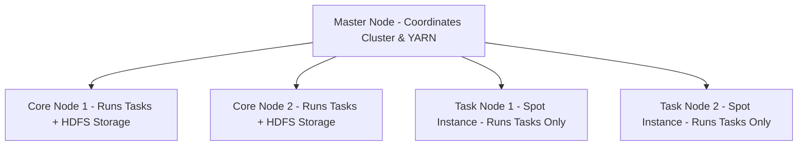

# 🐘 Amazon EMR (Elastic MapReduce)

- **Category**: Analytics / Big Data
- **Primary Use Case**: Petabyte-scale distributed data processing using open-source frameworks (Spark, Hadoop, Hive, Presto, HBase, Flink).
- **Slide Reference**: Pages 383–413 in [[AWSCertifiedDataEngineerSlides.pdf]]
- **Hub Links**: [[index]] | [[service-catalog]] | [[domain-1-ingestion-and-processing]]

---

## 1. High-Level Summary
Amazon EMR is the industry-leading cloud big data platform for processing vast amounts of data using open-source tools such as Apache Spark, Apache Hive, Apache HBase, Apache Flink, Apache Hudi, and Trino/Presto.

---

## 2. Cluster Architecture & Instance Node Types

- **Master Node**: Manages the cluster, coordinates tasks, runs YARN Resource Manager.
- **Core Node**: Executes tasks AND stores data in **HDFS (Hadoop Distributed File System)**. Cannot be terminated without potential data loss!
- **Task Node**: Executes tasks ONLY (does NOT store HDFS data). Can be safely scaled down or use **Spot Instances** for major cost savings!

---

## 3. EMR Deployment Options & Features

1. **EMR on EC2**: Traditional provisioned cluster. Full root access to EC2 instances.
2. **EMR Serverless**: Run Spark/Hive applications without provisioning, tuning, or managing clusters. Automatically scales compute resources up and down.
3. **EMR on EKS**: Run EMR Spark applications on shared Amazon EKS Kubernetes clusters.
4. **EMR File System (EMRFS)**: Connector allowing EMR clusters to directly read/write data in **Amazon S3 as an object store** instead of HDFS, decoupling storage from compute!

---

## 4. DEA-C01 Exam Tips & Scenarios

> [!IMPORTANT]
> **Key Exam Rules for EMR**:
> - **Cost Optimization**: Use **On-Demand Instances** for Master and Core nodes, and **Spot Instances** for Task nodes.
> - **Decoupling Storage**: Use **EMRFS with S3** so clusters can be terminated immediately after job completion without losing data.
> - **EMR vs Glue**: Choose **EMR** when needing custom open-source libraries, Presto/Trino SQL, fine-grained cluster configurations, or long-running Spark jobs.

---

## 📌 Related Notes
- [[glue]] — Serverless Spark vs EMR
- [[s3]] — EMRFS object storage
- [[ecr-ecs-eks]] — EMR on EKS
