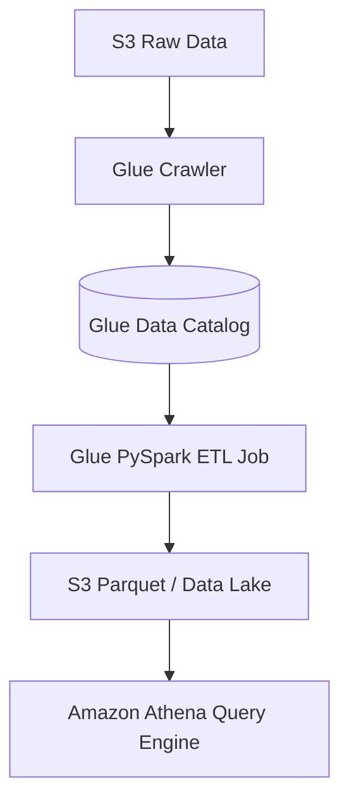

# 🧪 AWS Glue (Serverless Data Integration & ETL)

- **Category**: Analytics / Data Pipelines
- **Primary Use Case**: Serverless ETL, Data Cataloging, Schema Discovery, Data Quality, Visual ETL.
- **Slide Reference**: Pages 331–364 in [[AWSCertifiedDataEngineerSlides.pdf]]
- **Hub Links**: [[index]] | [[service-catalog]] | [[domain-1-ingestion-and-processing]]

---

## 1. High-Level Summary
AWS Glue is a fully managed, serverless data integration service that makes it easy to discover, prepare, and combine data for analytics, machine learning, and application development. It includes event-driven ETL job orchestration, automatic schema crawlers, and a centralized Apache Hive-compatible **Glue Data Catalog**.

---

## 2. Key Architecture Components

### 1. Glue Data Catalog
- Central repository to store structural and operational metadata for data assets (databases, tables, schemas, partitions).
- Integrated natively with [[athena]], [[emr]], [[redshift]] Spectrum, and [[lake-formation]].

### 2. Glue Crawlers & Classifiers
- Connects to data stores (S3, JDBC databases, DynamoDB), infers schema, format, and compression, and creates metadata tables in the Glue Data Catalog.
- Supports **Partition Detection**: Automatically parses S3 prefixes like `s3://my-bucket/dataset/year=2026/month=07/`.

### 3. Glue ETL Jobs (PySpark & Scala)
- Executes distributed PySpark code on serverless Apache Spark infrastructure.
- Uses **Glue DynamicFrames**: Extends Spark DataFrames to handle non-rigid, missing, or nested schemas without pre-defining schema definitions.
- **Worker Types**: `G.1X` (1 DPU, 4 vCPU, 16 GB), `G.2X` (2 DPU, 8 vCPU, 32 GB), `G.025X` (0.25 DPU for light workloads).

### 4. AWS Glue Data Quality
- Uses **DQDL (Data Quality Definition Language)** to write rule suites (e.g. `Completeness "email" > 0.98`, `IsUnique "user_id"`).
- Automatically evaluates data quality in ETL pipelines and halts jobs or routes bad records to quarantine S3 prefixes.

### 5. AWS Glue DataBrew
- Visual data preparation tool with 250+ pre-built transformations for data analysts without writing code.

---

## 3. DEA-C01 Exam Tips & Scenarios

> [!IMPORTANT]
> **Key Exam Rules for AWS Glue**:
> - **Schema Drift Handling**: Enable Glue Crawlers with `Update the table definition in the data catalog` setting.
> - **Glue DynamicFrames vs Spark DataFrames**: DynamicFrames allow schema flexibility on semi-structured JSON without schema enforcement errors.
> - **Automated Data Quality Checks**: Use **AWS Glue Data Quality** instead of writing custom validation scripts in Python.
> - **Incremental S3 Processing**: Use **Glue Job Bookmarks** to track state and process ONLY newly added files since the last run!

---

## 📌 Related Notes
- [[athena]] — Serverless SQL queries on Glue Data Catalog
- [[emr]] — Managed EMR clusters vs Glue Serverless Spark
- [[s3]] — S3 Data Lake target for Glue ETL
