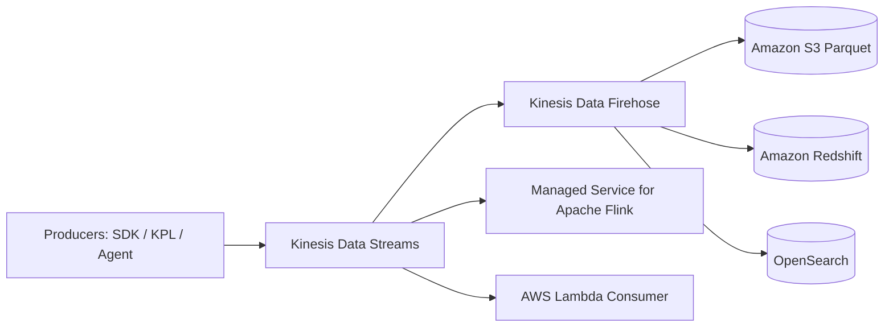

# 🌊 Amazon Kinesis Family (Real-Time Streaming)

- **Category**: Analytics / Streaming
- **Primary Use Case**: Real-time data streaming ingestion, continuous analytics, streaming delivery to data lake.
- **Slide Reference**: Pages 414–459 in [[AWSCertifiedDataEngineerSlides.pdf]]
- **Hub Links**: [[index]] | [[service-catalog]] | [[domain-1-ingestion-and-processing]]

---

## 1. High-Level Summary
The Amazon Kinesis family collects, processes, and analyzes real-time streaming data so you can get timely insights and react quickly to new information.

---

## 2. Key Kinesis Family Components

### 1. Kinesis Data Streams (KDS)
- Real-time ingestion stream built of **Shards**.
- **Shard Capacity**: 1 MB/sec (or 1,000 records/sec) IN, 2 MB/sec OUT.
- **Retention**: 24 hours default up to **365 days** (1 year)!
- **Capacity Modes**:
  - **On-Demand**: Auto-scales shards based on throughput.
  - **Provisioned**: Manually specify number of shards.
- **Consumers**: Kinesis Client Library (KCL), AWS Lambda, Apache Spark Streaming, Managed Service for Apache Flink.

### 2. Kinesis Data Firehose (KDF)
- Fully managed **zero-code streaming delivery service** to destinations (S3, Redshift, OpenSearch, Splunk, HTTP Endpoints).
- **Buffer Hints**: Delivers records based on **Buffer Size** (1 MB - 128 MB) or **Buffer Interval** (60s - 900s), whichever is met first (near real-time micro-batching).
- **In-Flight Data Transformation**: Can invoke AWS Lambda to transform/format data or automatically convert JSON to **Parquet/ORC** using Glue Data Catalog before writing to S3!

### 3. Managed Service for Apache Flink (formerly Kinesis Data Analytics)
- Run stateful Apache Flink applications to query and analyze streaming data continuously with sub-second latency using SQL, Java, or Python.

### 4. Kinesis Video Streams
- Securely stream video from connected devices to AWS for ML analytics.

---

## 3. DEA-C01 Exam Tips & Scenarios

> [!IMPORTANT]
> **KDS vs KDF Decision Matrix**:
> - If requirement is **real-time sub-second custom processing with multi-consumer replay capabilities and retention up to 1 year**: Choose **Kinesis Data Streams (KDS)**.
> - If requirement is **zero-administration, automatic ingestion directly into S3/Redshift with format conversion to Parquet**: Choose **Kinesis Data Firehose (KDF)**.
> - **Kinesis Scaling**: If getting `ProvisionedThroughputExceededException`, increase shard count or implement exponential backoff with partition key randomization!

---

## 📌 Related Notes
- [[msk-kafka]] — Amazon MSK vs Kinesis
- [[lambda]] — Lambda consumers for Kinesis
- [[s3]] — Firehose S3 destination
