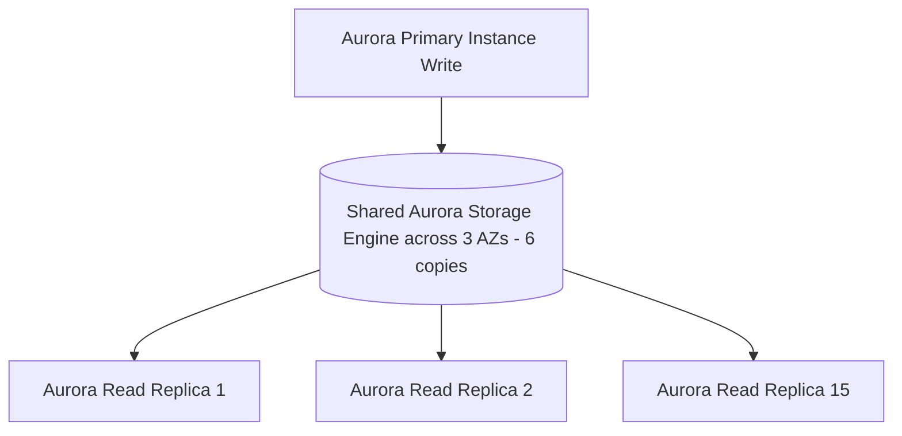

# 🐘 Amazon RDS & Amazon Aurora

- **Category**: Database (Relational OLTP)
- **Primary Use Case**: Managed relational databases (PostgreSQL, MySQL, MariaDB, Oracle, SQL Server) & High-Performance Cloud-Native Aurora.
- **Slide Reference**: Pages 196–213 in [[AWSCertifiedDataEngineerSlides.pdf]]
- **Hub Links**: [[index]] | [[service-catalog]] | [[domain-2-data-store-management]]

---

## 1. High-Level Summary
Amazon Relational Database Service (RDS) provides managed relational databases. Amazon Aurora is AWS's proprietary cloud-native MySQL/PostgreSQL-compatible relational engine offering 5x performance over MySQL and 3x over PostgreSQL.

---

## 2. Key Architecture & Features

### Amazon Aurora Architecture
- **Distributed Shared Storage**: Data is automatically replicated across 3 Availability Zones (6 copies total).
- **Self-Healing Storage**: Aurora continuously scans disk blocks and repairs bad sectors automatically without impact.
- **Read Replicas**: Up to 15 Aurora Read Replicas with sub-10ms replication lag.

---

### Aurora Advanced Deployment Options

1. **Aurora Serverless v2**:
   - Scales instantly and automatically in fractions of a second from 0.5 to 128 ACUs (Aurora Capacity Units) based on application demand.

2. **Aurora Global Database**:
   - Spans across multiple AWS Regions with latency under 1 second for disaster recovery and fast local reads.

3. **Aurora Machine Learning**:
   - Execute ML inferences directly via SQL statements by calling SageMaker or Amazon Comprehend.

---

## 3. DEA-C01 Exam Tips & Scenarios

> [!IMPORTANT]
> - **Multi-AZ vs Read Replicas**:
>   - **Multi-AZ**: For High Availability & Failover (Synchronous replication, standby instance cannot handle read traffic).
>   - **Read Replicas**: For Scalability & Read Performance (Asynchronous replication, supports read queries).
> - **CDC Migration from RDS**: Use [[dms-and-sct]] (AWS DMS) to capture ongoing changes from RDS binary logs to S3 data lake.

---

## 📌 Related Notes
- [[dms-and-sct]] — Migrating RDS/Aurora to S3 or Redshift
- [[redshift]] — OLTP (RDS) vs OLAP (Redshift)
