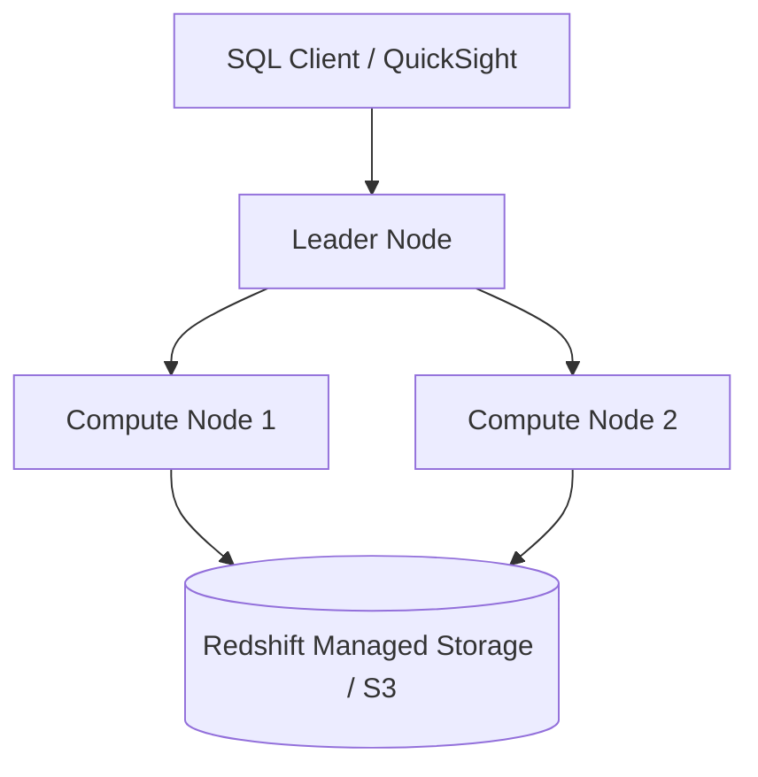

# 🔴 Amazon Redshift (Petabyte-Scale Data Warehouse)

- **Category**: Database / Data Warehousing
- **Primary Use Case**: Enterprise OLAP data warehousing, SQL analytics, petabyte reporting
- **Slide Reference**: Pages 220–265 in [[AWSCertifiedDataEngineerSlides.pdf]]
- **Hub Links**: [[index]] | [[service-catalog]] | [[domain-2-data-store-management]]

---

## 1. High-Level Summary
Amazon Redshift is a fully managed, petabyte-scale columnar data warehouse designed for high-performance online analytical processing (OLAP). It uses Massively Parallel Processing (MPP) architecture to distribute and parallelize queries across compute nodes.

---

## 2. Key Architecture & Features

### Architecture Breakdown
- **Leader Node**: Receives client connections, parses SQL queries, generates optimized execution plans, and coordinates compute nodes.
- **Compute Nodes**: Executes compiled code on data subsets and returns intermediate results to the leader node.
- **RA3 Nodes with Managed Storage**: Separates compute from storage! Automatically tiers data between high-speed local SSD and persistent S3-backed Redshift Managed Storage (RMS).

---

### Data Distribution Styles (DISTSTYLE)
Choosing the right distribution style minimizes network data movement (`DS_BCAST_INNER` / `DS_DIST_NONE`):

| Distribution Style | Behavior | Ideal Use Case |
| --- | --- | --- |
| **KEY (`DISTSTYLE KEY`)** | Rows distributed based on values in a specified column. | Large fact table joined frequently on a specific foreign key. |
| **ALL (`DISTSTYLE ALL`)** | Full copy of the table is duplicated to every compute node. | Small, infrequently updated dimension tables (< 2-3M rows). |
| **EVEN (`DISTSTYLE EVEN`)** | Round-robin distribution of rows across nodes. | Tables not joined frequently or where no obvious join key exists. |
| **AUTO (`DISTSTYLE AUTO`)** | Redshift automatically assigns `ALL` initially, then switches to `EVEN` as table grows. | Default mode when unsure. |

---

### Sort Keys (SORTKEY)
Determines physical ordering of data on disk blocks to enable block-skipping (Zone Maps):
- **Compound Sort Key**: Default. Best when queries filter on leading columns (`WHERE year = 2026 AND month = 7`).
- **Interleaved Sort Key**: Gives equal weight to every column in the sort key. Best when query filters vary widely across columns (requires frequent `VACUUM REINDEX`).

---

### Redshift Advanced Ecosystem Features

1. **Redshift Serverless**:
   - Automatically provisions and scales capacity in **RPUs (Redshift Processing Units)** based on query workload demand. Pay only for query run time.

2. **Redshift Spectrum**:
   - Query data stored directly in Amazon S3 data lakes using standard SQL **without loading it into Redshift tables**! Uses Glue Data Catalog schemas.

3. **Redshift Data Sharing**:
   - Securely share live read-only data across Redshift clusters, AWS accounts, or regions **without manual data copying or ETL**.

4. **Concurrency Scaling**:
   - Automatically adds transient cluster capacity to support virtually unlimited concurrent read queries with zero wait time.

5. **Materialized Views**:
   - Precompute and store query results. Automatically refreshed incrementally.

6. **Redshift ML**:
   - Train and execute Amazon SageMaker machine learning models directly using SQL queries inside Redshift!

---

## 3. DEA-C01 Exam Tips & Scenarios

> [!IMPORTANT]
> **Redshift Best Practices & Exam Patterns**:
> - **Loading Data into Redshift**: ALWAYS use the `COPY` command from S3/DynamoDB/EFS. Never insert rows using individual SQL `INSERT` statements!
> - **Optimizing COPY Command**: Split input data into multiple files that are a **multiple of the total number of slice compute nodes**.
> - **Cross-Account Data Access without ETL**: Choose **Redshift Data Sharing**.
> - **Query S3 data lake alongside Redshift tables**: Choose **Redshift Spectrum**.

---

## 📌 Related Notes
- [[athena]] — Serverless SQL vs Redshift Spectrum
- [[s3]] — S3 Data Lake storage for Redshift Spectrum
- [[glue]] — Glue Catalog integration
