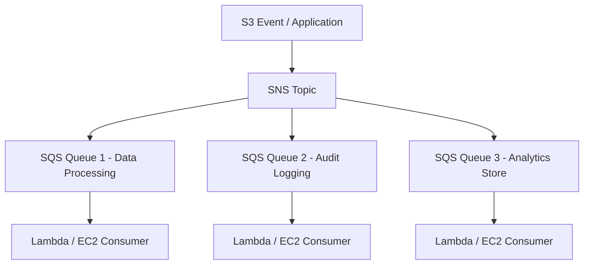

# ✉️ Amazon SQS & Amazon SNS

- **Category**: Application Integration
- **Primary Use Case**: Asynchronous message queuing, pub/sub notification fanout, decoupling microservices.
- **Slide Reference**: Pages 499–525 in [[AWSCertifiedDataEngineerSlides.pdf]]
- **Hub Links**: [[index]] | [[service-catalog]] | [[domain-1-ingestion-and-processing]]

---

## 1. High-Level Summary
Amazon SQS (Simple Queue Service) and Amazon SNS (Simple Notification Service) decouple data producers from consumers in distributed systems, guaranteeing reliable event delivery and message buffering.

---

## 2. Technical Breakdown & Comparison

| Feature | Amazon SQS (Queue) | Amazon SNS (Pub/Sub) |
| --- | --- | --- |
| **Model** | **Pull** (Consumers poll queue) | **Push** (Pushes events to subscribers) |
| **Patterns** | Point-to-Point message processing | Fanout to multiple SQS queues, Lambda, HTTP endpoints |
| **Queue Types** | Standard (unlimited throughput, at-least-once delivery) & **FIFO** (exactly-once, strictly ordered) | Standard & **FIFO Topics** |
| **Retention** | 1 minute up to **14 days** | No storage (Immediate push to subscribers) |
| **Dead Letter Queue** | Captures unprocessable messages after maxReceiveCount | Supported for HTTP/Lambda subscriptions |

---

## 3. SNS + SQS Fanout Architecture Pattern

---

## 4. DEA-C01 Exam Tips

> [!IMPORTANT]
> - **Fanout Pattern**: Send 1 event message to multiple independent processing queues simultaneously -> Use **SNS Topic subscribed to multiple SQS Queues**.
> - **Strict Order Processing**: Choose **SQS FIFO Queue** (Guarantees ordering and exactly-once processing using Message Group ID and Deduplication ID).

---

## 📌 Related Notes
- [[lambda]] — Lambda consumers for SQS/SNS
- [[step-functions]] — Workflow integration
