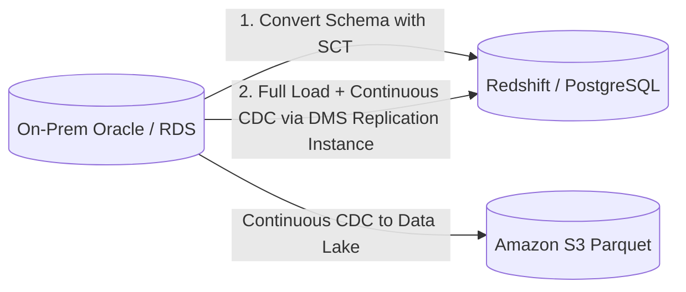

# 🔄 AWS DMS & AWS Schema Conversion Tool (SCT)

- **Category**: Migration & Transfer
- **Primary Use Case**: Heterogeneous & homogeneous database migration, Change Data Capture (CDC) into S3/Redshift/DynamoDB.
- **Slide Reference**: Pages 269–275 in [[AWSCertifiedDataEngineerSlides.pdf]]
- **Hub Links**: [[index]] | [[service-catalog]] | [[domain-1-ingestion-and-processing]]

---

## 1. High-Level Summary
AWS Database Migration Service (DMS) enables quick and secure migration of relational databases, data warehouses, and NoSQL stores to AWS with minimal downtime. AWS Schema Conversion Tool (SCT) automates heterogeneous database schema conversion (e.g. Oracle to PostgreSQL or Teradata to Redshift).

---

## 2. Architecture & Migration Workflow

### Key DMS Concepts
- **Replication Instance**: EC2-based instance that runs DMS migration tasks.
- **Endpoints**: Source and Target connections (databases, S3, Kinesis, Kafka).
- **Migration Task Types**:
  1. **Full Load**: Migrates existing data snapshot.
  2. **Full Load + CDC**: Migrates initial data and continuously syncs ongoing changes.
  3. **CDC Only**: Captures ongoing transaction log changes (Change Data Capture).

### DMS + SCT Division of Responsibilities
- **AWS SCT**: Converts database schema, views, stored procedures, and code definitions between different engines (Heterogeneous).
- **AWS DMS**: Moves actual table data and streams transaction log changes. (Handles Homogeneous data movement directly without SCT).

---

## 3. DEA-C01 Exam Tips & Scenarios

> [!IMPORTANT]
> **Key Exam Rules for DMS & SCT**:
> - **Migrating Oracle/SQL Server to AWS Aurora/Redshift**: Use **AWS SCT** first to convert schema, then **AWS DMS** to migrate data.
> - **Continuous replication from On-Premises database to S3 Data Lake**: Configure **AWS DMS with CDC (Change Data Capture)** using S3 as target endpoint (writes files in CSV or Parquet format).
> - **DMS Target S3 Formatting**: DMS can output CDC updates as insert/update/delete markers directly to S3.

---

## 📌 Related Notes
- [[rds-and-aurora]] — RDS and Aurora target databases
- [[redshift]] — Redshift data warehouse target
- [[s3]] — S3 Data Lake CDC target
