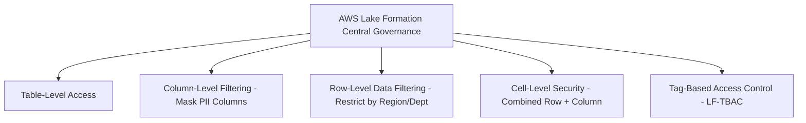

# 🛡️ AWS Lake Formation (Data Lake Governance & Fine-Grained Access Control)

- **Category**: Security / Governance
- **Primary Use Case**: Centralized data lake security, fine-grained column/row/cell-level access control, Tag-Based Access Control (LF-TBAC).
- **Slide Reference**: Pages 360–364 & 576–589 in [[AWSCertifiedDataEngineerSlides.pdf]]
- **Hub Links**: [[index]] | [[service-catalog]] | [[domain-4-data-security-and-governance]]

---

## 1. High-Level Summary
AWS Lake Formation simplifies setting up, securing, and managing data lakes. It replaces complex S3 bucket policies and IAM policies with a centralized permissions model for Glue Data Catalog databases, tables, columns, rows, and cells.

---

## 2. Key Access Control Granularities

### 1. Fine-Grained Permissions
- **Column-Level Security**: Grant access to specific table columns while excluding sensitive columns (e.g. Hide `ssn` column from Analysts).
- **Row-Level Security**: Filter rows based on SQL expressions (e.g., `SELECT * WHERE country = 'US'`).
- **Cell-Level Security**: Combines column masking with row filtering for extreme precision.

### 2. LF-TBAC (Lake Formation Tag-Based Access Control)
- Assign metadata tags (LF-Tags) to catalog databases, tables, or columns (e.g., `Confidentiality=High`, `Department=Finance`).
- Grant IAM users or roles permissions based on tags instead of explicitly listing thousands of individual tables!

---

## 3. DEA-C01 Exam Tips & Scenarios

> [!IMPORTANT]
> **Key Exam Rules for Lake Formation**:
> - **Column & Row-Level Filtering for Athena / Redshift Spectrum**: Choose **AWS Lake Formation**. Standard S3 bucket policies and IAM CANNOT grant column/row-level permissions on data files stored in S3!
> - **Cross-Account Data Lake Sharing**: Use **Lake Formation Resource Share** (powered by AWS RAM) to share catalog tables across accounts without copying files.

---

## 📌 Related Notes
- [[glue]] — Glue Catalog integration with Lake Formation
- [[athena]] — Athena query execution adhering to Lake Formation rules
- [[s3]] — S3 object storage underlying Lake Formation
