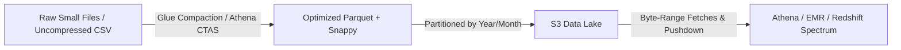

# ⚡ Amazon S3 Performance & Optimization

- **Category**: Storage / Performance Engineering
- **Primary Use Case**: High-Throughput Analytics, Low-Latency Data Lake I/O, Large File Transfers
- **Slide Reference**: Pages 77–138 in [[AWSCertifiedDataEngineerSlides.pdf]]
- **Hub Links**: [[index]] | [[service-catalog]] | [[s3]] | [[domain-2-data-store-management]]

---

## 1. High-Level Summary

Optimizing Amazon S3 performance is a critical skill tested in the **AWS DEA-C01** exam. While S3 scales automatically to handle virtually unlimited storage and throughput, achieving maximum performance requires understanding **prefix request limits**, **parallelization techniques** (Multipart Upload & Byte-Range Fetches), **storage class selection** (e.g., S3 Express One Zone), and **data lake formatting patterns** (compaction, Parquet/ORC, partitioning).

---

## 2. Prefix Request Limits & Prefix Partitioning

### S3 Baseline Limits per Prefix

Amazon S3 automatically scales to support very high request rates. Request limits apply **per prefix** in an S3 bucket:

| Operation Type                | Request Limit per Second per Prefix |
| ----------------------------- | ----------------------------------- |
| **`GET` / `HEAD`**            | **5,500 requests/sec**              |
| **`PUT` / `POST` / `DELETE`** | **3,500 requests/sec**              |

> [!IMPORTANT]
> **What is an S3 Prefix?**  
> An S3 prefix is any string between the bucket name and the object name.  
> In `s3://my-bucket/logs/2026/08/07/app.log`, the prefix is `logs/2026/08/07/`.

```mermaid
graph TD
    subgraph Single Prefix Bottleneck: 3,500 PUT / 5,500 GET max
        P1["s3://data-lake/raw/data.csv"]
    end

    subgraph Scaled Prefixes: 3x Throughput (10,500 PUT / 16,500 GET)
        P2["s3://data-lake/raw/part-A/data1.csv"]
        P3["s3://data-lake/raw/part-B/data2.csv"]
        P4["s3://data-lake/raw/part-C/data3.csv"]
    end
```

### Horizontal Scaling via Prefix Distribution

- **Parallel Prefixes**: If applications require 10,000 `GET` requests/sec, distributing objects across 2 distinct prefixes yields up to $2 \times 5,500 = 11,000$ `GET` requests/sec.
- **Hash-based Prefix Naming**: Inserting a hash prefix (e.g., `s3://bucket/a1b2-2026-08-07/file.json` or partitioning by customer ID/UUID) distributes traffic across multiple prefix partitions.
- **Auto-Sharding**: S3 automatically scales prefixes behind the scenes by partition splitting when request rates grow.

---

## 3. Acceleration Techniques & Data Transfer Optimization

### 1. S3 Multipart Upload

- **How it works**: Breaks large files into parts (from 5 MB up to 5 GB per part) and uploads them in parallel.
- **Thresholds**:
  - Recommended for objects **> 100 MB**.
  - **Mandatory** for objects **> 5 GB** (Max single object size in S3 is **5 TB**).
- **Benefits**:
  - **Higher Throughput**: Uploads parts concurrently over multiple connections.
  - **Fault Tolerance**: If a part upload fails, only that part needs to be re-transmitted (not the entire file).
  - **Pause & Resume**: Can pause uploads and resume later.

### 2. S3 Byte-Range Fetches (Parallel Downloads)

- **How it works**: Uses the HTTP `Range` header (`Range: bytes=0-1048576`) to download specific byte ranges of an object in parallel.
- **Use Cases**:
  - Parallelizing downloads of giant files across multiple threads/connections.
  - **Footer Reads in Columnar Files**: Analytical engines ([[athena]], [[emr]] Spark) perform byte-range fetches to read metadata/footers of Parquet/ORC files without fetching the entire object.

### 3. S3 Transfer Acceleration

- **How it works**: Accelerates long-distance uploads/downloads by routing traffic through AWS **CloudFront Global Edge Locations** onto the optimized AWS private network backbone.
- **Use Cases**: Global cross-border uploads, remote data ingestion into a centralized AWS region.

### 4. S3 Bucket Keys (SSE-KMS Encryption Throttling Mitigation)

- **Problem**: Default SSE-KMS encryption calls AWS KMS (`GenerateDataKey` / `Decrypt`) per object operation. KMS API limits (5,500–30,000 req/sec) can cause `KMS.KMSInvalidStateException` or throttling exceptions.
- **Solution**: **S3 Bucket Keys** generate a bucket-level key in KMS, allowing S3 to create local data keys for encryption.
- **Impact**: Reduces KMS request costs and API call rates by **up to 99%**.

---

## 4. High-Performance Storage Class: S3 Express One Zone

For compute-intensive analytics requiring the lowest possible latency, AWS provides **S3 Express One Zone**.

| Feature                | S3 Standard                        | S3 Express One Zone                                         |
| ---------------------- | ---------------------------------- | ----------------------------------------------------------- |
| **Availability Zones** | Multi-AZ ($\ge 3$ AZs)             | Single AZ (Directory Bucket)                                |
| **Latency**            | Double-digit milliseconds          | **Single-digit milliseconds (consistent)**                  |
| **Throughput & RPS**   | Standard prefix limits             | Hundreds of thousands of RPS                                |
| **Authentication**     | Standard IAM per request           | **Session-based auth (`CreateSession`)**                    |
| **Ideal Use Case**     | Data Lake Landing Zone / Long-term | **EMR Spark jobs, SageMaker checkpointing, Athena queries** |

---

## 5. Analytics Data Lake Performance Best Practices



### 1. Small File Problem & Compaction

- **Problem**: Millions of small files (< 128 MB) degrade performance due to S3 API overhead, Glue crawler indexing latency, and Spark/Athena task scheduling overhead.
- **Target File Size**: **128 MB to 512 MB** (up to 1 GB for large analytical scans).
- **Solutions**:
  - Run [[glue]] ETL jobs or AWS Lambda scripts to merge/compact small files into larger files.
  - Use [[athena]] `CREATE TABLE AS SELECT` (`CTAS`) to rewrite small files into target sizes.
  - In Spark / [[emr]], use `coalesce()` or `repartition()` before writing to S3.

### 2. Compression & Columnar Formats

- **Parquet / ORC**: Columnar formats enable **column projection** (reading only requested columns) and **predicate pushdown** (skipping non-matching row groups).
- **Splittable Compression**: Use **Snappy** or **Zstd** codecs with Parquet to allow analytical engines to split large files into parallel tasks across worker nodes.

### 3. Hive-Style Partitioning & Partition Projection

- Partition data by frequently filtered columns (e.g., `s3://bucket/table/year=2026/month=08/day=07/`).
- Use **Athena Partition Projection** to calculate partition locations via rules rather than querying the Glue Data Catalog, avoiding metastore latency.

### 4. S3 Select

- Enables applications to filter object content (CSV, JSON, Parquet) server-side using simple SQL expressions (`SELECT * FROM S3Object s WHERE s.status = 'ACTIVE'`).
- Reduces network bandwidth and I/O payload by returning only the required subset of data.

---

## 6. S3 Performance Anti-Patterns vs. Best Practices

| Anti-Pattern ❌                               | Best Practice ✅                                                | DEA-C01 Exam Context                                  |
| --------------------------------------------- | --------------------------------------------------------------- | ----------------------------------------------------- |
| Single-threaded upload of files > 5 GB        | **S3 Multipart Upload** (parallel upload of parts)              | Mandatory for files > 5 GB                            |
| Millions of tiny files (< 10 MB)              | **File Compaction** (Glue/Athena/Spark into 128–512 MB Parquet) | Eliminates GET overhead & speeds up query planning    |
| KMS API throttling on high-RPS SSE-KMS        | Enable **S3 Bucket Keys**                                       | Reduces KMS API calls by up to 99%                    |
| High request rate bottleneck on 1 date prefix | Distribute prefixes with **random hash / high cardinality key** | Scales throughput past 3,500 PUT / 5,500 GET limit    |
| Reading whole objects to get metadata         | **Byte-Range Fetches** (`Range` header)                         | Parallel reads & reading Parquet footers              |
| Long-distance cross-border S3 ingestion       | **S3 Transfer Acceleration**                                    | Edge location caching/routing via CloudFront backbone |

---

## 7. DEA-C01 Exam Tips & Scenario Triggers

> [!IMPORTANT]
> **Key Exam Decision Rules**:
>
> - **Consistent single-digit millisecond latency for analytics/EMR**: Choose **S3 Express One Zone**.
> - **Upload file $> 5\text{ GB}$**: Must use **S3 Multipart Upload**.
> - **SSE-KMS call limit reached or KMS cost reduction needed**: Enable **S3 Bucket Keys**.
> - **Speed up queries on S3 with Athena/EMR**: Convert data to **Parquet + Snappy** and compact files to **128 MB–512 MB**.
> - **Cross-geography fast data ingestion to S3**: Use **S3 Transfer Acceleration**.
> - **Query metadata/footers of large objects fast**: Use **Byte-Range Fetches**.
> - **Avoid metastore lookup overhead in Athena**: Enable **Partition Projection**.

---

## 📌 Related Notes

- [[s3]] — Main Amazon S3 Overview & Storage Classes
- [[data-formats-and-compression]] — Parquet, ORC, Snappy & Zstd details
- [[data-modeling-and-partitioning]] — Partition strategies for S3 & Athena
- [[athena]] — Athena query optimization & CTAS
- [[glue]] — Glue compaction ETL jobs
- [[emr]] — EMR Spark tuning on S3
- [[kms-and-secrets]] — SSE-KMS & S3 Bucket Keys
