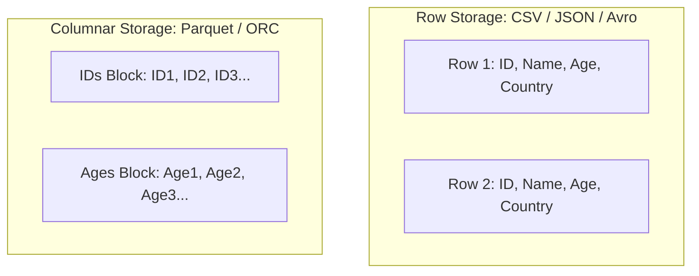

# 📄 Data Formats & Compression Codecs

- **Category**: Fundamentals / Storage Optimization
- **Slide Reference**: Pages 38–48 in [[AWSCertifiedDataEngineerSlides.pdf]]
- **Hub Links**: [[index]] | [[service-catalog]]

---

## 1. Row-Based vs Columnar Storage Formats

### Format Matrix

| Format | Storage Layout | Schema Type | Splittable? | Best Use Case |
| --- | --- | --- | --- | --- |
| **CSV / TSV** | Row-based | Schema-on-read | Yes (if uncompressed) | Raw data export, human inspection |
| **JSON** | Row-based | Semi-structured | No (multiline) / Yes (JSON lines) | API payloads, web logs, event streaming |
| **Apache Avro** | Row-based (Binary) | Schema included in file | **Yes** | Kafka streaming pipelines, high-write row operations |
| **Apache Parquet**| **Columnar** (Binary) | Self-describing schema | **Yes** | **Analytical queries (Athena, Spark, Redshift Spectrum)** |
| **Apache ORC** | **Columnar** (Binary) | Self-describing schema | **Yes** | Hive & EMR analytics, optimized indexing |

---

## 2. Compression Codecs Breakdown

| Compression Codec | Splittable? | Compression Ratio | Speed | Recommended AWS Use Case |
| --- | --- | --- | --- | --- |
| **Snappy** | **No** (unless block-container like Parquet) | Moderate | **Ultra Fast** | Default codec for **Parquet** in Glue / Spark / Athena |
| **Gzip** | **No** | High | Moderate | Web log archiving, HTTP responses |
| **Zstd (Zstandard)** | **Yes** | High | Fast | Modern replacement for Gzip in Parquet & S3 |
| **Bzip2** | **Yes** | Maximum | Slow | Archival storage where splitting raw text is mandatory |

---

## 3. DEA-C01 Exam Rules

> [!IMPORTANT]
> - **Converting Data to Parquet + Snappy**: The single most tested optimization in DEA-C01! Reduces S3 storage cost by 75-90% and accelerates [[athena]] / [[redshift]] Spectrum queries by 10x by reading only requested columns and skipping non-matching data blocks.

---

## 📌 Related Notes
- [[athena]] — Query performance on Parquet
- [[glue]] — Format conversion jobs in Glue
