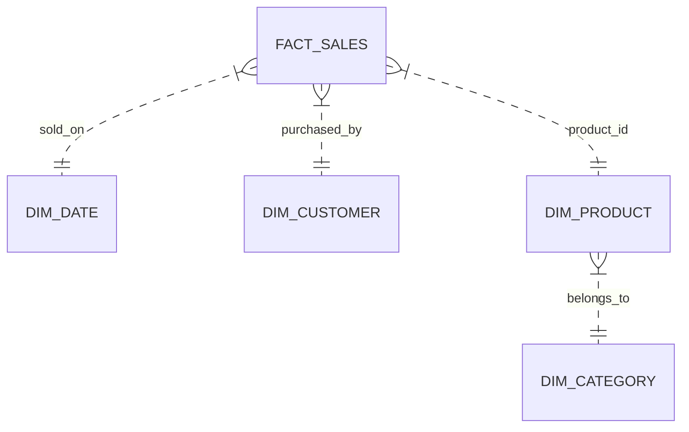

# 📐 Data Modeling & Partitioning Strategies

- **Category**: Fundamentals / Data Architecture
- **Slide Reference**: Pages 49–75 in [[AWSCertifiedDataEngineerSlides.pdf]]
- **Hub Links**: [[index]] | [[service-catalog]]

---

## 1. Dimensional Modeling (Star Schema vs Snowflake Schema)



- **Star Schema**: Denormalized dimension tables directly connected to a central fact table. Preferred for Data Warehousing ([[redshift]]) due to simpler joins and faster query performance.
- **Snowflake Schema**: Normalized dimension tables (e.g. `DIM_PRODUCT` joins to `DIM_CATEGORY`). Saves storage space but requires more complex multi-table joins.

---

## 2. Partitioning Strategies & S3 Prefix Structure

Partitioning divides a large dataset into logical subsets based on column values (e.g. Date, Region, Department).

### Hive-Style S3 Partition Prefixing
```text
s3://my-analytics-bucket/sales/year=2026/month=07/day=28/data_part001.parquet
```

### Partition Pruning & Performance
Query engines ([[athena]], Spark, [[redshift]] Spectrum) read **ONLY** the S3 prefixes matching `WHERE year = 2026 AND month = 07`, completely skipping hundreds of gigabytes of non-matching directories!

### Common Partitioning Pitfalls
1. **Over-Partitioning**: Creating millions of tiny files inside thousands of micro-partitions (e.g. partitioning by `user_id` or timestamp). Causes massive S3 listing metadata overhead and slows down queries!
2. **Under-Partitioning**: Not partitioning large multi-terabyte datasets, forcing query engines to scan every object in the bucket.

---

## 📌 Related Notes
- [[athena]] — Partition projection in Athena
- [[redshift]] — Distribution keys vs Sort keys
- [[data-formats-and-compression]] — File sizes inside partitions
