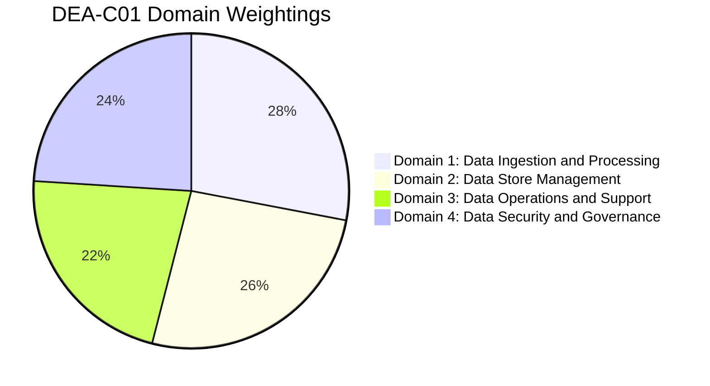
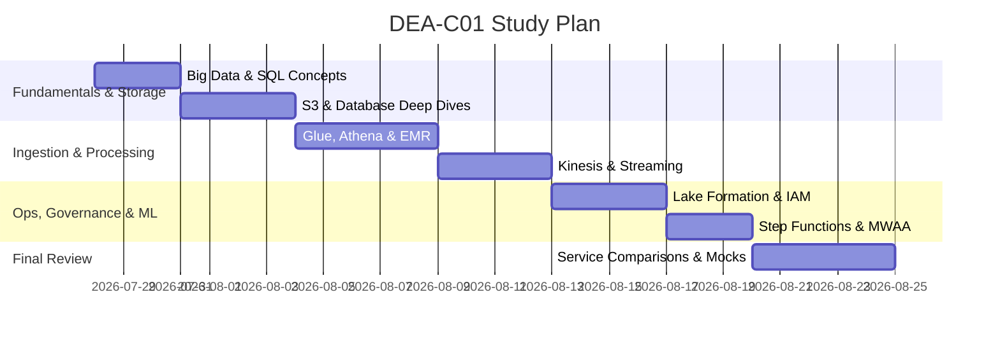

# 🎯 AWS Certified Data Engineer – Associate (DEA-C01) Exam Roadmap

The **AWS Certified Data Engineer – Associate (DEA-C01)** validates expertise in data-driven solutions, data architecture, data ingestion, transformation, storage management, operations, security, and governance.

---

## 📊 Exam Structure & Weightings

| Domain | Weighting | Key Focus Areas | Note Link |
| --- | --- | --- | --- |
| **Domain 1: Data Ingestion and Processing** | **28%** | Batch vs Streaming ingestion, ETL pipelines, transformation, schema evolution, Glue, Kinesis, Lambda, MWAA, Step Functions | [[domain-1-ingestion-and-processing]] |
| **Domain 2: Data Store Management** | **26%** | Data store selection, schema design, Redshift, S3, DynamoDB, RDS/Aurora, OpenSearch, storage tiering & partitioning | [[domain-2-data-store-management]] |
| **Domain 3: Data Operations and Support** | **22%** | Pipeline automation, monitoring, CloudWatch, EventBridge, error handling, performance tuning, data quality (Glue DQ) | [[domain-3-data-operations-and-support]] |
| **Domain 4: Data Security and Governance** | **24%** | Identity & access management (IAM), encryption (KMS), governance (Lake Formation, DataZone), PII protection (Macie) | [[domain-4-data-security-and-governance]] |

---

## 📅 Recommended 4-Week Study Strategy

### Week 1: Fundamentals & Core Data Stores
- Review Big Data 5 V's, SQL joins/window functions: [[big-data-fundamentals]], [[sql-and-version-control-review]]
- S3 Storage Classes, Lifecycle, Object Lock & Replication: [[s3]]
- Relational (RDS/Aurora) & NoSQL (DynamoDB, Redshift): [[rds-and-aurora]], [[dynamodb]], [[redshift]]

### Week 2: Ingestion & Analytics Pipelines
- Data Ingestion with Kinesis Data Streams / Firehose / MSK: [[kinesis]], [[msk-kafka]]
- ETL with AWS Glue (Crawlers, Catalog, Jobs, DataBrew, Data Quality): [[glue]]
- Interactive Querying with Athena & Big Data with EMR: [[athena]], [[emr]]

### Week 3: Orchestration, Governance & Security
- Workflow orchestration with Step Functions & MWAA (Airflow): [[step-functions]], [[mwaa-airflow]]
- Governance & Access Control with Lake Formation, IAM, KMS: [[lake-formation]], [[iam]], [[kms-and-secrets]]
- Migration & Transfer: [[dms-and-sct]], [[datasync-and-snow]], [[application-discovery-and-mgn]], [[data-exchange]], [[transfer-family]]

### Week 4: Scenarios, Optimization & Exam Practice
- Review cross-service decision matrix: [[service-comparisons]]
- High-frequency exam traps & keywords: [[high-frequency-exam-patterns]]
- Slide Exam Tips review: [[AWSCertifiedDataEngineerSlides.pdf]]

---

## 📌 Master Hub Link
Return to main hub: [[index]]
