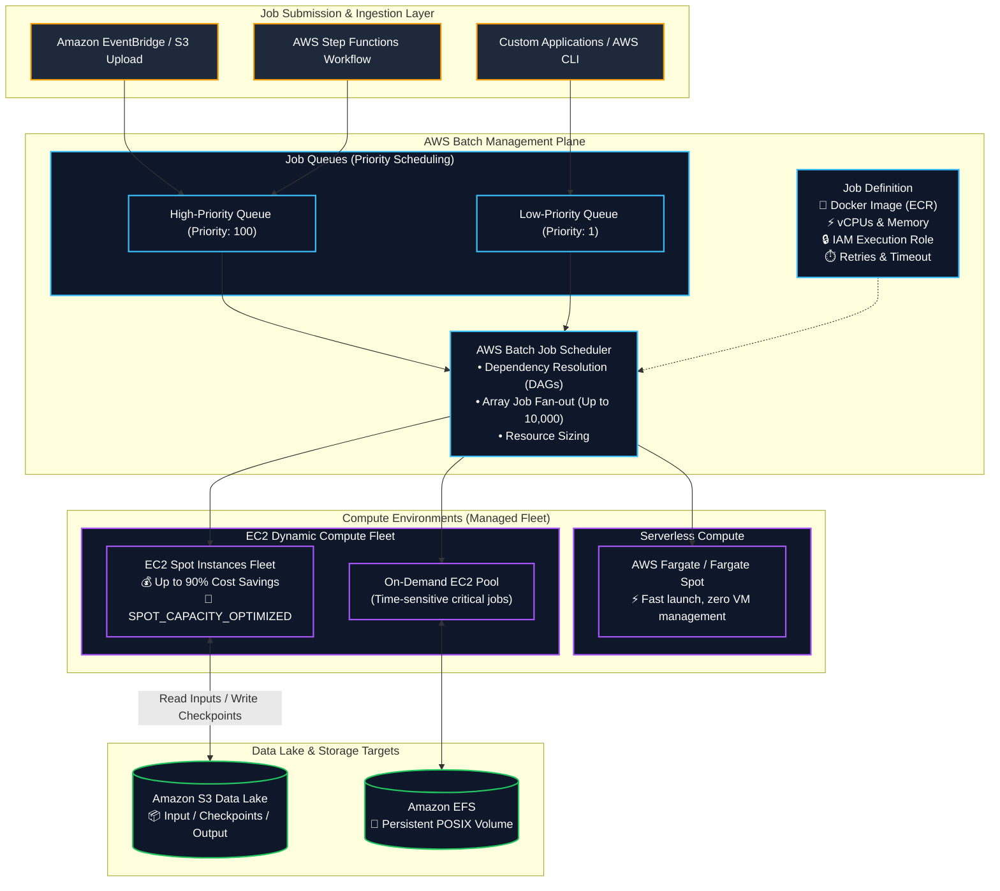
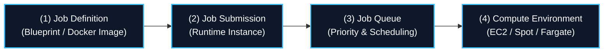
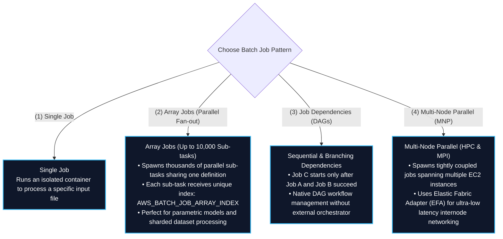
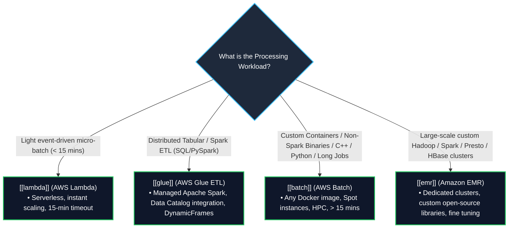
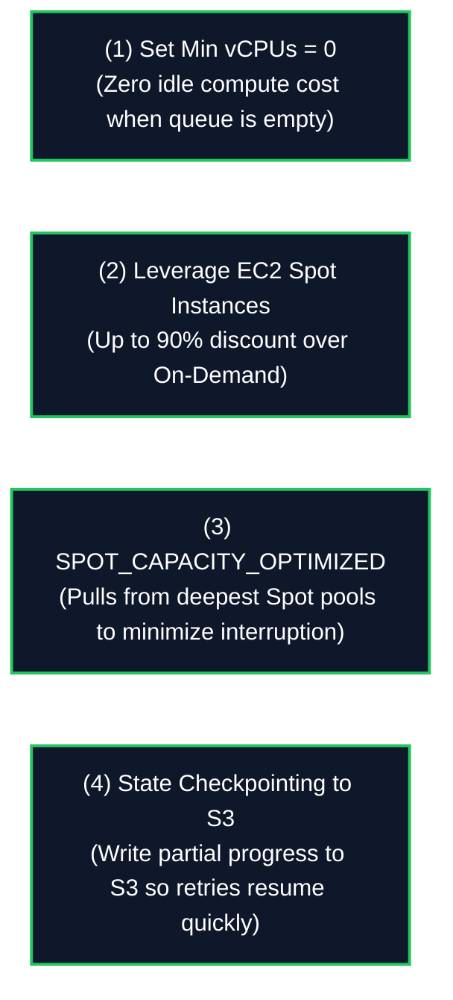

# 📦 AWS Batch (Managed Containerized Batch Computing & HPC Workloads)

- **Category**: Compute (Containerized Batch Processing & High-Performance Computing)
- **Primary Use Case**: Running long-running (> 15 min) batch computing jobs, non-Spark data transformations, scientific simulations, ML data preprocessing, and Dockerized image processing on managed EC2, Spot Instances, or AWS Fargate.
- **Slide Reference**: Pages 311–312 in `[[AWSCertifiedDataEngineerSlides.pdf]]`
- **Hub Links**: [[index]] | [[service-catalog]] | [[domain-1-ingestion-and-processing]] | [[lambda]] | [[glue]] | [[emr]] | [[ecr-ecs-eks]] | [[step-functions]]

---

## 1. High-Level Summary

**AWS Batch** is a fully managed batch computing service that enables data engineers, scientists, and developers to run hundreds of thousands of batch and High-Performance Computing (HPC) jobs on AWS. AWS Batch dynamically provisions the optimal quantity and type of compute resources (such as CPU, memory-optimized, or GPU instances) based on the volume and specific resource requirements of the submitted batch jobs.

In data engineering architectures, AWS Batch fills the critical gap where:
1. **Jobs Exceed Serverless Limits**: Tasks take longer than the strict **15-minute AWS Lambda timeout**.
2. **Non-Spark Workloads**: Tasks rely on custom compiled binaries, C/C++, Python scripts, R statistical models, or proprietary third-party libraries that **do not run natively on Apache Spark / AWS Glue**.
3. **Massive Parallelism (Array Jobs)**: Running parameter sweeps, Monte Carlo simulations, or bulk data formatting over thousands of identical sub-tasks in parallel.
4. **Extreme Cost Optimization**: Leveraging **EC2 Spot Instances** with automated capacity bidding and allocation strategies to achieve up to **90% cost savings**.

---

## 2. Core Architecture & Building Blocks

AWS Batch operates through four interconnected abstractions:

### 1. Job Definitions
A blueprint specifying how jobs are executed:
- **Container Properties**: Docker image URI hosted in [[ecr-ecs-eks]] (Amazon ECR), required vCPUs (e.g., 4 vCPU), memory allocation (e.g., 16 GB), command parameters, and environment variables.
- **IAM Roles**:
  - **Job Role**: Permissions granted to the container application code (e.g., `s3:GetObject`, `s3:PutObject`, `dynamodb:UpdateItem`).
  - **Execution Role**: Used by the container agent to pull images from ECR and stream logs to Amazon CloudWatch.
- **Retry Strategy & Timeouts**: Maximum retry attempts on failure (e.g., 3 retries) and execution timeout limit.
- **Storage Mounts**: Local host storage or persistent shared **Amazon EFS** volumes.

### 2. Job Queues
- Buffers submitted jobs until compute capacity is ready.
- **Priority-Based Scheduling**: Higher priority integer queues are evaluated and allocated compute resources before lower priority queues.
- A single Job Queue can route jobs across multiple Compute Environments (e.g., primary Spot pool with fallback to On-Demand).

### 3. Compute Environments
The pool of compute resources used to execute batch jobs:

| Dimension | Managed Compute Environment | Unmanaged Compute Environment |
| :--- | :--- | :--- |
| **Infrastructure Management** | **Fully Managed by AWS**: Automatically provisions, scales, updates, and terminates instances based on queue depth. | **Customer Managed**: User provisions and configures custom EC2 AMIs and container daemons. |
| **Compute Types Supported** | **EC2 On-Demand**, **EC2 Spot**, **AWS Fargate**, **Fargate Spot** | Custom Amazon EC2 instances |
| **Instance Type Selection** | `optimal` (AWS chooses best cost/performance instances) or specific instance families (`c6i`, `r6i`, `g5`, `p4d` GPUs). | Pre-launched instances |
| **Min / Desired / Max vCPUs** | Configurable scaling boundaries (e.g., Min: 0, Max: 256 vCPUs). Set **Min vCPUs = 0** to eliminate idle compute costs! | Manual scaling |

#### Allocation Strategies for EC2 Environments:
- **`BEST_FIT`**: Selects instance types that best fit job requirements at the lowest cost per vCPU.
- **`BEST_FIT_PROGRESSIVE`**: Selects additional instance types if preferred types are unavailable.
- **`SPOT_CAPACITY_OPTIMIZED`** (Recommended for Spot): Allocates Spot Instances from the deepest available Spot capacity pools, drastically reducing Spot interruption rates.

---

## 3. Job Execution Patterns & Workflows

---

## 4. Master Decision Matrix: AWS Batch vs. AWS Glue vs. AWS Lambda vs. Amazon EMR

Choosing between AWS batch compute engines is one of the most frequently tested topics on the DEA-C01 exam:

### Complete Comparative Matrix (Slide 312 Exam Focus)

| Dimension | AWS Batch | AWS Glue ETL | AWS Lambda | Amazon EMR |
| :--- | :--- | :--- | :--- | :--- |
| **Execution Framework** | **Docker Containers (Any language/binary)** | **Apache Spark / Python Shell / Ray** | **Function Handlers (Serverless snippets)** | **Hadoop / Spark / Presto / Flink Ecosystem** |
| **Primary Workload** | Non-Spark batch jobs, custom C++/R/Python binaries, HPC simulations, video rendering | Relational & tabular data integration, S3 Data Lake ETL to Parquet | Micro-batching, real-time file validation, event triggers | Petabyte-scale big data analytics, custom distributed frameworks |
| **Max Execution Time** | **Unlimited** (Hours to days) | **Unlimited** (Default 48 hours timeout) | ⏱️ **15 Minutes (900s)** | **Unlimited** (Long-running or ephemeral clusters) |
| **Infrastructure Model** | Managed EC2 / Spot / Fargate | Serverless DPUs (Data Processing Units) | Serverless | EC2 Clusters / EMR Serverless / EMR on EKS |
| **Spot Cost Savings** | ✅ **Native Spot integration** (up to 90% off) | ⚠️ Flex execution tier (35% off) | ❌ Standard duration pricing | ✅ **Spot Task nodes** (up to 90% off) |
| **AWS Catalog Integration**| Manual (via SDK / Athena) | ✅ **Native Glue Data Catalog integration** | Manual (via SDK) | ✅ Native Glue Data Catalog support |

---

## 5. Cost Optimization Strategies for Batch Workloads

1. **Scale-to-Zero (`Min vCPUs = 0`)**: Ensure managed compute environments have `Min vCPUs` set to 0 so instances are automatically terminated when no jobs are queued.
2. **Spot Capacity Optimization**: Always configure `SPOT_CAPACITY_OPTIMIZED` as the allocation strategy to significantly reduce the probability of instance termination during execution.
3. **Automated Retries & Checkpointing**: Because Spot instances can be reclaimed with a 2-minute warning, design batch processing algorithms to periodically save checkpoint files into **Amazon S3**. If a job is terminated, AWS Batch automatically retries the job on a new instance.

---

## 6. High-Yield DEA-C01 Exam Tips & Traps

> [!IMPORTANT]
> **Key Exam Trigger Keywords**:
> - **"Run containerized batch processing jobs exceeding 15 minutes with specialized dependencies (C++, Python, R, custom binaries)"** $\rightarrow$ **AWS Batch**.
> - **"Massive parallel processing of thousands of independent parametric sub-tasks"** $\rightarrow$ **AWS Batch Array Jobs (`AWS_BATCH_JOB_ARRAY_INDEX`)**.
> - **"Fault-tolerant, cost-optimized batch processing with maximum discount"** $\rightarrow$ **AWS Batch with EC2 Spot Instances (`SPOT_CAPACITY_OPTIMIZED`)**.
> - **"Tightly coupled High-Performance Computing (HPC) across distributed cluster nodes"** $\rightarrow$ **AWS Batch Multi-Node Parallel (MNP) with Elastic Fabric Adapter (EFA)**.

> [!WARNING]
> **Exam Traps & Failure Modes**:
> 1. **Batch vs. Glue Selection Trap**:
>    - If the workload is standard tabular data transformation using **Apache Spark (PySpark/Scala)** to convert S3 CSV files into Parquet, choose **AWS Glue**, NOT AWS Batch. AWS Batch is intended for **arbitrary non-Spark Docker containerized workloads**.
> 2. **Batch vs. Lambda Timeout Trap**:
>    - If a scenario describes an ETL script currently running on AWS Lambda that is failing due to the **15-minute timeout**, the solution is to **package the script as a Docker container and run it on AWS Batch** (or AWS Glue).
> 3. **Spot Interruption Handling**:
>    - For mission-critical, time-sensitive batch jobs with strict SLAs that cannot tolerate interruptions, configure the Job Queue with an **On-Demand Compute Environment**, not Spot.

---

## 📌 Related Notes

- [[lambda]] — AWS Lambda for serverless micro-batch processing (< 15 mins)
- [[glue]] — AWS Glue for distributed serverless Apache Spark ETL
- [[emr]] — Amazon EMR for petabyte-scale distributed big data clusters
- [[ecr-ecs-eks]] — Amazon ECR container registry and ECS/EKS orchestration
- [[step-functions]] — Orchestrating AWS Batch multi-step data pipelines
- [[domain-1-ingestion-and-processing]] — DEA-C01 Domain 1 Study Guide
- [[service-comparisons]] — Master DEA-C01 Service Decision Matrix

