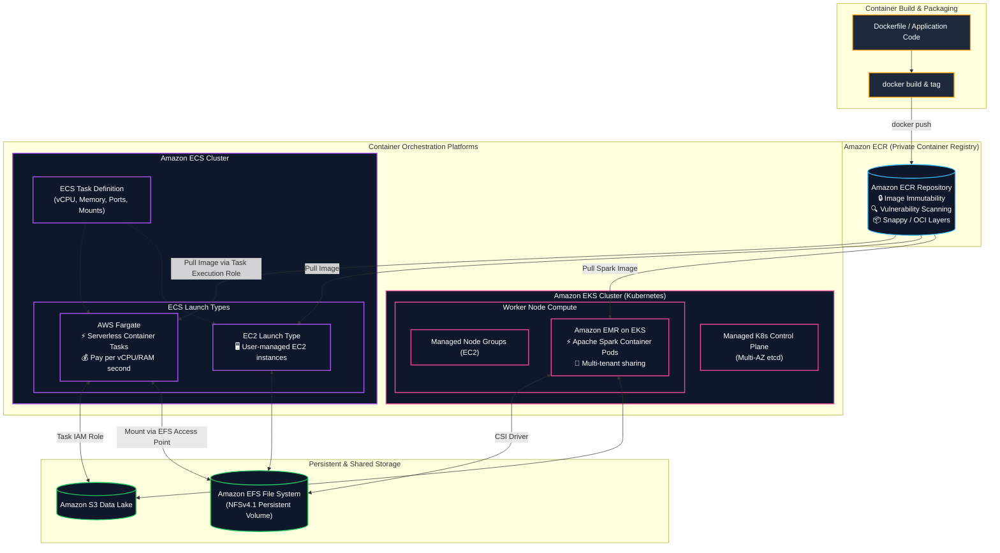
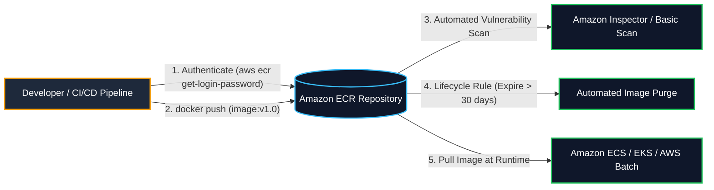
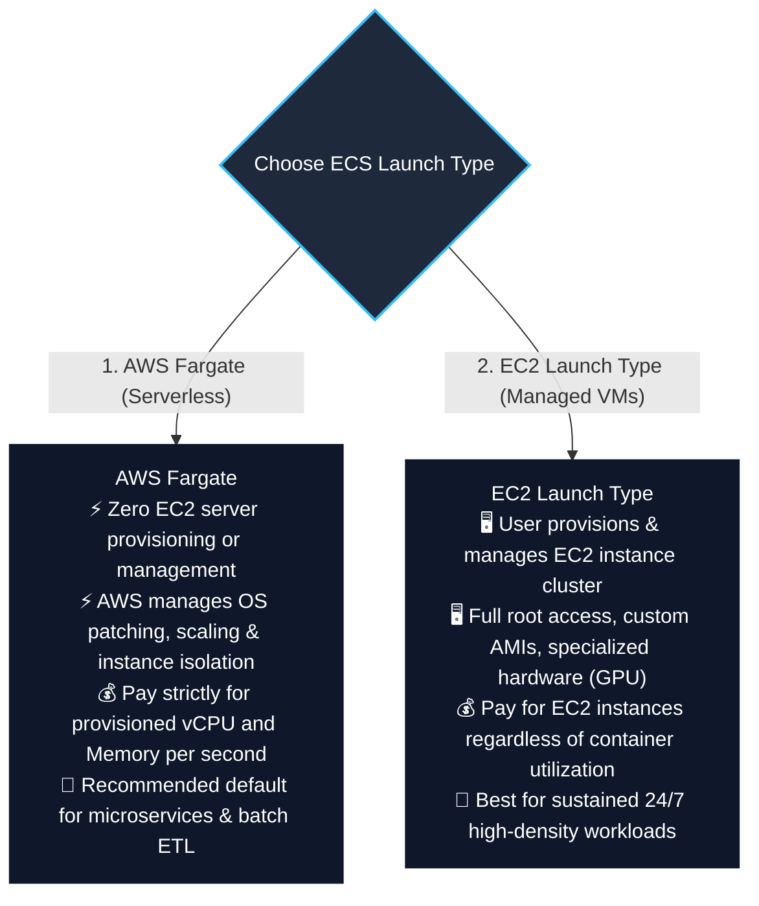
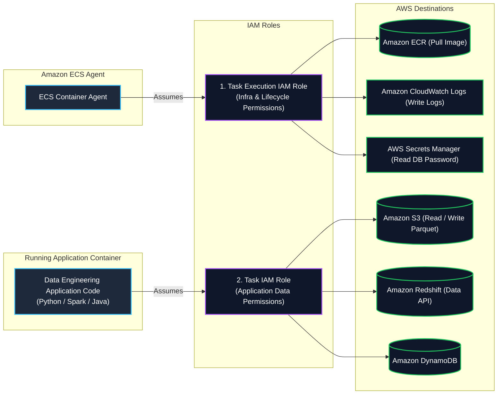
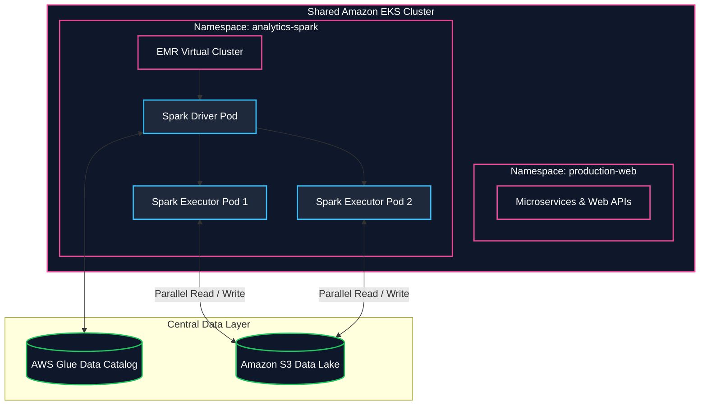
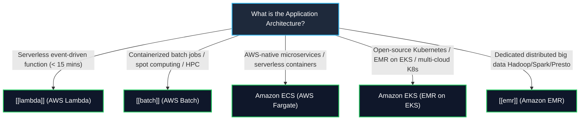

# 🐳 Amazon ECR, Amazon ECS & Amazon EKS (Containers & Kubernetes on AWS)

- **Category**: Compute & Containers (Container Registry, Serverless Containers & Kubernetes Orchestration)
- **Primary Use Case**: Storing container images in ECR, running containerized microservices & data processing on ECS (EC2/Fargate), and running distributed big data engines (e.g. **Amazon EMR on EKS**) on managed Kubernetes.
- **Slide Reference**: Pages 313–330 in `[[AWSCertifiedDataEngineerSlides.pdf]]`
- **Hub Links**: [[index]] | [[service-catalog]] | [[domain-1-ingestion-and-processing]] | [[batch]] | [[lambda]] | [[emr]] | [[efs-and-fsx]]

---

## 1. High-Level Summary

Containers package application code, system runtimes, libraries, and configurations into standardized, portable units that execute consistently across development, testing, and cloud production environments.

In modern AWS data engineering architectures:
1. **Amazon Elastic Container Registry (Amazon ECR)**: Secure, scalable private Docker registry storing custom ETL container images, machine learning model scoring containers, and [[batch]] job definitions.
2. **Amazon Elastic Container Service (Amazon ECS)**: AWS-native, highly opinionated container orchestration platform supporting both traditional **Amazon EC2 Launch Types** and serverless **AWS Fargate** compute.
3. **Amazon Elastic Kubernetes Service (Amazon EKS)**: Managed Kubernetes platform enabling enterprises to run distributed analytics engines—notably **Amazon EMR on EKS** (Apache Spark)—alongside operational microservices on a single shared compute cluster.

For the **AWS Certified Data Engineer – Associate (DEA-C01)** exam, you must master:
- **ECR Security & Lifecycle Management**: Image immutability, vulnerability scanning, and automated lifecycle cleanup policies.
- **ECS Launch Types**: **EC2 Launch Type** (full OS control) vs. **AWS Fargate** (zero-maintenance serverless container compute).
- **ECS IAM Roles**: **Task Execution IAM Role** (pulling images & logs) vs. **Task IAM Role** (application access to S3, DynamoDB, Redshift).
- **Persistent Storage Integration**: Mounting **Amazon EFS** shared file systems directly into ECS tasks and EKS pods.
- **Amazon EMR on EKS**: Running Spark applications in container pods for multi-tenant isolation, rapid startup, and infrastructure sharing.

---

## 2. Amazon Elastic Container Registry (Amazon ECR)

Amazon ECR is a fully managed container registry that makes it easy to store, manage, share, and deploy container images:

### Key ECR Features for Data Engineering:
1. **Image Tag Immutability**: Prevents image tags (such as `:prod` or `:v1.0`) from being overwritten by subsequent pushes. Guarantees deterministic, reproducible ETL pipeline runs.
2. **Automated Vulnerability Scanning**: Scans images for Common Vulnerabilities and Exposures (CVEs) automatically on push.
3. **Lifecycle Policies**: Automatically purges untagged or old historical container images, preventing unbounded storage costs for frequently updated CI/CD pipelines.
4. **Cross-Region & Cross-Account Replication**: Automatically replicates container images to secondary AWS regions for disaster recovery and low-latency task execution.

---

## 3. Amazon Elastic Container Service (Amazon ECS)

### 1. Launch Types: EC2 vs. AWS Fargate

### Launch Types Comparison Matrix

| Architectural Feature | AWS Fargate (Serverless) | EC2 Launch Type |
| :--- | :--- | :--- |
| **Server Management** | **Zero server management** (No EC2 instances visible in console) | **Customer manages EC2 cluster** (OS patching, scaling groups) |
| **Pricing Model** | Pay per vCPU & GB memory consumed per second | Pay for running EC2 instances (even if half empty) |
| **Startup Time** | Fast (~30–60 seconds per container) | Instant if EC2 cluster has spare capacity; slower if EC2 must scale out |
| **Custom AMIs / GPUs** | Standard AWS Linux container environment | Supports custom AMIs, GPU instance types (`g5`, `p4d`), custom kernel flags |
| **Persistent Storage** | **Amazon EFS** (via Access Points) | **Amazon EBS** (single-node) or **Amazon EFS** (shared multi-node) |
| **Best DEA-C01 Fit** | **Spiky, unpredictable ETL pipelines, microservices, ad-hoc batch processing** | **Predictable 24/7 sustained processing, specialized GPU training** |

---

### 2. ECS IAM Role Separation: Task Execution Role vs. Task Role

Understanding the distinction between these two IAM roles is a critical DEA-C01 exam concept:

1. **Task Execution Role**:
   - Used by the **ECS Container Agent** and Fargate infrastructure.
   - Permissions required: `ecr:GetAuthorizationToken`, `ecr:BatchGetImage`, `logs:CreateLogStream`, `logs:PutLogEvents`, and `secretsmanager:GetSecretValue` (for injecting environment variables securely).
2. **Task Role (Task IAM Role)**:
   - Used by your **custom application code** running inside the container.
   - Permissions required: `s3:GetObject`, `s3:PutObject`, `dynamodb:Query`, `redshift-data:ExecuteStatement`.

---

### 3. Persistent Shared Storage with Amazon EFS
- Containers are stateless and ephemeral by default; when a task stops, local disk is wiped.
- To persist data or share reference tables across hundreds of concurrent ECS tasks, configure **Amazon EFS storage volumes in the Task Definition**.
- **Works seamlessly on both EC2 and AWS Fargate launch types** using EFS Access Points with POSIX UID/GID enforcement.

---

## 4. Amazon Elastic Kubernetes Service (Amazon EKS)

**Amazon EKS** is a managed Kubernetes service that automates the deployment, scaling, and maintenance of Kubernetes control plane nodes across multiple Availability Zones.

### 1. Kubernetes Storage: Container Storage Interface (CSI) Drivers
To provide persistent storage to Kubernetes pods, EKS uses standard **StorageClass** manifests backed by AWS CSI drivers:

| Storage Type | AWS CSI Driver | Kubernetes Volume Mode | Best Big Data Use Case |
| :--- | :--- | :--- | :--- |
| **Amazon EBS** | `ebs.csi.aws.com` | `ReadWriteOnce` (RWO - Single Pod) | Kafka broker commit logs, hosted stateful databases |
| **Amazon EFS** | `efs.csi.aws.com` | `ReadWriteMany` (RWX - Multi-Node) | Shared model weights, cross-pod reference caches |
| **AWS FSx for Lustre** | `fsx.csi.aws.com` | `ReadWriteMany` (RWX - High-Throughput) | Sub-millisecond distributed ML training & HPC |

---

### 2. Amazon EMR on EKS (Core Exam Focus)

**Amazon EMR on EKS** allows data engineers to run Apache Spark workloads on managed Amazon EKS clusters:
- **Infrastructure Consolidation**: Consolidates compute resources by running Spark big data pipelines on the same Kubernetes cluster as web applications and APIs, eliminating idle cluster waste.
- **Dynamic Pod Provisioning**: EMR provisions Spark driver and executor pods dynamically on demand and terminates them immediately upon job completion.
- **Up to 3x Faster**: Utilizes the performance-optimized **EMR runtime for Apache Spark** (up to 3x faster and 68% lower cost than open-source Spark on Kubernetes).
- **Native Integration**: Seamlessly connects with [[glue]] Data Catalog and [[lake-formation]] for data governance.

---

## 5. Master Compute & Containers Decision Matrix

### Complete Comparative Matrix

| Dimension | AWS Lambda | AWS Batch | Amazon ECS (Fargate) | Amazon EKS (EMR on EKS) | Amazon EMR (EC2) |
| :--- | :--- | :--- | :--- | :--- | :--- |
| **Packaging** | Zip archive or Container (up to 10 GB) | Docker Container | Docker Container | Docker Container / K8s Pods | EC2 AMIs / Bootstrap Actions |
| **Max Runtime** | ⏱️ **15 Minutes** | Unlimited | Unlimited | Unlimited | Unlimited |
| **Orchestration** | AWS-managed event triggers | Job Queues & Dependencies | ECS Task Definitions | Kubernetes Manifests / Helm | YARN ResourceManager |
| **Big Data Engine** | Custom Python scripts | Non-Spark batch containers | Custom container pipelines | **EMR Spark on Kubernetes** | Native Spark, Hadoop, Presto |
| **Storage Persistence** | `/tmp` (10 GB) or EFS | EBS, Spot scratch, EFS | **Amazon EFS** | **EBS, EFS, FSx for Lustre (CSI)** | HDFS, S3 (EMRFS) |

---

## 6. High-Yield DEA-C01 Exam Tips & Traps

> [!IMPORTANT]
> **Key Exam Trigger Keywords**:
> - **"Run containerized applications on AWS without managing underlying EC2 instances"** $\rightarrow$ **Amazon ECS with AWS Fargate launch type**.
> - **"Share Kubernetes cluster resources between microservices and Apache Spark data engineering jobs"** $\rightarrow$ **Amazon EMR on EKS**.
> - **"Grant containerized application running in ECS permissions to access S3 or DynamoDB"** $\rightarrow$ **Attach IAM policy to the ECS Task IAM Role** (Not the Task Execution Role or EC2 Instance Profile!).
> - **"Prevent overwriting container images in CI/CD pipelines"** $\rightarrow$ **Enable Image Tag Immutability on Amazon ECR**.
> - **"Persistent shared multi-task file storage for Fargate containers"** $\rightarrow$ **Mount Amazon EFS via EFS Access Points**.

> [!WARNING]
> **Exam Traps & Failure Modes**:
> 1. **Task Role vs. Task Execution Role Trap**:
>    - If a containerized application gets `AccessDenied` when attempting to read from Amazon S3, modifying the **Task Execution Role** will NOT resolve the issue. You must grant `s3:GetObject` to the **Task Role**!
> 2. **EMR on EC2 vs. EMR on EKS**:
>    - Choose **EMR on EKS** when the organization already runs Kubernetes and wants to **share compute infrastructure across analytics and operational teams**. Choose **EMR on EC2** when you need fine-grained control over Hadoop/YARN configurations, HBase, or dedicated long-running clusters.
> 3. **EBS vs. EFS on Fargate**:
>    - AWS Fargate supports mounting **Amazon EFS** for shared multi-AZ persistent storage. It does **NOT** support attaching arbitrary Amazon EBS volumes directly to Fargate tasks.

---

## 📌 Related Notes

- [[batch]] — AWS Batch for managed containerized batch compute
- [[lambda]] — AWS Lambda for serverless micro-batch processing
- [[emr]] — Amazon EMR distributed analytics and EMR on EKS
- [[efs-and-fsx]] — Amazon EFS shared storage integration with containers
- [[s3]] — Amazon S3 Data Lake target for containerized ETL pipelines
- [[domain-1-ingestion-and-processing]] — DEA-C01 Domain 1 Study Guide
- [[service-comparisons]] — Master DEA-C01 Service Decision Matrix

