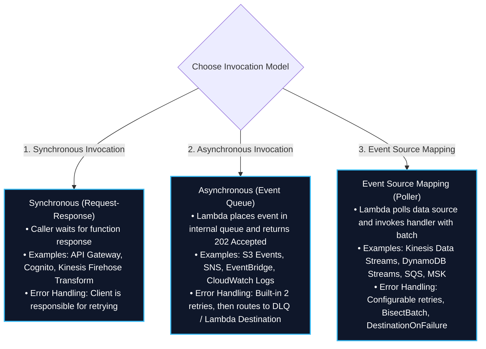
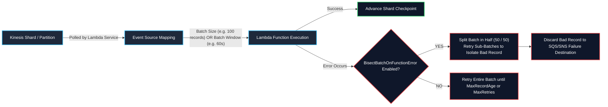
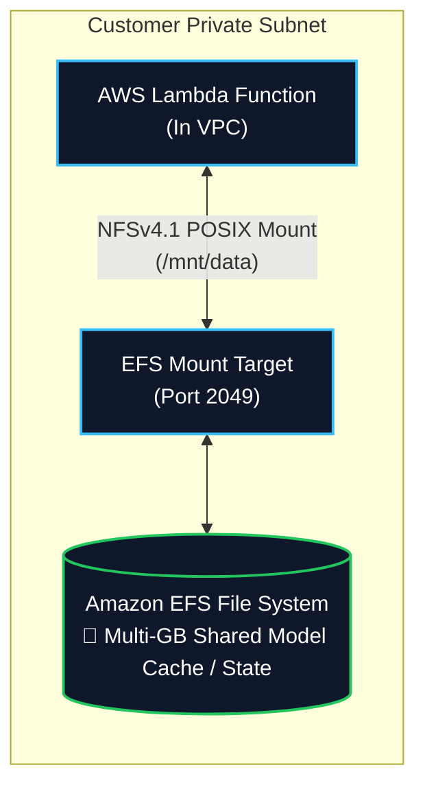
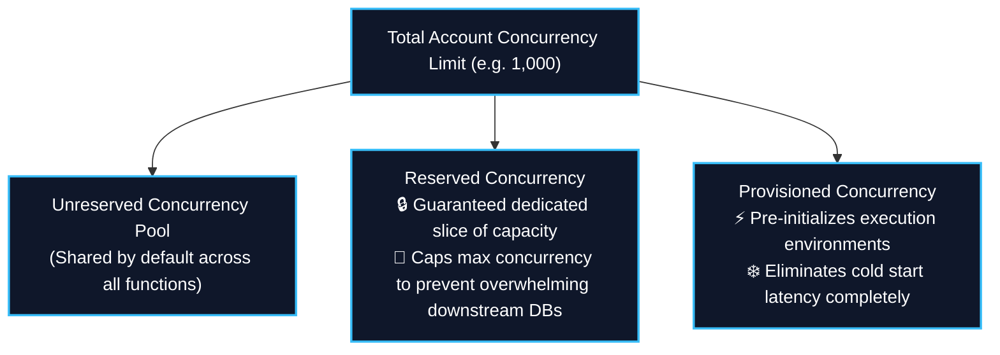
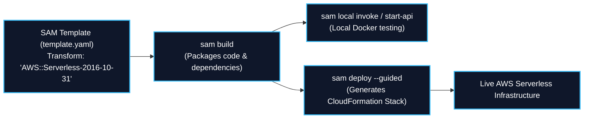
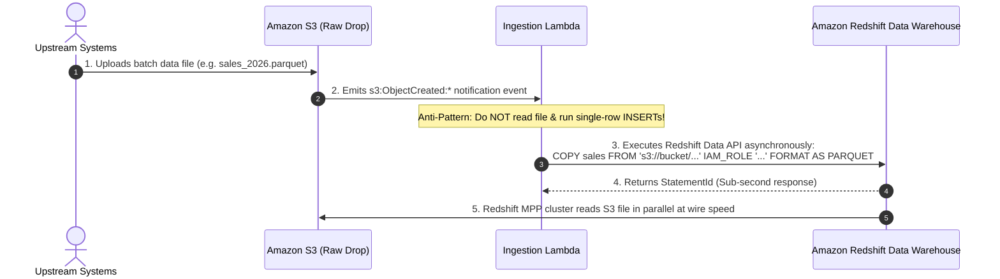

# ⚡ AWS Lambda (Serverless Event-Driven Compute & Data Transformation)

- **Category**: Compute (Serverless Compute & Event-Driven Processing)
- **Primary Use Case**: Real-time event-driven data processing, streaming micro-batching from [[kinesis]] and [[msk-kafka]], lightweight ETL, S3 file ingestion triggers, and workflow orchestration glue.
- **Slide Reference**: Pages 289–310 in `[[AWSCertifiedDataEngineerSlides.pdf]]`
- **Hub Links**: [[index]] | [[service-catalog]] | [[domain-1-ingestion-and-processing]] | [[kinesis]] | [[s3]] | [[dynamodb]] | [[redshift]] | [[efs-and-fsx]] | [[step-functions]]

---

## 1. High-Level Summary

**AWS Lambda** is a fully managed, event-driven serverless compute service that runs code in response to events without provisioning or managing servers. Lambda automatically scales from zero to tens of thousands of concurrent executions, billing strictly for compute duration in 1-millisecond increments.

In data engineering architectures, AWS Lambda serves as the essential **event-driven glue**:
1. **Real-Time File Processing**: Triggered instantly by [[s3]] object creation events (`s3:ObjectCreated:*`) to validate, decompress, or extract metadata.
2. **Stream Processing & Micro-Batching**: Reading and transforming streaming records from [[kinesis]] Data Streams, [[dynamodb]] Streams, and [[msk-kafka]].
3. **Data Lake Hydration & Data Warehouse Loading**: Initiating bulk `COPY` commands into [[redshift]] or updating metadata in [[glue]] Data Catalog.
4. **Database Event Streaming**: Replicating change events from operational databases to search indexes like [[opensearch]] or alerting topics via [[sqs-and-sns]].

For the **AWS Certified Data Engineer – Associate (DEA-C01)** exam, you must master:
- **Invocation Models**: Synchronous vs. Asynchronous vs. Event Source Mapping (Stream/Queue Polling).
- **Stream Ingestion Tuning**: Batch size, batching window, parallelization factor, error handling (`BisectBatchOnFunctionError`), and tumbling windows.
- **Compute Limits & Storage**: The strict **15-minute execution limit**, memory allocation (128 MB to 10 GB), ephemeral storage (`/tmp` up to 10 GB), and mounting **Amazon EFS** for multi-gigabyte persistent storage.
- **Concurrency & Cold Starts**: Reserved vs. Provisioned Concurrency.
- **AWS SAM (Serverless Application Model)**: Deploying serverless data pipelines locally and on AWS.

```mermaid
graph TB
    subgraph EventSources["Event Sources (Invocation Models)"]
        subgraph AsyncSources["1. Asynchronous Triggers"]
            S3Event["Amazon S3<br/>(s3:ObjectCreated:*)"]
            SNSEvent["Amazon SNS Topics"]
            EBEvent["Amazon EventBridge (Cron/Events)"]
        end

        subgraph StreamSources["2. Event Source Mapping (Polling)"]
            KinesisStream["Amazon Kinesis Data Streams"]
            DynamoStream["Amazon DynamoDB Streams"]
            MSKStream["Amazon MSK (Kafka)"]
            SQSQueue["Amazon SQS Queues"]
        end

        subgraph SyncSources["3. Synchronous Invocations"]
            APIGW["Amazon API Gateway"]
            FirehoseTrans["Kinesis Data Firehose (Transform)"]
        end
    end

    subgraph LambdaEngine["AWS Lambda Compute Core"]
        Handler["Lambda Function Handler<br/>⚡ 128 MB - 10 GB RAM<br/>⏱️ 15-Minute Max Timeout<br/>📦 512 MB - 10 GB /tmp Storage"]
        EFSAttached["Mounted Amazon EFS<br/>(Multi-GB Shared Model / State)"]
        Layers["Lambda Layers (Pandas / PyArrow)"]
    end

    subgraph TargetDestinations["Downstream Storage & Analytics"]
        RedshiftDW[("Amazon Redshift<br/>(Trigger COPY Command)")]
        OpenSearchCluster[("Amazon OpenSearch<br/>(Log Indexing)")]
        CleanS3[("Amazon S3 (Silver Data Lake)")]
        DLQQueue[("Dead Letter Queue (SQS / SNS)<br/>(Failed Async Events)")]
    end

    S3Event -->|"Async Invoke (2 Retries)"| Handler
    SNSEvent --> Handler
    EBEvent --> Handler

    KinesisStream -->|"Polled in Batches"| Handler
    DynamoStream --> Handler
    MSKStream --> Handler
    SQSQueue --> Handler

    APIGW -->|"Sync Invoke"| Handler
    FirehoseTrans --> Handler

    Handler <--> EFSAttached
    Handler --- Layers

    Handler -->|"Execute Data API / COPY"| RedshiftDW
    Handler -->|"Index Documents"| OpenSearchCluster
    Handler -->|"Write Processed Output"| CleanS3
    Handler -.->|"On Failure (Async)"| DLQQueue

    classDef src fill:#1e293b,stroke:#f59e0b,stroke-width:2px,color:#fff;
    classDef lambda fill:#0f172a,stroke:#38bdf8,stroke-width:2px,color:#fff;
    classDef dest fill:#0f172a,stroke:#22c55e,stroke-width:2px,color:#fff;

    class S3Event,SNSEvent,EBEvent,KinesisStream,DynamoStream,MSKStream,SQSQueue,APIGW,FirehoseTrans src;
    class Handler,EFSAttached,Layers lambda;
    class RedshiftDW,OpenSearchCluster,CleanS3,DLQQueue dest;
```



---

## 2. Technical Specifications & Compute Limits

| Parameter / Resource | Hard / Soft Limit | Data Engineering Significance |
| :--- | :--- | :--- |
| **Max Execution Timeout** | **15 minutes (900 seconds)** | **Strict Hard Limit**: Long-running Spark or custom ETL jobs exceeding 15 minutes MUST run on [[glue]], [[emr]], [[batch]], or [[ecr-ecs-eks]]. |
| **Memory Allocation** | **128 MB to 10,240 MB (10 GB)** | Configured in 1 MB increments. **CPU scales proportionally with memory** (at 1,769 MB, Lambda allocates 1 full vCPU; at 10 GB, up to 6 vCPUs). |
| **Ephemeral Storage (`/tmp`)** | **512 MB to 10,240 MB (10 GB)** | Configurable local scratch disk space. Essential for downloading, uncompressing, and processing multi-gigabyte files locally before uploading to S3. |
| **Direct Deployment Package Size** | **50 MB** (zipped) / **250 MB** (unzipped) | Includes code and unzipped dependencies. |
| **Container Image Deployment** | **Up to 10 GB** | Packaged as a Docker container stored in [[ecr-ecs-eks]] (Amazon ECR). Ideal for large ML packages (TensorFlow, PyTorch) or custom C++ libraries. |
| **Lambda Layers** | Max **5 layers** per function | Shared reusable libraries (e.g. AWS SDK, `awswrangler`, `numpy`, `pandas`). Total unzipped size of function + all layers must not exceed 250 MB. |
| **Default Regional Concurrency** | **1,000 concurrent executions** | Soft limit per AWS Region (can be increased via quota request). |

---

## 3. Lambda Invocation Models & Error Handling

Understanding the three invocation models is vital for data pipeline reliability:



### Event Source Mapping Stream Controls (Kinesis & DynamoDB Streams)

When processing streaming data with Lambda, fine-grained batching and retry parameters prevent poison pill records from stalling stream partitions:



#### Key Streaming Tuning Parameters:
1. **`BatchSize`**: Maximum number of records sent to the function in a single invocation (1 to 10,000).
2. **`MaximumBatchingWindowInSeconds`**: Maximum time Lambda buffers records before invoking the function (0 to 300 seconds). Allows batching micro-records during low-throughput periods to optimize cost and downstream database writes.
3. **`ParallelizationFactor`**: Enables up to **10 concurrent Lambda invocations per single Kinesis shard**, maintaining in-order processing per partition key while scaling throughput!
4. **`BisectBatchOnFunctionError`**: Automatically splits a failed batch into two halves and retries each recursively to isolate the single malformed record ("poison pill") without stalling the entire shard.
5. **`MaximumRecordAgeInSeconds` & `MaximumRetryAttempts`**: Drops expired streaming records to a **Destination on Failure** (Amazon SQS or SNS) to resume stream flow.
6. **`TumblingWindows`**: Enables stateful tumbling window calculations (aggregations over continuous tumbling time windows up to 15 minutes).

---

## 4. Lambda VPC Networking & Amazon EFS Mounting

### 1. VPC Networking (ENI Architecture)
- By default, Lambda runs in a secure AWS-managed VPC with direct access to the public internet and public AWS endpoints.
- To access private resources (such as Amazon RDS inside private subnets, Amazon Redshift, or internal microservices), attach the Lambda function to **private subnets within your VPC**.
- **Important**: To access the public internet from a VPC-enabled Lambda function, route traffic through a **NAT Gateway** in a public subnet.

### 2. Persistent Storage: Amazon EFS Integration



- Lambda can mount **Amazon EFS** file systems via an **EFS Access Point**.
- **Benefits for Data Engineering**:
  - Provides a shared, persistent POSIX file system with **unlimited storage capacity** (bypassing the 10 GB `/tmp` limit).
  - Enables multiple concurrent Lambda function invocations to share large machine learning model weights, search indexes, or stateful reference datasets.

---

## 5. Concurrency Management: Reserved vs. Provisioned Concurrency



1. **Reserved Concurrency**:
   - Allocates a guaranteed maximum number of concurrent execution instances to a specific function.
   - **Crucial Data Engineering Role**: Acts as a **rate limiter (circuit breaker)** to protect downstream transactional databases ([[rds-and-aurora]]) from connection exhaustion when massive bursts of events hit Lambda.
2. **Provisioned Concurrency**:
   - Pre-initializes a requested number of execution environments (downloads code, initializes runtime, runs initialization code).
   - Completely eliminates **cold start latency** for real-time APIs or synchronous stream transformations.

---

## 6. AWS Serverless Application Model (AWS SAM)

**AWS SAM** is an open-source framework extending AWS CloudFormation to define, build, test, and deploy serverless data architectures:



### SAM Template Example for Event-Driven Ingestion:
```yaml
AWSTemplateFormatVersion: '2010-09-09'
Transform: 'AWS::Serverless-2016-10-31'
Description: 'S3 Ingestion & Redshift Copy Trigger'

Resources:
  DataIngestFunction:
    Type: AWS::Serverless::Function
    Properties:
      Handler: app.lambda_handler
      Runtime: python3.11
      MemorySize: 1024
      Timeout: 60
      Policies:
        - S3ReadPolicy:
            BucketName: raw-data-lake-bucket
      Events:
        S3FileUpload:
          Type: S3
          Properties:
            Bucket: !Ref RawDataBucket
            Events: s3:ObjectCreated:*
            Filter:
              S3Key:
                Rules:
                  - Name: suffix
                    Value: .parquet

  RawDataBucket:
    Type: AWS::S3::Bucket
```

- **SAM Accelerate (`sam sync --watch`)**: Synchronizes local code changes directly to AWS in real-time, bypassing full CloudFormation stack updates for rapid cloud development and testing.

---

## 7. Data Engineering Production Architecture Patterns

### Pattern A: Event-Driven Redshift Data Warehouse Bulk Ingestion



### Pattern B: Real-Time Stream Ingestion & OpenSearch Log Indexing
- **Scenario**: High-volume clickstream logs flow into [[kinesis]] Data Streams. Analytics dashboards require searchable documents in [[opensearch]] within seconds.
- **Architecture**:
  - Kinesis Data Streams captures log records.
  - Lambda Event Source Mapping polls Kinesis with `BatchSize: 500` and `MaximumBatchingWindowInSeconds: 10`.
  - Lambda transforms JSON records, extracts geolocation, and executes bulk indexing requests into Amazon OpenSearch Service.
  - Failed records are routed to an SQS Dead Letter Queue with `BisectBatchOnFunctionError: true`.

---

## 8. High-Yield DEA-C01 Exam Tips & Traps

> [!IMPORTANT]
> **Key Exam Trigger Keywords**:
> - **"Event-driven serverless processing triggered by S3 uploads or Kinesis streams"** $\rightarrow$ **AWS Lambda**.
> - **"Loading large S3 files into Amazon Redshift via event trigger"** $\rightarrow$ **Lambda triggers Redshift `COPY` command via Redshift Data API** (Never line-by-line SQL `INSERT`s inside Lambda!).
> - **"Prevent poison pill records from blocking a Kinesis data stream"** $\rightarrow$ **Enable `BisectBatchOnFunctionError: true` and configure `DestinationOnFailure` (SQS/SNS)**.
> - **"Eliminate cold start latency for critical Lambda workloads"** $\rightarrow$ **Provisioned Concurrency**.
> - **"Prevent bursty Lambda invocations from exhausting relational database connections"** $\rightarrow$ **Reserved Concurrency (acts as a throttling ceiling) or Amazon RDS Proxy**.
> - **"Serverless function requires multi-gigabyte shared ML model cache or shared file system"** $\rightarrow$ **Attach Amazon EFS to Lambda via EFS Access Point**.

> [!WARNING]
> **Exam Traps & Failure Modes**:
> 1. **The 15-Minute Execution Limit**:
>    - Lambda functions **automatically terminate at 15 minutes (900s)**. If an exam question mentions a batch processing task taking 30 minutes or several hours, Lambda is the wrong answer; choose **AWS Batch**, **AWS Glue ETL**, or **Amazon EMR**.
> 2. **S3 Event Notification Recursion Trap**:
>    - If a Lambda function is triggered by an S3 bucket upload and writes its output file back to the **same S3 bucket with the same prefix**, it causes an **infinite recursive execution loop**, resulting in massive AWS bills! Always write output to a different bucket or distinct prefix.
> 3. **Asynchronous Retry Behavior**:
>    - Asynchronous invocations (from S3, SNS, EventBridge) automatically **retry twice on failure** before sending to a DLQ. Ensure functions are **idempotent** so retries do not create duplicate records in downstream databases.

---

## 📌 Related Notes

- [[batch]] — AWS Batch for long-running containerized batch computing (> 15 mins)
- [[glue]] — AWS Glue for distributed serverless Spark ETL
- [[emr]] — Amazon EMR for petabyte-scale distributed cluster processing
- [[kinesis]] — Amazon Kinesis streaming ingestion with Lambda consumers
- [[s3-event-notifications]] — S3 Event Notifications & EventBridge integration
- [[step-functions]] — Orchestrating multi-step Lambda workflows
- [[domain-1-ingestion-and-processing]] — DEA-C01 Domain 1 Study Guide
- [[service-comparisons]] — Master DEA-C01 Service Decision Matrix

