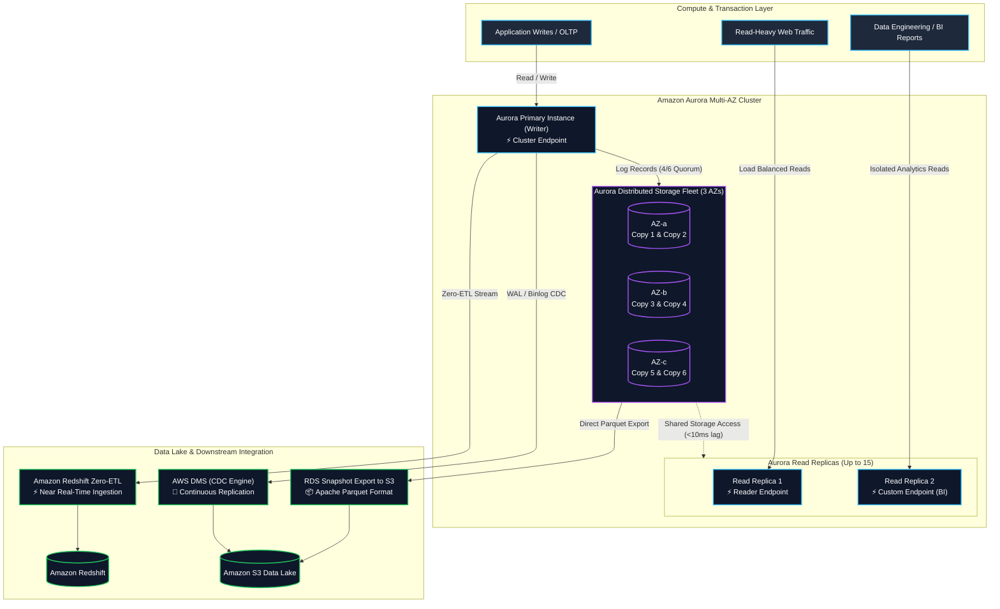
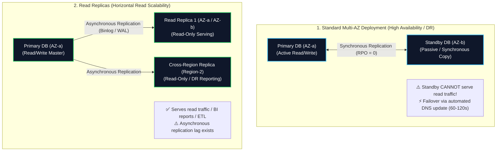
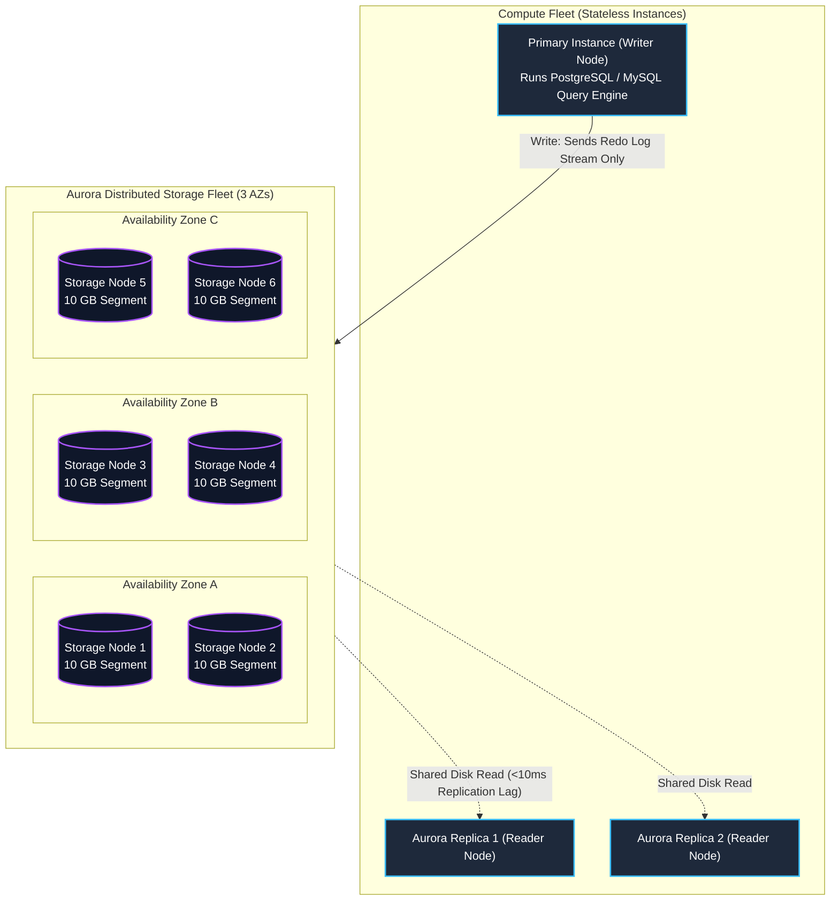
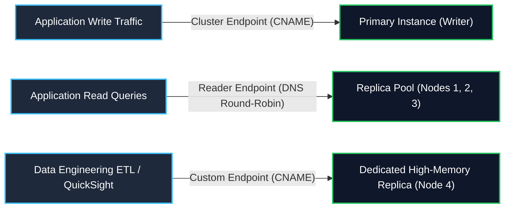
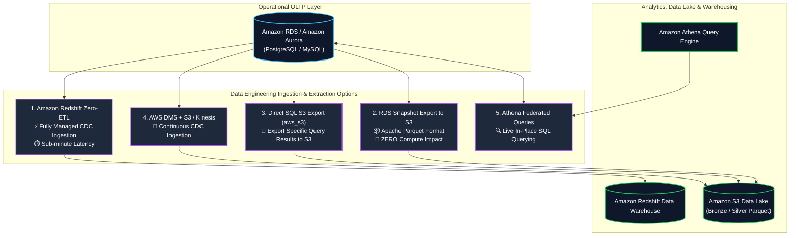
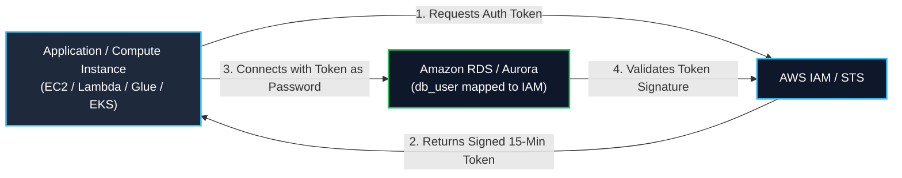

# 🐘 Amazon RDS & Amazon Aurora (Managed Relational OLTP Databases)

- **Category**: Database (Relational OLTP & Cloud-Native Storage)
- **Primary Use Case**: Managed relational databases for transactional operational workloads, ACID transactions, Change Data Capture (CDC) ingestion, zero-ETL integration with [[redshift]], and direct S3 Parquet export.
- **Slide Reference**: Pages 196–213 in `[[AWSCertifiedDataEngineerSlides.pdf]]`
- **Hub Links**: [[index]] | [[service-catalog]] | [[domain-2-data-store-management]] | [[domain-1-ingestion-and-processing]] | [[redshift]] | [[dms-and-sct]] | [[s3]] | [[kms-and-secrets]]

---

## 1. High-Level Summary

**Amazon Relational Database Service (Amazon RDS)** is a fully managed web service that makes it easy to set up, operate, and scale relational databases in the cloud across six database engines: **Amazon Aurora**, **PostgreSQL**, **MySQL**, **MariaDB**, **Oracle**, and **Microsoft SQL Server**.

**Amazon Aurora** is AWS's proprietary, cloud-native relational database engine compatible with MySQL and PostgreSQL. Aurora decouples compute and storage into a distributed, self-healing, multi-AZ storage subsystem, delivering up to **5x the throughput of standard MySQL** and **3x the throughput of standard PostgreSQL**.

For the **AWS Certified Data Engineer – Associate (DEA-C01)** exam, you must master:
1. **Multi-AZ Deployments vs. Read Replicas**: High Availability (HA) failover vs. horizontal read scalability and analytics offloading.
2. **Aurora Distributed Storage Architecture**: 6-way replication across 3 AZs with 4/6 write quorum and 3/6 read quorum.
3. **Data Lake & Analytics Integrations**: Native snapshot export to S3 in **Apache Parquet**, direct SQL S3 export (`aws_s3`), and **Amazon Redshift Zero-ETL integration**.
4. **Change Data Capture (CDC)**: Extracting transactional changes from PostgreSQL WAL or MySQL binlogs via [[dms-and-sct]] (AWS DMS).
5. **Security & Authentication**: **IAM Database Authentication** (temporary tokens) and automated credential rotation with [[kms-and-secrets]] (AWS Secrets Manager).



---

## 2. Amazon RDS Core Architecture

### 1. Storage Volume Subsystems in Standard RDS

Standard RDS instances (PostgreSQL, MySQL, MariaDB, Oracle, SQL Server) utilize Amazon EBS volumes under the hood:

| Volume Type | Technical Characteristics | Max IOPS / Throughput | Best Data Engineering Use Case |
| :--- | :--- | :--- | :--- |
| **General Purpose SSD (`gp3`)** | Baseline 3,000 IOPS and 125 MB/s included free; decoupled independent scaling of IOPS and throughput | 16,000 IOPS / 1,000 MB/s | **Recommended default** for development, testing, and standard production OLTP workloads |
| **Provisioned IOPS SSD (`io1` / `io2 Block Express`)** | Dedicated sustained I/O performance with sub-millisecond latency; 5 9's durability on `io2` | Up to **256,000 IOPS** / 4,000 MB/s | Mission-critical, high-throughput OLTP databases with intensive random I/O |
| **Storage Auto-Scaling** | Dynamically expands storage volume size up to **64 TiB** when free disk space falls below 10% | N/A | Prevents database downtime caused by storage exhaustion (Note: Storage can only scale **up**, never down) |

---

### 2. Multi-AZ Deployments vs. Read Replicas (Core Exam Distinction)

Understanding the architectural distinction between **Multi-AZ** (for High Availability) and **Read Replicas** (for Scalability) is one of the most heavily tested concepts in the DEA-C01 exam.



### Multi-AZ vs. Read Replicas Comparison Matrix

| Architectural Feature | Standard Multi-AZ Deployment | Read Replicas | Multi-AZ DB Cluster (Two Readable Standbys) |
| :--- | :--- | :--- | :--- |
| **Primary Purpose** | **High Availability (HA) & Disaster Recovery** | **Horizontal Read Scalability & BI Offloading** | **HA + Fast Failover + Read Scalability** |
| **Replication Type** | **Synchronous** (Zero data loss, RPO = 0) | **Asynchronous** (Subject to replication lag) | **Quorum-based** (Semi-synchronous to 2 standbys) |
| **Active Read Traffic?** | ❌ **No** (Standby is passive; invisible to applications) | ✅ **Yes** (Dedicated DNS endpoints for read-only queries) | ✅ **Yes** (Both standbys serve read traffic) |
| **Failover Mechanism** | **Automatic**: DNS record flipped to standby (60–120s) | **Manual Promotion**: Must be manually promoted to standalone | **Automatic**: Sub-35 second failover |
| **Region Scope** | **Single Region** (Across 2 AZs) | **Same Region OR Cross-Region** | **Single Region** (Across 3 AZs) |
| **Performance Impact** | Slight write latency penalty (waiting for sync ack) | No write latency impact on primary | Minimal write latency impact |
| **Max Instances** | 1 Primary + 1 Standby | Up to **5** (Standard RDS) or **15** (Aurora) | 1 Writer + 2 Readable Standbys |

---

## 3. Amazon Aurora Cloud-Native Architecture

Amazon Aurora re-architects the traditional relational database by decoupling compute from storage and moving the logging layer to a purpose-built distributed storage fleet.



### Key Aurora Storage Innovations

1. **6-Way Replication Across 3 AZs**:
   - Aurora automatically partitions your database storage volume into **10 GB segments** and replicates each segment **6 times across 3 Availability Zones** (2 copies per AZ).
2. **Quorum Model (Fault Tolerance)**:
   - **Write Quorum ($4/6$)**: A write is committed as soon as **4 out of 6 nodes** acknowledge receiving the log record. Aurora can withstand the complete loss of an entire AZ plus one additional storage node without losing write availability!
   - **Read Quorum ($3/6$)**: Reads require acknowledgment from 3 of 6 nodes.
3. **Log is the Database**:
   - Instead of writing dirty buffer pages and database files across the network (like standard RDS), the Aurora compute engine writes **redo log records only** directly to the storage fleet.
   - Storage nodes apply redo logs in parallel in the background, eliminating write amplification and I/O bottlenecks.
4. **Self-Healing & Auto-Expanding Storage**:
   - Storage continuously scans for corrupted disk sectors and repairs them automatically in background 10 GB chunks.
   - Storage grows automatically in 10 GB increments from 10 GB up to **128 TiB** (and automatically shrinks when data is deleted).

---

### Aurora Endpoints Architecture

Aurora provides four types of DNS endpoints to direct traffic to appropriate compute instances:



1. **Cluster Endpoint (Writer Endpoint)**: Points to the current primary DB instance. Automatically points to the new primary after a failover.
2. **Reader Endpoint**: Provides DNS round-robin load balancing across all active Aurora Read Replicas.
3. **Custom Endpoint**: Represents a user-defined set of DB instances. Ideal for routing heavy analytical queries or ETL jobs to specific larger instance sizes without affecting general user read traffic.
4. **Instance Endpoint**: Direct connection to a specific DB instance in the cluster.

---

### Aurora Advanced Deployment Options

#### 1. Aurora Serverless v2
- Automatically scales compute capacity up and down in fractions of a second based on application demand.
- Capacity is measured in **Aurora Capacity Units (ACUs)**, scaling from **0.5 ACU to 128 ACUs** (1 ACU $\approx$ 2 GiB RAM, corresponding CPU and networking).
- Adjusts CPU and memory capacity in fine-grained steps without dropping database connections.
- Ideal for spiky, unpredictable, multi-tenant, and dev/test workloads.

#### 2. Aurora Global Database
- Spans across multiple AWS Regions with sub-second replication latency (typically **< 1 second**).
- Replication is handled directly by the dedicated storage layer (zero performance penalty on primary compute).
- Provides disaster recovery with RPO < 1s and RTO < 1 minute, plus ultra-low latency local reads worldwide.

#### 3. Aurora Parallel Query
- Pushes SQL query processing down to the Aurora distributed storage fleet.
- Enables thousands of storage nodes to scan and filter data segments in parallel.
- Accelerates analytical queries (`COUNT`, `SUM`, `AVG`, large table scans) up to **10x to 100x** on transactional tables without needing to move data to a data warehouse.

#### 4. Aurora Fast Database Cloning
- Creates instant, isolated clones of an Aurora cluster using **Copy-on-Write** storage.
- Clones are created in minutes regardless of database size (even for 50+ TB databases) with zero initial additional storage cost.
- Ideal for staging, testing schema migrations, or running intensive one-off data extraction pipelines.

---

## 4. Data Engineering Integrations & Data Lake Pipelines



### 1. Amazon Redshift Zero-ETL Integration (Top Exam Focus)
- Fully managed, serverless integration that automatically replicates transactional data from Amazon Aurora (MySQL/PostgreSQL) and Amazon RDS into **Amazon Redshift**.
- **Mechanics**: Data written to Aurora is automatically replicated to Redshift storage within seconds of write.
- **Why use it?**: Eliminates the need to design, build, and maintain complex ETL/ELT pipelines using Glue or DMS. Enables real-time analytics and BI dashboards directly on transactional data.

### 2. RDS Snapshot Export to Amazon S3 (Parquet Export)
- Exports the data from an Amazon RDS or Aurora snapshot directly into **Amazon S3 in Apache Parquet format**.
- **Zero Impact on Production**: The export process runs completely in the AWS managed background fleet; **consumes 0 CPU/RAM/IOPS** on the active database instance.
- **Analytical Optimization**: Parquet files are automatically columnar-formatted, compressed with Snappy, and partitioned, making them instantly queryable by [[athena]], [[glue]], or loadable into [[redshift]].

### 3. Direct SQL S3 Integration (`aws_s3` Extension for PostgreSQL)
- Using the native `aws_s3` extension in RDS/Aurora PostgreSQL, you can export query results directly to S3:

```sql
-- Export query results directly to an S3 bucket in CSV format
SELECT * FROM aws_s3.query_export_to_s3(
   'SELECT customer_id, transaction_date, amount FROM customer_transactions WHERE transaction_date >= ''2026-01-01''',
   aws_commons.create_s3_uri('my-data-lake-bucket', 'raw/transactions_2026.csv', 'us-east-1'),
   options => 'format csv, header true'
);
```

### 4. Change Data Capture (CDC) via AWS DMS
- **AWS Database Migration Service (AWS DMS)** reads transactional transaction logs (PostgreSQL WAL or MySQL binary logs) continuously.
- Replicates INSERTs, UPDATEs, and DELETEs to **Amazon S3**, **Amazon Kinesis Data Streams**, or **Amazon MSK** in near real-time for stream processing.

---

## 5. Security, Authentication & Credential Governance



### 1. IAM Database Authentication
- Eliminates hardcoded database user passwords.
- Applications authenticate to RDS/Aurora MySQL or PostgreSQL using temporary **IAM authentication tokens** (signed with AWS credentials, valid for 15 minutes).
- **IAM Policy Action**: `rds-db:connect`.

### 2. AWS Secrets Manager Credential Rotation
- Securely stores database master credentials and application connection strings.
- Natively rotates database passwords on a scheduled basis (e.g., every 30 days) using an automated AWS Lambda rotation function without application disruption.

### 3. Encryption at Rest & In Transit
- **At Rest**: AWS KMS (CMK or AWS managed key `aws/rds`). Covers the DB instance, all automated backups, read replicas, and snapshots. (Encryption must be enabled at creation time; cannot encrypt an existing unencrypted database in place without snapshotting).
- **In Transit**: SSL/TLS encryption enforced by setting parameter `rds.force_ssl = 1` (PostgreSQL) or `require_secure_transport = ON` (MySQL).

---

## 6. Multi-Dimensional Comparison: RDS vs. Aurora vs. Redshift vs. DynamoDB

| Architectural Dimension | Amazon RDS (Postgres/MySQL) | Amazon Aurora | Amazon Redshift | Amazon DynamoDB |
| :--- | :--- | :--- | :--- | :--- |
| **Data Model** | Relational (SQL) | Relational (SQL) | Relational (SQL / Columnar) | NoSQL (Key-Value / Document) |
| **Workload Type** | **OLTP (Transactional)** | **OLTP (High-Performance)** | **OLAP (Analytics / DW)** | **OLTP (Massive Concurrency)** |
| **Storage Architecture** | Dedicated EBS Volumes | **Distributed Shared Cluster** (3 AZs, 6 copies) | Columnar Managed Storage (Redshift Managed Storage - RMS) | Distributed Partitioned SSDs |
| **Max Storage Size** | 64 TiB | **128 TiB** (Auto-scaling) | Petabytes / Exabytes | Virtually Infinite |
| **Query Latency** | Single-digit milliseconds | Single-digit milliseconds | Seconds to minutes (Complex aggregation) | **Single-digit milliseconds (Microseconds with DAX)** |
| **Replication** | Asynchronous / Synchronous Multi-AZ | **Sub-10ms shared storage** | Multi-AZ clusters / S3 replication | Sub-second Global Tables |
| **Primary DEA-C01 Fit** | Standard transactional apps, relational migrations | **High-throughput OLTP, Zero-ETL to Redshift** | **Complex SQL analytics, aggregation, data warehouse** | **Real-time key-value lookups, session state, CDC** |

---

## 7. Data Engineering Production Architecture Patterns

### Pattern A: Zero-ETL Real-Time Analytics Pipeline with Redshift

- **Challenge**: An e-commerce platform needs real-time inventory and revenue dashboards. Running heavy aggregation queries on the transactional database causes primary CPU spikes and locks checkout tables.
- **Solution**: Configure **Amazon Aurora PostgreSQL Zero-ETL integration with Amazon Redshift**.
- **Architecture**:
  - Web applications write checkout transactions to Aurora Primary.
  - Transactions replicate to Redshift in near real-time (< 15 seconds) via Zero-ETL.
  - Business Intelligence tools ([[quicksight]]) run complex multi-table join and aggregation queries directly against Redshift.

### Pattern B: Zero-Compute Production Data Lake Hydration (Snapshot Export to S3)

- **Challenge**: The data engineering team must ingest complete historical database tables into the S3 Data Lake daily without degrading the performance of active OLTP instances during peak hours.
- **Solution**: Use **RDS Automated Snapshot Export to Amazon S3**.
- **Architecture**:
  - RDS automated backups take a daily snapshot.
  - AWS Backup or EventBridge triggers an export of the snapshot directly to S3.
  - The export engine converts the database tables into snappy-compressed **Apache Parquet files** partitioned by date in S3.
  - **Zero CPU/IOPS impact** on the live database.

---

## 8. High-Yield DEA-C01 Exam Tips & Traps

> [!IMPORTANT]
> **Key Exam Trigger Keywords**:
>
> - **"High availability, synchronous replication across 2 AZs with automated failover, passive standby"** $\rightarrow$ **Amazon RDS Multi-AZ**.
> - **"Horizontal read scalability, asynchronous replication, offload analytical queries or BI reporting"** $\rightarrow$ **RDS / Aurora Read Replicas**.
> - **"High-performance cloud-native MySQL/PostgreSQL with 6 storage copies across 3 AZs and 4/6 write quorum"** $\rightarrow$ **Amazon Aurora**.
> - **"Near real-time replication from Aurora to Redshift without custom ETL pipelines"** $\rightarrow$ **Amazon Redshift Zero-ETL integration**.
> - **"Export historical relational data to S3 Data Lake in Parquet format without impacting DB instance CPU or IOPS"** $\rightarrow$ **RDS Snapshot Export to Amazon S3**.
> - **"Authenticate compute applications to RDS without storing passwords"** $\rightarrow$ **IAM Database Authentication (`rds-db:connect`)**.
> - **"Automatically rotate database credentials on a schedule"** $\rightarrow$ **AWS Secrets Manager**.

> [!WARNING]
> **Exam Traps & Failure Modes**:
>
> 1. **Multi-AZ Standby is NOT for Read Queries**:
>    - In standard RDS Multi-AZ, the standby instance is purely passive and **cannot accept read or write connections**. If an exam question asks to offload read reporting traffic, the answer is **Read Replicas**, not Multi-AZ! (Except for Multi-AZ DB Clusters with 2 readable standbys).
> 2. **Encrypting Unencrypted Existing RDS Databases**:
>    - You cannot enable encryption on an existing running RDS database in-place. You must: **Take a snapshot $\rightarrow$ Copy the snapshot with KMS encryption enabled $\rightarrow$ Restore a new encrypted DB from that snapshot**.
> 3. **Aurora Storage Quorum Mechanics**:
>    - Write Quorum = **4 of 6 copies** (can lose 2 copies without losing write availability).
>    - Read Quorum = **3 of 6 copies** (can lose 3 copies without losing read availability).
> 4. **Storage Shrinking Trap**:
>    - Standard RDS EBS volumes can be scaled **UP** automatically, but **CANNOT be scaled down**. Aurora storage, however, automatically scales up and **automatically shrinks** when tables/data are dropped.
> 5. **OLTP (RDS/Aurora) vs. OLAP (Redshift)**:
>    - Do not choose RDS or Aurora for heavy historical aggregation over billions of rows; choose **Amazon Redshift**. Do not choose Redshift for high-frequency transactional single-row lookups; choose **RDS/Aurora** or **DynamoDB**.

---

## 📌 Related Notes

- [[redshift]] — Petabyte-scale OLAP data warehouse and Zero-ETL target
- [[dynamodb]] — Serverless NoSQL operational database comparisons
- [[dms-and-sct]] — AWS Database Migration Service for CDC replication from RDS
- [[s3]] — S3 Data Lake target for RDS Snapshot Parquet exports
- [[athena]] — Querying RDS S3 exports and Athena Federated Queries
- [[kms-and-secrets]] — KMS database encryption and Secrets Manager credential rotation
- [[aws-backup]] — Centralized backup plans, PITR, and Vault Lock protection for RDS
- [[service-comparisons]] — Master DEA-C01 Service Decision Matrix
- [[domain-2-data-store-management]] — DEA-C01 Domain 2 Study Guide
