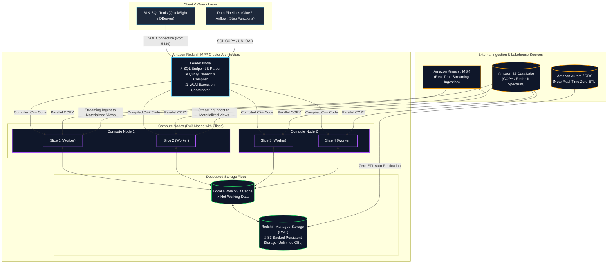
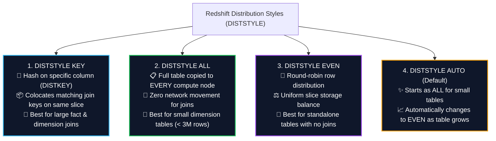
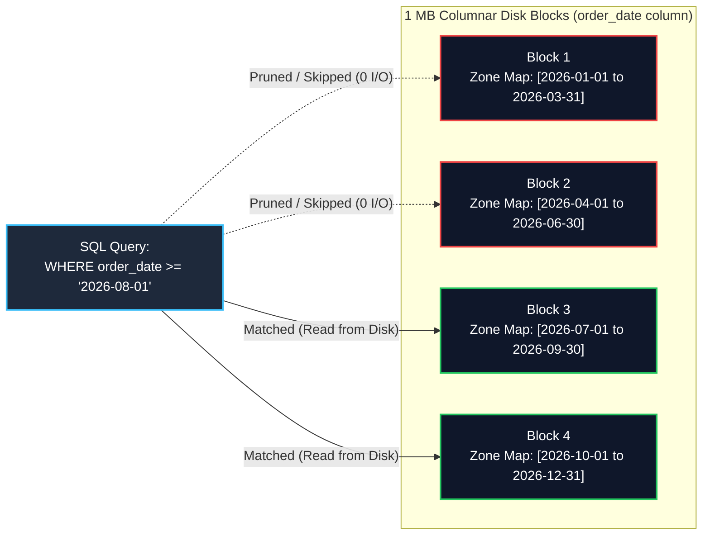
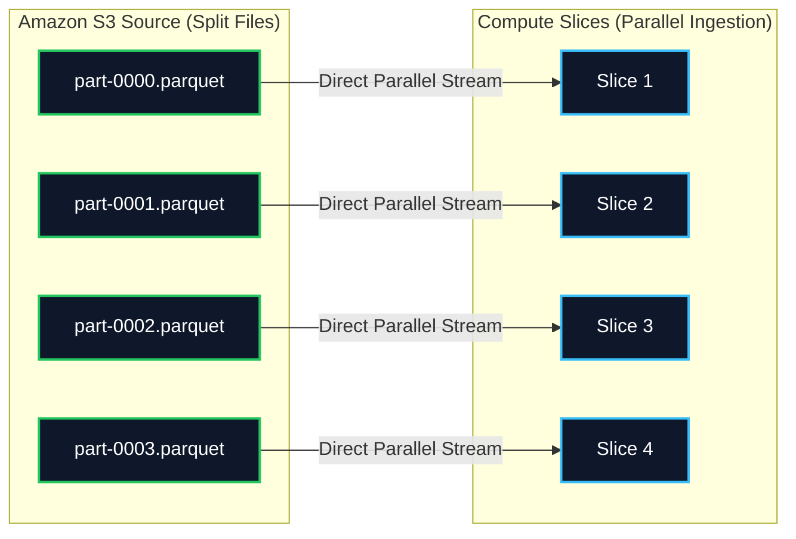
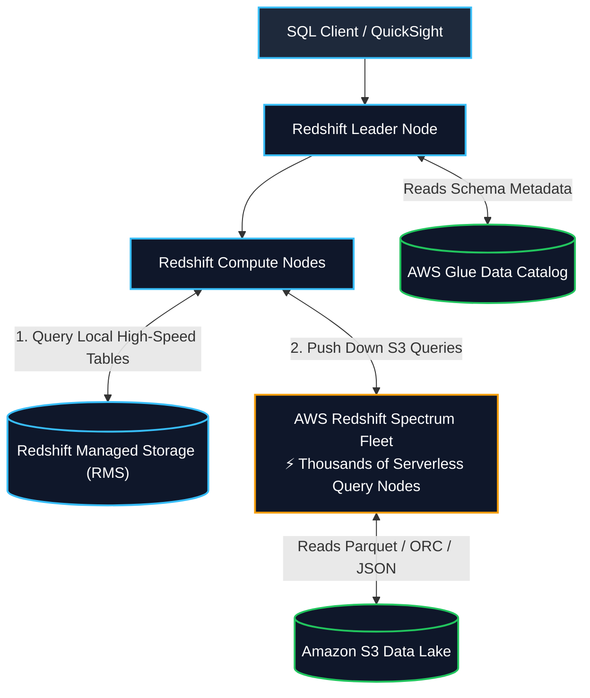
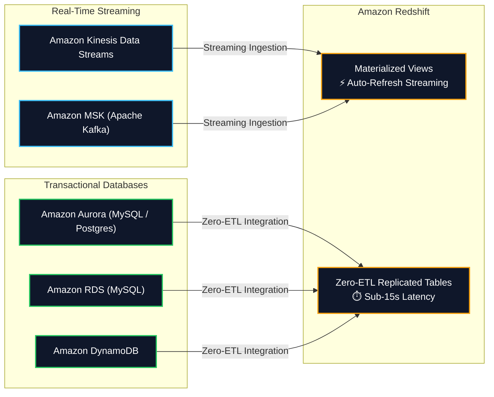

# 🔴 Amazon Redshift (Petabyte-Scale Cloud Data Warehouse & Lakehouse)

- **Category**: Database (Petabyte-Scale Columnar OLAP Data Warehouse)
- **Primary Use Case**: Enterprise data warehousing, high-performance complex SQL analytics, BI dashboarding, Data Lakehouse querying with Redshift Spectrum, Zero-ETL replication, and real-time streaming ingestion.
- **Slide Reference**: Pages 220–265 in `[[AWSCertifiedDataEngineerSlides.pdf]]`
- **Hub Links**: [[index]] | [[service-catalog]] | [[domain-2-data-store-management]] | [[domain-1-ingestion-and-processing]] | [[athena]] | [[glue]] | [[s3]] | [[rds-and-aurora]] | [[kinesis]]

---

## 1. High-Level Summary & Core Architecture

**Amazon Redshift** is a fully managed, petabyte-scale, columnar Massively Parallel Processing (MPP) data warehouse. It delivers ultra-fast query performance by parallelizing execution across distributed compute nodes, utilizing columnar storage, and leveraging hardware-accelerated local cache combined with decoupled cloud storage.

For the **AWS Certified Data Engineer – Associate (DEA-C01)** exam, Redshift is one of the most critical services tested across:
1. **MPP & RA3 Architecture**: Leader node coordination, compute node slices, and persistent S3-backed **Redshift Managed Storage (RMS)**.
2. **Table Design & Performance Tuning**: Choosing optimal **Distribution Styles (`DISTSTYLE KEY / ALL / EVEN / AUTO`)** and **Sort Keys (`Compound` vs. `Interleaved` & Zone Maps)**.
3. **High-Throughput Ingestion**: Parallel bulk loading using the **`COPY` command**, manifest files, S3 file splitting math ($N \times \text{Slices}$), and columnar encodings (**`AZ64` / `ZSTD`**).
4. **Data Lakehouse & Federation**: Querying exabytes of open-format S3 data with **Redshift Spectrum**, and transactional operational data via **Federated Queries** and **Zero-ETL Ingestion**.
5. **Workload Management (WLM) & Scalability**: Automatic WLM, Short Query Acceleration (SQA), Concurrency Scaling, and **Redshift Serverless (RPUs)**.
6. **Data Sharing & In-Database ML**: Zero-copy cross-cluster / cross-account **Redshift Data Sharing** and SQL-based **Redshift ML**.



---

## 2. Redshift Node Types & Massively Parallel Processing (MPP)

### 1. Leader Node vs. Compute Nodes & Slices

- **Leader Node**:
  - Serves as the master endpoint for JDBC/ODBC client connections.
  - Parses SQL statements, builds optimized query plans, compiles them into executable C++ code, and distributes execution code to compute nodes.
  - Aggregates intermediate query results from compute nodes before returning final records to the client.
  - **Exam Note**: Leader node is **free of charge** when running clusters with two or more compute nodes. User table data is **never stored on the leader node**.
- **Compute Nodes**:
  - Execute the compiled code on assigned table slices in parallel.
  - Each compute node is partitioned into logical processing units called **Slices**.
  - Number of slices depends on the node size (e.g., `ra3.4xlarge` has 4 slices; `ra3.16xlarge` has 16 slices).
  - All slices work simultaneously to process chunks of data.

---

### 2. Node Families: RA3 vs. Dense Compute (DC2)

| Node Family | Architecture & Storage Model | Best DEA-C01 Use Case |
| :--- | :--- | :--- |
| **RA3 Nodes (`ra3.xlplus`, `ra3.4xlarge`, `ra3.16xlarge`)** | **Decoupled Compute & Storage**: Uses high-performance local SSD cache combined with persistent **Redshift Managed Storage (RMS)** backed by Amazon S3. Storage scales automatically up to **128 TB per node**. | **Recommended modern default** for all production workloads. Allows scaling compute and storage independently. |
| **Dense Compute (`dc2.large`, `dc2.8xlarge`)** | **Tightly Coupled Compute & Local SSD**: Fixed local NVMe SSD storage. Cannot scale storage without adding more compute nodes. | Small data marts (< 500 GB) or development environments requiring intensive compute with static storage. |

---

## 3. Redshift Table Design: Distribution Styles (`DISTSTYLE`)

Choosing the correct Distribution Style is essential for optimizing query performance. It dictates how table rows are distributed across physical compute slices to **minimize network data movement (data redistribution)** during `JOIN` and `GROUP BY` operations.



### Comprehensive Distribution Style Matrix

| Style | Syntax Example | Placement Behavior | Ideal Data Engineering Use Case |
| :--- | :--- | :--- | :--- |
| **`KEY`** | `DISTSTYLE KEY DISTKEY(customer_id)` | Hashing algorithm places rows with the same key value on the **exact same slice**. | **Large Fact Tables** joined frequently with large Dimension tables on the same join key. |
| **`ALL`** | `DISTSTYLE ALL` | Replicates the **entire table to node 0 of every compute node**. | **Small, slowly changing Dimension Tables** (< 2–3 million rows or < a few GBs). |
| **`EVEN`** | `DISTSTYLE EVEN` | Distributes rows evenly across all slices in a **round-robin** pattern. | Tables that are not joined with other tables, or when no clear join key exists. |
| **`AUTO`** | `DISTSTYLE AUTO` | Redshift manages distribution: assigns `ALL` when table is small, transitions to `EVEN` as data grows. | Default when query access patterns are not yet established. |

---

### Diagnosing Data Redistribution in Query Plans (`EXPLAIN`)

When tables are joined on columns with mismatched distribution keys, Redshift must physically move rows across the network during query execution:
- **`DS_DIST_NONE` (Optimal)**: Zero network data movement. Both tables are colocated on the same slices via matching `DISTKEY`s or `DISTSTYLE ALL`.
- **`DS_BCAST_INNER` (Acceptable for Small Tables)**: The inner table is broadcast across the network to all compute nodes. Fast for small tables; severe performance penalty for large tables.
- **`DS_DIST_BOTH` (Worst Performance)**: Both tables must be redistributed across the network. Indicates poorly designed or missing `DISTKEY`s!

---

## 4. Redshift Table Design: Sort Keys & Zone Maps

Redshift stores data on disk in **1 MB blocks**. For every 1 MB block, Redshift automatically maintains **Zone Maps** in memory.

### 1. Zone Maps (Block-Skipping Mechanism)
- Zone maps store the **minimum (`MIN`) and maximum (`MAX`) values** of each column within every 1 MB block.
- When an analytical query filters with a `WHERE` clause (e.g., `WHERE order_date BETWEEN '2026-08-01' AND '2026-08-10'`), the query engine compares the predicate with the Zone Map metadata and **completely skips reading non-matching 1 MB blocks from disk**.
- Results in massive I/O reduction and 10x to 100x query speedups.



---

### 2. Compound Sort Key vs. Interleaved Sort Key

| Characteristic | Compound Sort Key (Default) | Interleaved Sort Key |
| :--- | :--- | :--- |
| **Sorting Hierarchy** | **Strict hierarchical order**: `(col1, col2, col3)`. Sorts by `col1` first, then `col2` within `col1`. | **Equal weighting** across all indexed columns. |
| **Best Query Filter Patterns** | Highly effective when queries filter on **leading / prefix columns** (e.g., `WHERE col1 = 'X'` or `WHERE col1 = 'X' AND col2 = 'Y'`). | Ideal when queries filter on **different columns independently** (e.g., `WHERE col2 = 'Y'` without filtering on `col1`). |
| **Ingestion & Vacuum Overhead** | Low maintenance overhead; fast `COPY` bulk ingestion. | High maintenance overhead; requires frequent `VACUUM REINDEX` after bulk data loads. |
| **Exam Recommendation** | **Choose by default** for time-series date columns, fact tables, and predictable filters. | Choose ONLY when multiple unpredictable ad-hoc query filters are applied across wide dimension columns. |

---

## 5. Bulk Data Ingestion: High-Performance `COPY` Best Practices

The **`COPY` command** is the foundational data ingestion mechanism in Amazon Redshift.



### Golden Rules for the `COPY` Command (Top DEA-C01 Rules)

1. **NEVER use SQL `INSERT` statements for bulk data**:
   - Single `INSERT` statements route through the Leader node sequentially and write to disk uncompressed, resulting in terrible performance and cluster bottlenecks.
2. **S3 File Splitting Math**:
   - Split your source data files into a **multiple of the total number of slices** in the Redshift cluster (e.g., for a 16-slice cluster, split data into 16, 32, or 64 files).
   - Files should be roughly equal in size (compressed between **1 MB and 1 GB**).
3. **Use Manifest Files (`manifest`)**:
   - Provide a JSON manifest file listing explicit S3 URIs to ensure **exact file loading** and prevent duplicate loads or accidental ingestion of temporary files with matching prefixes.
4. **Columnar Compression Encodings (`AZ64` vs `ZSTD`)**:
   - **`AZ64`**: Proprietary AWS encoding designed specifically for numeric (`INT`, `BIGINT`, `DECIMAL`), `DATE`, and `TIMESTAMP` columns. Provides highest compression ratio and fastest query execution using SIMD hardware vectorization.
   - **`ZSTD`**: High compression algorithm ideal for unstructured text, `VARCHAR`, and wide columns.

### Example Production `COPY` SQL Command
```sql
COPY public.customer_transactions
FROM 's3://my-analytics-lake/manifests/2026_transactions.manifest'
IAM_ROLE 'arn:aws:iam::123456789012:role/RedshiftS3LoadRole'
FORMAT AS PARQUET
MANIFEST;
```

---

## 6. Redshift Spectrum & Hybrid Data Lakehouse Architecture

**Amazon Redshift Spectrum** allows you to run standard SQL queries directly against exabytes of data stored in **Amazon S3 Data Lakes** without loading the data into Redshift tables.



### Key Redshift Spectrum Technical Attributes

1. **Separation of Compute & Data**:
   - Redshift provisions a dynamic fleet of thousands of serverless Spectrum nodes behind the scenes to scan, filter, and aggregate S3 data in parallel.
2. **Glue Catalog Metastore Integration**:
   - External tables in Redshift Spectrum are defined using the **AWS Glue Data Catalog**:
     ```sql
     CREATE EXTERNAL SCHEMA data_lake_schema
     FROM DATA CATALOG
     DATABASE 'glue_analytics_db'
     IAM_ROLE 'arn:aws:iam::123456789012:role/RedshiftSpectrumRole';
     ```
3. **Hybrid Joins**:
   - A single SQL query can join hot operational tables stored in Redshift local RMS storage with cold historical tables sitting in S3 Parquet format.
4. **Cost Model**:
   - Billed at **$5.00 per TB of data scanned** from Amazon S3. Using columnar formats (**Apache Parquet**, **ORC**) and S3 partition pruning drastically reduces costs.

---

## 7. Redshift Serverless vs. Provisioned Clusters

| Dimension | Redshift Serverless | Redshift Provisioned Clusters |
| :--- | :--- | :--- |
| **Capacity Metric** | **Redshift Processing Units (RPUs)** (Base capacity scales from 8 to 512 RPUs) | Node types & count (e.g., 4 x `ra3.4xlarge`) |
| **Scaling Behavior** | Automatically scales RPU compute up/down in seconds based on query complexity | Manual cluster resize or Scheduled Elastic Resize |
| **Billing Model** | Pay per RPU-hour **only when queries are actively running** (per-second billing) | Hourly instance pricing (continuous 24/7 cost unless paused) |
| **Cost Optimization** | Set max RPU usage limits and daily/weekly cost caps | Purchase **Reserved Instances (RIs)** for 1 or 3 years (up to 75% savings) |
| **Best Exam Use Case** | Variable, spiky, intermittent, or ad-hoc query workloads | Steady-state 24/7 production enterprise data warehouses |

---

## 8. Workload Management (WLM) & Concurrency Scaling

### 1. Automatic WLM (Auto WLM) & Query Priorities
- Redshift Automatic WLM uses machine learning to dynamically manage query queues, memory allocation, and concurrency slots.
- **Query Priority**: Assign priorities (`CRITICAL`, `HIGH`, `NORMAL`, `LOW`) to specific user groups (e.g., give Executive Dashboard users `CRITICAL` priority and ETL batch users `LOW` priority).
- **Short Query Acceleration (SQA)**: Automatically identifies fast-running queries and executes them in a dedicated priority queue, preventing long-running ETL queries from blocking quick dashboard lookups.

### 2. Concurrency Scaling
- Automatically provisions transient replica clusters in seconds to handle sudden bursts of concurrent read queries with zero wait time.
- Clusters earn **1 hour of free Concurrency Scaling credits** for every 24 hours the cluster is active.

---

## 9. Modern Real-Time Ingestion & Ecosystem Features



### 1. Amazon Redshift Streaming Ingestion
- Ingests streaming data directly from **Amazon Kinesis Data Streams** or **Amazon Managed Streaming for Apache Kafka (MSK)** into Redshift Materialized Views.
- Eliminates the need to stage streaming data in Amazon S3 or run separate Lambda/Firehose ingestion jobs.

### 2. Amazon Redshift Zero-ETL Integration
- Fully managed replication from **Amazon Aurora**, **Amazon RDS**, and **Amazon DynamoDB** into Redshift.
- Transactional changes are replicated within seconds, enabling real-time analytics on operational data with zero ETL maintenance overhead.

### 3. Redshift Data Sharing
- Allows live, secure, read-only data sharing across Redshift clusters, AWS accounts, or AWS Regions **without copying data or maintaining ETL pipelines**.
- Consumer clusters query the producer cluster's Redshift Managed Storage (RMS) directly.

### 4. Redshift ML
- Train, compile, and run machine learning models using standard SQL:
```sql
CREATE MODEL customer_churn_model
FROM (SELECT age, tenure, monthly_spend, churn_label FROM customer_data)
TARGET churn_label
FUNCTION predict_churn
IAM_ROLE 'arn:aws:iam::123456789012:role/RedshiftMLRole'
SETTINGS (
  S3_BUCKET 'my-redshift-ml-bucket'
);
```

---

## 10. Cluster Maintenance & Diagnostics

- **`VACUUM` Command**:
  - Reclaims disk space from rows marked for deletion and restores the sorted order for sort keys.
  - Types: `VACUUM FULL`, `VACUUM SORT ONLY`, `VACUUM DELETE ONLY`, `VACUUM REINDEX`.
  - **Auto Vacuum**: Redshift runs automated background vacuuming during periods of low cluster activity.
- **`ANALYZE` Command**:
  - Updates table statistics metadata used by the query optimizer to choose the most efficient execution plan.
- **Diagnostic System Views**:
  - `STL_LOAD_ERRORS`: Inspect details of failed `COPY` command executions.
  - `SVV_TABLE_INFO`: Check table skew, distribution style, sort keys, and percentage of unsorted rows.
  - `STL_QUERY` / `STL_WLM_QUERY`: View historical query execution times and WLM queue wait metrics.

---

## 11. High-Frequency DEA-C01 Exam Tips & Traps

> [!IMPORTANT]
> **Key Exam Trigger Keywords**:
>
> - **"Petabyte-scale columnar OLAP data warehouse with complex SQL analytics"** $\rightarrow$ **Amazon Redshift**.
> - **"Query S3 data lake using SQL without loading data into cluster"** $\rightarrow$ **Amazon Redshift Spectrum** (with Glue Catalog).
> - **"Share live data across accounts/clusters without data copying or ETL"** $\rightarrow$ **Redshift Data Sharing**.
> - **"Near real-time replication from Aurora/RDS to Redshift without custom Glue ETL"** $\rightarrow$ **Amazon Redshift Zero-ETL integration**.
> - **"Bulk load millions of records into Redshift efficiently"** $\rightarrow$ **`COPY` command from S3 with split files equaling a multiple of slice count**.
> - **"Avoid network broadcast on joins between small dimension and large fact tables"** $\rightarrow$ **`DISTSTYLE ALL` on dimension, `DISTSTYLE KEY` on fact table**.
> - **"Skip reading 1 MB disk blocks during range filters"** $\rightarrow$ **Zone Maps with Compound Sort Keys**.

> [!WARNING]
> **Common Exam Traps & Pitfalls**:
>
> 1. **SQL `INSERT` vs. `COPY`**:
>    - Never select individual SQL `INSERT` statements or multi-row `INSERT VALUES` for data ingestion in Redshift. The answer is always the parallel **`COPY` command**.
> 2. **S3 File Count for `COPY`**:
>    - Loading a single massive 50 GB compressed file will utilize only **1 slice**, leaving all other compute slices completely idle! Always split S3 files into a multiple of total slices.
> 3. **`DISTSTYLE ALL` on Huge Tables Trap**:
>    - Do NOT apply `DISTSTYLE ALL` to multi-billion row fact tables. It will duplicate the entire multi-TB dataset across every compute node, consuming all disk storage! `DISTSTYLE ALL` is strictly for small dimension tables (< 2–3M rows).
> 4. **Redshift Spectrum vs. Athena**:
>    - If the scenario already has an active **Redshift cluster** and requires joining cluster tables with S3 Data Lake files, choose **Redshift Spectrum**.
>    - If the requirement is ad-hoc serverless SQL directly on S3 without maintaining an active warehouse cluster, choose **Amazon Athena**.
> 5. **Interleaved Sort Key Maintenance**:
>    - Interleaved sort keys degrade performance if the table undergoes massive continuous bulk loads without running `VACUUM REINDEX`.

---

## 📌 Related Notes

- [[athena]] — Serverless ad-hoc SQL engine vs. Redshift Spectrum
- [[s3]] — S3 Data Lake target for Redshift COPY and UNLOAD commands
- [[glue]] — AWS Glue Data Catalog integration for Redshift Spectrum
- [[rds-and-aurora]] — Amazon Aurora Zero-ETL integration with Redshift
- [[kinesis]] — Real-time streaming ingestion into Redshift Materialized Views
- [[dynamodb]] — Exporting DynamoDB to S3/Redshift
- [[service-comparisons]] — Master DEA-C01 Service Decision Matrix
- [[domain-2-data-store-management]] — DEA-C01 Domain 2 Study Guide
