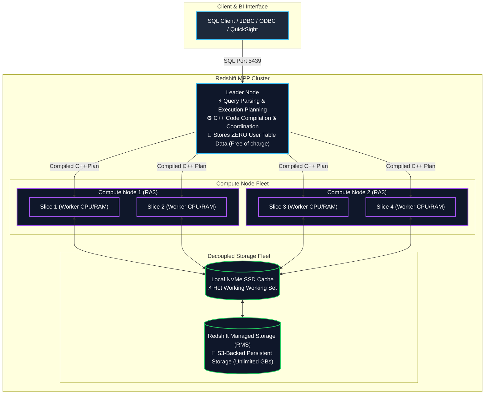
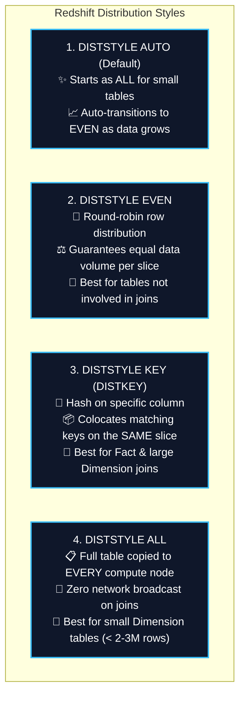
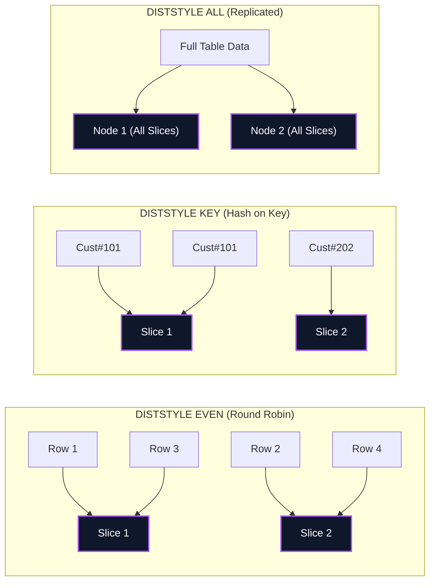
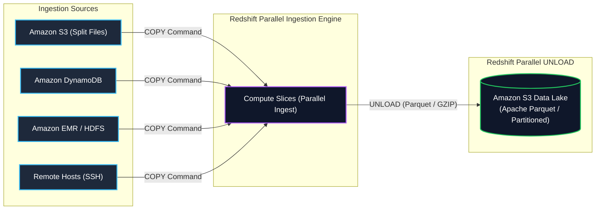
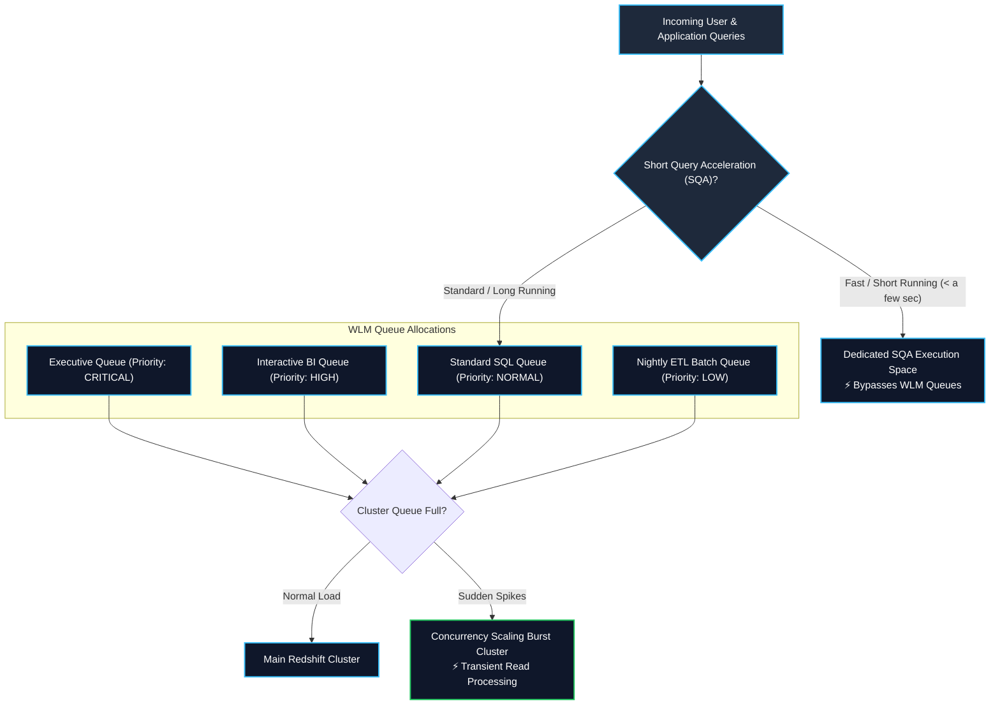
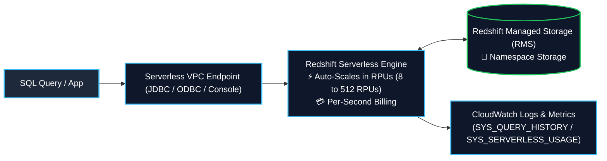
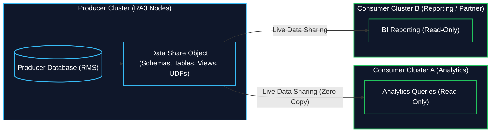
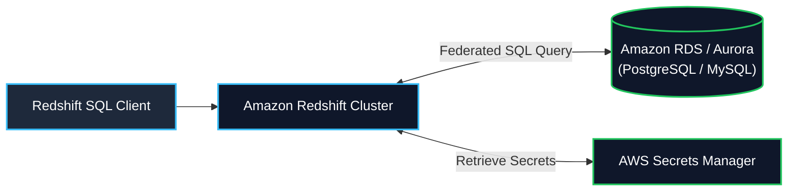
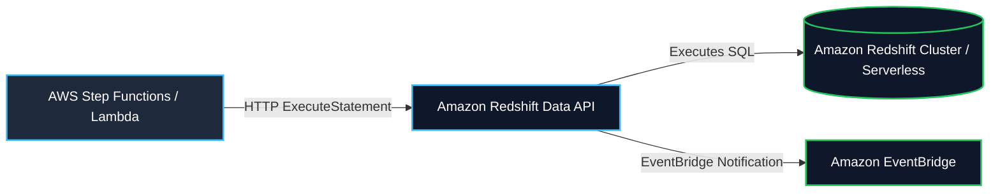

# 🔴 Amazon Redshift (Petabyte-Scale Cloud Data Warehouse & Lakehouse)

- **Category**: Database (Petabyte-Scale Columnar OLAP Data Warehouse)
- **Primary Use Case**: Enterprise data warehousing, high-performance complex SQL analytics, BI dashboarding, Lakehouse querying with Redshift Spectrum, Serverless data processing, Zero-ETL replication, and real-time streaming ingestion.
- **Slide Reference**: Pages 220–265 in `[[AWSCertifiedDataEngineerSlides.pdf]]`
- **Hub Links**: [[index]] | [[service-catalog]] | [[domain-2-data-store-management]] | [[domain-1-ingestion-and-processing]] | [[athena]] | [[glue]] | [[s3]] | [[rds-and-aurora]] | [[kinesis]] | [[kms-and-secrets]]

---

## Master Slide Index (Pages 220–265)

| Slide # | Slide Title | Major Technical Concept & Section Link |
| :--- | :--- | :--- |
| **220–222** | Amazon Redshift & Use-Cases | [1. Redshift Fundamentals & MPP Architecture](#1-redshift-fundamentals--mpp-architecture-slides-220225) |
| **223** | Dense Compute (DC) vs. RA3 | [1. Redshift Fundamentals & MPP Architecture](#1-redshift-fundamentals--mpp-architecture-slides-220225) |
| **224** | Redshift Spectrum | [13. Redshift Spectrum & Lakehouse Querying](#13-redshift-spectrum--lakehouse-querying-slide-224) |
| **225** | Redshift Performance (MPP, Columnar, Compression) | [1. Redshift Fundamentals](#1-redshift-fundamentals--mpp-architecture-slides-220225) & [4. Sort Keys & Zone Maps](#4-table-design-sort-keys--zone-maps-slide-225) |
| **226** | Redshift Durability (Replication, S3 Backup, Cross-Region) | [2. Durability & Resizing](#2-high-availability-durability--cluster-resizing-slides-226-227-234-242) |
| **227** | Scaling Redshift (Vertical & Horizontal on-demand) | [2. Durability & Resizing](#2-high-availability-durability--cluster-resizing-slides-226-227-234-242) |
| **228–231** | Distribution Styles (AUTO, EVEN, KEY, ALL) & Slices | [3. Distribution Styles & Slices](#3-table-design-distribution-styles--slices-slides-228231) |
| **232–233** | Importing / Exporting Data (`COPY` Command Depth) | [5. Bulk Data Ingestion (`COPY` & `UNLOAD`)](#5-data-ingestion--export-copy-unload-dblink-integrations-slides-232236-244) |
| **234** | KMS-Encrypted Snapshot Copies Across Regions | [2. Durability & Resizing](#2-high-availability-durability--cluster-resizing-slides-226-227-234-242) |
| **235** | `DBLINK` (PostgreSQL / RDS Integration) | [5. Bulk Data Ingestion](#5-data-ingestion--export-copy-unload-dblink-integrations-slides-232236-244) |
| **236** | Integration with Other Services (S3, DynamoDB, EMR) | [5. Bulk Data Ingestion](#5-data-ingestion--export-copy-unload-dblink-integrations-slides-232236-244) |
| **237–241** | Workload Management (WLM), Queues, SQA & Concurrency Scaling | [6. Workload Management (WLM) & SQA](#6-workload-management-wlm-concurrency-scaling--sqa-slides-237241) |
| **242** | Resizing Redshift Clusters (Elastic Resize vs. Classic Resize) | [2. Durability & Resizing](#2-high-availability-durability--cluster-resizing-slides-226-227-234-242) |
| **243** | `VACUUM` Command (`FULL`, `SORT ONLY`, `DELETE ONLY`, `REINDEX`) | [7. Cluster Maintenance (`VACUUM` & `ANALYZE`)](#7-cluster-maintenance-vacuum--analyze-slide-243) |
| **244** | Newer Features (RA3, Data Lake Export, Spatial, Data Sharing) | [10. Data Sharing](#10-redshift-data-sharing-slides-244-255256) & [5. Bulk Ingestion](#5-data-ingestion--export-copy-unload-dblink-integrations-slides-232236-244) |
| **245** | Amazon Redshift ML | [16. Redshift ML & Modern Capabilities](#16-redshift-ml-zero-etl--streaming-ingestion-slides-245) |
| **246** | Redshift Anti-Patterns (When NOT to use Redshift) | [17. Security & Anti-Patterns](#17-redshift-security--anti-patterns-slides-246247) |
| **247** | Redshift Security Concerns (HSM, SSL/TLS, GRANT/REVOKE) | [17. Security & Anti-Patterns](#17-redshift-security--anti-patterns-slides-246247) |
| **248–252** | Redshift Serverless (RPUs, Setup, Limitations, Monitoring) | [8. Redshift Serverless](#8-redshift-serverless-slides-248252) |
| **253–254** | Redshift Materialized Views (Creation, Auto-Refresh) | [9. Materialized Views](#9-redshift-materialized-views-slides-253254) |
| **255–256** | Redshift Data Sharing (Producer/Consumer, RA3, Lake Formation) | [10. Redshift Data Sharing](#10-redshift-data-sharing-slides-244-255256) |
| **257–258** | Redshift Lambda UDFs (`CREATE EXTERNAL FUNCTION`, JSON) | [11. Lambda User-Defined Functions](#11-redshift-lambda-user-defined-functions-udfs-slides-257258) |
| **259–261** | Redshift Federated Queries (RDS/Aurora, Secrets Manager) | [12. Federated Queries](#12-redshift-federated-queries-slides-259261) |
| **262** | Redshift System Tables & Views (`SYS_`, `STV_`, `SVV_`, `STL_`) | [14. System Tables & Diagnostic Views](#14-redshift-system-tables--diagnostic-views-slide-262) |
| **263–265** | Redshift Data API (REST, Async SQL, Step Functions, Quotas) | [15. Redshift Data API](#15-amazon-redshift-data-api-slides-263265) |

---

## 1. Redshift Fundamentals & MPP Architecture (Slides 220–225)

**Amazon Redshift** is a fully managed, petabyte-scale columnar data warehouse designed for high-performance online analytical processing (OLAP). It delivers up to **10x higher performance** than traditional relational databases on analytical queries through its **Massively Parallel Processing (MPP)** architecture.



### Core Architecture Breakdown
1. **Leader Node**:
   - Manages client connections, parses SQL queries, analyzes query optimization trees, and compiles code into optimized C++ binaries.
   - Coordinates parallel query execution across compute nodes and aggregates intermediate results for final return to the client.
   - **Cost Rule**: Free of charge when running clusters with 2 or more compute nodes.
2. **Compute Nodes & Slices**:
   - Compute nodes execute the compiled query steps in parallel across logical subdivisions called **Slices**.
   - Each slice is allocated dedicated CPU, memory, and disk space. A cluster with 4 compute nodes having 4 slices each possesses **16 parallel processing slices**.
3. **Columnar Storage & 1 MB Blocks**:
   - Data is stored physically on disk by column rather than row.
   - Stored in **1 MB immutable disk blocks**. Columnar layout drastically reduces disk I/O because queries only retrieve columns explicitly referenced in the SQL statement.
4. **Column Compression Encodings**:
   - **`AZ64`**: Proprietary AWS algorithm designed for numeric, `DATE`, and `TIMESTAMP` columns, yielding maximum compression and hardware-accelerated query speed.
   - **`ZSTD`**: High general-purpose compression for wide strings and text.
   - **`RAW`**: Uncompressed (default for sort key leading columns).

---

## 2. High Availability, Durability & Cluster Resizing (Slides 226, 227, 234, 242)

### 1. Cluster Durability & Replication (Slide 226)
- **Intra-Cluster Replication**: Data is mirrored across compute nodes within the cluster.
- **Continuous Automated S3 Backups**: Redshift automatically snapshots all cluster data to Amazon S3 asynchronously with a default retention period of 1 day (configurable up to 35 days).

### 2. Cross-Region KMS-Encrypted Snapshot Copy (Slide 234)
When backing up a KMS-encrypted Redshift cluster across AWS Regions:
- You must create a **KMS Customer Managed Key (CMK)** in the destination Region.
- Create a **KMS Snapshot Copy Grant** in the destination Region authorizing Redshift to use the destination KMS key.
- Configure Redshift automated snapshot copy to replicate snapshots to the target Region using that Snapshot Copy Grant.

### 3. Cluster Resizing: Elastic Resize vs. Classic Resize (Slides 227, 242)

| Dimension | Elastic Resize (Recommended) | Classic Resize |
| :--- | :--- | :--- |
| **Operation Duration** | **Minutes (typically < 10–15 mins)** | **Hours to Days** (Copies entire dataset row-by-row) |
| **Availability During Resize** | Cluster is **unavailable / read-only** for only a few minutes during node restart | Cluster is in **read-only mode** for the entire multi-hour duration |
| **Node Flexibility** | Add/remove nodes of the same type (or double/half node count); can change between RA3 node types | Can change to any arbitrary node type or configuration |
| **Disk Space Redistribution** | Metadata pointers updated instantly on Redshift Managed Storage (RMS) | Full physical data copy into a newly provisioned cluster |

---

## 3. Table Design: Distribution Styles & Slices (Slides 228–231)

Choosing the correct Distribution Style (`DISTSTYLE`) minimizes network I/O and data movement across compute slices during `JOIN` and `GROUP BY` operations.



### Distribution Style Deep Dive & Node Slices



### Distribution Decision Rules
- **Use `DISTSTYLE KEY`**: On large fact tables and large dimension tables that join frequently on the same foreign key (e.g. `order_id` or `customer_id`).
- **Use `DISTSTYLE ALL`**: On small, infrequently updated dimension tables ($< 2\text{–}3$ million rows). Eliminates data redistribution during joins.
- **Use `DISTSTYLE EVEN`**: On staging tables, standalone tables, or tables with no clear join keys.
- **Query Redistribution Diagnostic**:
  - `DS_DIST_NONE`: Optimal (no data redistribution required).
  - `DS_BCAST_INNER`: Inner table broadcast to all nodes (acceptable for small tables).
  - `DS_DIST_BOTH`: Both tables redistributed across the network (slowest, indicates missing `DISTKEY`).

---

## 4. Table Design: Sort Keys & Zone Maps (Slide 225)

### 1. In-Memory Zone Maps
- For every 1 MB disk block, Redshift automatically stores the **`MIN` and `MAX` values** of every column in memory (**Zone Maps**).
- During query execution with `WHERE` range filters, Redshift consults Zone Maps to **completely skip (prune) non-relevant 1 MB disk blocks**, reducing disk I/O to near zero.

### 2. Compound Sort Key vs. Interleaved Sort Key

| Sort Key Type | Technical Mechanics | Best Query Pattern |
| :--- | :--- | :--- |
| **Compound Sort Key (Default)** | Strict hierarchical sort order `(col1, col2)`. Sorts by `col1` first, then by `col2` within `col1`. | Queries that filter on the **prefix / leading columns** (e.g. `WHERE col1 = 'val'` or `WHERE col1 = 'val' AND col2 = 'val'`). Excellent for date/timestamp series. |
| **Interleaved Sort Key** | Equal weighting to every column in the sort key. | Queries that filter on **arbitrary, independent combinations of columns** (e.g., `WHERE col2 = 'val'` alone). |
| **Maintenance Warning** | Low maintenance overhead. | High maintenance: requires frequent `VACUUM REINDEX` after bulk data ingestion; degrades if unsorted. |

---

## 5. Data Ingestion & Export (`COPY`, `UNLOAD`, DBLINK, Integrations) (Slides 232–236, 244)



### 1. `COPY` Command Best Practices (Slides 232, 233)
- **Parallel Execution**: `COPY` reads data in parallel directly into all compute slices.
- **S3 File Splitting Rule**: Split S3 input files into a **multiple of the total number of slices** ($N \times \text{Slices}$). For a 16-slice cluster, split into 16, 32, or 64 files of equal size (1 MB to 1 GB compressed).
- **Manifest Files**: Use a JSON manifest file (`manifest`) to specify exact S3 file paths and avoid loading unintended files with common prefixes.
- **Data Compression**: `COPY` automatically applies optimal columnar encodings when loading into an empty table (or run `ANALYZE COMPRESSION`).

### 2. Parallel `UNLOAD` to Amazon S3 (Slide 244)
- Exports query results in parallel from all compute slices to Amazon S3:
```sql
UNLOAD ('SELECT * FROM customer_sales WHERE sale_date >= \'2026-01-01\'')
TO 's3://my-lakehouse-bucket/unloaded_sales/'
IAM_ROLE 'arn:aws:iam::123456789012:role/RedshiftUnloadRole'
FORMAT AS PARQUET
PARTITION BY (sale_region)
MANIFEST;
```
- **Parquet Unload**: 2x faster than text unload, uses up to 6x less storage in S3, and is instantly queryable by Athena, EMR, and Redshift Spectrum.

### 3. Spatial Data Types (Slide 244) & DBLINK (Slide 235)
- **Spatial Types**: Native support for `GEOMETRY` and `GEOGRAPHY` data types for geospatial SQL functions (`ST_Distance`, `ST_Contains`).
- **`DBLINK`**: Allows connecting Redshift directly to PostgreSQL / RDS PostgreSQL databases for cross-database querying.

---

## 6. Workload Management (WLM), Concurrency Scaling & SQA (Slides 237–241)

Workload Management (WLM) prevents long-running, resource-heavy ETL queries from blocking fast interactive BI queries.



### 1. Automatic WLM (Auto WLM) (Slide 239)
- Uses machine learning to dynamically manage query queues, concurrency levels, and memory allocation.
- Creates up to **8 queues** (default 5 queues with even memory allocation).
- **Query Priorities**: Set priority levels (`CRITICAL`, `HIGH`, `NORMAL`, `LOW`) based on user groups.

### 2. Manual WLM (Slide 240)
- Explicitly configured service classes with fixed memory percentages and concurrency levels.
- Default configuration: 1 queue with a concurrency level of 5 (processes 5 queries simultaneously) + 1 Superuser queue with concurrency level 1.

### 3. Short Query Acceleration (SQA) (Slide 241)
- Uses machine learning to identify fast-running queries and routes them to a dedicated SQA execution space.
- Prevents fast dashboard queries from waiting behind massive long-running ETL aggregations.

### 4. Concurrency Scaling (Slide 238)
- Automatically adds transient compute cluster capacity to handle sudden bursts of concurrent read queries with zero wait time.
- **Credit Rule**: Redshift clusters earn **1 hour of free Concurrency Scaling credits** for every 24 hours the cluster is actively running.

---

## 7. Cluster Maintenance: `VACUUM` & `ANALYZE` (Slide 243)

### 1. The `VACUUM` Command
Reclaims space from deleted rows and re-sorts tables:
- **`VACUUM FULL`**: Reclaims disk space from deleted rows and restores sort order for all unsorted rows (most comprehensive).
- **`VACUUM SORT ONLY`**: Restores sort order without reclaiming deleted disk space.
- **`VACUUM DELETE ONLY`**: Reclaims deleted disk space without re-sorting.
- **`VACUUM REINDEX`**: Rebuilds the interleaved sort index (mandatory after bulk loads into tables with Interleaved Sort Keys).
- **Auto Vacuum**: Redshift automatically runs background vacuum operations during periods of cluster inactivity.

### 2. The `ANALYZE` Command
- Updates optimizer table statistics metadata, allowing the query planner to generate optimal execution plans.

---

## 8. Redshift Serverless (Slides 248–252)

**Amazon Redshift Serverless** automatically provisions and scales data warehouse capacity in response to dynamic workloads, charging only for active query run time.



### Technical Details of Redshift Serverless
1. **Redshift Processing Units (RPUs)** (Slide 250):
   - Capacity is measured in **RPUs**. You pay for **RPU-hours per second** of query execution plus storage.
   - **Base Capacity**: Configurable from **8 to 512 RPUs** (defaults to AUTO).
   - **Max Usage Limits**: Set max RPU limits to control daily or monthly cost caps.
2. **Serverless Setup & IAM** (Slide 249):
   - Configured with a **Workgroup** (compute configuration, VPC subnets, security groups) and a **Namespace** (database name, admin credentials, KMS encryption, audit logging).
   - Requires IAM policy with `redshift-serverless:*` permissions.
3. **What Serverless Does NOT Have** (Slide 251):
   - No Parameter Groups.
   - No manual Workload Management (WLM) configuration (handled automatically via ML).
   - No maintenance windows or manual version track configurations.
   - Must be accessed inside a VPC (or VPC endpoint).
4. **Monitoring Serverless** (Slide 252):
   - System views: `SYS_QUERY_HISTORY`, `SYS_LOAD_HISTORY`, `SYS_SERVERLESS_USAGE`.
   - CloudWatch logs delivered automatically under `/aws/redshift/serverless/`.

---

## 9. Redshift Materialized Views (Slides 253–254)

- Stores precomputed query results based on SQL queries over one or more base tables.
- **Creation & Auto-Refresh**:
```sql
CREATE MATERIALIZED VIEW tickets_mv
AUTO REFRESH YES AS
SELECT 
    c.catgroup,
    sum(s.qtysold) as total_sold
FROM category c, event e, sales s
WHERE c.catid = e.catid AND e.eventid = s.eventid
GROUP BY c.catgroup;
```
- **Incremental Refresh**: Refreshes only changed data in underlying base tables using `REFRESH MATERIALIZED VIEW tickets_mv`.
- Materialized views can be created on top of other materialized views to reuse expensive multi-table joins.

---

## 10. Redshift Data Sharing (Slides 244, 255–256)

Enables secure, live, read-only data sharing across Redshift clusters, AWS accounts, or AWS Regions **without copying data or building ETL pipelines**.



### Key Technical Attributes
1. **Producer / Consumer Isolation**: Producer cluster compute is completely unaffected by consumer query load.
2. **Prerequisites**: Both producer and consumer clusters must be **encrypted** and use **RA3 node types**.
3. **Data Share Types**:
   - **Standard Data Sharing**: Across clusters in the same or different AWS accounts/Regions.
   - **AWS Data Exchange**: Licensing and monetizing live data shares to third parties.
   - **AWS Lake Formation-Managed Data Sharing**: Centralized governance and column/row-level permissions.

---

## 11. Redshift Lambda User-Defined Functions (UDFs) (Slides 257–258)

Allows invoking custom AWS Lambda functions directly inside Redshift SQL statements.

```sql
-- 1. Register Lambda UDF in Redshift
CREATE EXTERNAL FUNCTION lambda_multiply(INT, INT)
RETURNS INT VOLATILE
LAMBDA 'arn:aws:lambda:us-east-1:123456789012:function:multiply_func'
IAM_ROLE 'arn:aws:iam::123456789012:role/RedshiftLambdaRole';

-- 2. Use in SQL Query
SELECT product_id, lambda_multiply(units, price) as total_value
FROM inventory_table;
```

### JSON Communication & Permissions
- Redshift batches rows into a **JSON payload** sent to the Lambda function.
- Requires IAM role on the cluster with `lambda:InvokeFunction` or `AWSLambdaRole` policy. Supports cross-account Lambda invocation using IAM role chaining.

---

## 12. Redshift Federated Queries (Slides 259–261)

Ties Redshift directly to live operational databases in **Amazon RDS** and **Amazon Aurora (PostgreSQL and MySQL)** without ETL pipelines.



### Configuration Steps
1. Put Redshift and RDS/Aurora in the same VPC subnet or configure **VPC Peering**.
2. Store database credentials in **AWS Secrets Manager**.
3. Create external schema in Redshift:
```sql
CREATE EXTERNAL SCHEMA apg
FROM POSTGRES
DATABASE 'production_db' SCHEMA 'public'
URI 'aurora-pg-cluster.xyz.us-east-1.rds.amazonaws.com'
IAM_ROLE 'arn:aws:iam::123456789012:role/RedshiftSecretsRole'
SECRET_ARN 'arn:aws:secretsmanager:us-east-1:123456789012:secret:rds-creds-AbCdEf';
```
4. Query external schema directly (`SELECT * FROM apg.lineitem;`).

---

## 13. Redshift Spectrum & Lakehouse Querying (Slide 224)

- Query exabytes of data stored in **Amazon S3 Data Lakes** without loading it into Redshift tables.
- Leverages the **AWS Glue Data Catalog** for table schemas.
- External tables can be joined with local Redshift tables in a single SQL query.
- Billed at **$5.00 per TB scanned** from S3. Using columnar formats (**Parquet/ORC**) and S3 partitioning optimizes query costs.

---

## 14. Redshift System Tables & Diagnostic Views (Slide 262)

| Prefix | Type | Storage & Description |
| :--- | :--- | :--- |
| **`SYS_`** | Serverless & Provisioned Monitoring | Monitors query history, load metrics, and serverless usage (`SYS_QUERY_HISTORY`, `SYS_LOAD_HISTORY`). |
| **`STV_`** | Snapshot Data | Transient in-memory snapshots of current system execution. |
| **`SVV_`** | Object Metadata | Views referencing STV tables to show database object metadata (`SVV_TABLE_INFO`, `SVV_EXTERNAL_SCHEMAS`). |
| **`STL_`** | Disk Persisted Logs | Persistent log views on disk (`STL_LOAD_ERRORS`, `STL_QUERY`, `STL_WLM_QUERY`). |
| **`SVCS_` / `SVL_`** | Query Details | Execution details on main and Concurrency Scaling clusters (`SVL_QLOG`). |

---

## 15. Amazon Redshift Data API (Slides 263–265)

The **Redshift Data API** allows executing SQL statements via secure asynchronous HTTP/REST endpoints without managing persistent JDBC/ODBC database connections or drivers.



### Key Capabilities & Quotas (Slide 265)
- **Asynchronous Execution**: Submit queries via `ExecuteStatement` or `BatchExecuteStatement` and poll results via `GetStatementResult` (or trigger EventBridge on completion).
- **Authentication**: Uses IAM credentials and AWS Secrets Manager (no database passwords passed in API calls).
- **Quotas**:
  - Max query duration: **24 hours**.
  - Max query result size: **100 MB (gzip compressed)**.
  - Result retention time: **24 hours**.
  - Max active queries: **500**.
  - Max SQL statement size: **100 KB**.

---

## 16. Redshift ML, Zero-ETL & Streaming Ingestion (Slide 245)

1. **Amazon Redshift ML**:
   - Train, compile, and run machine learning models using standard SQL:
```sql
CREATE MODEL customer_churn_model
FROM (SELECT age, tenure, monthly_spend, churn_label FROM customer_data)
TARGET churn_label
FUNCTION predict_churn
IAM_ROLE 'arn:aws:iam::123456789012:role/RedshiftMLRole'
SETTINGS (S3_BUCKET 'my-redshift-ml-bucket');
```
2. **Zero-ETL Integrations**:
   - Fully managed near real-time (< 15 seconds) replication from **Amazon Aurora**, **Amazon RDS**, and **Amazon DynamoDB** into Redshift.
3. **Streaming Ingestion**:
   - Ingests streaming data directly from **Amazon Kinesis Data Streams** and **Amazon MSK** into Redshift Materialized Views with sub-second latency without S3 staging.

---

## 17. Redshift Security & Anti-Patterns (Slides 246–247)

### 1. Redshift Security (Slide 247)
- **Hardware Security Module (HSM)**: Configure trusted connection between Redshift and HSM using client and server certificates. (To migrate an unencrypted cluster to HSM, create a new encrypted cluster and restore data).
- **KMS Encryption**: AES-256 encryption at rest covering data blocks, snapshots, and replicas.
- **Access Control**: SQL `GRANT` and `REVOKE` commands for users/groups, Column-Level Security (CLS), and Row-Level Security (RLS).

### 2. Redshift Anti-Patterns (When NOT to use Redshift) (Slide 246)
- **Small Datasets ($< \text{a few GBs}$)**: Use **Amazon RDS** instead. Redshift has cluster startup overhead.
- **OLTP / Transactional Workloads**: Use **Amazon RDS** or **Amazon DynamoDB** instead. Redshift is optimized for OLAP aggregations, not rapid single-row inserts/updates.
- **Unstructured Data**: ETL and structure data first using **Amazon EMR** or **AWS Glue**.
- **BLOB Data (Images, Audio, Videos)**: Store binary files in **Amazon S3** and store only S3 URI string references in Redshift.

---

## 18. High-Frequency DEA-C01 Exam Tips & Traps

> [!IMPORTANT]
> **Key Exam Trigger Keywords**:
>
> - **"Petabyte-scale columnar OLAP data warehouse with complex SQL joins"** $\rightarrow$ **Amazon Redshift**.
> - **"Query S3 data lake using SQL without loading data into warehouse"** $\rightarrow$ **Redshift Spectrum** (via Glue Catalog).
> - **"Asynchronous SQL query execution for Step Functions ETL without JDBC drivers"** $\rightarrow$ **Redshift Data API**.
> - **"Zero-copy live read-only data sharing across clusters/accounts"** $\rightarrow$ **Redshift Data Sharing** (requires RA3 & encryption).
> - **"Near real-time replication from Aurora to Redshift without custom Glue pipelines"** $\rightarrow$ **Amazon Redshift Zero-ETL integration**.
> - **"Fastest bulk load into Redshift"** $\rightarrow$ **`COPY` command from S3 with files split into multiples of slice count**.
> - **"Avoid network broadcast on fact-dimension joins"** $\rightarrow$ **`DISTSTYLE ALL` on small dimension, `DISTSTYLE KEY` on fact table**.
> - **"Prevent short interactive dashboard queries from getting stuck behind long ETL jobs"** $\rightarrow$ **Short Query Acceleration (SQA)**.

> [!WARNING]
> **Common Exam Traps & Pitfalls**:
>
> 1. **SQL `INSERT` vs. `COPY`**: Never use SQL `INSERT` statements for bulk data loading in Redshift. Always choose `COPY`.
> 2. **S3 File Count for `COPY`**: Loading one giant 100 GB file uses only 1 slice, leaving all other slices idle. Always split files to match or multiply the slice count.
> 3. **`DISTSTYLE ALL` on Large Fact Tables**: Never apply `DISTSTYLE ALL` to massive fact tables; it will duplicate billions of rows to every node, exhausting storage.
> 4. **Redshift Serverless Limitations**: Redshift Serverless does not support manual WLM or Parameter Groups.
> 5. **Cross-Region KMS Snapshot Copies**: Requires creating a KMS key in the destination Region and associating it with a **Snapshot Copy Grant**.

---

## 📌 Related Notes

- [[athena]] — Serverless SQL on S3 vs. Redshift Spectrum
- [[s3]] — Amazon S3 Data Lake target for COPY and UNLOAD commands
- [[glue]] — AWS Glue Data Catalog integration for Redshift Spectrum
- [[rds-and-aurora]] — Amazon Aurora Zero-ETL integration with Redshift
- [[kinesis]] — Streaming ingestion into Redshift Materialized Views
- [[dynamodb]] — Exporting DynamoDB to S3 and Redshift
- [[kms-and-secrets]] — KMS encryption and Secrets Manager integration
- [[service-comparisons]] — Master DEA-C01 Service Decision Matrix
- [[domain-2-data-store-management]] — DEA-C01 Domain 2 Study Guide
