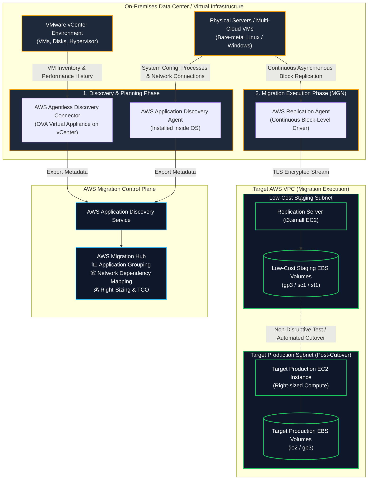
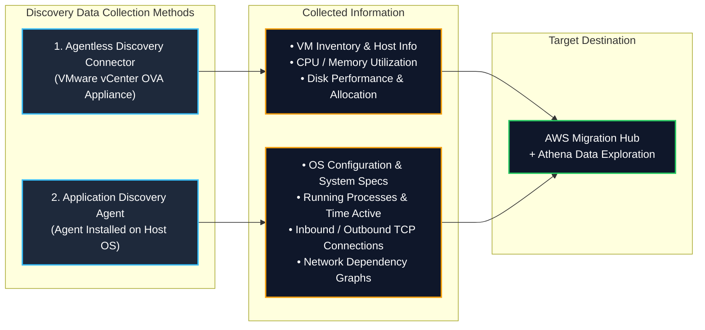
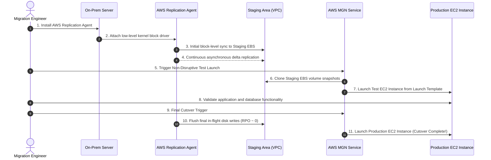
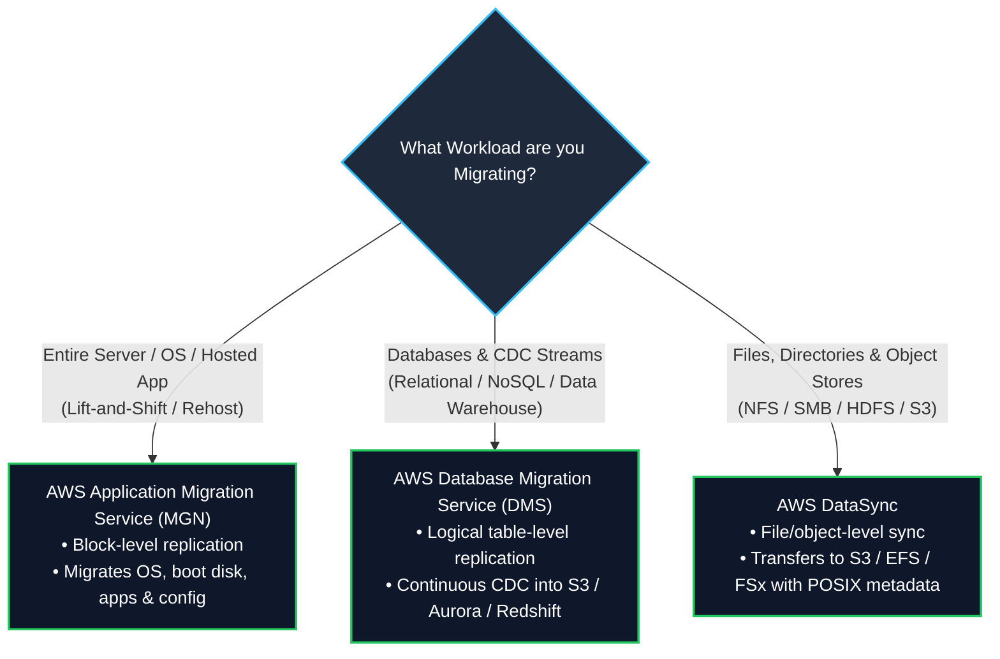

# 🔍 AWS Application Discovery Service & AWS Application Migration Service (MGN)

- **Category**: Migration & Transfer (Discovery, Assessment, Dependency Mapping & Automated Server Rehosting)
- **Primary Use Case**: Planning enterprise cloud migrations by discovering on-premises server infrastructure, mapping dependencies, and executing automated lift-and-shift (rehost) server migrations with continuous block-level replication.
- **Slide Reference**: Pages 267–268 in `[[AWSCertifiedDataEngineerSlides.pdf]]`
- **Hub Links**: [[index]] | [[service-catalog]] | [[domain-1-ingestion-and-processing]] | [[dms-and-sct]] | [[datasync-and-snow]] | [[data-exchange]] | [[transfer-family]]

---

## 1. High-Level Summary

Enterprise cloud migrations begin with understanding the existing on-premises inventory and workload dependencies before executing migration waves:

1. **AWS Application Discovery Service**: Gathers server specification, performance utilization (CPU, memory, disk I/O), and network connection metadata from on-premises data centers. The collected data feeds into **AWS Migration Hub** to group servers into applications, map inter-service network dependencies, and calculate Total Cost of Ownership (TCO) for right-sizing AWS compute instances.
2. **AWS Application Migration Service (AWS MGN)**: The AWS-native evolution of **CloudEndure Migration** and the official replacement for the legacy **AWS Server Migration Service (SMS)**. It is the primary AWS service for **lift-and-shift (rehost)** migrations, non-disruptively copying physical, virtual, or cloud-hosted servers to AWS using continuous block-level data replication.

For the **AWS Certified Data Engineer – Associate (DEA-C01)** exam, you must master:
- **Agentless vs. Agent-Based Discovery**: When to use the **AWS Agentless Discovery Connector** (VMware vCenter) vs. the **AWS Application Discovery Agent** (OS-level running processes and TCP network dependencies).
- **AWS Migration Hub Integration**: Centralized dashboard to track discovery, planning, and migration status across DMS, MGN, and partner tools.
- **AWS MGN Lift-and-Shift Architecture**: The lightweight replication agent, low-cost staging area in an Amazon VPC, continuous asynchronous block-level replication, non-disruptive testing, and automated cutover to target EC2 instances.

---

## 2. AWS Application Discovery Service Deep Dive

Planning an enterprise data and database migration requires collecting infrastructure attributes to eliminate guesswork and prevent migration outages caused by hidden inter-system dependencies.

### Agentless vs. Agent-Based Discovery Comparison Matrix

| Architectural Dimension | Agentless Discovery Connector | Application Discovery Agent |
| :--- | :--- | :--- |
| **Deployment Model** | Deployed as an **OVA virtual appliance** directly inside VMware vCenter environment. | Installed individually on each **Linux or Windows OS** (VMs, bare-metal physical servers, or other clouds). |
| **Administrative Overhead** | **Very Low** (Single appliance installed at hypervisor level). | **Higher** (Requires root/administrator installation across all servers). |
| **Host System Access Required** | ❌ No host root/admin credentials needed. | ✅ Host root/admin permissions required to install agent. |
| **Collected Data Metrics** | VM inventory, hardware configuration, historical CPU/RAM/Disk performance averages. | Detailed hardware specs, system performance, **active running processes**, and **network connection telemetry**. |
| **Network Dependency Mapping** | ❌ **No** (Cannot see TCP/IP network flows between distinct applications). | ✅ **Yes** (Captures source/destination IP, port, packet rate, and maps inter-server dependencies). |
| **Best DEA-C01 Use Case** | Fast, non-intrusive initial high-level discovery of VMware server fleets. | Detailed migration wave planning, uncovering hidden database/ETL dependencies before migration. |

---

## 3. AWS Application Migration Service (AWS MGN) Deep Dive

**AWS Application Migration Service (AWS MGN)** enables organizations to lift-and-shift (rehost) large fleets of physical, virtual, or cloud-based applications directly to Amazon EC2 with minimal downtime and zero data loss.

### 1. Evolution from CloudEndure & SMS
- **AWS Server Migration Service (SMS)**: Legacy snapshot-based migration service (deprecated). Migrated servers by taking periodic snapshots, causing higher RPO (hours).
- **CloudEndure Migration**: Third-party acquisition by AWS that introduced real-time continuous block-level data replication.
- **AWS Application Migration Service (AWS MGN)**: The modern, fully integrated, AWS-native evolution of CloudEndure. Provides unified IAM authentication, AWS CloudTrail auditing, CloudWatch metrics, and automated launch template orchestration.

### 2. End-to-End Rehost Workflow

### 3. Key Components of AWS MGN Architecture

1. **AWS Replication Agent**:
   - Lightweight software agent installed on the source server.
   - Reads storage blocks at the OS driver level (below file system). Replicates all block changes continuously without restarting the source server.
2. **Staging Area Subnet**:
   - An isolated subnet in your target AWS VPC containing lightweight, cost-effective EC2 replication servers (e.g., `t3.small`) and low-cost EBS volumes (e.g., `sc1` or `st1`).
   - Keeps cloud infrastructure costs minimal during weeks/months of replication synchronization.
3. **Launch Templates & Post-Launch Scripts**:
   - Defines the target EC2 instance type (e.g., `c6i.2xlarge`), subnet, security group, and production EBS volume type (`gp3`/`io2`).
   - Post-launch actions can automatically install AWS Systems Manager (SSM) agent, run custom disaster recovery scripts, or install database drivers.
4. **Non-Disruptive Testing**:
   - You can launch test EC2 instances at any time without stopping the source server or interrupting ongoing continuous replication.

---

## 4. Migration Tool Selection: MGN vs. DMS vs. DataSync

Choosing the right migration tool for the right data tier is a frequent DEA-C01 architectural decision:

### Complete Feature Comparison Matrix

| Feature / Capability | AWS Application Migration Service (MGN) | AWS Database Migration Service (DMS) | AWS DataSync |
| :--- | :--- | :--- | :--- |
| **Migration Layer** | **Block Level (Physical/Virtual Disks)** | **Logical Database Level (Tables & Rows)** | **File & Object Level (Files & Metadata)** |
| **Primary Target** | **Amazon EC2 (AMIs & EBS Volumes)** | **Amazon RDS, Aurora, Redshift, S3, DynamoDB** | **Amazon S3, Amazon EFS, AWS FSx** |
| **Source Engine Change?** | ❌ No (Exact bit-for-bit replica of source OS) | ✅ Yes (Supports heterogeneous engine conversions with SCT) | ❌ No (Transfers files across supported protocols) |
| **Replication Mechanism** | Continuous OS block-level write intercept | Transaction log parsing (WAL, binlogs, redo logs) | Scheduled/continuous file delta synchronization |
| **Application Downtime** | Minimal (Minutes during final DNS cutover) | Near-zero (Continuous CDC catch-up) | Not applicable (Used for storage data synchronization) |
| **Data Transformation?** | ❌ No transformation | ✅ Yes (Table mapping, column renaming, filtering) | ❌ No transformation (File integrity preserved) |

---

## 5. High-Yield DEA-C01 Exam Tips & Traps

> [!IMPORTANT]
> **Key Exam Trigger Keywords**:
> - **"Plan on-premises migration, discover server utilization and map network dependencies between systems"** $\rightarrow$ **AWS Application Discovery Service (with Application Discovery Agent)**.
> - **"Agentless discovery of VMware vCenter virtual machines"** $\rightarrow$ **AWS Agentless Discovery Connector**.
> - **"Track progress of migrations across multiple AWS tools (DMS, MGN) in a single centralized dashboard"** $\rightarrow$ **AWS Migration Hub**.
> - **"Lift-and-shift / rehost physical, virtual, or cloud servers to EC2 with minimal downtime and continuous block replication"** $\rightarrow$ **AWS Application Migration Service (MGN)**.
> - **"Evolution of CloudEndure Migration / Replacement for Server Migration Service (SMS)"** $\rightarrow$ **AWS Application Migration Service (MGN)**.

> [!WARNING]
> **Exam Traps & Failure Modes**:
> 1. **Agentless Discovery Cannot Map Network Dependencies**:
>    - If an exam scenario requires **mapping network connections between applications and discovering hidden dependencies**, the **Agentless Discovery Connector is insufficient**. You MUST install the **Application Discovery Agent** inside each operating system.
> 2. **MGN vs. DMS for Database Migrations**:
>    - If the goal is to modernize an on-premises Oracle database to **Amazon Aurora PostgreSQL**, use **AWS SCT + AWS DMS**, NOT AWS MGN! AWS MGN only clones the entire server as-is onto an EC2 instance (rehost), without engine conversion or modernization.
> 3. **Staging Area Cost Optimization**:
>    - During ongoing MGN replication, source disks replicate to low-cost staging EBS volumes attached to small EC2 replication instances. Full-sized production compute instances are **only provisioned during testing or final cutover**, minimizing migration costs.

---

## 📌 Related Notes

- [[dms-and-sct]] — AWS DMS & SCT for database migrations and CDC replication
- [[datasync-and-snow]] — AWS DataSync & Snow Family for file and object migration
- [[data-exchange]] — AWS Data Exchange for third-party datasets and Redshift integration
- [[transfer-family]] — AWS Transfer Family for SFTP/FTPS workflows
- [[domain-1-ingestion-and-processing]] — DEA-C01 Domain 1 Study Guide
- [[service-comparisons]] — Master DEA-C01 Service Decision Matrix
