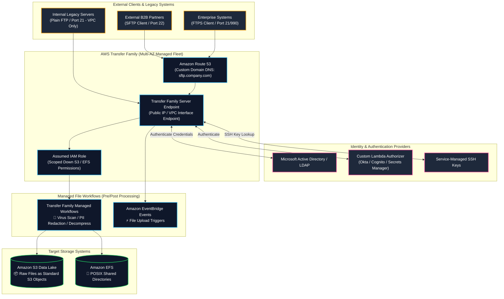
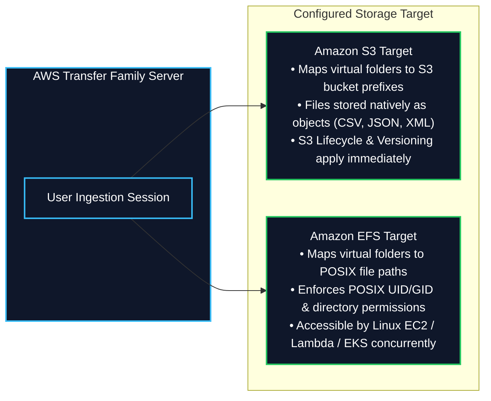
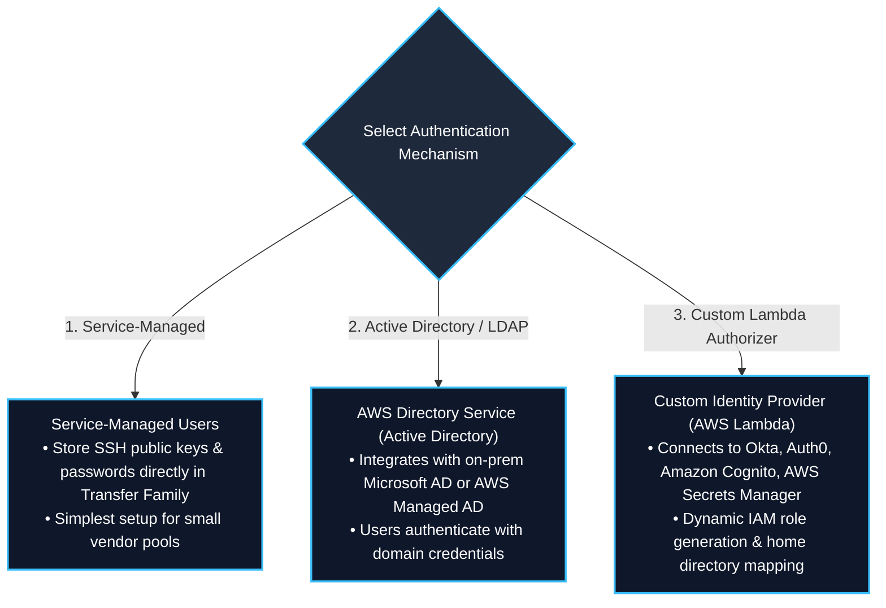
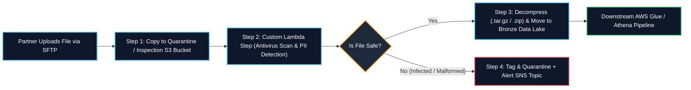
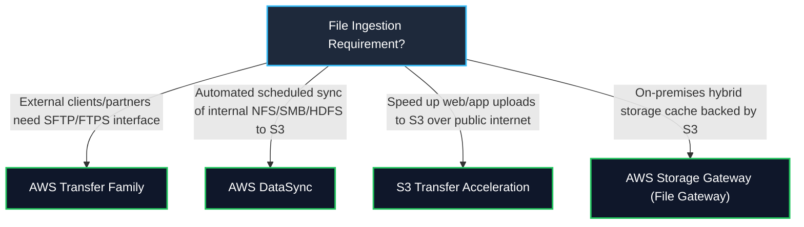

# 📂 AWS Transfer Family (Managed SFTP, FTPS, FTP & AS2)

- **Category**: Migration & Transfer (B2B Partner File Exchange & Managed File Transfer)
- **Primary Use Case**: Providing external business partners and legacy enterprise systems with secure, seamless file transfer access (**SFTP, FTPS, FTP, AS2**) directly into [[s3]] Data Lakes and [[efs-and-fsx]] (Amazon EFS) without modifying client workflows or managing servers.
- **Slide Reference**: Pages 284–285 in `[[AWSCertifiedDataEngineerSlides.pdf]]`
- **Hub Links**: [[index]] | [[service-catalog]] | [[domain-1-ingestion-and-processing]] | [[domain-2-data-store-management]] | [[s3]] | [[efs-and-fsx]] | [[datasync-and-snow]]

---

## 1. High-Level Summary

**AWS Transfer Family** is a fully managed, highly available, Multi-AZ service that enables seamless migration and execution of file transfer workflows directly into and out of **Amazon S3** and **Amazon EFS**. It supports industry-standard protocols including **SFTP** (SSH File Transfer Protocol), **FTPS** (FTP over SSL), **FTP** (unencrypted, VPC-only), and **AS2** (Applicability Statement 2 for EDI B2B transactions).

For the **AWS Certified Data Engineer – Associate (DEA-C01)** exam, you must master:
1. **Target Storage Backends**: Direct integration with **Amazon S3** (files stored natively as S3 objects) and **Amazon EFS** (POSIX directories).
2. **Supported Transfer Protocols & Security**:
   - **SFTP** (Port 22): Encrypted file transfer using SSH keys or passwords.
   - **FTPS** (Port 21/990): TLS-encrypted FTP.
   - **FTP** (Port 21): Plaintext FTP, **restricted to VPC endpoints only** for security compliance.
   - **AS2** (Port 443): Structured B2B Electronic Data Interchange (EDI) with non-repudiation and MDN receipts.
3. **Identity & Authentication Options**: Service-managed credentials, **Microsoft Active Directory** (via AWS Directory Service), **LDAP**, **Okta**, **Amazon Cognito**, or custom **AWS Lambda authorizers**.
4. **Network & Endpoint Architecture**: Public internet-facing endpoints with Amazon Route 53 custom domain names vs. VPC-hosted endpoints (internal or internet-facing with Elastic IPs).
5. **Automated Managed Workflows**: Triggering pre-processing (antivirus scanning, PII redaction, file decompression) before landing in S3, and post-processing notifications via Amazon EventBridge and [[step-functions]].

---

## 2. Core Protocol Capabilities & Storage Mapping

### 1. Protocol Capabilities Matrix

| Protocol | Encryption Standard | Network Exposure | Port(s) | Primary DEA-C01 Use Case |
| :--- | :--- | :--- | :--- | :--- |
| **AWS Transfer for SFTP** | SSH / AES-256 | Public Internet or VPC | **Port 22** | **Recommended Default**: Secure B2B partner ingestion, automated ERP/CRM file dumps into S3 Data Lake. |
| **AWS Transfer for FTPS** | TLS / SSL Encryption | Public Internet or VPC | **Port 21, 990** | Legacy enterprise clients requiring SSL-secured FTP. |
| **AWS Transfer for FTP** | ❌ None (Plaintext) | 🔒 **VPC Only** (Strictly blocked from public internet) | **Port 21** | Legacy on-premises/VPC internal applications that cannot support encryption. |
| **AWS Transfer for AS2** | S/MIME, SHA-2, Digital Signatures | Public Internet or VPC | **Port 443** | Supply chain, logistics, and EDI transaction exchanges with certified receipt verification (MDN). |

### 2. Storage Mapping: Amazon S3 vs. Amazon EFS

- **Amazon S3 Target**: Files uploaded via SFTP are written directly to S3 as native objects. Downstream data lake tools ([[glue]], [[athena]], [[redshift]]) can immediately query and transform the files.
- **Amazon EFS Target**: Files uploaded via SFTP are written to an Amazon EFS file system, preserving POSIX user permissions (UID/GID) and directory hierarchies.

---

## 3. Identity, Authentication & Security Governance

AWS Transfer Family provides flexible authentication architectures to integrate with existing corporate directories without migrating passwords:

### Logical Directory Mapping & Chroot Jail
- To prevent external partners from seeing your internal S3 bucket names or accessing unauthorized folder prefixes, Transfer Family supports **Logical Directories (Chroot)**:
  - Replaces absolute bucket paths (`s3://enterprise-data-lake-prod/incoming/partner_abc/`) with a clean virtual root (`/`).
  - Restricts the user to their specific virtual directory jail.

---

## 4. Transfer Family Managed Workflows (Automated ETL Pre-Processing)

AWS Transfer Family includes native **Managed Workflows** that execute automated processing steps immediately upon file upload before or after the file is saved to its final location:

---

## 5. Master Data Ingestion Decision Matrix: Transfer Family vs. Alternatives

### Complete Comparative Matrix

| Service | Client Protocol | Client Software Changes? | Target Storage | Best DEA-C01 Use Case |
| :--- | :--- | :--- | :--- | :--- |
| **AWS Transfer Family** | **SFTP, FTPS, FTP, AS2** | ❌ **Zero changes** (Clients use standard FileZilla, WinSCP, scripts) | **Amazon S3, Amazon EFS** | External vendor/partner B2B file uploads directly into data lakes. |
| **AWS DataSync** | NFS, SMB, HDFS, S3-API | Requires DataSync Agent VM | **Amazon S3, EFS, FSx** | Automated, high-speed internal data migration and scheduled file server replication. |
| **Amazon S3 Transfer Acceleration** | HTTPS REST API | Change S3 endpoint URL | **Amazon S3** | Global web/mobile client direct S3 uploads routed over CloudFront edge network. |
| **AWS Storage Gateway (File Gateway)** | NFS, SMB | ❌ Zero changes (Mount local IP) | **Amazon S3** | Local hybrid caching for on-premises applications requiring low-latency file share access. |

---

## 6. High-Yield DEA-C01 Exam Tips & Traps

> [!IMPORTANT]
> **Key Exam Trigger Keywords**:
> - **"Provide external vendors or partners with SFTP access to upload files directly into Amazon S3 or Amazon EFS without managing servers"** $\rightarrow$ **AWS Transfer Family**.
> - **"Migrate legacy SFTP workflows to AWS with Active Directory / LDAP authentication and custom domain name"** $\rightarrow$ **AWS Transfer Family (with Route 53 & Directory Service)**.
> - **"Automate virus scanning and file decompression upon SFTP file upload before landing in S3"** $\rightarrow$ **AWS Transfer Family Managed Workflows**.
> - **"Unencrypted FTP protocol compliance"** $\rightarrow$ **AWS Transfer for FTP configured with VPC-only endpoint (never public internet)**.

> [!WARNING]
> **Exam Traps & Failure Modes**:
> 1. **DataSync vs. Transfer Family Trap**:
>    - If the question asks for **third parties, external vendors, or B2B partners** uploading files using standard SFTP tools, choose **AWS Transfer Family**. **AWS DataSync** cannot serve as an SFTP server for external clients.
> 2. **Plain FTP Internet Exposure Trap**:
>    - Standard unencrypted FTP is **strictly forbidden from having a public internet endpoint** in AWS Transfer Family. FTP endpoints can only be deployed inside an Amazon VPC.
> 3. **IAM Scoping with Session Policies**:
>    - When configuring multi-tenant SFTP servers, use **IAM Session Policies** or **Logical Directory mappings** to restrict each external user to their specific folder (`s3://bucket/home/${transfer:UserName}`) so they cannot browse other vendors' data.

---

## 📌 Related Notes

- [[s3]] — Amazon S3 Data Lake target for SFTP file uploads
- [[efs-and-fsx]] — Amazon EFS shared file system target for Transfer Family
- [[datasync-and-snow]] — AWS DataSync & Snow Family comparison
- [[dms-and-sct]] — Database migration and CDC streaming
- [[data-exchange]] — Third-party commercial dataset ingestion
- [[application-discovery-and-mgn]] — Application Discovery & MGN server migration
- [[domain-1-ingestion-and-processing]] — DEA-C01 Domain 1 Study Guide
- [[service-comparisons]] — Master DEA-C01 Service Decision Matrix
