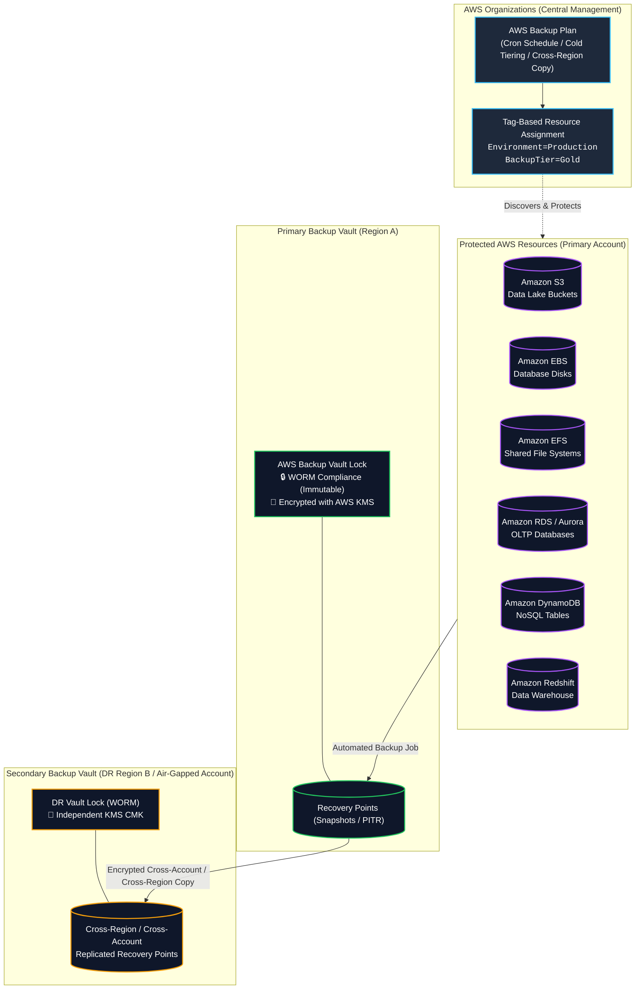
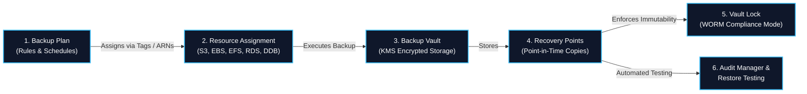
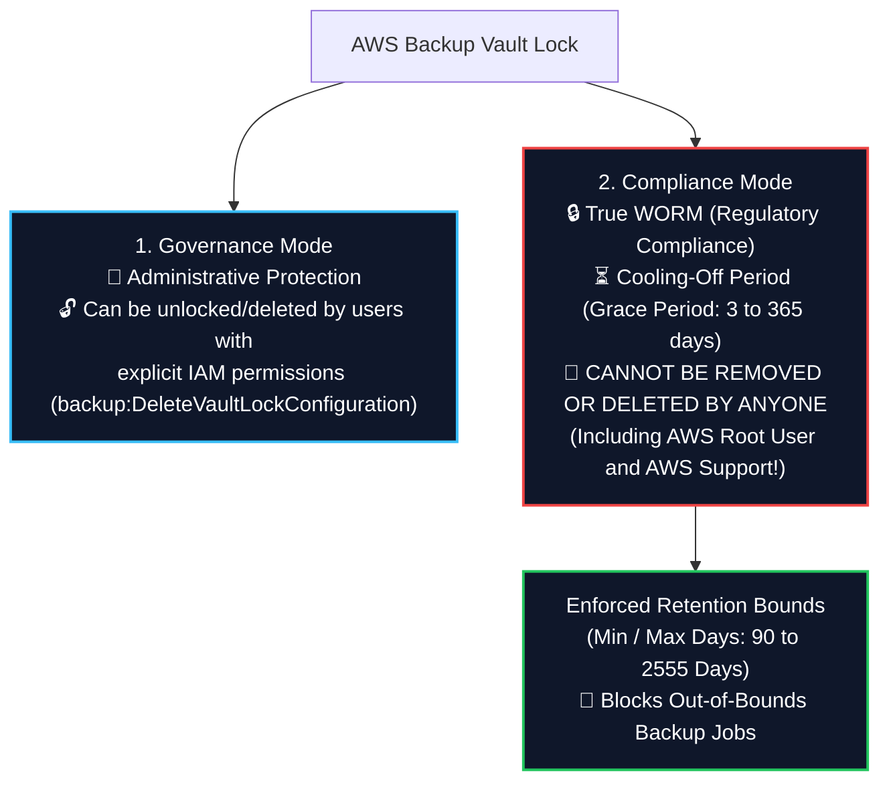
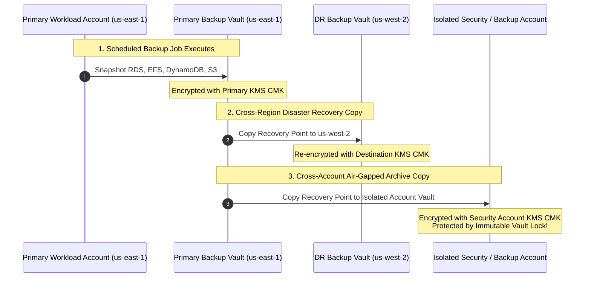
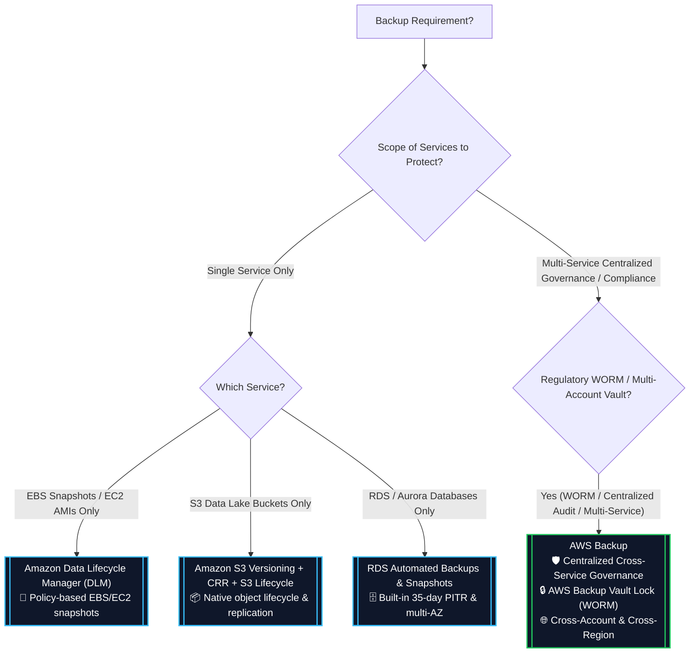
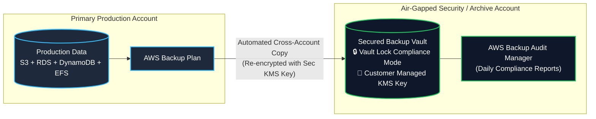

# 🛡️ AWS Backup (Centralized Policy-Based Data Protection)

- **Category**: Security, Governance & Storage Management
- **Primary Use Case**: Centralized, automated, policy-driven backup management, disaster recovery, WORM compliance (**AWS Backup Vault Lock**), and cross-account / cross-Region data protection across AWS services.
- **Slide Reference**: Pages 139–154, 410–430 in `[[AWSCertifiedDataEngineerSlides.pdf]]`
- **Hub Links**: [[index]] | [[service-catalog]] | [[domain-4-data-security-and-governance]] | [[domain-2-data-store-management]] | [[s3]] | [[ebs-and-instance-store]] | [[efs-and-fsx]]

---

## 1. High-Level Summary

**AWS Backup** is a fully managed, policy-based service that centralizes and automates data protection across AWS services (Amazon S3, EBS, EFS, FSx, RDS, Aurora, DynamoDB, Redshift, DocumentDB, Neptune, Timestream, and EC2) as well as hybrid on-premises workloads.

For the **AWS Certified Data Engineer – Associate (DEA-C01)** exam, AWS Backup is the standard answer for:
1. **Centralized Cross-Service Backup Governance**: Replacing custom snapshot scripts and fragmented service-specific backup tools with unified, tag-driven **Backup Plans**.
2. **Ransomware & Tamper Protection (WORM)**: Using **AWS Backup Vault Lock** in *Compliance Mode* to make backups immutable and non-deletable even by the AWS Account Root User.
3. **Cross-Account & Cross-Region Disaster Recovery**: Automatically replicating encrypted recovery points to an isolated, air-gapped security account in a secondary AWS Region within **AWS Organizations**.
4. **Automated Audit & Compliance**: Continuously evaluating data protection policies against organizational SLAs using **AWS Backup Audit Manager**.

---

## 2. Core Architectural Components

### 1. Backup Plans
A **Backup Plan** is a policy definition that specifies when and how AWS Backup protects your resources:
- **Backup Frequency**: Scheduled via cron expressions (e.g., hourly, daily at 02:00 UTC, weekly).
- **Backup Window**: Specifies the start time window (e.g., must start within 8 hours) and completion duration.
- **Lifecycle Rules**:
  - Transition to **Cold Storage** after $X$ days (supported for Amazon EFS, DynamoDB, S3, EBS, etc.).
  - **Expire / Delete** recovery points after $Y$ days (e.g., retain for 365 days for regulatory compliance).
- **Copy Actions**: Automated replication rules to copy recovery points to another **AWS Region** or another **AWS Account** within your AWS Organization.

### 2. Resource Assignment
- Resources are automatically attached to Backup Plans using **Tags** (e.g., `BackupPolicy = DailyGold`, `DataType = FinancialRecords`) or explicit Resource ARNs.
- Dynamically discovers new resources as they are created without requiring manual reconfiguration.

### 3. Backup Vaults & Access Policies
- A **Backup Vault** is a secure, logical container in AWS Backup that stores and organizes **Recovery Points**.
- **Encryption**: Every vault is encrypted at rest using an **AWS KMS Key** (AWS managed key `aws/backup` or Customer Managed Key CMK).
- **Vault Access Policy**: A JSON resource-based policy assigned to the vault to restrict permissions (e.g., denying `backup:DeleteRecoveryPoint` to all non-admin roles).

### 4. Recovery Points
- A **Recovery Point** represents the backed-up content of an AWS resource at a specific point in time (e.g., an EBS snapshot, EFS snapshot, RDS automated snapshot, or S3 continuous PITR baseline).

---

## 3. AWS Backup Vault Lock (WORM Compliance & Ransomware Defense)

**AWS Backup Vault Lock** is a critical security and compliance capability that enforces **WORM (Write Once, Read Many)** immutability on backup vaults. It prevents backups from being deleted or altered by unauthorized users, compromised credentials, or ransomware attacks.

### Governance Mode vs. Compliance Mode

| Dimension | Governance Mode | Compliance Mode (WORM) |
| :--- | :--- | :--- |
| **Primary Goal** | Guardrail against accidental deletion by operators | Strict regulatory compliance (SEC Rule 17a-4, HIPAA, FINRA) & Ransomware defense |
| **Can Lock be Removed?** | ✅ **Yes** (By users with `backup:DeleteVaultLockConfiguration`) | ❌ **NO** (Once the cooling-off period expires, the lock is permanent) |
| **Can Backups be Deleted Early?** | ✅ **Yes** (By users with administrative IAM permissions) | ❌ **NO (Impossible for anyone, including AWS Root Account and AWS Support)** |
| **Cooling-Off Grace Period** | None (Configurable immediately) | Mandatory grace period (between **3 days and 365 days**) during which the lock can still be deleted |
| **Retention Bounds Enforcement** | Optional | **Mandatory**: Enforces `MinRetentionDays` and `MaxRetentionDays` on all recovery points |

> [!CAUTION]
> **Compliance Mode Lock is Irreversible**:
> Once the cooling-off grace period expires in Compliance Mode, **no one**—not even the AWS account root user, organization administrators, or AWS Technical Support—can delete the vault lock or delete recovery points before their scheduled retention expiration date!

---

## 4. Cross-Region & Cross-Account Backup Architecture

To meet stringent Business Continuity and Disaster Recovery (BC/DR) requirements, AWS Backup natively supports cross-region and cross-account copy operations within **AWS Organizations**.

### Key Multi-Account & Multi-Region Rules

1. **Cross-Account Copy Prerequisites**:
   - Both source and destination accounts must belong to the **same AWS Organization**.
   - Must enable **Backup Policies** at the AWS Organizations root/OU level.
   - Destination Backup Vault Access Policy must allow the source account's AWS Backup service principal (`backup.amazonaws.com`) to copy recovery points.
2. **KMS Re-Encryption**:
   - When a recovery point is copied to another Region or Account, it is **automatically decrypted in-flight using the source KMS key and re-encrypted using the destination vault's KMS key**.
   - AWS default managed keys (`aws/backup`) cannot be shared across accounts; **Customer Managed Keys (KMS CMKs)** are mandatory for cross-account copying.

---

## 5. Supported AWS Services Matrix for Data Engineers

| AWS Service | Backup Type / Granularity | Continuous Backup (PITR) | Lifecycle to Cold Storage | Primary Data Engineering Use Case |
| :--- | :--- | :---: | :---: | :--- |
| **Amazon S3** | Scheduled bucket snapshots + Continuous PITR | ✅ **Yes** (Up to 35 days) | ✅ **Yes** | Protecting Data Lake metadata and object stores from accidental deletion |
| **Amazon EFS** | Entire file system snapshot | ❌ No | ✅ **Yes** | Shared container persistent volumes and Lambda code/model repositories |
| **Amazon EBS** | Block-level incremental snapshots | ❌ No | ✅ **Yes** (EBS Archive) | Hosted PostgreSQL, MySQL, and Kafka broker disks on EC2 |
| **Amazon DynamoDB** | Table-level snapshots + Continuous PITR | ✅ **Yes** (Up to 35 days) | ✅ **Yes** | Application state stores and real-time streaming metadata |
| **Amazon RDS / Aurora** | Database instance snapshots + PITR | ✅ **Yes** (Up to 35 days) | ❌ No | Central transactional relational databases |
| **Amazon Redshift** | Provisioned cluster manual / automated snapshots | ❌ No | ❌ No | Petabyte-scale analytical data warehouse clusters |
| **AWS FSx (Lustre, ONTAP, Windows)** | Entire file system snapshots | ❌ No | ❌ No | HPC cluster staging and enterprise file servers |
| **Amazon DocumentDB / Neptune** | Cluster snapshots | ❌ No | ❌ No | NoSQL document and graph database clusters |

---

## 6. AWS Backup vs. DLM vs. S3 Native vs. RDS Native

Understanding when to use AWS Backup versus native tools is tested heavily across **Domain 2, 3, and 4**.

### Detailed Feature Comparison

| Feature Dimension | AWS Backup | Amazon Data Lifecycle Manager (DLM) | S3 Native (Versioning / CRR) | RDS Native Backups |
| :--- | :--- | :--- | :--- | :--- |
| **Supported Services** | **15+ AWS Services** (S3, EBS, EFS, RDS, DDB, Redshift, FSx) | **EBS Volumes & EC2 AMIs only** | Amazon S3 only | Amazon RDS & Aurora only |
| **Centralized Console** | ✅ **Yes** (Single pane of glass across services) | ❌ No (EC2 console only) | ❌ No (S3 console only) | ❌ No (RDS console only) |
| **WORM Tamper Protection** | ✅ **Yes (Vault Lock Compliance Mode)** | ❌ No | ✅ Yes (S3 Object Lock) | ❌ No |
| **Cross-Account Replication** | ✅ **Yes** (AWS Organizations integrated) | ✅ Yes (EBS snapshots only) | ✅ Yes (S3 CRR / Batch Copy) | ⚠️ Manual snapshot share |
| **Automated Restore Testing** | ✅ **Yes** (AWS Backup Restore Testing) | ❌ No | ❌ No | ❌ No |
| **Compliance Auditing** | ✅ **Yes** (AWS Backup Audit Manager) | ❌ No | ❌ No | ❌ No |

---

## 7. Production Architecture Patterns for Data Engineers

### Pattern A: Ransomware-Resistant Air-Gapped Data Lake & Database Backup

- **Challenge**: Critical analytical tables in S3, DynamoDB, and RDS are vulnerable to compromised admin credentials or ransomware attacks deleting production databases.
- **Solution**:
  - Create a central **Backup Plan** in AWS Organizations with automated hourly/daily backups.
  - Configure a **Cross-Account Copy Rule** targeting a dedicated, air-gapped **Security/Archive AWS Account**.
  - Enforce **AWS Backup Vault Lock in Compliance Mode** on the destination vault with a 365-day retention policy.
- **Result**: Even if the primary workload AWS account is completely compromised or deleted, all recovery points remain untouched, immutable, and restorable from the security account.

### Pattern B: Automated Restore Validation & RTO/RPO Compliance

- **Challenge**: Regulatory standards require verifying that backups are not corrupted and can meet strict Recovery Time Objectives (RTO).
- **Solution**:
  - Enable **AWS Backup Restore Testing**.
  - Configure automated restore plans that spin up isolated test instances (e.g., test RDS instance or test EFS file system), run synthetic data verification queries, and cleanly delete the test infrastructure.
  - Generate automated audit reports via **AWS Backup Audit Manager** to satisfy compliance auditors.

---

## 8. DEA-C01 Exam Tips, Pitfalls & Scenario Triggers

> [!IMPORTANT]
> **Key Exam Trigger Keywords**:
>
> - **"Centralized, automated policy-driven backup across multiple AWS services (S3, EBS, EFS, RDS, DynamoDB)"** $\rightarrow$ **AWS Backup**.
> - **"Prevent deletion or modification of backups by ANY user including the root user / ransomware protection / WORM"** $\rightarrow$ **AWS Backup Vault Lock in Compliance Mode**.
> - **"Allow authorized administrators to delete backups for cost control while preventing standard operators from doing so"** $\rightarrow$ **AWS Backup Vault Lock in Governance Mode**.
> - **"Automatically copy backups to an isolated secondary account in a different AWS Region"** $\rightarrow$ **AWS Backup Cross-Account & Cross-Region Copy with AWS Organizations**.
> - **"Continuously validate backup compliance and automated restore capabilities"** $\rightarrow$ **AWS Backup Audit Manager & Restore Testing**.
> - **"Automate snapshot schedules for EBS volumes and EC2 instances ONLY"** $\rightarrow$ **Amazon Data Lifecycle Manager (DLM)**.

> [!WARNING]
> **Exam Traps & Failure Modes**:
>
> 1. **Vault Lock Compliance Mode is Permanent**:
>    - Once the cooling-off period expires, Compliance Mode cannot be deleted by AWS account root or AWS Support. Do not select Compliance Mode if the requirement states administrators must be able to delete backups to reduce costs.
> 2. **Cross-Account KMS Key Requirement**:
>    - You cannot use AWS default managed keys (`aws/backup` or `aws/s3`) for cross-account backup copying. You **must use a Customer Managed Key (CMK)** with cross-account access granted in the KMS key policy.
> 3. **AWS Backup vs. DLM Scope**:
>    - DLM only handles EBS volumes and EC2 AMIs. If a scenario involves **EFS**, **RDS**, **DynamoDB**, or **S3**, DLM is incorrect; the answer must be **AWS Backup**.
> 4. **S3 Backup vs. S3 Versioning**:
>    - S3 Versioning protects against accidental deletes within the same bucket. AWS Backup for S3 provides centralized management, cross-account vault storage, and independent lifecycle retention outside the primary S3 bucket boundary.

---

## 📌 Related Notes

- [[kms-and-secrets]] — AWS KMS encryption keys, CMKs, and cross-account key policies
- [[lake-formation]] — Data Lake security, governance, and centralized access control
- [[macie-and-cloudtrail]] — Amazon Macie PII discovery and CloudTrail API auditing
- [[s3]] — Amazon S3 object storage and central Data Lake protection
- [[ebs-and-instance-store]] — Amazon EBS volume snapshots and lifecycle management
- [[efs-and-fsx]] — Amazon EFS and AWS FSx backup integrations
- [[ebs-vs-efs-vs-instance-store]] — Storage Decision Matrix (EFS vs. EBS vs. Instance Store)
- [[domain-4-data-security-and-governance]] — DEA-C01 Domain 4 Study Guide
- [[domain-2-data-store-management]] — DEA-C01 Domain 2 Study Guide
- [[domain-3-data-operations-and-support]] — DEA-C01 Domain 3 Study Guide
