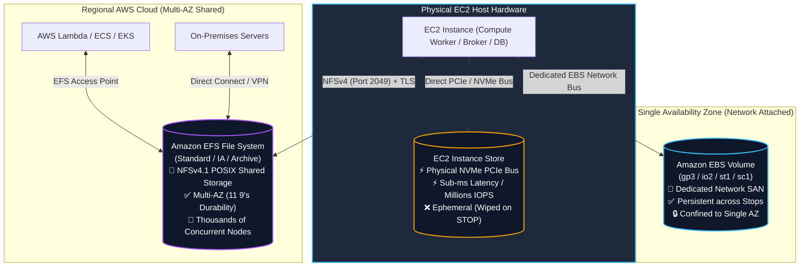
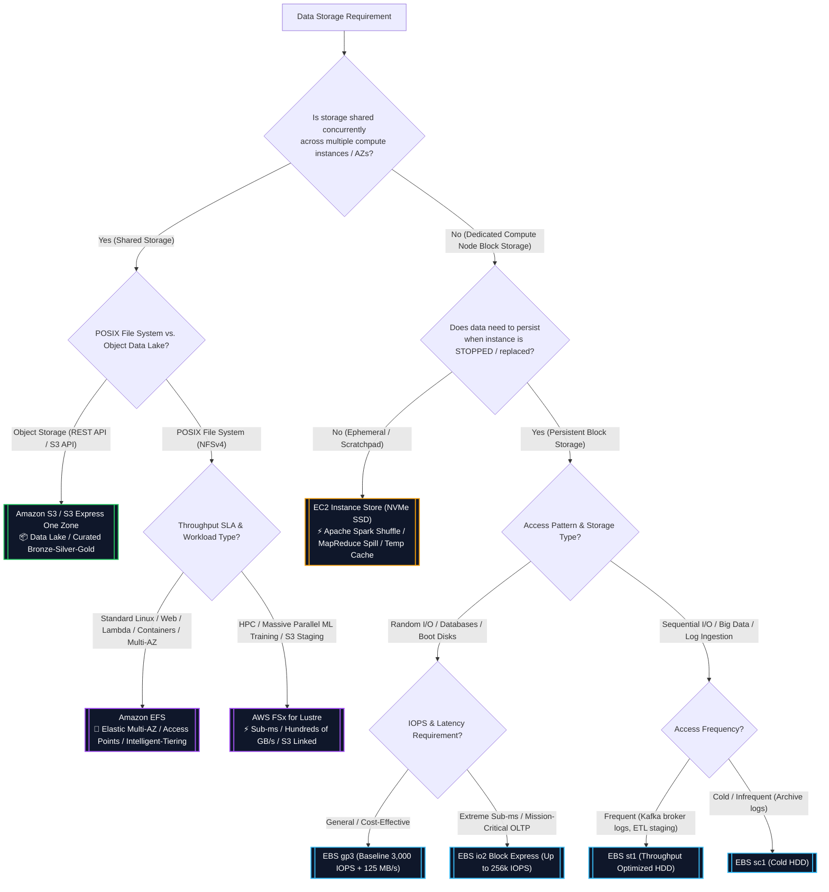
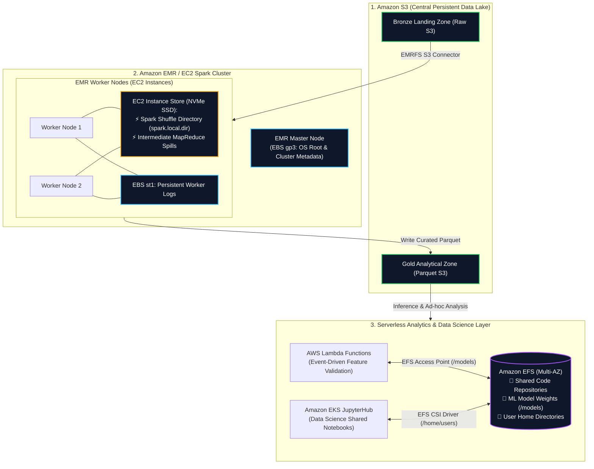

# ⚖️ Amazon EFS vs. Amazon EBS vs. EC2 Instance Store

- **Category**: Storage Architecture & Service Selection
- **Primary Use Case**: Definitive decision guide and architectural trade-off comparison between **Amazon EFS** (Shared Multi-AZ File), **Amazon EBS** (Persistent Network Block), and **EC2 Instance Store** (Ultra-High IOPS Ephemeral Block).
- **Slide Reference**: Pages 139–154 in `[[AWSCertifiedDataEngineerSlides.pdf]]`
- **Hub Links**: [[index]] | [[service-catalog]] | [[domain-2-data-store-management]] | [[service-comparisons]] | [[ebs-and-instance-store]] | [[efs-and-fsx]] | [[s3]]

---

## 1. High-Level Architectural Summary

Selecting the correct storage tier is one of the most heavily tested topics in **Domain 2 (Data Store Management)** of the AWS Certified Data Engineer – Associate (DEA-C01) exam.

AWS provides three primary compute-attached storage solutions, each engineered for distinct latency profiles, persistence guarantees, network boundaries, and concurrency requirements:

1. **EC2 Instance Store (Ephemeral Block)**:
   - Physically attached NVMe SSDs / SATA HDDs residing directly on the underlying host server.
   - Delivers **ultra-low sub-millisecond latency**, **millions of IOPS**, and **maximum sequential throughput** without consuming network bandwidth.
   - **Data is ephemeral**: Permanently lost if the instance is **stopped**, **terminated**, or encounters a **host hardware failure** (survives OS reboots only).
2. **Amazon EBS (Persistent Network Block)**:
   - Network-attached virtual block devices communicating with EC2 over dedicated network bandwidth.
   - **Persistent & independent**: Data survives instance stops, terminations, and host migrations; backed by point-in-time incremental snapshots to [[s3]].
   - **Single-AZ boundary**: Bound to a single Availability Zone (Multi-Attach supported on `io1`/`io2` up to 16 Nitro instances strictly in the *same* AZ).
3. **Amazon EFS (Elastic Shared Multi-AZ POSIX File)**:
   - Fully managed, serverless, elastic POSIX-compliant shared file system accessible concurrently over **NFSv4** by thousands of compute instances.
   - **Regional Multi-AZ durability (11 9's)** across 3+ Availability Zones.
   - Mountable simultaneously by **EC2**, **Amazon ECS**, **Amazon EKS**, **AWS Fargate**, **AWS Lambda**, and on-premises servers via AWS Direct Connect / VPN.

---

## 2. Comprehensive Technical Comparison Matrix

| Architectural Dimension | EC2 Instance Store | Amazon EBS (Elastic Block Store) | Amazon EFS (Elastic File System) |
| :--- | :--- | :--- | :--- |
| **Storage Architecture** | Direct-attached physical NVMe SSD / HDD | Network-attached virtual block SAN | Distributed network-attached POSIX file system |
| **Access Protocol** | Block device (PCIe / direct NVMe bus) | Block device (Network bus over fabric) | **NFSv4.0 / NFSv4.1** (TCP Port 2049) |
| **Data Persistence** | ❌ **Ephemeral** (Wiped on Stop/Terminate) | ✅ **Persistent** (Independent of instance lifecycle) | ✅ **Persistent** (Serverless independent storage) |
| **Survives OS Reboot?** | ✅ **Yes** | ✅ **Yes** | ✅ **Yes** |
| **Survives Instance STOP?** | ❌ **No (Data wiped permanently)** | ✅ **Yes** | ✅ **Yes** |
| **Survives Instance Terminate?** | ❌ **No (Data wiped permanently)** | ✅ **Yes** (Configurable `DeleteOnTermination`) | ✅ **Yes** |
| **Survives Host Hardware Failure?** | ❌ **No (Data lost with host machine)** | ✅ **Yes** (Reattach volume to new instance) | ✅ **Yes** (11 9's Multi-AZ durability) |
| **Availability Domain** | Single physical host server | **Single Availability Zone (AZ)** | **Regional Multi-AZ** (or Single-AZ One Zone) |
| **Client Concurrency** | Single EC2 instance only | Single EC2 instance (`io1`/`io2` Multi-Attach up to 16 in same AZ) | **Thousands of concurrent clients across multiple AZs** |
| **Supported Compute Clients** | Specific EC2 instance types | EC2 instances | **EC2, ECS, EKS, Fargate, Lambda, On-Premises** |
| **Latency Profile** | **Sub-millisecond (Fastest possible)** | Single-digit ms down to sub-ms (`io2 Block Express`) | Low ms (< 1ms metadata on General Purpose) |
| **Max Throughput** | Multi-GB/s (Hardware bus limited) | Up to **4,000 MB/s** (`io2 Block Express`), 1,000 MB/s (`gp3`) | **Up to 3+ GB/s** (Elastic Mode) |
| **Max IOPS** | **Millions of IOPS** (Direct NVMe) | Up to **256,000 IOPS** (`io2 Block Express`) | Tens of thousands of IOPS (Max I/O mode) |
| **Capacity Management** | Fixed by EC2 instance hardware | Pre-provisioned volume size (up to 64 TiB) | **Elastic auto-scaling** (PBs; grows & shrinks automatically) |
| **OS Boot Volume Support** | ✅ Yes (On select instance types) | ✅ **Yes** (All SSD types: `gp2`, `gp3`, `io1`, `io2`) | ❌ **No** |
| **Backup Mechanism** | Manual scripts copying to S3/EBS | Automated incremental **EBS Snapshots to S3** | **AWS Backup** policies & native EFS Replication |
| **Security & Permissions** | OS-level file permissions | AWS KMS at rest + Nitro transit encryption | **KMS at rest + TLS 1.2 + POSIX + EFS Access Points + IAM** |
| **Pricing Model** | Included in EC2 hourly instance price | Provisioned GB/month + provisioned IOPS/MBps | Stored GB/month (Tiered: Standard, IA, Archive) + transfer |
| **Primary DEA-C01 Workload** | **Spark shuffle, MapReduce spills, temp cache** | **Databases (RDS/Postgres), Kafka logs, OS disks** | **Shared code/notebooks, Lambda state, container PVs** |

---

## 3. Lifecycle & Failure Scenario Matrix

Understanding exact data retention behavior across operational events is one of the most frequently tested distinctions on the exam.

```mermaid
graph TD
    Event["EC2 Instance Lifecycle / Failure Event"]
    
    Event --> E1["1. Operating System Reboot<br/><code>sudo reboot</code>"]
    Event --> E2["2. Instance STOP<br/><code>aws ec2 stop-instances</code>"]
    Event --> E3["3. Instance TERMINATION<br/><code>aws ec2 terminate-instances</code>"]
    Event --> E4["4. Host Hardware Failure<br/>(Physical Host Crash)"]
    Event --> E5["5. Availability Zone Outage<br/>(Regional AZ Degradation)"]

    E1 --> IS_1["Instance Store:<br/>✅ <b>Preserved</b>"]
    E1 --> EBS_1["Amazon EBS:<br/>✅ <b>Preserved</b>"]
    E1 --> EFS_1["Amazon EFS:<br/>✅ <b>Preserved</b>"]

    E2 --> IS_2["Instance Store:<br/>❌ <b>PERMANENTLY WIPED</b>"]
    E2 --> EBS_2["Amazon EBS:<br/>✅ <b>Preserved (Ready to Reattach)</b>"]
    E2 --> EFS_2["Amazon EFS:<br/>✅ <b>Preserved (Unaffected)</b>"]

    E3 --> IS_3["Instance Store:<br/>❌ <b>PERMANENTLY WIPED</b>"]
    E3 --> EBS_3["Amazon EBS:<br/>⚠️ <b>Configurable (DeleteOnTermination)</b>"]
    E3 --> EFS_3["Amazon EFS:<br/>✅ <b>Preserved (Unaffected)</b>"]

    E4 --> IS_4["Instance Store:<br/>❌ <b>PERMANENTLY LOST</b>"]
    E4 --> EBS_4["Amazon EBS:<br/>✅ <b>Preserved (Reattach to New Node)</b>"]
    E4 --> EFS_4["Amazon EFS:<br/>✅ <b>11 9s Multi-AZ Intact</b>"]

    E5 --> IS_5["Instance Store:<br/>❌ <b>Unavailable in AZ</b>"]
    E5 --> EBS_5["Amazon EBS:<br/>❌ <b>Inaccessible (Tied to AZ)</b>"]
    E5 --> EFS_5["Amazon EFS:<br/>✅ <b>100% Available across Surviving AZs</b>"]

    classDef event fill:#1e293b,stroke:#38bdf8,stroke-width:2px,color:#fff;
    classDef pass fill:#0f172a,stroke:#22c55e,stroke-width:2px,color:#fff;
    classDef fail fill:#0f172a,stroke:#ef4444,stroke-width:2px,color:#fff;
    classDef warn fill:#0f172a,stroke:#f59e0b,stroke-width:2px,color:#fff;

    class Event,E1,E2,E3,E4,E5 event;
    class IS_1,EBS_1,EFS_1,EBS_2,EFS_2,EFS_3,EBS_4,EFS_4,EFS_5 pass;
    class IS_2,IS_3,IS_4,IS_5,EBS_5 fail;
    class EBS_3 warn;
```

### Event Retention Summary Matrix

| Lifecycle / Failure Event | EC2 Instance Store | Amazon EBS | Amazon EFS |
| :--- | :--- | :--- | :--- |
| **Operating System Reboot (`sudo reboot`)** | ✅ **Preserved** (Data remains intact across OS reboots) | ✅ **Preserved** (Volume remains attached and online) | ✅ **Preserved** (NFS connection resumes automatically) |
| **Instance Stop (`aws ec2 stop-instances`)** | ❌ **PERMANENTLY WIPED** (Physical host release wipes NVMe) | ✅ **Preserved** (Detached/preserved independently in AZ) | ✅ **Preserved** (Multi-AZ shared file system unaffected) |
| **Instance Termination (`terminate-instances`)** | ❌ **PERMANENTLY WIPED** (Disks returned to pool) | ⚠️ **Configurable** (`DeleteOnTermination` flag) | ✅ **Preserved** (Managed independently from compute) |
| **Physical Host Hardware Failure** | ❌ **PERMANENTLY LOST** (Unrecoverable without custom backups) | ✅ **Preserved** (Reattach EBS volume to a new instance) | ✅ **Preserved** (11 9's Multi-AZ automated redundancy) |
| **Availability Zone (AZ) Outage** | ❌ **Unavailable** (Host is in degraded AZ) | ❌ **Inaccessible** (EBS is strictly bound to single AZ) | ✅ **Fully Available** (Clients failover to healthy AZs) |

---

### Detailed Operational Breakdown by Event

#### 1. Operating System Reboot
- **EC2 Instance Store**: Data is **preserved** through soft/graceful operating system reboots because the instance remains allocated to the exact same physical host.
- **Amazon EBS**: Volume remains attached and block integrity is preserved.
- **Amazon EFS**: Network connection re-establishes via the VPC Mount Target upon boot.

#### 2. Instance Stop / Start (`aws ec2 stop-instances`)
- **EC2 Instance Store**: **Data is permanently erased**. Stopping an instance deallocates the VM from the underlying physical server hardware. When started again, the instance launches on a different physical host with brand-new, wiped instance store volumes.
- **Amazon EBS**: Volume data is **100% preserved**. The volume can remain detached or reattached to another EC2 instance in the same AZ.
- **Amazon EFS**: Unaffected. Files remain safely stored across 3+ Availability Zones.

#### 3. Instance Termination
- **EC2 Instance Store**: **Data is permanently erased**.
- **Amazon EBS**: Preserved by default for non-root volumes; root volumes are deleted unless `DeleteOnTermination=false` is explicitly set.
- **Amazon EFS**: Independent serverless lifecycle; termination of compute clients has zero impact on EFS files.

#### 4. Underlying Host Hardware Failure
- **EC2 Instance Store**: **Data is permanently lost** if the physical NVMe SSD or host motherboard suffers a hardware failure.
- **Amazon EBS**: Since EBS is a network SAN decoupled from host hardware, the volume can be detached and attached to a newly launched EC2 instance in the same AZ without data loss.
- **Amazon EFS**: Built-in 11 9's durability automatically protects data against any individual hardware or facility failures.

---

## 4. Workload Decision Tree for Data Engineers

Use this flowchart to determine the correct storage option for any DEA-C01 architectural scenario:

---

## 5. Deep Dive by Storage Service

### 1. EC2 Instance Store (Ephemeral Working Storage)

- **Architecture**: Physical NVMe SSD or magnetic disks physically plugged into the host motherboard slot where the EC2 instance virtual machine runs.
- **Key Characteristics**:
  - **No network overhead**: Communication flows over the direct PCIe bus, eliminating EBS network interface bandwidth limits.
  - **Maximum I/O Performance**: Yields the absolute highest IOPS (millions) and lowest latency (microseconds).
  - **Ephemeral Lifecycle**: Storage is allocated only for the duration of the instance's active run. When the instance is **stopped**, the virtual machine is deallocated from the physical host, and the underlying storage blocks are cryptographically wiped for security.
- **Top Data Engineering Use Cases**:
  1. **Apache Spark Shuffle Directory (`spark.local.dir`)**: During wide transformations (`join`, `groupByKey`), executors write intermediate partitions to Instance Store. If a node crashes, Spark's DAG scheduler recalculates missing partitions from S3.
  2. **Hadoop / MapReduce Intermediate Spills**: Temporary mapper sorting and intermediate merge disks.
  3. **High-Speed Caching & Buffering**: Redis/Memcached cache layer where cached data can be reconstructed from a persistent database upon failure.

---

### 2. Amazon EBS (Persistent Dedicated Block Storage)

- **Architecture**: High-availability, network-attached storage area network (SAN) within a single Availability Zone.
- **Key Characteristics**:
  - **Decoupled Lifecycle**: EBS volumes exist independently of EC2 instances. You can stop an instance, detach the volume, and attach it to an entirely different EC2 instance in the same AZ.
  - **Single-AZ Isolation**: An EBS volume in `us-east-1a` cannot be directly mounted to an EC2 instance in `us-east-1b`. Cross-AZ migration requires taking an **EBS Snapshot to S3** and creating a new volume in the target AZ.
  - **EBS Volume Types**:
    - `gp3`: Recommended default SSD (3,000 IOPS + 125 MB/s baseline included free, decoupled scaling).
    - `io2 Block Express`: Sub-millisecond, up to 256,000 IOPS, 5 9's durability for mission-critical OLTP.
    - `st1`: Throughput Optimized HDD (up to 500 MB/s) for sequential big data and Kafka commit logs.
    - `sc1`: Cold HDD (up to 250 MB/s) for lowest-cost sequential archiving.
  - **EBS Multi-Attach**: Allows attaching a single `io1` or `io2` volume concurrently to up to 16 Nitro EC2 instances in the **same AZ** (requires a cluster-aware file system like GFS2).
- **Top Data Engineering Use Cases**:
  1. **Self-Managed Databases & Message Brokers**: PostgreSQL, MySQL, Cassandra, and Apache Kafka brokers on EC2.
  2. **EC2 Operating System Boot Volumes**: Must use SSD-backed volumes (`gp3`, `gp2`, `io1`, `io2`).

---

### 3. Amazon EFS (Elastic Multi-AZ POSIX File System)

- **Architecture**: Distributed network file system spanning multiple Availability Zones, exposing an NFSv4.1 interface via Mount Targets in each VPC subnet.
- **Key Characteristics**:
  - **True Multi-AZ Concurrency**: Thousands of EC2 instances across different AZs, Lambda functions, ECS containers, and EKS pods can read and write to the exact same file simultaneously with strong consistency.
  - **Serverless & Elastic**: Automatically scales storage capacity from gigabytes to petabytes up and down; no pre-provisioning required.
  - **EFS Access Points**: Enforces POSIX user identities (`UID`/`GID`) and jails clients to specific root directory paths (mandatory for Lambda integration).
  - **Automated Lifecycle Tiering**: Transparently moves inactive files from **Standard** to **Infrequent Access (IA)** (92% savings) and **Archive** tiers. **EFS Intelligent-Tiering** auto-restores accessed files back to Standard.
- **Top Data Engineering Use Cases**:
  1. **Serverless ML Model Inference & ETL**: Mounting heavy model weights (> 10 GB) into [[lambda]] functions via EFS Access Points.
  2. **Multi-Tenant Container Storage**: Shared persistent storage for data science notebooks (JupyterHub) on [[ecr-ecs-eks]] (ECS/EKS).
  3. **Shared Application & Enterprise Directories**: Multi-AZ web applications, ETL script repositories, and cross-AZ log aggregation.

---

## 6. End-to-End Big Data Architecture Pattern

This reference architecture demonstrates how a production big data pipeline combines **Instance Store**, **EBS**, **EFS**, and **S3** to maximize performance while minimizing cost:

### Architectural Roles Breakdown:
- **Amazon S3**: Permanent, highly durable data lake storage for raw and curated datasets.
- **EC2 Instance Store**: High-speed ephemeral scratch space for intermediate Spark shuffle data and memory spills during cluster execution.
- **Amazon EBS (`gp3`/`st1`)**: Persistent boot disk and commit log storage for EMR master/worker nodes.
- **Amazon EFS**: Shared Multi-AZ persistent storage for shared ML model weights mounted into AWS Lambda and data science home directories on Amazon EKS.

---

## 7. DEA-C01 High-Frequency Exam Patterns & Pitfalls

> [!IMPORTANT]
> **Exam Trigger Keywords & Exact Match Rules**:
>
> - **"Ultra-high IOPS / Lowest latency scratchpad for distributed data processing / Spark shuffle"** $\rightarrow$ **EC2 Instance Store**.
> - **"Cost-effective sequential throughput for Kafka broker logs or MapReduce staging on EC2"** $\rightarrow$ **EBS `st1` (Throughput Optimized HDD)**.
> - **"Predictable IOPS & throughput scaled independently of volume capacity"** $\rightarrow$ **EBS `gp3`**.
> - **"Shared POSIX file system across multiple Linux EC2 instances, Lambda functions, or ECS/EKS containers across Multi-AZ"** $\rightarrow$ **Amazon EFS**.
> - **"Serverless file system with automatic scaling and zero storage provisioning"** $\rightarrow$ **Amazon EFS with Elastic Throughput**.
> - **"Enforce POSIX identity, user jailing, or mount shared file system to AWS Lambda"** $\rightarrow$ **EFS Access Points**.
> - **"Sub-millisecond parallel file system linked directly to Amazon S3 for HPC / ML training"** $\rightarrow$ **AWS FSx for Lustre**.

> [!WARNING]
> **Exam Traps & Failure Modes**:
>
> 1. **The Instance Store Stop Trap**:
>    - If an exam scenario states that compute instances are **stopped overnight to save costs** or **scaled down dynamically**, data on **EC2 Instance Store WILL BE PERMANENTLY WIPED**. You must use **Amazon EBS** or **Amazon EFS** if data must persist across stops.
> 2. **EBS Multi-Attach vs. EFS**:
>    - EBS Multi-Attach (`io1`/`io2`) is strictly **Single-AZ** and limited to a maximum of 16 Nitro instances. It does *not* provide Multi-AZ access and does *not* support standard POSIX concurrent writes without a cluster-aware file system.
>    - If multiple AZs or hundreds/thousands of concurrent clients are required, the answer is **Amazon EFS**.
> 3. **EBS Single-AZ Constraint**:
>    - You cannot attach an EBS volume in `us-east-1a` to an EC2 instance in `us-east-1b`. To move EBS data across AZs: **Snapshot to S3 $\rightarrow$ Create Volume in target AZ $\rightarrow$ Attach**.
> 4. **EFS Bursting Throughput Depletion**:
>    - Small EFS file systems (< 50 GB) on Bursting Throughput will quickly deplete burst credits during large batch jobs. The exam solution is to configure **Elastic Throughput** or **Provisioned Throughput**.
> 5. **Boot Volume Restrictions**:
>    - Neither **EBS `st1`**, **EBS `sc1`**, nor **Amazon EFS** can be used as EC2 boot/root volumes. Boot volumes must be **EBS SSD (`gp2`, `gp3`, `io1`, `io2`)** or select instance store AMI configurations.

---

## 📌 Related Notes

- [[ebs-and-instance-store]] — Dedicated deep dive on EBS volume types (`gp3`, `io2`, `st1`, `sc1`), snapshots, and Instance Store
- [[efs-and-fsx]] — Dedicated deep dive on Amazon EFS (Access Points, Tiering) and AWS FSx (Lustre, ONTAP, Windows)
- [[s3]] — Persistent object storage and Central Data Lake architecture
- [[ecr-ecs-eks]] — Container persistent volume claims and CSI drivers
- [[lambda]] — Serverless data processing and EFS integration
- [[emr]] — Big data processing clusters, EMRFS, and Spark shuffle storage
- [[service-comparisons]] — Master DEA-C01 Service Decision Matrix
- [[domain-2-data-store-management]] — DEA-C01 Domain 2 Study Guide
