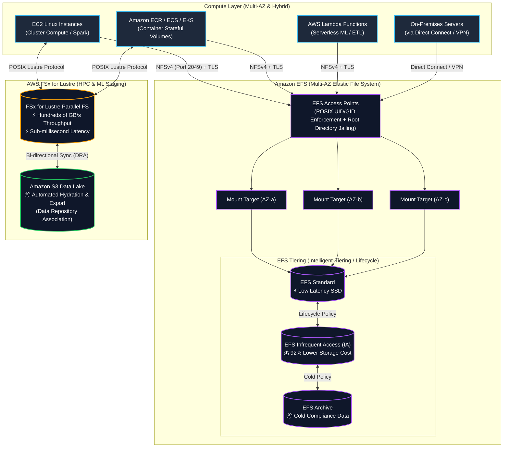
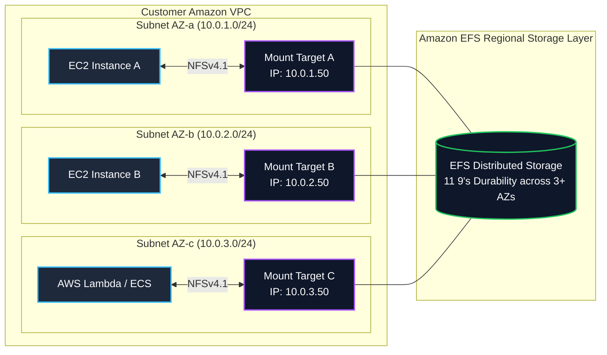
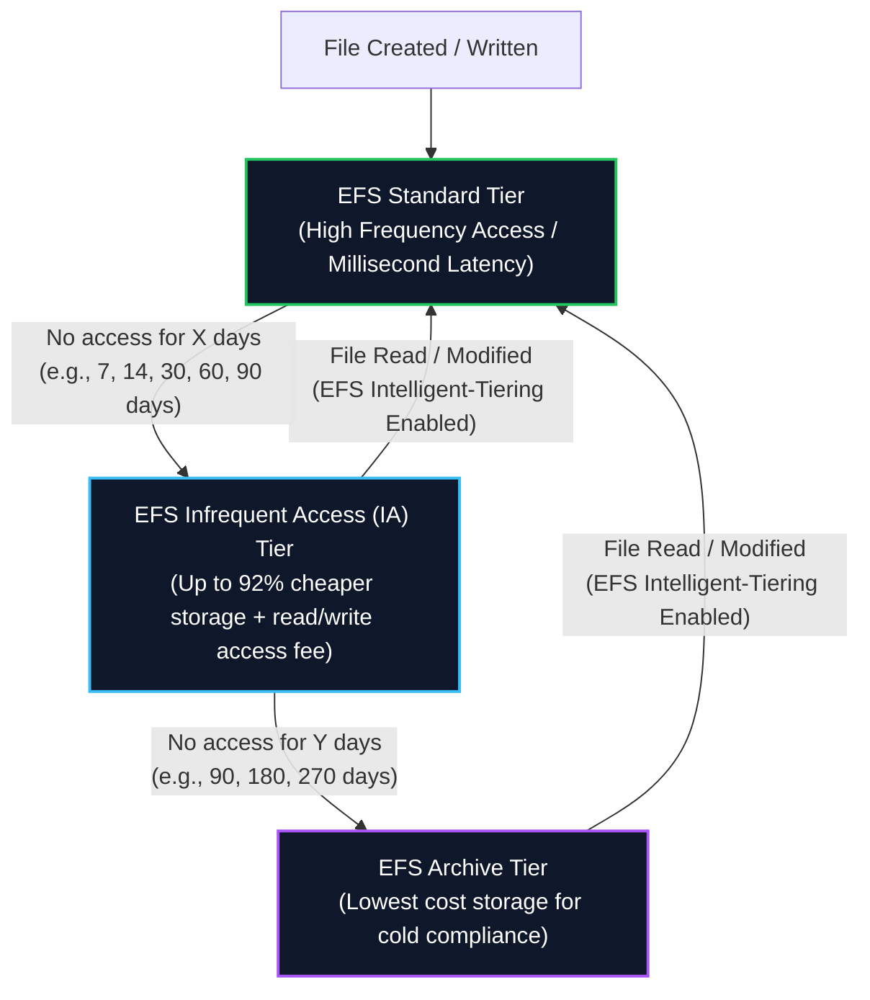
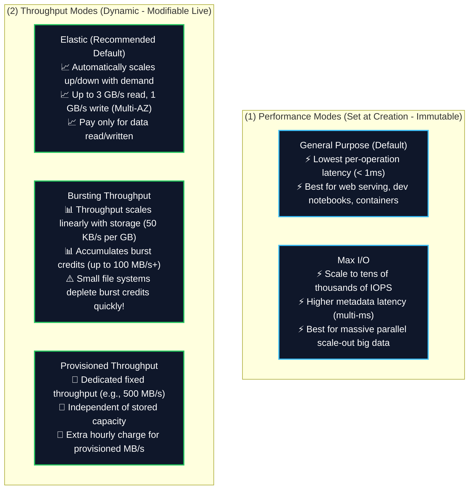
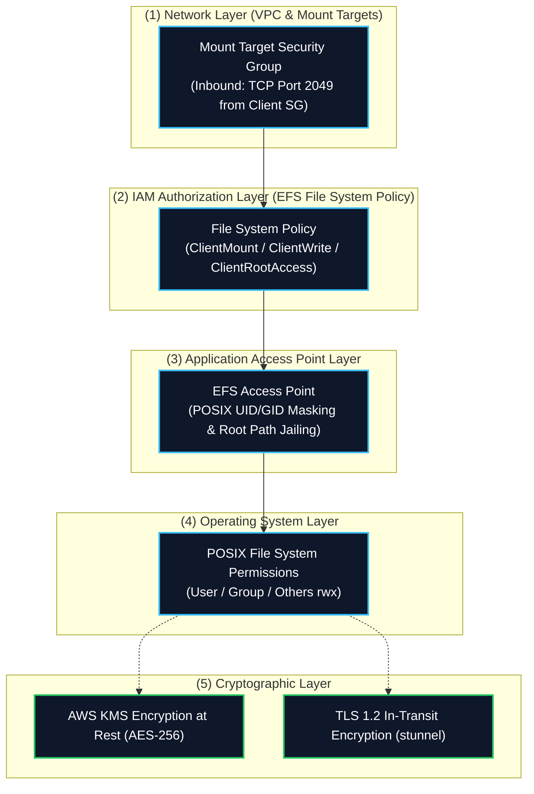
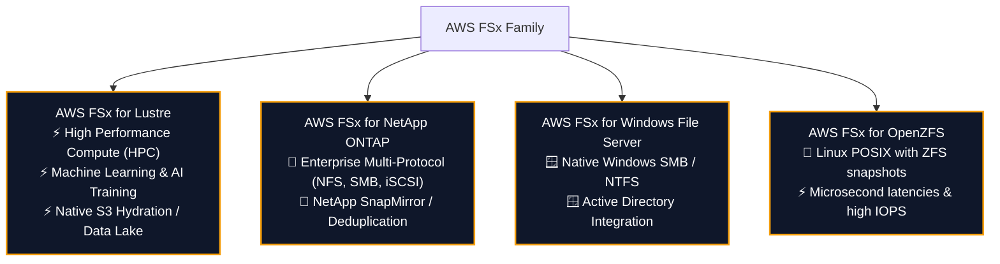
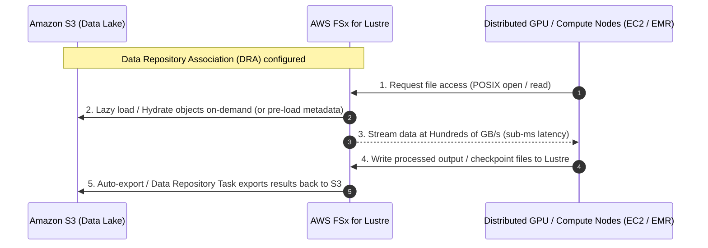
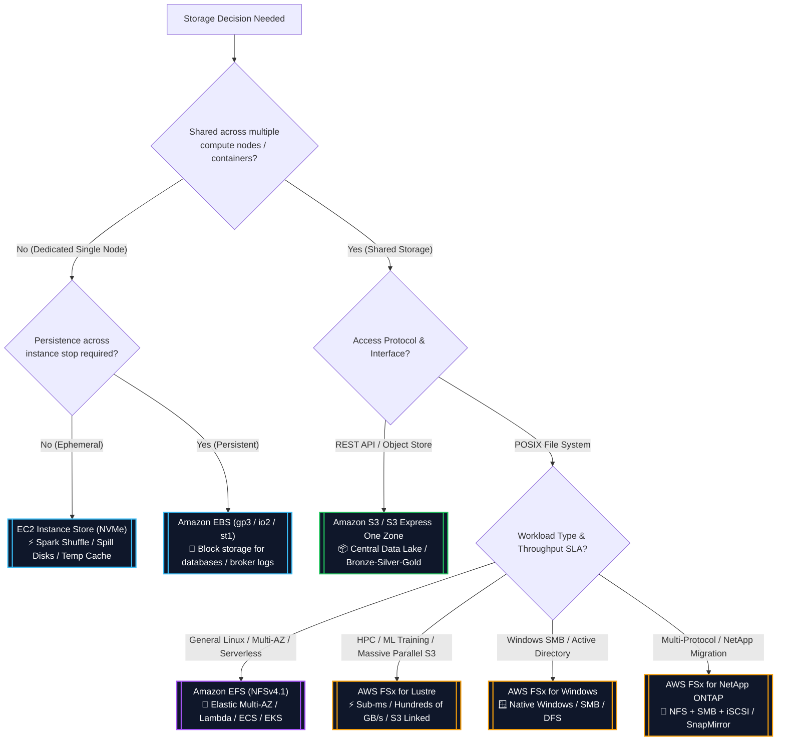
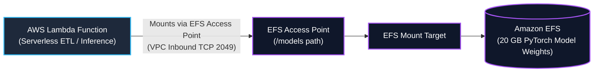

# 📁 Amazon EFS & AWS FSx (Lustre, ONTAP, Windows, OpenZFS)

- **Category**: Storage (Shared Managed File Systems)
- **Primary Use Case**: Shared POSIX file storage for distributed Linux compute clusters, container persistent volumes ([[ecr-ecs-eks]]), serverless functions ([[lambda]]), and ultra-high-throughput HPC / ML data staging from [[s3]].
- **Slide Reference**: Pages 139–154 in `[[AWSCertifiedDataEngineerSlides.pdf]]`
- **Hub Links**: [[index]] | [[service-catalog]] | [[domain-2-data-store-management]] | [[s3]] | [[ebs-and-instance-store]]

---

## 1. High-Level Summary

Shared file storage allows hundreds to thousands of concurrent compute instances (EC2, ECS tasks, EKS pods, Lambda functions, and on-premises servers) to access a single, shared, POSIX-compliant file system simultaneously over standard network protocols (**NFSv4** for EFS; **Lustre / SMB / NFS** for FSx).

For the **AWS Certified Data Engineer – Associate (DEA-C01)** exam, you must distinguish when to use:
1. **Amazon EFS**: Fully managed, serverless, Multi-AZ elastic file storage for standard Linux workloads, containers, Lambda, and cross-AZ shared directories.
2. **AWS FSx for Lustre**: Ultra-high-performance parallel file storage optimized for compute-heavy workloads (HPC, distributed machine learning, video rendering, big data analytics) with **native, bi-directional synchronization with Amazon S3**.
3. **AWS FSx for NetApp ONTAP / Windows / OpenZFS**: Enterprise multi-protocol storage, native Windows SMB environments, and ZFS-powered workflows.



---

## 2. Amazon EFS Architecture & Core Components

Amazon EFS provides elastic, serverless file storage that grows and shrinks automatically as files are added and removed, requiring zero storage provisioning or management.



### Key Architectural Elements

1. **Mount Targets**:
   - To mount an EFS file system from an EC2 instance, container, or Lambda function, you create a **Mount Target** in each Availability Zone where compute resources reside.
   - Each Mount Target provides an IP address and a DNS name (e.g., `fs-12345678.efs.us-east-1.amazonaws.com`).
   - Clients in AZ-a communicate with the Mount Target in AZ-a to avoid cross-AZ data transfer fees and minimize latency.
   - **Security Group**: Attached to the Mount Target. Must allow inbound **TCP Port 2049 (NFS)** from the compute security group or subnet CIDR.

2. **EFS Access Points (Crucial for Lambda & Containers)**:
   - Application-specific entry points into an EFS file system that enforce fine-grained access control, identity masking, and directory isolation.
   - **POSIX Identity Enforcement**: Overrides client-provided identity and forces all requests through the access point to use a specific POSIX user ID (`UID`), group ID (`GID`), and secondary GIDs.
   - **Root Directory Jailing**: Enforces a specific sub-directory path as the virtual root (e.g., `/export/app1`), preventing clients from accessing parent directories or files owned by other applications.
   - **Automatic Directory Creation**: Automatically creates the designated root directory with specified owner permissions if it does not exist when the client mounts.
   - **Exam Significance**: EFS Access Points are **mandatory** when mounting EFS to **AWS Lambda** and recommended for multi-tenant **Amazon ECS / EKS** deployments.

3. **EFS Mount Helper (`amazon-efs-utils`)**:
   - An open-source package providing the `mount.efs` command.
   - Automates mounting by file system ID, enforces **TLS in-transit encryption** (via `stunnel`), and supports IAM authentication tokens.

---

## 3. EFS Storage Classes & Automated Lifecycle Tiering

EFS offers multiple storage classes to balance performance and cost. Files can automatically migrate across tiers using **EFS Lifecycle Management** and **EFS Intelligent-Tiering**.



### Storage Classes Comparison Matrix

| Storage Class | Availability / Durability | Redundancy Scope | Storage Cost (Approx.) | Access Fee | Optimal Workload |
| :--- | :--- | :--- | :--- | :--- | :--- |
| **EFS Standard** | 99.99% / 11 9's | **Multi-AZ** (3+ AZs) | ~$0.30 / GB-mo | None | Active data, web serving, ETL staging, container root volumes |
| **EFS Infrequent Access (IA)** | 99.99% / 11 9's | **Multi-AZ** (3+ AZs) | ~$0.025 / GB-mo (92% savings) | ~$0.01 / GB read | Files accessed a few times per month |
| **EFS Archive** | 99.99% / 11 9's | **Multi-AZ** (3+ AZs) | ~$0.008 / GB-mo (Lowest Multi-AZ) | ~$0.03 / GB read | Cold historical data, regulatory archives accessed < few times/year |
| **EFS One Zone** | 99.9% / 11 9's (Single AZ) | **Single AZ** | ~$0.16 / GB-mo (47% savings vs Standard) | None | Non-critical dev/test, replicated build artifacts, single-AZ apps |
| **EFS One Zone-IA** | 99.9% / 11 9's (Single AZ) | **Single AZ** | ~$0.0133 / GB-mo | ~$0.01 / GB read | Infrequently accessed single-AZ dev/test datasets |

### Lifecycle Policies & Intelligent-Tiering

1. **Transition into IA / Archive**:
   - Moves files that have not been read or modified for a configured period: `1, 7, 14, 30, 60, 90, 180, 270, or 365 days`.
2. **Transition out of IA / Archive (Intelligent-Tiering)**:
   - **Without Intelligent-Tiering**: Reading a file in IA leaves it in IA (incurring repeated access charges on subsequent reads).
   - **With Intelligent-Tiering (Recommended)**: Reading a file in IA or Archive **automatically restores it to EFS Standard**, protecting against runaway access charges during unexpected burst read patterns.

---

## 4. EFS Performance Modes & Throughput Modes

Choosing the correct combination of **Performance Mode** and **Throughput Mode** is critical for both pipeline performance and cost optimization on the DEA-C01 exam.



### Performance Modes

- **General Purpose (Recommended Default)**:
  - Delivers the lowest latency per file operation (sub-millisecond for metadata and read operations).
  - Recommended for almost all standard data workloads, container shared disks, and interactive web servers.
- **Max I/O**:
  - Scales to virtually unlimited aggregate throughput and tens of thousands of IOPS.
  - Incurs a slight latency penalty (multi-millisecond) for individual metadata operations (`ls`, `stat`, `mkdir`).
  - Recommended only for massive parallel scale-out compute clusters (hundreds of parallel Spark / MapReduce nodes simultaneously querying the file system).

### Throughput Modes

| Throughput Mode | Scaling Model | Max Throughput Limits | Cost Structure | Best Data Engineering Use Case |
| :--- | :--- | :--- | :--- | :--- |
| **Elastic (Default)** | Auto-scales instantly based on read/write I/O | **3 GB/s Read, 1 GB/s Write** (Multi-AZ)<br/>(Up to 10 GB/s in select regions) | Pay per GB transferred ($0.03/GB read, $0.06/GB write) + base storage | **Spiky, unpredictable ETL pipelines, periodic batch jobs, serverless functions.** |
| **Bursting** | Baseline scales at $50 \text{ KB/s per GB}$; bursts to $100 \text{ MB/s}$ using burst credits | Dependent on total stored volume size | Included in base storage price | Steady workloads with large storage footprints (> 1 TiB) where baseline throughput suffices. |
| **Provisioned** | Fixed throughput provisioned manually (e.g. 200 MB/s) | Up to 3,000 MB/s | Charged for provisioned MB/s above baseline | Small storage footprint (< 50 GB) requiring sustained high throughput (e.g., streaming ingest buffer). |

> [!WARNING]
> **Bursting Credit Exhaustion Trap**:
> If a file system is small (e.g., 10 GB), its baseline throughput is only $500 \text{ KB/s}$. If a heavy ETL job runs against it, the file system will exhaust its burst credits within minutes, throttling the pipeline down to $500 \text{ KB/s}$. **Solution**: Switch to **Elastic Throughput** or **Provisioned Throughput**.

---

## 5. EFS Security, Encryption & Access Control

EFS provides defense-in-depth security across network boundaries, IAM permissions, and POSIX file access.



### 1. Encryption
- **Encryption at Rest**: Enabled during creation using [[kms-and-secrets]] (AWS KMS CMK or AWS-managed key `aws/elasticfilesystem`). All metadata and file contents are encrypted transparently with zero performance impact.
- **Encryption in Transit**: Uses industry-standard **TLS 1.2** managed automatically when mounting via `amazon-efs-utils` (using the `-o tls` mount flag).

### 2. IAM Policies for NFS Clients
EFS supports IAM file system resource policies to grant or restrict specific actions:
- `elasticfilesystem:ClientMount`: Allows read-only mounting of the file system.
- `elasticfilesystem:ClientWrite`: Allows writing to the file system.
- `elasticfilesystem:ClientRootAccess`: Controls whether the client can access the file system as `root` (UID 0) or is squashed to anonymous user.

### Example EFS IAM File System Policy (Enforcing Read-Only and In-Transit Encryption)

```json
{
  "Version": "2012-10-17",
  "Id": "EFSReadOnlyAndSecurePolicy",
  "Statement": [
    {
      "Sid": "EnforceTLS",
      "Effect": "Deny",
      "Principal": "*",
      "Action": "*",
      "Resource": "arn:aws:elasticfilesystem:us-east-1:123456789012:file-system/fs-12345678",
      "Condition": {
        "Bool": {
          "aws:SecureTransport": "false"
        }
      }
    },
    {
      "Sid": "AllowMountAndWriteForRole",
      "Effect": "Allow",
      "Principal": {
        "AWS": "arn:aws:iam::123456789012:role/DataEngineeringETLRole"
      },
      "Action": [
        "elasticfilesystem:ClientMount",
        "elasticfilesystem:ClientWrite"
      ],
      "Resource": "arn:aws:elasticfilesystem:us-east-1:123456789012:file-system/fs-12345678"
    }
  ]
}
```

---

## 6. AWS FSx File Systems Family Deep Dive

AWS FSx provides fully managed, purpose-built, high-performance third-party and open-source file systems.



### 1. AWS FSx for Lustre (Top Exam Focus for DEA-C01)

Lustre is an open-source parallel file system designed for compute-intensive workloads that require sub-millisecond latencies, hundreds of gigabytes per second of throughput, and millions of IOPS.



#### Key FSx for Lustre Features

1. **Native Amazon S3 Integration (Data Repository Association - DRA)**:
   - FSx for Lustre can link directly to an Amazon S3 bucket.
   - When created, Lustre imports S3 metadata (object keys appear as POSIX files/folders).
   - **Lazy Loading**: When compute nodes read a file, FSx transparently loads the bytes from S3 on first access.
   - **Data Repository Tasks (DRT)**: Can export modified or new files from FSx back to S3 (either automatically via export policies or explicitly via API/CLI).
2. **Deployment Options**:
   - **Scratch File Systems**: Designed for temporary, ephemeral compute workloads. No data replication across disks (if a storage server fails, uncommitted data is lost). Highest raw burst throughput at lowest cost.
   - **Persistent File Systems**: Designed for long-running workloads. Data is replicated within the same AZ; failed file servers are replaced transparently. Available with SSD storage or HDD storage (with optional SSD read caches).

### 2. AWS FSx for NetApp ONTAP
- Fully managed shared storage built on NetApp's popular ONTAP file system.
- Supports **multi-protocol access** (NFS, SMB, and iSCSI) to the same data volume simultaneously.
- Offers enterprise storage features: instant snapshotting, deduplication, compression, thin provisioning, and replication with on-premises NetApp clusters via **SnapMirror**.
- Automatically tiers cold data from fast SSDs to a low-cost capacity pool.

### 3. AWS FSx for Windows File Server
- Fully managed native Microsoft Windows file system accessed over the **SMB (Server Message Block)** protocol.
- Integrates natively with Microsoft Active Directory (AD), DFS Namespaces, and Windows Access Control Lists (ACLs).
- Available in Single-AZ or Multi-AZ deployments with automatic failover.

### 4. AWS FSx for OpenZFS
- Managed OpenZFS file system providing POSIX-compliant shared storage for Linux applications.
- Delivers up to 1 million IOPS and latencies under 0.5 milliseconds.
- Features instant point-in-time ZFS snapshots, data cloning, and on-the-fly compression.

---

## 7. Storage Decision Matrix: S3 vs. EBS vs. EFS vs. FSx for Lustre

Understanding the architectural boundaries between AWS storage solutions is tested heavily in **Domain 2 (Data Store Management)**.



### Comprehensive Storage Comparison Matrix

| Dimension | Amazon S3 | Amazon EBS | Amazon EFS | AWS FSx for Lustre | EC2 Instance Store |
| :--- | :--- | :--- | :--- | :--- | :--- |
| **Storage Type** | Object Storage | Block Storage | Distributed File System | Parallel File System | Ephemeral Host Block |
| **Protocol** | HTTPS (REST API) | Block device (PCIe/NVMe over fabric) | **NFSv4.0 / NFSv4.1** | **Lustre POSIX** | Direct PCIe / NVMe |
| **Multi-Node Concurrency** | Millions of clients | Single instance (`io2` Multi-Attach up to 16 in same AZ) | **Thousands of clients** | **Thousands of clients** | Single instance only |
| **Multi-AZ Availability** | Multi-AZ (Standard) or Single-AZ (Express) | **Single AZ strictly** | **Multi-AZ (Standard)** or Single-AZ (One Zone) | **Single AZ** (Linked to Multi-AZ S3) | **Physical Host only** |
| **Latency** | ~10–50 ms (Single-digit ms on Express One Zone) | Low ms down to sub-ms (`io2`) | Low ms (< 1ms metadata on GP) | **Sub-millisecond** | **Sub-millisecond (Fastest)** |
| **Throughput Capacity** | Virtually unlimited (3,500 PUT / 5,500 GET per prefix) | Up to 4,000 MB/s (`io2 Block Express`) | **Up to 3+ GB/s (Elastic)** | **Hundreds of GB/s** | Highest raw physical bus throughput |
| **Capacity Sizing** | Infinite auto-scaling | Pre-provisioned volume size (up to 64 TiB) | **Elastic auto-scaling** (PBs) | Provisioned cluster size | Fixed by EC2 instance type |
| **S3 Direct Integration** | Native | Snapshot backup to S3 | AWS DataSync / AWS Backup | **Native Lazy-Loading & Auto-Export** | Custom replication scripts |
| **Primary DEA-C01 Role** | Central Data Lake, Bronze/Silver/Gold tiers | Databases, Kafka broker logs, stateful compute | Shared web/notebook dirs, Lambda state, container PVs | **HPC, ML model training, EMR high-speed staging** | Spark shuffle space, MapReduce spills, temp cache |

---

## 8. Data Engineering Architecture Patterns

### Pattern A: Serverless Machine Learning Inference with AWS Lambda & Amazon EFS

- **Challenge**: Machine learning inference models (e.g., PyTorch, Hugging Face NLP transformers) exceed the 250 MB Lambda deployment package limit and the 10 GB ephemeral `/tmp` storage limit.
- **Solution**: Mount an **Amazon EFS** file system to the AWS Lambda function via an **EFS Access Point**.
- **Architecture**:
  - The EFS Access Point enforces UID/GID and maps to `/models`.
  - The Lambda execution environment mounts the EFS directory at cold start.
  - Large pre-trained model weights (e.g., 20 GB) are loaded directly into Lambda memory on initialization.



### Pattern B: Ultra-Fast Distributed ML Training & EMR Staging with FSx for Lustre + S3

- **Challenge**: Training distributed deep learning models or running heavy geospatial analytics directly against S3 causes bottlenecked GET requests and high network latencies.
- **Solution**: Spin up an **AWS FSx for Lustre** cluster with a Data Repository Association pointing to the S3 Data Lake.
- **Architecture**:
  - Compute worker nodes read training images/tensors at sub-millisecond latencies across hundreds of gigabytes per second.
  - Model checkpoints and evaluation metrics are written directly to Lustre.
  - An **FSx Data Repository Task** automatically syncs output files back to Amazon S3.
  - Once training completes, the FSx for Lustre cluster is deleted (saving cost) while persistent data remains safely in S3.

### Pattern C: Multi-Tenant Analytics & JupyterHub on Amazon EKS

- **Challenge**: Hundreds of data scientists require isolated home directories and shared dataset folders with persistent storage across pod restarts.
- **Solution**: Deploy the **Amazon EFS CSI Driver** on Amazon EKS using dynamic volume provisioning with **EFS Access Points**.
- **Architecture**:
  - Each data scientist pod gets a dedicated Access Point root directory (`/users/user-123`) with enforced POSIX permissions.
  - Common read-only datasets are mounted from a shared path (`/data/curated-features`).

---

## 9. DEA-C01 Exam Tips, Pitfalls & Scenarios

> [!IMPORTANT]
> **Key Exam Trigger Keywords**:
>
> - **"Shared POSIX file system across multiple Linux EC2 instances, Lambda functions, or ECS/EKS containers"** $\rightarrow$ **Amazon EFS**.
> - **"Serverless file system that automatically grows and shrinks without provisioning"** $\rightarrow$ **Amazon EFS with Elastic Throughput**.
> - **"High Performance Computing (HPC), distributed ML model training, or sub-millisecond parallel file system linked to Amazon S3"** $\rightarrow$ **AWS FSx for Lustre**.
> - **"Enforce POSIX identity, directory isolation, or mount shared file system to AWS Lambda"** $\rightarrow$ **EFS Access Points**.
> - **"Migrate Windows file share using SMB, NTFS, and Active Directory integration"** $\rightarrow$ **AWS FSx for Windows File Server**.
> - **"Multi-protocol (NFS + SMB + iSCSI) with NetApp SnapMirror migration"** $\rightarrow$ **AWS FSx for NetApp ONTAP**.

> [!WARNING]
> **Common Exam Traps & Pitfalls**:
>
> 1. **EFS vs. EBS Multi-Attach**:
>    - EBS Multi-Attach (`io1`/`io2`) is strictly **Single-AZ** and limited to up to 16 Nitro instances, requiring a cluster-aware file system (like GFS2).
>    - If multi-AZ sharing or thousands of concurrent Linux clients are required, the answer is **Amazon EFS**, not EBS Multi-Attach.
> 2. **EFS Network Mounting Trap**:
>    - Clients cannot connect to EFS directly over the public Internet. On-premises servers must connect via **AWS Direct Connect** or **AWS Site-to-Site VPN** through the VPC Mount Target.
>    - The Mount Target security group must allow inbound **TCP Port 2049** from client security groups.
> 3. **Bursting Mode Exhaustion**:
>    - Small EFS file systems on **Bursting Throughput** will throttle once burst credits are exhausted. If an exam scenario describes unexpected I/O bottlenecks on small datasets, recommend switching to **Elastic Throughput** or **Provisioned Throughput**.
> 4. **FSx for Lustre Scratch vs. Persistent**:
>    - **Scratch**: Best for temporary/batch compute where S3 holds the durable data.
>    - **Persistent**: Best for longer-running jobs requiring intra-AZ disk replication and automated high availability.
> 5. **EFS File Deletion & Resizing**:
>    - Unlike EBS (which only grows), EFS automatically shrinks when files are deleted, reducing your monthly storage bill automatically.

---

## 📌 Related Notes

- [[s3]] — Persistent object storage and Data Lake architecture
- [[ebs-and-instance-store]] — Amazon EBS volume types and EC2 Instance Store
- [[ecr-ecs-eks]] — Containerized compute and persistent volume mounting
- [[lambda]] — Serverless data processing and EFS integration
- [[emr]] — Big data processing clusters and storage options
- [[datasync-and-snow]] — AWS DataSync for NFS/EFS automated migrations
- [[kms-and-secrets]] — AWS KMS keys and file system encryption
- [[service-comparisons]] — Service decision matrix (S3 vs EBS vs EFS vs FSx)
- [[ebs-vs-efs-vs-instance-store]] — Deep Dive: Amazon EFS vs. EBS vs. EC2 Instance Store
- [[domain-2-data-store-management]] — DEA-C01 Domain 2 Study Guide
