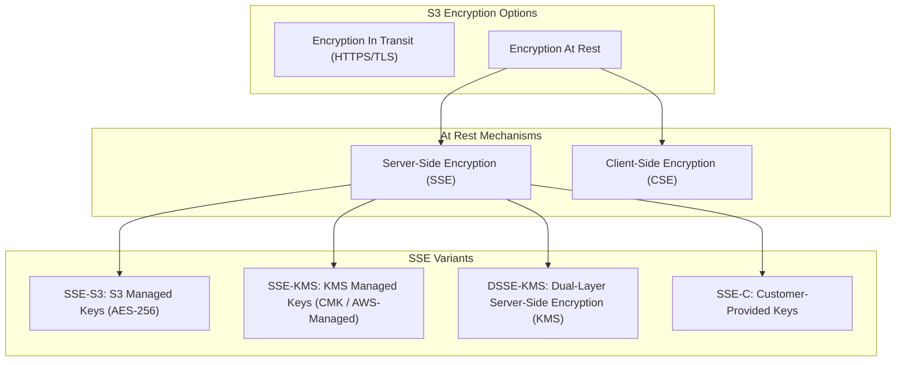
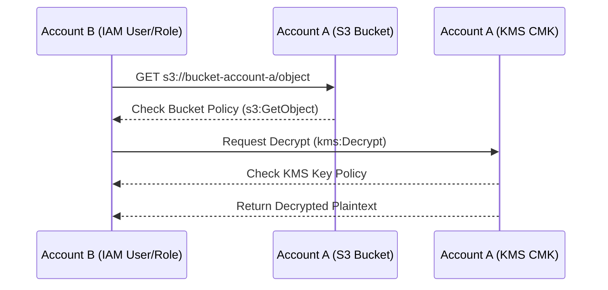

# 🔒 Amazon S3 Encryption

- **Category**: Security & Storage Governance
- **Primary Use Case**: Data Protection at Rest & In Transit, Compliance, Fine-Grained Access Control
- **Slide Reference**: Pages 77–138 in [[AWSCertifiedDataEngineerSlides.pdf]]
- **Hub Links**: [[index]] | [[service-catalog]] | [[s3]] | [[s3-performance]] | [[kms-and-secrets]]

---

## 1. High-Level Summary

Data security and encryption are foundational elements of the **AWS Certified Data Engineer – Associate (DEA-C01)** exam. Amazon S3 supports both **Encryption in Transit** (protecting data moving over the network) and **Encryption at Rest** (protecting stored object data). Understanding the differences between **SSE-S3**, **SSE-KMS**, **SSE-C**, and **Client-Side Encryption**, along with cross-account KMS permissions and S3 Bucket Keys, is vital for designing compliant data lakes.

---

## 2. Encryption Types Architecture



---

## 3. Server-Side Encryption (SSE) Breakdown

With Server-Side Encryption, Amazon S3 encrypts data at the object level as it writes to disks in data centers and decrypts it when accessed.

| Encryption Method | Key Manager | Key Rotation & Audit                                | Header Required                                   | Cost                           | Exam Use Case                                                |
| ----------------- | ----------- | --------------------------------------------------- | ------------------------------------------------- | ------------------------------ | ------------------------------------------------------------ |
| **SSE-S3**        | Amazon S3   | Automatic key rotation (AWS managed)                | `x-amz-server-side-encryption: AES256`            | Free (Default for all buckets) | Baseline encryption at rest, no special audit needed         |
| **SSE-KMS**       | AWS KMS     | Configurable rotation, **CloudTrail audit logging** | `x-amz-server-side-encryption: aws:kms`           | KMS key fees + request fees    | Compliance requiring audit trails & separate key permissions |
| **DSSE-KMS**      | AWS KMS     | Configurable rotation, CloudTrail logging           | `x-amz-server-side-encryption: aws:kms:dsse`      | KMS key fees + request fees    | **Dual-Layer Server-Side Encryption** for strict compliance  |
| **SSE-C**         | Customer    | Customer managed (S3 does NOT store key)            | `x-amz-server-side-encryption-customer-algorithm` | Free (No KMS fees)             | Strict regulatory requirements where customer holds keys     |

---

### 1. SSE-S3 (S3-Managed Keys)

- **Mechanism**: S3 encrypts each object using a unique key with **AES-256**.
- **Default Encryption**: Since January 2023, **SSE-S3 is enabled by default** for all new S3 buckets at no additional cost.
- **Key Access**: Managed entirely by AWS. Users do not have control over key policies or rotation intervals.

### 2. SSE-KMS (AWS KMS-Managed Keys)

- **Mechanism**: S3 encrypts objects using data keys backed by an AWS KMS Customer Master Key (CMK) or AWS-managed key (`aws/s3`).
- **Key Advantages**:
  - **Audit Logging**: Every encrypt/decrypt operation is logged in **AWS CloudTrail**.
  - **Granular Control**: Separate IAM permissions for S3 bucket access (`s3:GetObject`) AND KMS key usage (`kms:Decrypt`).
- **KMS API Quota Limits & S3 Bucket Keys**:
  - **Issue**: Uploading/downloading high volumes of objects invokes KMS APIs (`GenerateDataKey` / `Decrypt`), which can hit KMS request limits (5,500–30,000 req/sec) and incur high costs.
  - **Solution**: Enable **S3 Bucket Keys**. S3 generates a time-limited bucket-level key, reducing KMS API calls and costs by **up to 99%**.

### 3. DSSE-KMS (Dual-Layer Server-Side Encryption with AWS KMS)

- **Definition**: **Dual-Layer Server-Side Encryption based on KMS**.
- **Mechanism**: Applies **two independent layers of AES-256 encryption** at the server level using KMS keys.
- **Use Case**: Designed for high-compliance workloads (defense, federal, financial regulations) mandating dual-layer cryptographic protection without client-side encryption overhead.

### 4. SSE-C (Customer-Provided Keys)

- **Mechanism**: The client provides the encryption key in the HTTP headers of every upload (`PUT`) and download (`GET`) request. S3 uses the key to encrypt/decrypt, then immediately discards the key from memory.
- **Critical Considerations**:
  - AWS does **NOT** store or track SSE-C keys. **If the key is lost, data recovery is impossible.**
  - **No S3 Console Support**: SSE-C objects cannot be viewed or downloaded via the AWS Management Console. Must use AWS CLI / SDK.

---

## 4. Client-Side Encryption (CSE)

- **Mechanism**: Data is encrypted locally on the client system **before** sending it to S3.
- **Workflow**:
  1. Client uses the **Amazon S3 Encryption Client** (SDK) or custom library to generate a data key.
  2. Plaintext is encrypted locally.
  3. Encrypted object is uploaded to S3. S3 stores raw ciphertext.
- **Use Case**: Highest security requirement where plaintext data must never touch AWS infrastructure unencrypted.

---

## 5. Security Enforcements & Bucket Policies

### 1. Enforcing Encryption in Transit (HTTPS / TLS)

To ensure data is encrypted in transit and reject unencrypted HTTP requests, attach an S3 Bucket Policy with `"aws:SecureTransport": "false"` and `Effect: Deny`:

```json
{
  "Version": "2012-10-17",
  "Statement": [
    {
      "Sid": "EnforceTLSRequestsOnly",
      "Effect": "Deny",
      "Principal": "*",
      "Action": "s3:*",
      "Resource": ["arn:aws:s3:::my-secure-bucket", "arn:aws:s3:::my-secure-bucket/*"],
      "Condition": {
        "Bool": {
          "aws:SecureTransport": "false"
        }
      }
    }
  ]
}
```

### 2. Enforcing SSE-KMS at Rest via Bucket Policy

To enforce that uploaded objects MUST use SSE-KMS:

```json
{
  "Version": "2012-10-17",
  "Statement": [
    {
      "Sid": "DenyNonKMSUploads",
      "Effect": "Deny",
      "Principal": "*",
      "Action": "s3:PutObject",
      "Resource": "arn:aws:s3:::my-secure-bucket/*",
      "Condition": {
        "StringNotEquals": {
          "s3:x-amz-server-side-encryption": "aws:kms"
        }
      }
    }
  ]
}
```

---

## 6. Cross-Account S3 Access with SSE-KMS

When sharing encrypted S3 objects across AWS accounts (Account A owns S3 bucket & KMS key; Account B accesses data):



> [!IMPORTANT]
> **Cross-Account Requirement Checklist**:
>
> 1. **S3 Bucket Policy / IAM Policy**: Grant `s3:GetObject` permission to Account B.
> 2. **KMS Key Policy**: Grant `kms:Decrypt` and `kms:GenerateDataKey` permissions to Account B.
> 3. **Customer Managed Key (CMK) Mandatory**: The default AWS-managed key (`aws/s3`) **CANNOT** be shared across accounts! You MUST use a **Customer Managed Key (CMK)** for cross-account SSE-KMS access.

---

## 7. DEA-C01 Exam Tips & Decision Triggers

> [!IMPORTANT]
> **Key Exam Decision Rules**:
>
> - **Enforce encryption in transit (HTTPS)**: Use S3 Bucket Policy with `"aws:SecureTransport": "false"` and `Effect: Deny`.
> - **Audit trail of who accessed/encrypted S3 data**: Choose **SSE-KMS** (logs to **CloudTrail**).
> - **Dual-layer encryption required for strict regulatory compliance**: Choose **DSSE-KMS** (Dual-Layer Server-Side Encryption based on KMS).
> - **Cross-account access to encrypted S3 bucket**: Use **SSE-KMS with Customer Managed Key (CMK)** + update both Bucket Policy and KMS Key Policy. (AWS-managed `aws/s3` key fails cross-account!).
> - **High S3 request volume causing KMS throttling / high KMS costs**: Enable **S3 Bucket Keys**.
> - **Must manage encryption keys without AWS holding keys**: Choose **SSE-C** or **Client-Side Encryption (CSE)**.
> - **Console access not working for S3 objects**: Root cause is likely **SSE-C** encryption (S3 console cannot supply client-side headers).

---

## 📌 Related Notes

- [[s3]] — Amazon S3 Overview & Storage Classes
- [[s3-performance]] — S3 Bucket Keys & Request Performance
- [[kms-and-secrets]] — AWS KMS Key Policies, Symmetric vs Asymmetric Keys & CloudTrail Audit
- [[lake-formation]] — Data Lake Access Control & Encryption Governance
