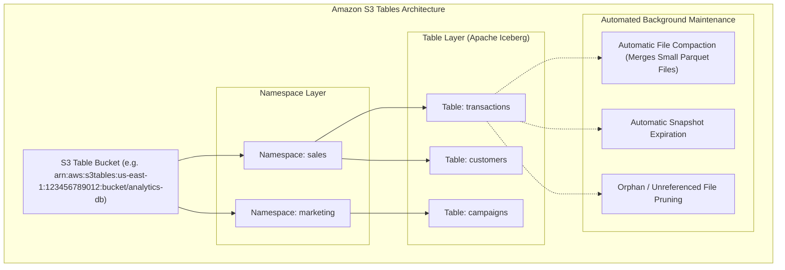

# 📊 Amazon S3 Tables

- **Category**: Tabular Object Storage & Data Lake Architecture
- **Primary Use Case**: Managed Apache Iceberg Tables, Automated Data Lake Maintenance, High-Throughput ACID Transactions
- **Slide Reference**: Pages 77–138 in [[AWSCertifiedDataEngineerSlides.pdf]]
- **Hub Links**: [[index]] | [[service-catalog]] | [[s3]] | [[athena]] | [[lake-formation]] | [[glue]]

---

## 1. High-Level Summary

**Amazon S3 Tables** is a purpose-built storage bucket type designed specifically for storing tabular data formatted as **Apache Iceberg** tables. It is the first object storage optimized specifically for table-based analytics, delivering up to **3x faster query performance** and **10x higher transactions per second (TPS)** compared to traditional general-purpose S3 buckets. S3 Tables automates background table optimization (compaction, snapshot expiration, unreferenced file pruning), removing the operational burden of managing Apache Iceberg data lakes manually.

---

## 2. Architecture & Hierarchy

### Table Bucket Hierarchy

1. **Table Bucket**: A dedicated, specialized S3 bucket type scoped exclusively for table storage (`s3tables`).
2. **Namespace**: A logical grouping container for tables within a Table Bucket (equivalent to a schema or database in traditional relational databases).
3. **Table**: An individual **Apache Iceberg** table stored as Parquet files with Iceberg metadata, manifests, and snapshot histories.

---

## 3. Core Features & Capabilities

### 1. Automated Table Maintenance (Zero Operational Overhead)

In standard S3 buckets, Apache Iceberg tables accumulate millions of small data files and obsolete metadata snapshots over time, degrading query performance unless manual Glue ETL / EMR compaction scripts are run.  
**S3 Tables automatically performs background optimization**:

- **Automatic File Compaction**: Merges small Parquet data files into optimal sizes ($128\text{ MB}$–$512\text{ MB}$) continuously in the background without affecting active queries.
- **Snapshot Expiration**: Automatically purges old Iceberg snapshots according to retention policies.
- **Unreferenced File Cleanup (Vacuum)**: Identifies and deletes orphan data files not attached to active Iceberg metadata manifests.

### 2. High-Concurrency ACID Transactions & Performance

- **10x Higher Transactions per Second (TPS)**: Optimizes metadata locks and commit operations, supporting thousands of concurrent writes/updates without commit conflict failures.
- **Up to 3x Faster Query Performance**: Built-in metadata indexing and automated layout optimization accelerate query planning in engines like [[athena]], [[redshift]], and [[emr]] Spark.

### 3. Integrated Governance with AWS Lake Formation

- S3 Tables natively integrates with **AWS Lake Formation**.
- Fine-grained access control can be enforced down to the **column-level**, **row-level**, and **cell-level** using Lake Formation Tag-Based Access Control (LF-TBAC).

---

## 4. Storage Class Comparison: Standard vs. Express One Zone vs. Tables

| Feature                 | S3 Standard                  | S3 Express One Zone             | Amazon S3 Tables                                |
| ----------------------- | ---------------------------- | ------------------------------- | ----------------------------------------------- |
| **Primary Format**      | General Unstructured Objects | High-Throughput Objects         | **Apache Iceberg Tabular Data**                 |
| **Latency**             | Double-digit ms              | **Single-digit ms (Single AZ)** | Millisecond analytics I/O                       |
| **Compaction**          | Manual (Glue/Athena CTAS)    | Manual                          | **Fully Automatic Background Compaction**       |
| **Metadata Management** | Object Key Prefixes          | Object Key Prefixes             | **Native Iceberg Catalog & Snapshot Pruning**   |
| **Ideal Query Engines** | Athena, Glue, Redshift, EMR  | SageMaker, Spark Checkpoints    | **Athena, Spark, Redshift, Snowflake, Iceberg** |

---

## 5. Analytics Ecosystem Integration

Amazon S3 Tables seamlessly integrates with both AWS native services and open-source analytical tools via standard Apache Iceberg REST catalog interfaces:

- **[[athena]]**: Query S3 Tables directly using standard ANSI SQL (`SELECT`, `INSERT`, `UPDATE`, `MERGE INTO`).
- **AWS Glue Data Catalog**: S3 Tables automatically register their schemas in the AWS Glue Data Catalog.
- **[[redshift]]**: Query S3 Tables using Redshift Spectrum or Serverless zero-copy integration.
- **[[emr]] & Apache Spark**: Read and write Iceberg tables using `pyspark` or Spark SQL with native pushdown optimizations.
- **Third-Party Engines**: Snowflake, Starburst/Trino, Databricks via standard Apache Iceberg endpoints.

---

## 6. DEA-C01 Exam Tips & Decision Triggers

> [!IMPORTANT]
> **Key Exam Decision Rules**:
>
> - **Store Apache Iceberg tables in S3 with automated file compaction & snapshot maintenance**: Choose **Amazon S3 Tables**.
> - **High-concurrency streaming ingestion into Apache Iceberg on S3**: Choose **Amazon S3 Tables** (provides 10x higher commit TPS).
> - **Eliminate manual Glue ETL compaction scripts for data lake tables**: Migrate tables to **Amazon S3 Tables**.
> - **Single-digit millisecond latency for machine learning training & checkpoints**: Choose **S3 Express One Zone**.
> - **Row- and Column-level security on S3 Tables**: Enforce via **AWS Lake Formation integration**.

---

## 📌 Related Notes

- [[s3]] — Amazon S3 Overview & Storage Classes
- [[s3-performance]] — S3 Request Limits & Compaction Techniques
- [[athena]] — Querying Iceberg & S3 Data Lakes
- [[glue]] — Glue Data Catalog & ETL Compaction
- [[lake-formation]] — Fine-Grained Governance for Data Lakes
