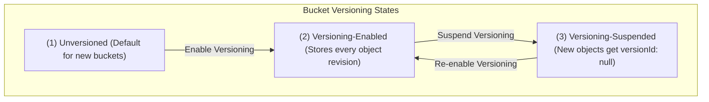
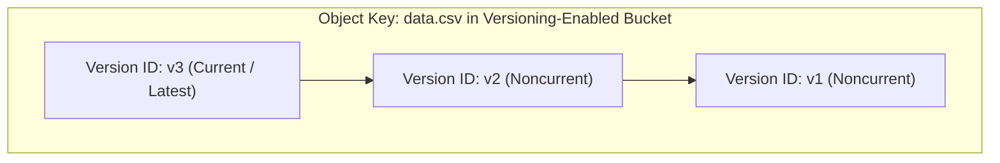
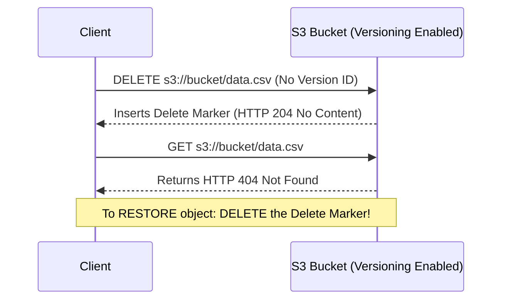
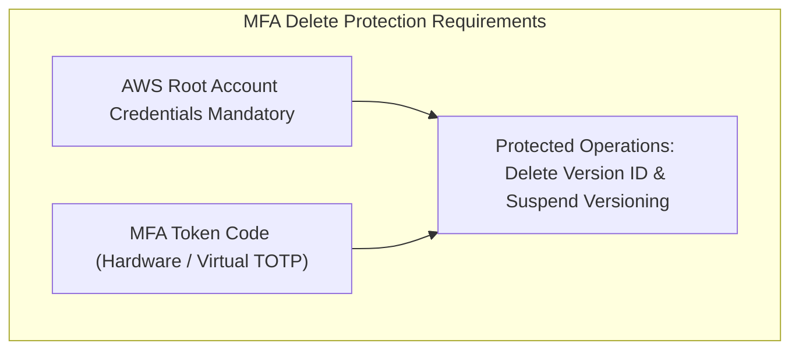

# 🔄 Amazon S3 Versioning & MFA Delete

- **Category**: Storage Protection & Data Governance
- **Primary Use Case**: Protection Against Accidental Overwrites & Deletions, Disaster Recovery, Prerequisite for S3 Replication & Object Lock
- **Slide Reference**: Pages 77–138 in [[AWSCertifiedDataEngineerSlides.pdf]]
- **Hub Links**: [[index]] | [[service-catalog]] | [[s3]] | [[s3-security]] | [[s3-encryption]]

---

## 1. High-Level Summary

**Amazon S3 Versioning** is a bucket-level feature that preserves, retrieves, and restores every version of every object stored in an S3 bucket. In the **AWS Certified Data Engineer – Associate (DEA-C01)** exam, S3 Versioning is tested as a core data protection mechanism, a mandatory prerequisite for **S3 Cross-Region Replication (CRR)** and **S3 Object Lock (WORM)**, and a key factor in storage cost optimization via **Lifecycle noncurrent version rules**.

---

## 2. Bucket Versioning States & Workflow



> [!IMPORTANT]
> **Versioning State Rule**:  
> Once a bucket is **Versioning-Enabled**, it can **NEVER** return to an **Unversioned** state. It can only be transitioned to **Versioning-Suspended**.

---

## 3. How S3 Versioning Works

### 1. Object Overwrites (PUT Requests)

When an object with an existing key is uploaded to a versioning-enabled bucket:

- S3 assigns a unique string **Version ID** (e.g., `3/L4bqtJlcpXVkfdA9jspM2kR378Pt2a`) to the new object.
- The new object becomes the **Current Version** (`latest`).
- Previous objects are preserved as **Noncurrent Versions**.



### 2. Object Deletions & Delete Markers (DELETE Requests)

When a simple `DELETE` request is sent for an object (without specifying a Version ID):

- S3 does **NOT** permanently delete any object data.
- Instead, S3 inserts a **Delete Marker** (a 0-byte placeholder) as the new **Current Version**.
- Subsequent `GET` requests for the object return **HTTP 404 Not Found**.



### 3. Restoring & Permanently Deleting Objects

- **Restoring a Deleted Object**: Simply send a `DELETE` request specifying the **Version ID of the Delete Marker**. S3 removes the Delete Marker, and the previous noncurrent version automatically becomes current again!
- **Permanent Deletion**: To permanently delete an object, the `DELETE` request MUST explicitly pass the target `versionId` (e.g., `DELETE /data.csv?versionId=v1`).

---

## 4. MFA Delete (Multi-Factor Authentication Delete)

For mission-critical data lakes requiring extra security against compromised IAM credentials or insider threats, AWS provides **MFA Delete**.



- **Protected Operations**: Requires an MFA token code to:
  1. Permanently delete an object version (`versionId`).
  2. Suspend versioning on the bucket.
- **Enablement Rule**: MFA Delete **CANNOT** be enabled via the AWS Management Console or IAM users. It MUST be enabled by the **AWS Account Root User** via the AWS CLI or API:

```bash
aws s3api put-bucket-versioning \
  --bucket my-secure-data-lake \
  --versioning-configuration Status=Enabled,MFADelete=Enabled \
  --mfa "arn:aws:iam::123456789012:mfa/root-account-mfa-token 123456"
```

---

## 5. S3 Versioning & Lifecycle Rules (Cost Management)

Because every version of an object is stored as a full file, versioning can cause S3 storage costs to grow exponentially if left unmanaged.

### Lifecycle Noncurrent Version Transitions & Expiration

S3 Lifecycle rules allow targeting **Noncurrent Versions**:

```json
{
  "Rules": [
    {
      "ID": "ManageNoncurrentVersions",
      "Status": "Enabled",
      "NoncurrentVersionTransitions": [
        {
          "NoncurrentDays": 30,
          "StorageClass": "STANDARD_IA"
        },
        {
          "NoncurrentDays": 90,
          "StorageClass": "GLACIER"
        }
      ],
      "NoncurrentVersionExpiration": {
        "NoncurrentDays": 365
      }
    }
  ]
}
```

### Expired Object Delete Markers Cleanup

When all noncurrent versions of an object have expired and been deleted, an orphan **Delete Marker** remains. You can configure a Lifecycle rule with `ExpiredObjectDeleteMarkers: true` to automatically clean up orphan delete markers, improving bucket query performance.

---

## 6. S3 Versioning Prerequisite Matrix

S3 Versioning is a mandatory technical prerequisite for several core S3 features:

| AWS S3 Feature                     | Requires Versioning Enabled? | Key Technical Reason                                                           |
| ---------------------------------- | ---------------------------- | ------------------------------------------------------------------------------ |
| **Cross-Region Replication (CRR)** | **Yes (Mandatory)**          | Requires version IDs to track & replicate asynchronous changes across regions. |
| **Same-Region Replication (SRR)**  | **Yes (Mandatory)**          | Required to replicate object state changes within the same region.             |
| **S3 Object Lock (WORM)**          | **Yes (Mandatory)**          | Enforces retention locks per specific object version ID.                       |
| **MFA Delete**                     | **Yes (Mandatory)**          | Protects individual version IDs from permanent deletion.                       |

---

## 7. DEA-C01 Exam Tips & Decision Triggers

> [!IMPORTANT]
> **Key Exam Decision Rules**:
>
> - **Protect data lake objects against accidental deletion or overwritten data**: Enable **S3 Versioning**.
> - **Re-activate a deleted file in a version-enabled bucket**: Delete the **Delete Marker**.
> - **Require extra authentication (MFA) to permanently delete object versions**: Enable **MFA Delete** (must use **Root Account** via CLI).
> - **Prerequisite for S3 Replication (CRR/SRR) or S3 Object Lock**: Enable **S3 Versioning** on source and destination buckets.
> - **Reduce storage costs in a versioned bucket**: Configure **S3 Lifecycle rules** targeting **Noncurrent Versions** (transition to Standard-IA/Glacier, then expire after $X$ days).
> - **Remove orphan delete markers**: Enable `ExpiredObjectDeleteMarkers` cleanup in S3 Lifecycle rules.

---

## 📌 Related Notes

- [[s3]] — Main Amazon S3 Overview & Storage Classes
- [[s3-security]] — S3 Security, Object Lock Compliance & Access Management
- [[s3-encryption]] — S3 Encryption (SSE-S3, SSE-KMS, DSSE-KMS, SSE-C)
- [[s3-performance]] — Request Performance & S3 Bucket Keys
- [[cost-management]] — Cost Optimization & Lifecycle Tiering
