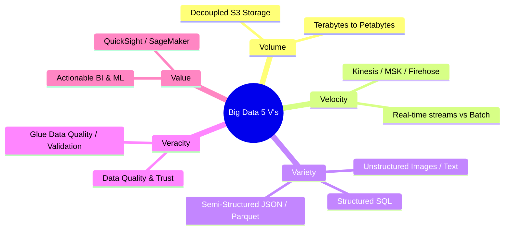
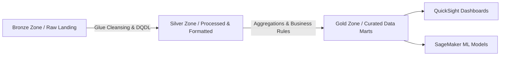

# 🌐 Big Data Fundamentals & Data Lake Architecture

- **Category**: Fundamentals
- **Language / ဘာသာစကား**: **English (Original)** | [မြန်မာဘာသာ (Burmese)](file:///home/monetine/Workspace/Wathon/aws-dea-c01/content/my/03-concepts/big-data-fundamentals.md)
- **Slide Reference**: Pages 12–37 in [[AWSCertifiedDataEngineerSlides.pdf]]
- **Hub Links**: [[index]] | [[service-catalog]]

---

## 1. The 5 V's of Big Data

---

## 2. Data Warehouses vs Data Lakes vs Data Swamps

| Characteristic | Data Warehouse (e.g. [[redshift]]) | Data Lake (e.g. [[s3]]) | Data Swamp |
| --- | --- | --- | --- |
| **Data Structure** | Schema-on-Write (Structured OLAP) | Schema-on-Read (Structured, Semi-Structured, Raw) | Ungoverned, uncurated data dumps without metadata |
| **Storage vs Compute** | Coupled or Managed Scaling | **Decoupled** (Cheap S3 storage + independent compute) | Decoupled but unorganized |
| **Governance** | Strict ACID & Schema Enforced | Governed via [[lake-formation]] & Catalog | Zero governance or metadata index |
| **Primary Users** | Business Analysts, BI Developers | Data Engineers, Data Scientists, ML Engineers | None (Data unusable) |

---

## 3. Data Lake Tiering Strategy (Medallion Architecture)

1. **Bronze (Raw Landing Zone)**: Original immutable source data (CSV, JSON, APIs).
2. **Silver (Processed / Standardized Zone)**: Cleaned, deduplicated, partitioned, converted to Parquet/ORC.
3. **Gold (Curated / Business Zone)**: Aggregated data marts optimized for high-performance BI reporting and analytics.

---

## 📌 Related Notes
- [[data-formats-and-compression]] — File formats across data lake tiers
- [[data-modeling-and-partitioning]] — Structuring data lake partitions
