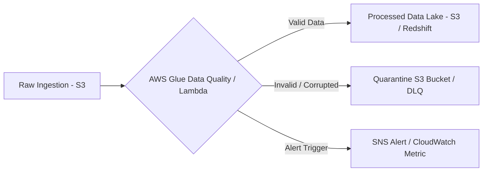

# 🔍 Data Validation and Profiling
- **Category**: Data Quality & Governance
- **Language / ဘာသာစကား**: **English (Original)** | [မြန်မာဘာသာ (Burmese)](file:///home/monetine/Workspace/Wathon/aws-dea-c01/content/my/03-concepts/data-validation-and-profiling.md)
- **Hub Links**: [[index]] | [[service-catalog]] | [[glue]] | [[sagemaker-and-ai]]

Data Validation and Profiling are core pillars of **Data Quality Management** in modern data engineering pipelines. In the **AWS Certified Data Engineer – Associate (DEA-C01)** exam, you are tested on how to automatically inspect, validate, profile, and quarantine bad data across batch and streaming architectures.

---

## 1. High-Level Summary

| Concept | Primary Purpose | When It Happens | AWS Primary Services |
| :--- | :--- | :--- | :--- |
| **Data Profiling** | Analyzing data structure, value distributions, schema types, missingness, and statistical summaries. | **Discovery & Ingestion Phase** | AWS Glue DataBrew, SageMaker Data Wrangler, Glue Crawlers |
| **Data Validation** | Enforcing business rules, constraints (nulls, range, uniqueness, regex), and schema compliance. | **ETL / Transformation Phase** | AWS Glue Data Quality (DQDL), PyDeequ (EMR/Spark), Lambda |

---

## 2. Core Concepts & Frameworks

### A. Data Profiling
* **Statistical Insights**: Calculates min, max, mean, median, standard deviation, and row counts.
* **Structural Inspection**: Detects data types, nested JSON structures, inferring schema evolution.
* **Quality Metrics**: Identifies missing values (nulls/empty strings), duplicate records, and out-of-range anomalies.

### B. Data Validation Rules & Constraints
* **Completeness**: `Completeness "customer_id" >= 0.98` (No more than 2% nulls).
* **Uniqueness**: `IsUnique "transaction_id"` (Must have distinct primary keys).
* **Column Correlation & Range**: `ColumnValues "age" between 18 and 120`.
* **Schema Compliance**: Ensuring incoming fields match catalog schema (e.g. integer vs string).
* **Format Assertions**: Validating ISO timestamps, email patterns, or currency formatting.

---

## 3. AWS Services for Validation & Profiling (DEA-C01 Focus)

### 1. AWS Glue Data Quality (DQDL)
- Uses **Data Quality Definition Language (DQDL)** to declare declarative rules.
- **Key Features**:
  - Automatically recommends quality rules by analyzing dataset history.
  - Can fail Glue ETL jobs automatically when data quality checks drop below threshold.
  - Generates Data Quality Scores integrated with the **AWS Glue Data Catalog**.

### 2. AWS Glue DataBrew
- Visual data preparation tool with built-in profiling capabilities.
- **Key Features**:
  - Generates comprehensive **Data Quality Reports** (80+ statistical metrics).
  - Visual charts showing value distribution, schema drift, and outlier detection.
  - Suitable for data analysts and engineers who prefer a no-code visual dashboard.

### 3. PyDeequ / Deequ (Apache Spark / EMR)
- Open-source library built by AWS on top of Apache Spark for unit testing data.
- **Key Features**:
  - Used in custom **Amazon EMR** or **Glue PySpark** scripts.
  - Defines metrics repositories to track data quality over time.
  - Supports Constraint Suggestions and Automated Anomaly Detection.

### 4. Amazon SageMaker Data Wrangler
- Used primarily for ML data pipelines.
- Automatically profiles feature distributions, detects target leakage, and generates quick visual quality summaries.

---

## 4. Pipeline Handling for Invalid Data (Quarantine Architecture)

When validation fails, data pipelines should follow one of these architectural patterns:

| Pattern | Mechanism | Use Case |
| :--- | :--- | :--- |
| **Quarantine / DLQ** | Route invalid records to an **S3 Quarantine Bucket** or **SQS DLQ**, allowing valid records to proceed. | High-throughput streaming (Kinesis/SQS) or non-critical ETL. |
| **Fail-Fast** | Immediately abort the Glue ETL job or Step Function execution. | Financial ledger, billing, or strict compliance pipelines. |
| **Remediation / Masking** | Replace null values with defaults or mask invalid PII strings using Glue PySpark. | Analytics lakes where missing data can be imputed safely. |

---

## 5. DEA-C01 Exam Tips & Scenarios

> [!IMPORTANT]
> **Key Exam Decision Matrix**

* **Scenario**: Need no-code, visual data profiling reports with 80+ statistical metrics.
  * ➔ **Choose AWS Glue DataBrew**.
* **Scenario**: Want declarative data quality rules directly inside serverless Glue ETL pipelines with automatic threshold failures.
  * ➔ **Choose AWS Glue Data Quality (DQDL)**.
* **Scenario**: Running large-scale PySpark jobs on EMR and need data unit testing with anomaly detection.
  * ➔ **Choose PyDeequ / Deequ**.
* **Scenario**: Need to alert data engineers when null counts spike in a Data Lake table.
  * ➔ **Choose Glue Data Quality + CloudWatch Alarm + Amazon SNS notification**.
* **Scenario**: Corrupted records in a stream must not block valid records.
  * ➔ **Choose Lambda Processor + SQS Dead-Letter Queue (DLQ) / S3 Bad Records Bucket**.

---

## 🔗 Related Notes
- [[glue]] — AWS Glue Data Catalog, Crawlers, ETL, and Glue Data Quality
- [[sagemaker-and-ai]] — SageMaker Data Wrangler profiling
- [[data-formats-and-compression]] — File schema validation (Parquet/ORC vs CSV)
- [[service-comparisons]] — Glue Data Quality vs DataBrew comparison
