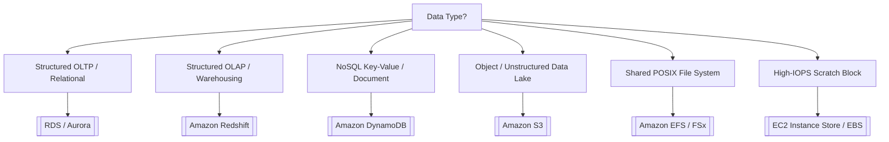

# ⚡ DEA-C01 Service Decision Matrix & Comparisons

Quick reference decision guide for resolving architectural choices on the AWS Certified Data Engineer Associate exam.

---

## 1. Storage & Database Choice Matrix

### Storage Decision Matrix: S3 vs EBS vs EFS vs Instance Store vs FSx for Lustre

| Storage Service | Protocol / Model | Scope / Durability | Persistence on STOP | Primary Data Engineering Role |
| :--- | :--- | :--- | :--- | :--- |
| **Amazon S3** | Object (REST API) | Multi-AZ (11 9's) | ✅ Persistent | Central Data Lake, Bronze/Silver/Gold analytics tables |
| **Amazon EBS** | Block device (Network) | Single-AZ (99.9%+) | ✅ Persistent | Hosted relational databases, Kafka commit logs, OS boot |
| **EC2 Instance Store** | Block device (PCIe Bus) | Host Server (Single Disk) | ❌ **WIPED** | **Spark shuffle partition cache, MapReduce spills, temp buffers** |
| **Amazon EFS** | POSIX File (NFSv4.1) | Multi-AZ (11 9's) | ✅ Persistent | **Multi-AZ shared directories, Lambda model storage, EKS/ECS PVs** |
| **AWS FSx for Lustre** | High-Perf Parallel File | Single-AZ (Linked S3) | ✅ Persistent in S3 | **Sub-ms HPC processing, distributed ML training, EMR staging** |

> 🔗 **Deep Dive Reference**: See [[ebs-vs-efs-vs-instance-store]] for comprehensive lifecycle, throughput, and architecture breakdowns.

---

## 2. Ingestion & Streaming Matrix

| Use Case | AWS Service Choice | Key Keyword Trigger |
| --- | --- | --- |
| **Real-time custom stream processing (Retention up to 365 days)** | [[kinesis]] (Data Streams) | Multi-consumer, sub-second latency, custom processing code |
| **Zero-code streaming delivery to S3 / Redshift / OpenSearch** | [[kinesis]] (Data Firehose) | Micro-batching, direct delivery, automatic Parquet transformation |
| **Open-source Kafka streaming ecosystem** | [[msk-kafka]] (Amazon MSK) | Apache Kafka compatibility, Kafka Connect |
| **Ingesting data from SaaS (Salesforce, ServiceNow)** | [[appflow]] (AWS AppFlow) | No-code SaaS connector, PrivateLink security |
| **Migrating databases with continuous replication** | [[dms-and-sct]] (AWS DMS + CDC) | Heterogeneous database migration, minimal downtime |

---

## 3. Query Engine Matrix: Athena vs Redshift Spectrum vs EMR

| Feature | Amazon Athena | Redshift Spectrum | Amazon EMR |
| --- | --- | --- | --- |
| **Infrastructure** | Fully Serverless | Runs on Redshift cluster nodes | Provisioned EC2 or EMR Serverless |
| **Query Engine** | Trino / Presto | Redshift MPP Engine | Apache Spark / Hive / Presto |
| **Data Location** | Amazon S3 | S3 + Redshift Local Tables | S3 (via EMRFS) or HDFS |
| **Pricing** | $5 per TB scanned | $5 per TB scanned (+ Redshift cluster) | Per-second cluster node pricing |
| **Best For** | Ad-hoc SQL queries on S3 | Joining S3 data lake with Redshift DW tables | Heavy custom Spark processing, machine learning |

---

## 4. Security & Governance Matrix

| Security Goal | Primary AWS Service |
| --- | --- |
| **Column & Row-Level Security on S3 Data Lake** | [[lake-formation]] (AWS Lake Formation) |
| **Automated PII Scanning in S3 (SSNs, Credit Cards)** | [[macie-and-cloudtrail]] (Amazon Macie) |
| **Database Credential Rotation** | [[kms-and-secrets]] (AWS Secrets Manager) |
| **Private S3 access without Internet Gateway** | [[vpc-and-networking]] (S3 Gateway VPC Endpoint) |
| **Centralized Cross-Service Backup & WORM Immutability** | [[aws-backup]] (AWS Backup & Vault Lock) |

---

## 📌 Master Hub Link
Return to main hub: [[index]]
