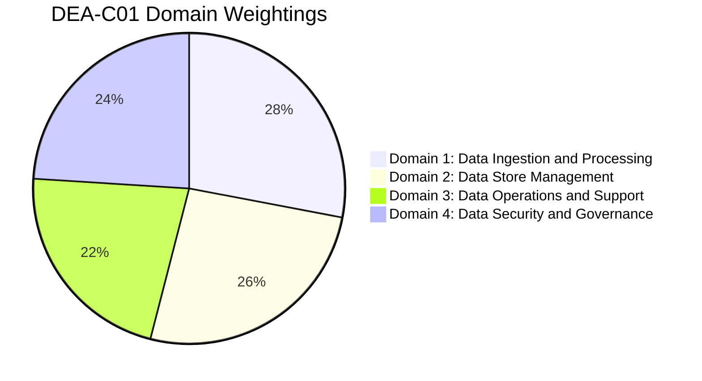
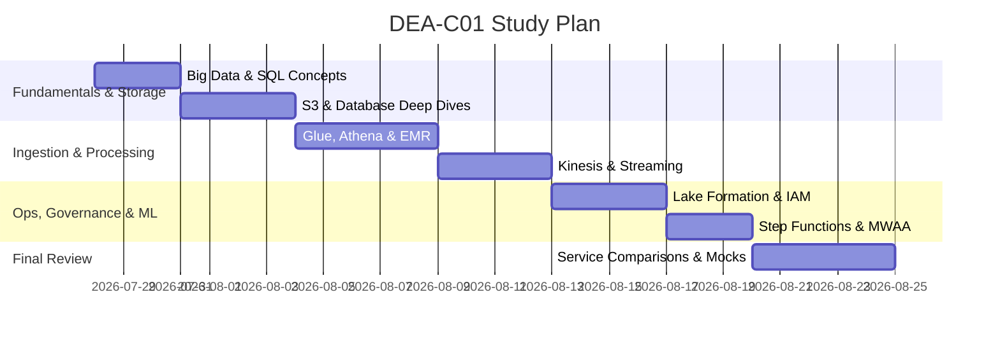

# 🎯 AWS Certified Data Engineer – Associate (DEA-C01) Exam Roadmap

The **AWS Certified Data Engineer – Associate (DEA-C01)** validates expertise in data-driven solutions, data architecture, data ingestion, transformation, storage management, operations, security, and governance.

---

## 📊 Exam Structure & Weightings

| Domain | Weighting | Key Focus Areas | Note Link |
| --- | --- | --- | --- |
| **Domain 1: Data Ingestion and Processing** | **28%** | Batch vs Streaming ingestion, ETL pipelines, transformation, schema evolution, Glue, Kinesis, Lambda, MWAA, Step Functions | [[en/01-domains/domain-1-ingestion-and-processing|domain-1-ingestion-and-processing]] |
| **Domain 2: Data Store Management** | **26%** | Data store selection, schema design, Redshift, S3, DynamoDB, RDS/Aurora, OpenSearch, storage tiering & partitioning | [[en/01-domains/domain-2-data-store-management|domain-2-data-store-management]] |
| **Domain 3: Data Operations and Support** | **22%** | Pipeline automation, monitoring, CloudWatch, EventBridge, error handling, performance tuning, data quality (Glue DQ) | [[en/01-domains/domain-3-data-operations-and-support|domain-3-data-operations-and-support]] |
| **Domain 4: Data Security and Governance** | **24%** | Identity & access management (IAM), encryption (KMS), governance (Lake Formation, DataZone), PII protection (Macie) | [[en/01-domains/domain-4-data-security-and-governance|domain-4-data-security-and-governance]] |

---

## 📅 Recommended 4-Week Study Strategy

### Week 1: Fundamentals & Core Data Stores
- Review Big Data 5 V's, SQL joins/window functions: [[en/03-concepts/big-data-fundamentals|big-data-fundamentals]], [[en/03-concepts/sql-and-version-control-review|sql-and-version-control-review]]
- S3 Storage Classes, Lifecycle, Object Lock & Replication: [[en/02-services/storage/s3/s3|s3]]
- Relational (RDS/Aurora) & NoSQL (DynamoDB, Redshift): [[en/02-services/database/rds-and-aurora|rds-and-aurora]], [[en/02-services/database/dynamodb|dynamodb]], [[en/02-services/database/redshift|redshift]]

### Week 2: Ingestion, Compute & Analytics Pipelines
- Data Ingestion with Kinesis Data Streams / Firehose / MSK: [[en/02-services/analytics-streaming/kinesis/kinesis|kinesis]], [[en/02-services/analytics-streaming/msk/msk|msk]]
- Serverless & Container Compute: [[en/02-services/compute-containers/lambda|lambda]], [[en/02-services/compute-containers/batch|batch]], [[en/02-services/compute-containers/ecr-ecs-eks|ecr-ecs-eks]], [[en/02-services/compute-containers/ec2-and-graviton|ec2-and-graviton]]
- ETL with AWS Glue (Crawlers, Catalog, Jobs, DataBrew, Data Quality): [[en/02-services/analytics-streaming/glue/glue|glue]]
- Interactive Querying with Athena & Big Data with EMR: [[en/02-services/analytics-streaming/athena/athena|athena]], [[en/02-services/analytics-streaming/emr/emr|emr]]

### Week 3: Orchestration, Governance & Security
- Workflow orchestration with Step Functions & MWAA (Airflow): [[en/02-services/integration/step-functions/step-functions|step-functions]], [[en/02-services/integration/mwaa-airflow|mwaa-airflow]]
- Governance & Access Control with Lake Formation, IAM, KMS: [[en/02-services/security-governance/lake-formation|lake-formation]], [[en/02-services/security-governance/iam|iam]], [[en/02-services/security-governance/kms-and-secrets|kms-and-secrets]]
- Migration & Transfer: [[en/02-services/migration/dms-and-sct|dms-and-sct]], [[en/02-services/migration/datasync-and-snow|datasync-and-snow]], [[en/02-services/migration/application-discovery-and-mgn|application-discovery-and-mgn]], [[en/02-services/migration/data-exchange|data-exchange]], [[en/02-services/migration/transfer-family|transfer-family]]

### Week 4: Scenarios, Optimization & Exam Practice
- Review cross-service decision matrix: [[en/04-exam-tips/service-comparisons|service-comparisons]]
- High-frequency exam traps & keywords: [[en/04-exam-tips/high-frequency-exam-patterns|high-frequency-exam-patterns]]
- Slide Exam Tips review: [AWSCertifiedDataEngineerSlides.pdf](/docs/AWSCertifiedDataEngineerSlides.pdf)

---

## 📌 Master Hub Link
Return to main hub: [[en/index|index]]
