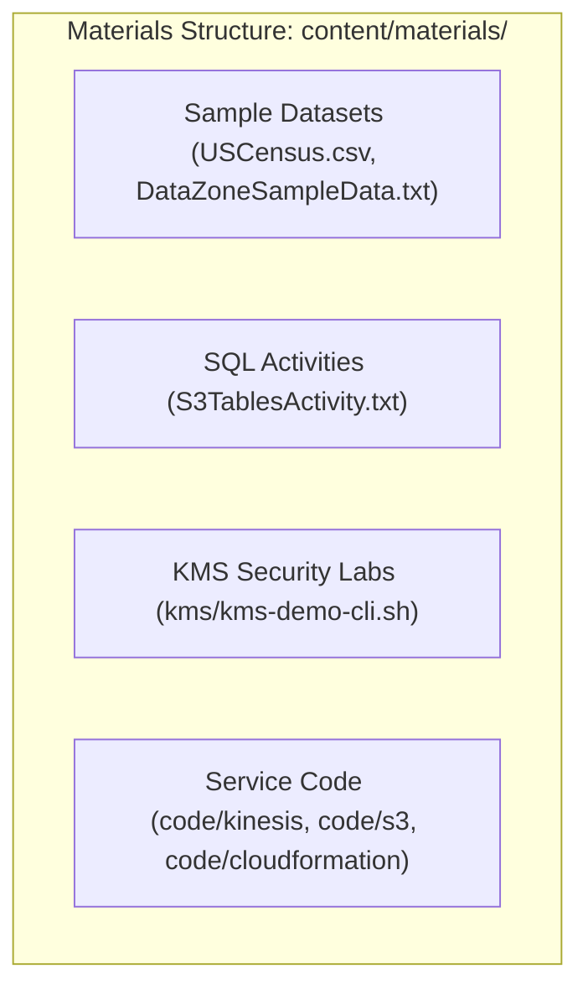

# 🧪 Hands-on Lab Materials & Code Samples (`content/materials/`)

- **Category**: Hands-on Exercises & Implementation Code
- **Primary Use Case**: Practical AWS Data Engineering Labs, CLI Scripts, Sample Datasets, Infrastructure as Code (IaC)
- **Hub Links**: [[en/index|index]] | [[en/00-hub/service-catalog|service-catalog]] | [[en/00-hub/dea-c01-roadmap|dea-c01-roadmap]]

---

## 1. Directory Overview

The `content/materials/` directory contains all hands-on lab assets, sample datasets, AWS CLI scripts, SQL queries, and Infrastructure as Code (IaC) templates accompanying the **AWS Certified Data Engineer – Associate (DEA-C01)** study notes.

---

## 2. Catalog of Lab Materials

### 1. Storage & Data Lake Labs (`S3` & `S3 Tables`)

- **`content/materials/S3TablesActivity.txt`**:
  - SQL script for testing **Amazon S3 Tables** with **Apache Iceberg**.
  - Demonstrates `CREATE TABLE` with Iceberg `TBLPROPERTIES`, partitioning by year, multi-row `INSERT`, and aggregation queries in Athena.
  - Linked Note: [[en/02-services/storage/s3/s3-tables|s3-tables]] | [[en/02-services/analytics-streaming/athena/athena|athena]]
- **`content/materials/USCensus.csv`**:
  - Standard CSV dataset (US State population & demographic data).
  - Used for S3 ingestion, Glue Crawlers, Athena query performance tests, and Parquet conversion labs.
  - Linked Note: [[en/02-services/storage/s3/s3|s3]] | [[en/03-concepts/data-formats-and-compression|data-formats-and-compression]]
- **`content/materials/code/s3/`**:
  - Sample static assets (`index.html`, test images) for testing S3 static website hosting and CORS configurations.

### 2. Security & Encryption Labs (`KMS` & `DataZone`)

- **`content/materials/kms/kms-demo-cli.sh`**:
  - Shell script demonstrating AWS KMS CLI operations: envelope encryption, data key generation (`aws kms generate-data-key`), and encryption/decryption validation.
  - Linked Note: [[en/02-services/security-governance/kms-and-secrets|kms-and-secrets]] | [[en/02-services/storage/s3/s3-encryption|s3-encryption]]
- **`content/materials/DataZoneSampleData.txt`**:
  - Structured text payload used for publishing data assets, metadata forms, and data governance policies in Amazon DataZone.
  - Linked Note: [[en/02-services/security-governance/lake-formation|lake-formation]]

### 3. Streaming & Analytics Labs (`Kinesis` & Serverless)

- **`content/materials/code/kinesis/kinesis-data-streams.sh`**:
  - CLI script for putting records into Kinesis Data Streams (`aws kinesis put-record`), inspecting shard iterators, and testing stream consumer throughput.
  - Linked Note: [[en/02-services/analytics-streaming/kinesis/kinesis|kinesis]]

### 4. Infrastructure as Code & Automation (`CDK`, `CloudFormation`, `SAM`)

- **`content/materials/code/cloudformation/`**: AWS CloudFormation templates for automated data lake infrastructure deployment.
- **`content/materials/code/sam/`**: AWS Serverless Application Model (SAM) templates for deploying Lambda data transformation triggers.
- **`content/materials/code/cdk/`**: AWS CDK constructs for data pipeline orchestration.
- **`content/materials/code/api-gateway/`**: API Gateway integration templates for RESTful data ingestion.

---

## 3. How to Use These Materials in Study & Labs

1. **Athena & S3 Tables Activity**:
   - Open `content/materials/S3TablesActivity.txt` in VS Code.
   - Copy the SQL statements into the **Amazon Athena Query Editor** to test creating Iceberg tables stored in S3 Table Buckets.
2. **KMS Envelope Encryption CLI Demo**:
   - Run `bash content/materials/kms/kms-demo-cli.sh` in AWS CloudShell or local terminal configured with AWS CLI credentials to observe envelope encryption in action.
3. **Data Profiling with Glue & Athena**:
   - Upload `content/materials/USCensus.csv` to an S3 bucket and trigger an AWS Glue Crawler to auto-detect schema and catalog the table.

---

## 📌 Master Hub Links

- Return to main hub: [[en/index|index]]
- AWS Service Catalog: [[en/00-hub/service-catalog|service-catalog]]
