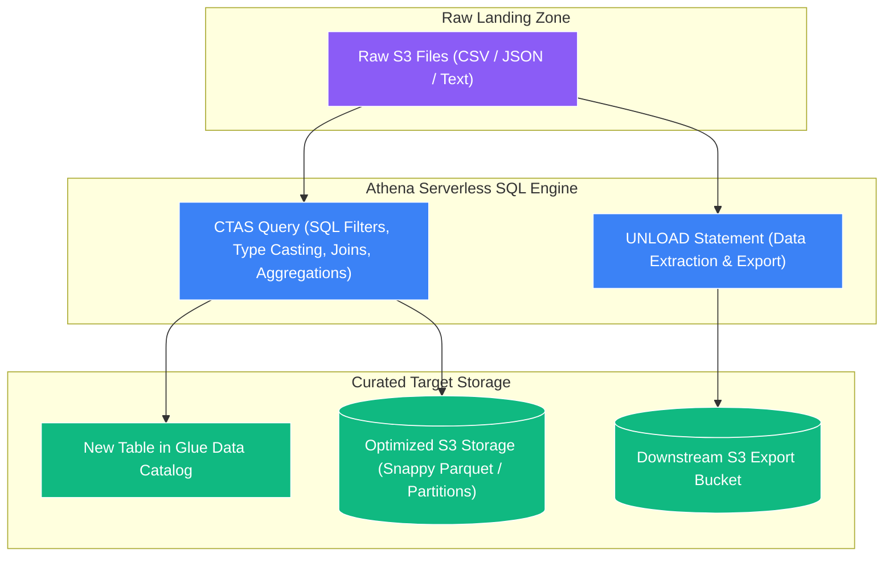

# 🔄 Athena CTAS & UNLOAD Statements (Serverless Lightweight ETL)

- **Category**: Analytics / Lightweight Serverless ETL & Data Transformation
- **Language / ဘာသာစကား**: **English (Original)** | [မြန်မာဘာသာ (Burmese)](/mm/02-services/analytics-streaming/athena/athena-ctas)
- **Primary Use Case**: Performing lightweight SQL-based ETL to transform, compress, partition, and export datasets in S3 without managing Spark clusters.
- **Slide Reference**: Pages 365–382 in `[AWSCertifiedDataEngineerSlides.pdf](/docs/AWSCertifiedDataEngineerSlides.pdf)`
- **Hub Links**: `[[en/index|index]]` | `[[en/02-services/analytics-streaming/athena/athena|athena]]` | `[[en/02-services/analytics-streaming/glue/glue-etl-jobs|glue-etl-jobs]]` | `[[en/03-concepts/data-formats-and-compression|data-formats-and-compression]]`

---

## 1. High-Level Summary

**CTAS (Create Table As Select)** is a standard ANSI SQL statement supported by Amazon Athena that runs a query on an existing table and saves the result as a **new, fully managed table** in Amazon S3, automatically adding its schema and partition metadata into the **[[en/02-services/analytics-streaming/glue/glue-data-catalog|glue-data-catalog]]**.

Alongside CTAS, Athena provides the **`UNLOAD`** statement, which extracts query results directly into S3 in desired formats (Parquet, ORC, Avro, JSON, CSV) with partitioning and compression **without creating a table definition in the Data Catalog**.

Together, CTAS and UNLOAD enable powerful **Serverless Lightweight ETL** pipelines using pure SQL, eliminating the need to write PySpark code or provision compute infrastructure for simple data conversions.



---

## 2. Core Capabilities & Syntax Deep Dive

### 1. Data Format Conversion & Partitioning via CTAS

```sql
CREATE TABLE curated_orders_parquet
WITH (
    -- 1. Specify target storage format
    format = 'PARQUET',
    parquet_compression = 'SNAPPY',

    -- 2. Define S3 partition hierarchy
    partitioned_by = ARRAY['order_year', 'order_month'],

    -- 3. Define hash-based bucketing for fast joins
    bucketed_by = ARRAY['customer_id'],
    bucket_count = 10,

    -- 4. Custom destination S3 location
    external_location = 's3://my-analytics-lake/curated/orders/'
) AS
SELECT 
    order_id,
    customer_id,
    amount,
    status,
    year AS order_year,
    month AS order_month
FROM raw_orders_csv
WHERE status != 'CANCELLED';
```

---

### 2. Appending Incremental Data (`INSERT INTO`)

Once a CTAS table is created, you can append subsequent daily or hourly batches to the existing table using standard `INSERT INTO` statements:

```sql
INSERT INTO curated_orders_parquet
SELECT 
    order_id,
    customer_id,
    amount,
    status,
    year AS order_year,
    month AS order_month
FROM raw_orders_csv
WHERE order_year = '2026' AND order_month = '09';
```

---

### 3. The `UNLOAD` Statement (Exporting without Catalog Tables)

If you need to transform and export query results to S3 for a third-party team or downstream system, but **do not want to create or pollute the Glue Data Catalog** with a new table definition, use `UNLOAD`:

```sql
UNLOAD (
    SELECT 
        customer_id, 
        SUM(amount) AS total_spend, 
        country
    FROM raw_orders_csv
    GROUP BY customer_id, country
)
TO 's3://export-bucket/customer_aggregates/'
WITH (
    format = 'PARQUET',
    compression = 'SNAPPY',
    partitioned_by = ARRAY['country']
);
```

---

## 3. CTAS Constraints & Rules for DEA-C01

| Constraint / Limit | Description | DEA-C01 Remediation |
| :--- | :--- | :--- |
| **100 Partitions Limit** | A single CTAS query can generate at most **100 partitions**. If a query attempts to write 101+ partitions, it fails with `EXCEEDED_MAX_WRITER_PARTITIONS`. | 1. Break the CTAS into multiple smaller runs using `WHERE` clauses (e.g., write year-by-year).<br>2. Use **AWS Glue ETL Jobs** for massive multi-partition writes. |
| **30-Minute Timeout** | Athena queries time out after **30 minutes** of continuous execution. | Optimize query with partition pruning, or use AWS Glue / EMR. |
| **Read/Write Pricing** | Billed standard **$5.00 per TB scanned** for the `SELECT` query + standard S3 storage and `PUT` request costs for files written. | Use columnar input data to minimize scan charges. |

---

## 4. Comparison Matrix: Athena CTAS vs. AWS Glue ETL vs. Amazon EMR

| Feature | Athena CTAS | AWS Glue ETL Jobs | Amazon EMR |
| :--- | :--- | :--- | :--- |
| **Language / Skill** | **ANSI SQL** | **PySpark, Scala, Python** | **Spark, Hive, Flink, Presto** |
| **Infrastructure Management** | **100% Serverless** | **Serverless (Configurable DPUs)** | **Managed Clusters (EC2 / EKS)** |
| **Partitioning Capacity** | Up to **100 partitions** per query | Unlimited partitions | Unlimited partitions |
| **Transformation Complexity** | Simple SQL filters, joins, aggregations, format conversion | Complex multi-stage DAGs, ML transforms, fuzzy matching | Highly customized big data, petabyte-scale graph processing |
| **Timeout Limit** | **30 minutes** | Configurable (Default 48 hours) | Unlimited |
| **Cost Model** | $5/TB data scanned | Per DPU-second consumed | EC2 instance hours + EMR software fee |

---

## 5. DEA-C01 Exam Tips & Scenarios

> [!IMPORTANT]
> **Key Exam Decision Triggers for Athena CTAS & UNLOAD**:
>
> - **"Convert raw CSV data in S3 to Snappy-compressed Parquet using pure SQL without provisioning clusters"** $\rightarrow$ **Amazon Athena CTAS query**.
> - **"Export aggregated query results to S3 in Parquet format partitioned by country without creating a Data Catalog table"** $\rightarrow$ **Amazon Athena `UNLOAD` statement**.
> - **"CTAS query fails with `EXCEEDED_MAX_WRITER_PARTITIONS` error"** $\rightarrow$ The query attempted to create more than **100 partitions**; split the query into smaller date ranges or use **AWS Glue ETL**.
> - **"Transform data in S3 but the team has no Python/Spark skills and knows only standard SQL"** $\rightarrow$ **Athena CTAS**.
> - **"Perform complex ETL involving fuzzy deduplication and machine learning transforms"** $\rightarrow$ *DO NOT use Athena CTAS; use **AWS Glue ETL (`FindMatches`)***.

---

## 📌 Related Notes
- `[[en/02-services/analytics-streaming/athena/athena|athena]]` — Amazon Athena Overview
- `[[en/02-services/analytics-streaming/athena/athena-performance|athena-performance]]` — Why Columnar Formats Matter
- `[[en/02-services/analytics-streaming/glue/glue-etl-jobs|glue-etl-jobs]]` — Heavyweight PySpark ETL Alternatives
- `[[en/03-concepts/data-formats-and-compression|data-formats-and-compression]]` — Parquet, ORC & Compression
