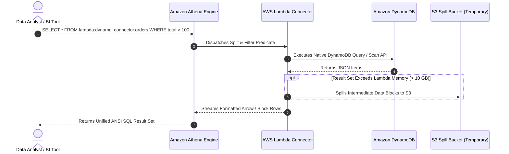

# 🔗 Athena Federated Query

- **Category**: Analytics / Cross-Source Zero-ETL Analytics
- **Language / ဘာသာစကား**: **English (Original)** | [မြန်မာဘာသာ (Burmese)](/mm/02-services/analytics-streaming/athena/athena-federated-query)
- **Primary Use Case**: Querying data in-place across non-S3 data stores (DynamoDB, RDS, CloudWatch, Redshift, DocumentDB) using standard SQL without moving data to S3.
- **Slide Reference**: Pages 365–382 in `[AWSCertifiedDataEngineerSlides.pdf](/docs/AWSCertifiedDataEngineerSlides.pdf)`
- **Hub Links**: `[[en/index|index]]` | `[[en/02-services/analytics-streaming/athena/athena|athena]]` | `[[en/02-services/database/dynamodb|dynamodb]]` | `[[en/02-services/compute-containers/lambda|lambda]]` | `[[en/01-domains/domain-1-ingestion-and-processing|domain-1-ingestion-and-processing]]`

---

## 1. High-Level Summary

Traditionally, Amazon Athena could only execute SQL queries against data stored in Amazon S3. If analytical queries required data residing in operational databases (like **Amazon DynamoDB**, **Amazon RDS**, or **Amazon CloudWatch Logs**), data engineers were forced to build complex, scheduled AWS Glue ETL jobs to extract, transform, and dump the data into S3 before querying.

**Athena Federated Query** eliminates this ETL overhead by enabling **Zero-ETL analytics in-place**. Using **Data Source Connectors** powered by **AWS Lambda**, Athena executes distributed SQL queries across relational, NoSQL, data warehouse, and custom data stores in parallel.



---

## 2. Core Architecture & Components

### 1. Data Source Connectors (AWS Lambda)
- Connectors are pre-built or custom AWS Lambda functions that act as a bridge between the Presto query coordinator and the target data source.
- The Lambda connector handles metadata retrieval, schema discovery, data extraction, and predicate pushdown (e.g., pushing `WHERE` clauses directly into the target database engine).

### 2. Supported Pre-Built Data Sources
AWS provides open-source, pre-built connectors available via the **AWS Serverless Application Repository (SAR)**:
- **NoSQL & Document Databases**: Amazon DynamoDB, Amazon DocumentDB, Apache HBase, MongoDB.
- **Relational Databases (JDBC)**: Amazon RDS / Aurora (PostgreSQL, MySQL, MariaDB, Oracle, Microsoft SQL Server).
- **Data Warehouses & Search**: Amazon Redshift, Amazon OpenSearch Service, Snowflake.
- **Logs & Key-Value**: Amazon CloudWatch Logs, Amazon CloudWatch Metrics, Amazon ElastiCache (Redis).

---

### 3. S3 Spill Bucket (Handling Large Result Sets)

AWS Lambda execution environments have a memory limit of **10 GB** and temporary `/tmp` storage limits:
- When a federated query scans a massive table in DynamoDB or RDS, the data extracted by the Lambda connector may exceed the available Lambda memory buffer.
- To prevent Out-of-Memory (OOM) failures, Athena uses an **Amazon S3 Spill Bucket**.
- The Lambda connector writes intermediate spilled chunks into S3, and the Athena query coordinator aggregates the chunks seamlessly.

---

### 4. Cross-Source Federated SQL Joins

A single SQL query in Athena can join tables residing across completely different storage engines:

```sql
-- Joining an S3 Data Lake table with a live DynamoDB table and a Redshift table
SELECT 
    s3_orders.order_id,
    s3_orders.order_date,
    ddb_users.customer_name,
    ddb_users.loyalty_tier,
    redshift_dim.store_region
FROM "s3_data_catalog"."curated"."orders" s3_orders
JOIN "lambda:dynamodb_connector"."default"."customers" ddb_users 
    ON s3_orders.customer_id = ddb_users.customer_id
JOIN "lambda:redshift_connector"."public"."stores" redshift_dim 
    ON s3_orders.store_id = redshift_dim.store_id
WHERE s3_orders.year = '2026' 
  AND ddb_users.loyalty_tier = 'PLATINUM';
```

---

### 5. Custom Connector Development (Query Federation SDK)
- If your enterprise uses a proprietary or custom internal database, developers can implement custom connectors using the **Amazon Athena Query Federation SDK** in Java.
- The SDK provides standard interfaces for metadata discovery (`MetadataHandler`) and record batching (`RecordHandler`).

---

## 3. Cost & Performance Trade-offs

| Cost & Performance Dimension | How It Works | DEA-C01 Optimization Strategy |
| :--- | :--- | :--- |
| **Athena Scan Charges** | Standard **$5.00 per TB** of data scanned. | Apply selective `WHERE` clauses to reduce rows fetched. |
| **AWS Lambda Charges** | Billed for Lambda execution duration and memory allocated per DPU/split. | Size Lambda memory appropriately; avoid over-allocating if queries are light. |
| **Target Database Load** | Federated queries consume read capacity on operational databases. | **Caution**: Running heavy Athena scans against production DynamoDB tables can exhaust Read Capacity Units (RCUs) and throttle production applications. |
| **S3 Spill Storage** | Standard S3 storage and API request charges for temporary spill files. | Configure S3 Lifecycle Rules on the spill bucket to automatically delete spill objects after **1 day**. |

---

## 4. DEA-C01 Exam Tips & Scenarios

> [!IMPORTANT]
> **Key Exam Decision Triggers for Federated Query**:
>
> - **"Analyze and join live data in DynamoDB with historical data in S3 using standard SQL without building an ETL pipeline"** $\rightarrow$ **Amazon Athena Federated Query with the DynamoDB Connector**.
> - **"Query Amazon CloudWatch Logs directly using ANSI SQL"** $\rightarrow$ **Athena Federated Query with CloudWatch Logs Connector**.
> - **"Federated query fails with Lambda memory limit or timeout error during large data extract"** $\rightarrow$ Configure an **S3 Spill Location** for the Lambda connector.
> - **"Prevent Athena federated queries from impacting operational production database performance"** $\rightarrow$ Direct queries to **read replicas** (for RDS/Aurora) or use dedicated read capacity / On-Demand capacity in DynamoDB.
> - **"How does Athena connect to non-S3 data stores?"** $\rightarrow$ Via **AWS Lambda Data Source Connectors**.

---

## 📌 Related Notes
- `[[en/02-services/analytics-streaming/athena/athena|athena]]` — Amazon Athena Architecture Overview
- `[[en/02-services/database/dynamodb|dynamodb]]` — Amazon DynamoDB Ingestion & Analytics
- `[[en/02-services/compute-containers/lambda|lambda]]` — Serverless Compute with AWS Lambda
- `[[en/02-services/analytics-streaming/glue/glue-etl-jobs|glue-etl-jobs]]` — When to use full Glue ETL vs. Federated Query
