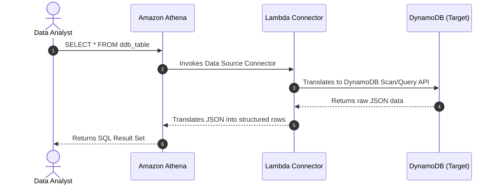

# 🔗 Athena Federated Query

- **Category**: Analytics / Data Integration
- **Language / ဘာသာစကား**: **English (Original)** | [မြန်မာဘာသာ (Burmese)](/mm/02-services/analytics-streaming/athena/athena-federated-query)
- **Primary Use Case**: Querying data stored *outside* of Amazon S3 (e.g., DynamoDB, Redshift, MySQL) using standard SQL directly from Athena.
- **Hub Links**: `[[index]]` | `[[athena]]` | `[[dynamodb]]`

---

## 1. High-Level Summary

Historically, Athena could only query data stored in Amazon S3. If data existed in Amazon DynamoDB or a relational database, you had to build an ETL pipeline (using AWS Glue) to extract the data, write it to S3, and then query it. 

**Athena Federated Query** solves this by allowing you to query non-S3 data sources in place using **AWS Lambda**.

---

## 2. Core Architecture

Athena Federated Query uses **Data Source Connectors** (which run as AWS Lambda functions) to translate SQL queries into the native API calls of the target database.

### Supported Data Sources:
- Amazon DynamoDB
- Amazon DocumentDB
- Amazon Redshift
- Relational Databases (Amazon RDS for MySQL, PostgreSQL, SQL Server)
- Amazon CloudWatch Logs
- Custom sources (You can write your own Lambda connector).

---

## 3. Key Benefits

1. **Zero-ETL Exploration**: Data Engineers can explore and join data across different databases without building complex Glue ETL pipelines just to move the data.
2. **Cross-Database Joins**: You can write a single SQL query in Athena that `JOIN`s a table in S3 with a table in DynamoDB and a table in Redshift.
3. **Serverless Execution**: The connectors run on AWS Lambda, so there is no persistent infrastructure to maintain.

---

## 4. DEA-C01 Exam Tips & Scenarios

> [!IMPORTANT]
> **Key Exam Trigger Keywords**:
> - **"Query DynamoDB and S3 data together using SQL without running an ETL job"** $\rightarrow$ **Use Athena Federated Query**.
> - **"Need to run ad-hoc analytics on Amazon DocumentDB or RDS without exporting data to S3"** $\rightarrow$ **Use Athena Federated Query**.
> - **"How does Athena connect to non-S3 sources?"** $\rightarrow$ **Via AWS Lambda Data Source Connectors**.

---

## 📌 Related Notes
- `[[athena]]` — Athena Overview
- `[[lambda]]` — AWS Lambda concepts
- `[[dynamodb]]` — Amazon DynamoDB
