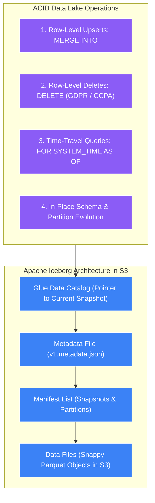
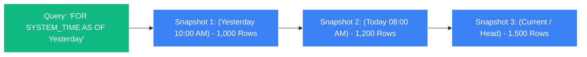

# 🧊 Athena ACID Transactions (Apache Iceberg)

- **Category**: Analytics / Data Lake Table Formats & ACID Transactions
- **Language / ဘာသာစကား**: **English (Original)** | [မြန်မာဘာသာ (Burmese)](/mm/02-services/analytics-streaming/athena/athena-iceberg)
- **Primary Use Case**: Enabling row-level `UPDATE`, `DELETE`, `MERGE INTO`, time-travel queries, and concurrent write guarantees on S3 Data Lakes.
- **Slide Reference**: Pages 365–382 in `[[AWSCertifiedDataEngineerSlides.pdf]]`
- **Hub Links**: `[[index]]` | `[[athena]]` | `[[domain-2-data-store-management]]` | `[[s3-tables]]`

---

## 1. High-Level Summary

By default, Amazon S3 and traditional Hive-style data lake tables are **immutable and append-only**. Updating or deleting a single row in a multi-gigabyte Parquet file traditionally required reading the entire partition, filtering out the deleted row, and rewriting the entire file to S3.

**Apache Iceberg** is an open-source, high-performance table format designed for massive analytic datasets on cloud storage. Amazon Athena natively supports Apache Iceberg, bringing **full ACID (Atomicity, Consistency, Isolation, Durability) transactional guarantees** directly to Amazon S3.



---

## 2. Core Capabilities & SQL Syntax Deep Dive

### 1. Table Creation
```sql
CREATE TABLE customer_orders_iceberg (
    order_id STRING,
    customer_id BIGINT,
    order_date DATE,
    order_amount DOUBLE,
    status STRING
)
PARTITIONED BY (order_date)
LOCATION 's3://my-analytics-lake/iceberg/orders/'
TBLPROPERTIES (
    'table_type' = 'ICEBERG',
    'format' = 'parquet',
    'write_compression' = 'snappy'
);
```

---

### 2. Row-Level Modifications (`UPDATE`, `DELETE`, `MERGE INTO`)

#### A. Row-Level Deletions (GDPR Compliance):
Instead of rewriting multi-terabyte partitions to comply with the "Right to be Forgotten", execute standard SQL:
```sql
-- Delete a specific user's records instantly
DELETE FROM customer_orders_iceberg 
WHERE customer_id = 987654321;
```

#### B. Row-Level Updates:
```sql
UPDATE customer_orders_iceberg 
SET status = 'REFUNDED' 
WHERE order_id = 'ORD-2026-99';
```

#### C. Change Data Capture (CDC) Upserts with `MERGE INTO`:
Synchronize operational database changes into your S3 data lake in a single statement:
```sql
MERGE INTO customer_orders_iceberg target
USING stage_orders_updates source
ON target.order_id = source.order_id
WHEN MATCHED AND source.operation = 'DELETE' THEN
    DELETE
WHEN MATCHED THEN
    UPDATE SET 
        order_amount = source.order_amount,
        status = source.status
WHEN NOT MATCHED THEN
    INSERT (order_id, customer_id, order_date, order_amount, status)
    VALUES (source.order_id, source.customer_id, source.order_date, source.order_amount, source.status);
```

---

### 3. Time-Travel & Historical Auditing Queries

Apache Iceberg tracks state changes using immutable snapshot manifests, allowing analysts to query the exact historical state of a table:



```sql
-- 1. Query table state as it existed exactly 2 days ago
SELECT COUNT(*) FROM customer_orders_iceberg 
FOR SYSTEM_TIME AS OF (current_timestamp - interval '2' day);

-- 2. Query table state as of a specific snapshot ID
SELECT * FROM customer_orders_iceberg 
FOR SYSTEM_VERSION AS OF 8921387129847192348;
```

---

### 4. In-Place Schema & Hidden Partition Evolution

- **Schema Evolution**: Add, drop, rename, or reorder columns safely using `ALTER TABLE`. Old data files do not need to be rewritten; Iceberg tracks column IDs independently of column names.
- **Partition Evolution**: Modify partition granularity (e.g., transition from `month` to `day` partitioning) without breaking existing historical partition paths.

---

### 5. Concurrent Writers & Isolation Guarantees

Iceberg uses **Optimistic Concurrency Control (OCC)**:
- Multiple distributed writers (e.g., multiple AWS Glue ETL streaming jobs, EMR clusters, and Athena users) can attempt to write to the same table simultaneously.
- Readers always see a consistent, isolated snapshot of the data, completely eliminating partial/dirty reads.

---

### 6. Table Maintenance & Compaction

Over time, frequent row-level updates and streaming ingestion create thousands of small data files and snapshot manifests:
1. **Compaction (`OPTIMIZE`)**: Merges small files into larger 128 MB+ Parquet files to maintain fast query speeds:
   ```sql
   OPTIMIZE customer_orders_iceberg REWRITE DATA USING BIN_PACK;
   ```
2. **Vacuuming (`VACUUM`)**: Purges expired snapshot manifests and deletes orphan S3 data files to reclaim storage costs:
   ```sql
   VACUUM customer_orders_iceberg;
   ```

---

## 3. Traditional Hive Tables vs. Apache Iceberg on S3

| Capability | Traditional Hive S3 Tables | Apache Iceberg Tables |
| :--- | :--- | :--- |
| **Data Modifications** | Append-only or full partition rewrite | **ACID `INSERT`, `UPDATE`, `DELETE`, `MERGE`** |
| **GDPR / CCPA Deletes** | Rewrite entire partition files | **Single row `DELETE` statement** |
| **Concurrent Writers** | Risk of data corruption & race conditions | **Optimistic Concurrency Control (OCC)** |
| **Time-Travel Queries** | Not supported | **Native snapshot & timestamp travel** |
| **Partitioning Mechanics** | Strict physical directory paths | **Hidden partitioning & partition evolution** |
| **Schema Evolution** | Prone to breaking downstream queries | **Safe in-place evolution by column ID** |

---

## 4. DEA-C01 Exam Tips & Scenarios

> [!IMPORTANT]
> **Key Exam Decision Triggers for Apache Iceberg on Athena**:
>
> - **"Perform row-level updates and deletes on an S3 data lake for GDPR 'Right to be Forgotten' compliance"** $\rightarrow$ **Use Apache Iceberg table format with Amazon Athena**.
> - **"Run 'time-travel' queries to audit historical data changes or reproduce machine learning training sets"** $\rightarrow$ **Apache Iceberg with `FOR SYSTEM_TIME AS OF`**.
> - **"Prevent data corruption when multiple Glue jobs and Athena queries write to the same S3 table simultaneously"** $\rightarrow$ **Migrate table to Apache Iceberg for ACID transactions**.
> - **"Ingest real-time Change Data Capture (CDC) streams with upserts into an S3 data lake"** $\rightarrow$ **Apache Iceberg `MERGE INTO` statement**.
> - **"Improve query performance on an Iceberg table degraded by frequent small file updates"** $\rightarrow$ Run **`OPTIMIZE <table_name> REWRITE DATA USING BIN_PACK`**.

---

## 📌 Related Notes
- `[[athena]]` — Amazon Athena Architecture Overview
- `[[athena-performance]]` — S3 Performance & Partitioning
- `[[s3-tables]]` — Amazon S3 Tables for Apache Iceberg
- `[[glue-etl-jobs]]` — Using AWS Glue with Apache Iceberg
