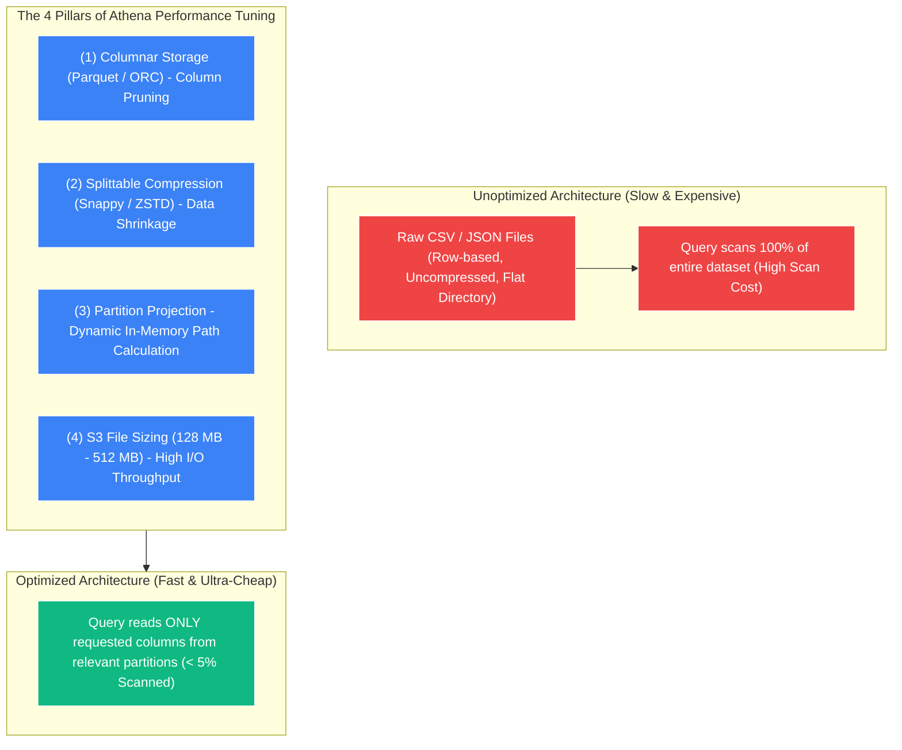

# 🚀 Athena Performance & Optimization

- **Category**: Analytics / Performance Tuning & Cost Reduction
- **Language / ဘာသာစကား**: **English (Original)** | [မြန်မာဘာသာ (Burmese)](/mm/02-services/analytics-streaming/athena/athena-performance)
- **Primary Use Case**: Maximizing SQL query speed and minimizing Athena scan charges ($5/TB) through columnar storage, compression, partition projection, and query tuning.
- **Slide Reference**: Pages 365–382 in `[AWSCertifiedDataEngineerSlides.pdf](/docs/AWSCertifiedDataEngineerSlides.pdf)`
- **Hub Links**: `[[index]]` | `[[athena]]` | `[[s3]]` | `[[domain-3-data-processing]]`

---

## 1. High-Level Summary

Amazon Athena charges **$5.00 per Terabyte (TB) of data scanned**. Therefore, in Athena architecture, **performance tuning is directly equivalent to cost optimization**. 

Every byte skipped during query execution saves money and accelerates query execution. By implementing the **Four Pillars of Athena Optimization** (Columnar Formats, Compression, Partitioning, and Optimal File Sizing), data engineers can achieve up to **90–99% cost reductions** while speeding up query runtimes from minutes to sub-seconds.



---

## 2. The Four Pillars of Athena Optimization

### 1. Columnar Data Formats (Apache Parquet & Apache ORC)
- **Row-Based Storage (CSV, JSON)**: If a query executes `SELECT customer_id, order_total` on a 100-column CSV file, Athena must scan all 100 columns across every row, paying for 100% of the data volume.
- **Columnar Storage (Parquet, ORC)**: Data is organized into column chunks with built-in statistics (min/max values per block). Athena fetches **only the exact columns** referenced in the query, skipping irrelevant columns entirely.

---

### 2. Splittable Compression Formats (Snappy & ZSTD)
- Compressing datasets reduces raw S3 storage consumption and network bandwidth.
- **Snappy**: The industry standard for Apache Parquet in AWS. Snappy provides balanced compression ratios and is **splittable**, allowing Athena worker nodes to read and process multiple parts of a single file in parallel.
- **Gzip**: Achieves higher compression ratios than Snappy but is **not splittable** at the file level (a single worker must decompress the whole file). Use Gzip only when raw storage savings outweigh parallel query performance.

---

### 3. S3 Partitioning & Partition Pruning
- Partitioning segregates data into hierarchical S3 folder prefixes (e.g., `s3://lake/sales/year=2026/month=08/day=17/`).
- When a query includes a `WHERE` clause matching partition keys (e.g., `WHERE year = '2026' AND month = '08'`), Athena uses **Partition Pruning** to skip all other year/month folders, scanning a fraction of the dataset.

---

### 4. Optimal S3 File Sizing (Solving the Small File Problem)
- **The Small File Bottleneck**: Having millions of tiny 10 KB–1 MB files in S3 causes excessive S3 `GET` API overhead and file open/close latency in Athena.
- **The Large File Bottleneck**: Having a single massive 1 TB file limits parallel execution across worker nodes.
- **Optimal Sizing Rule**: Aim for file sizes between **128 MB and 512 MB**. Use AWS Glue file grouping (`groupFiles="inPartition"`) or Athena CTAS to consolidate small files into 128 MB chunks before querying.

---

## 3. Deep Dive: Partition Projection

In massive data lakes with hundreds of thousands of partitions (e.g., IoT telemetry partitioned by `device_id` and `timestamp`), querying the **[[glue-data-catalog]]** metadata via API calls becomes a major bottleneck, causing queries to hang during the planning phase.

**Partition Projection** completely bypasses the Glue Data Catalog partition lookup. Instead of making metadata API calls, Athena **calculates partition locations dynamically in-memory** based on regex/range rules defined in the table properties.

```mermaid
graph TD
    subgraph TraditionalLookup["Traditional Partition Lookup (Slow at Scale)"]
        Q1["Athena Query with WHERE date = '2026-08-17'"] --> API["Glue Data Catalog API (GetPartitions)"]
        API --> S1["Scans 500,000+ Partition Metadata Records"]
        S1 --> P1["Takes 30–90 Seconds Just to Plan Query"]
    end

    subgraph PartitionProjectionLookup["Athena Partition Projection (Instant)"]
        Q2["Athena Query with WHERE date = '2026-08-17'"] --> InMem["In-Memory Date Range Rule Evaluation"]
        InMem --> DirectS3["Direct S3 GET: 's3://lake/data/2026-08-17/'"]
        DirectS3 --> P2["Sub-Second Query Initiation"]
    end

    classDef slow fill:#ef4444,stroke:#fff,stroke-width:1px,color:#fff;
    classDef fast fill:#10b981,stroke:#fff,stroke-width:1px,color:#fff;

    class API,S1,P1 slow;
    class InMem,DirectS3,P2 fast;
```



### Complete DDL Example with Partition Projection:
```sql
CREATE EXTERNAL TABLE website_clickstream (
    event_id STRING,
    user_id BIGINT,
    page_url STRING,
    response_time INT
)
PARTITIONED BY (
    event_date STRING,
    region STRING
)
ROW FORMAT SERDE 'org.apache.hadoop.hive.ql.io.parquet.serde.ParquetHiveSerDe'
STORED AS INPUTFORMAT 'org.apache.hadoop.hive.ql.io.parquet.MapredParquetInputFormat'
OUTPUTFORMAT 'org.apache.hadoop.hive.ql.io.parquet.MapredParquetOutputFormat'
LOCATION 's3://my-analytics-lake/clickstream/'
TBLPROPERTIES (
    -- 1. Enable Partition Projection
    'projection.enabled' = 'true',

    -- 2. Configure Date Partition Projection (Date Type)
    'projection.event_date.type' = 'date',
    'projection.event_date.range' = '2022-01-01,NOW',
    'projection.event_date.format' = 'yyyy-MM-dd',
    'projection.event_date.interval' = '1',
    'projection.event_date.interval.unit' = 'DAYS',

    -- 3. Configure Region Partition Projection (Enum Type)
    'projection.region.type' = 'enum',
    'projection.region.values' = 'us-east-1,us-west-2,eu-west-1,ap-southeast-1',

    -- 4. Dynamic S3 Storage Location Template
    'storage.location.template' = 's3://my-analytics-lake/clickstream/event_date=${event_date}/region=${region}/'
);
```

### Partition Management Strategy Comparison:

| Feature | Partition Projection | Glue Partition Index | Glue Crawlers | `MSCK REPAIR TABLE` |
| :--- | :--- | :--- | :--- | :--- |
| **Lookup Location** | **In-Memory (Athena Engine)** | **Glue Data Catalog (B-Tree)** | S3 File Scan $\rightarrow$ Catalog write | S3 File Scan $\rightarrow$ Catalog write |
| **New Partition Setup** | **Zero intervention** (Calculated automatically) | Automatic after crawler run | Requires running crawler | Requires running manual SQL |
| **Query Planning Latency** | **Sub-second (Fastest)** | Milliseconds | Minutes on large tables | Minutes / Hours (Fails on huge lakes) |
| **Cross-Service Support** | **Athena only** | Athena and Amazon EMR | All AWS Analytics | Athena and EMR |
| **Best Used For** | Predictable date ranges, hourly timestamps, known IDs. | Large partitioned tables queried by both Athena & EMR. | Discovering unknown schemas & irregular partitions. | Ad-hoc table repairs on small datasets. |

---

## 4. Advanced Performance Techniques & SQL Tuning

### 1. Bucketing / Clustering (`CLUSTERED BY`)
- Bucketing divides data within a partition into a fixed number of hash-based files based on a high-cardinality column (e.g., `user_id`).
- When two large tables are bucketed on the same key and joined together, Athena performs a **Bucket Map Join**, avoiding expensive inter-node shuffles across workers.

```sql
CREATE TABLE bucketed_orders
WITH (
    format = 'PARQUET',
    partitioned_by = ARRAY['order_date'],
    bucketed_by = ARRAY['customer_id'],
    bucket_count = 10
) AS SELECT * FROM raw_orders;
```

---

### 2. SQL Anti-Patterns & Query Optimization Rules

| Rule / Optimization | Why It Matters for Performance & Cost |
| :--- | :--- |
| **Never use `SELECT *`** | Always select explicit columns. In columnar Parquet/ORC, selecting all columns forces Athena to scan 100% of data. |
| **Beware of `LIMIT` Trap** | `SELECT * FROM table LIMIT 10` on unpartitioned CSV/JSON still scans the **entire file**; `LIMIT` does not reduce S3 scan charges! |
| **Order `JOIN` Clauses (Left vs. Right)** | Place the **largest table first (Left)** and the smaller dimension/lookup table second (Right). Athena broadcasts the right-side table to all worker nodes. |
| **Use `approx_distinct()`** | Replace `COUNT(DISTINCT column)` with `approx_distinct(column)` for massive datasets. Uses HyperLogLog to calculate counts with a ~2.3% standard error at a fraction of CPU and memory. |
| **Use `EXPLAIN (TYPE DISTRIBUTED)`** | Generates the distributed query execution plan to inspect stage fragmentation, data shuffling, and join operations. |

---

## 5. DEA-C01 Exam Tips & Scenarios

> [!IMPORTANT]
> **Key Exam Decision Triggers for Athena Performance**:
>
> - **"Drastically reduce Athena query costs and latency on a petabyte-scale CSV data lake"** $\rightarrow$ **Convert data to Apache Parquet with Snappy compression, partitioned by date**.
> - **"Queries on an hourly partitioned table take minutes just to start planning"** $\rightarrow$ **Enable Athena Partition Projection in table properties**.
> - **"Athena query scans 100 GB despite using `LIMIT 5`"** $\rightarrow$ Explain that `LIMIT` does not prune unpartitioned S3 storage scans; **use Partitioning and Columnar formats instead**.
> - **"Improve join performance between two large 10 TB tables in Athena"** $\rightarrow$ **Co-bucket both tables on the join key (`bucketed_by = ARRAY['id']`)**.
> - **"Calculate unique active users across 500 million records rapidly with minimal cost"** $\rightarrow$ **Use `approx_distinct(user_id)`**.

---

## 📌 Related Notes
- `[[athena]]` — Amazon Athena Architecture Overview
- `[[athena-ctas]]` — Converting CSV to Parquet using CTAS
- `[[data-formats-and-compression]]` — Parquet, ORC, Snappy & ZSTD Specs
- `[[glue-data-catalog]]` — Glue Partition Indexes
