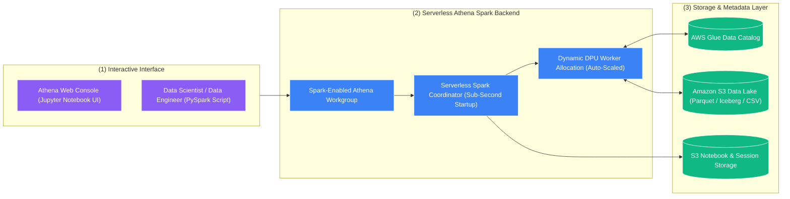

# ⚡ Amazon Athena for Apache Spark

- **Category**: Analytics / Distributed Serverless Processing & Interactive Notebooks
- **Language / ဘာသာစကား**: **English (Original)** | [မြန်မာဘာသာ (Burmese)](/mm/02-services/analytics-streaming/athena/athena-spark)
- **Primary Use Case**: Instant, interactive PySpark data exploration and serverless Jupyter notebooks on S3 without provisioning Spark clusters.
- **Slide Reference**: Pages 365–382 in `[AWSCertifiedDataEngineerSlides.pdf](/docs/AWSCertifiedDataEngineerSlides.pdf)`
- **Hub Links**: `[[index]]` | `[[athena]]` | `[[glue-etl-jobs]]` | `[[emr]]` | `[[domain-3-data-processing]]`

---

## 1. High-Level Summary

While Amazon Athena is primarily known for **serverless SQL**, it also natively supports **serverless Apache Spark**. 

**Amazon Athena for Apache Spark** allows data engineers, data analysts, and data scientists to execute interactive PySpark analytics and Jupyter notebooks directly from the Athena Web Console with an unprecedented startup time of **under 1 second**.

Engineers get the power of distributed Apache Spark dataframes and rich Python machine learning libraries (such as Pandas, NumPy, Matplotlib, and Seaborn) without waiting 5–15 minutes for Amazon EMR clusters to spin up or managing underlying infrastructure.



---

## 2. Core Architectural Features

### 1. Sub-Second Startup Latency
- Traditional Apache Spark on Amazon EMR or AWS Glue requires minutes to provision virtual machines and initialize Spark contexts.
- Athena for Apache Spark uses pre-warmed serverless compute capacity, launching interactive notebooks and sessions in **less than 1 second**.

### 2. Spark-Enabled Workgroups
- To run Spark jobs in Athena, you create an Athena Workgroup configured with the **Apache Spark engine**.
- You configure maximum DPU limits (Data Processing Units) per workgroup to enforce cost governance and prevent runaway computation costs.

### 3. Interactive PySpark Code Example
```python
import athena_spark_utils as utils
from pyspark.sql import SparkSession
import matplotlib.pyplot as plt
import pandas as pd

# Initialize Spark session (Instant start)
spark = SparkSession.builder.appName("AthenaSparkExploration").getOrCreate()

# 1. Read directly from AWS Glue Data Catalog table
df = spark.read.table("analytics_db.customer_churn_data")

# 2. Perform distributed PySpark DataFrame transformations
aggregated_df = df.groupBy("subscription_tier") \
    .agg({"monthly_spend": "avg", "customer_id": "count"}) \
    .withColumnRenamed("avg(monthly_spend)", "avg_spend") \
    .withColumnRenamed("count(customer_id)", "total_users")

# 3. Convert to Pandas for local in-notebook visualization
pandas_df = aggregated_df.toPandas()

# 4. Generate visual chart directly inside Athena Console
plt.bar(pandas_df['subscription_tier'], pandas_df['avg_spend'], color='skyblue')
plt.title('Average Spend by Subscription Tier')
plt.xlabel('Tier')
plt.ylabel('Average Spend ($)')
plt.show()
```

---

## 3. Decision Matrix: Spark on AWS (Athena Spark vs. Glue ETL vs. Amazon EMR)

One of the most frequently tested concepts on the DEA-C01 exam is knowing which Spark compute engine to select:

| Feature | Amazon Athena for Spark | AWS Glue ETL Jobs | Amazon EMR Clusters | Amazon EMR Serverless |
| :--- | :--- | :--- | :--- | :--- |
| **Primary Persona** | **Data Scientists / Analysts** | **Data Engineers** | **Big Data / Platform Engineers** | **Data Engineers / Analysts** |
| **Startup Latency** | **Sub-second (< 1 sec)** | 1–2 minutes | 5–15 minutes (EC2 provisioning) | Seconds to ~1 minute |
| **Execution Mode** | **Interactive exploration (Jupyter)** | **Scheduled batch / streaming pipelines** | **Persistent, long-running clusters** | Scheduled batch / ad-hoc jobs |
| **State Management** | Interactive session memory | **Native Job Bookmarks** | Custom application logic | Custom application logic |
| **Customizability** | Fixed standard PySpark environment | Standard Glue libraries + custom jars | **Full OS/Kernel/Hadoop customization** | Pre-packaged Spark/Hive runtimes |
| **Cost Model** | Billed per DPU-hour active | Billed per DPU-second active | EC2 hourly + EMR surcharge (Spot up to 90% off) | Billed per vCPU-hour and GB-hour |
| **Best Used For** | Ad-hoc Python analytics & fast iteration | Enterprise ETL pipelines & CDC | Petabyte-scale multi-workload clusters | Scalable Spark batch without EC2 tuning |

---

## 4. DEA-C01 Exam Tips & Scenarios

> [!IMPORTANT]
> **Key Exam Decision Triggers for Athena for Apache Spark**:
>
> - **"Need to run interactive PySpark code or Jupyter Notebooks instantly without waiting for clusters to start"** $\rightarrow$ **Amazon Athena for Apache Spark**.
> - **"Data Analysts use SQL, but Data Scientists need Python/PySpark on the exact same S3 data lake"** $\rightarrow$ **Athena SQL for analysts, Athena for Apache Spark for data scientists**.
> - **"Execute ad-hoc statistical data exploration in Python with sub-second startup latency"** $\rightarrow$ **Amazon Athena for Apache Spark**.

> [!WARNING]
> **Critical Exam Trap**:
> - **Do NOT use Athena for Apache Spark for mission-critical, scheduled production ETL pipelines**. While it can execute Spark code, **AWS Glue ETL Jobs** is the purpose-built service for production batch pipelines (due to Job Bookmarks, Glue Workflows integration, and automated retries).

---

## 📌 Related Notes
- `[[athena]]` — Amazon Athena Overview & Architecture
- `[[glue-etl-jobs]]` — Production Serverless Spark ETL
- `[[emr]]` — Amazon EMR for Massive-Scale Spark Clusters
- `[[domain-3-data-processing]]` — Distributed Processing Patterns
