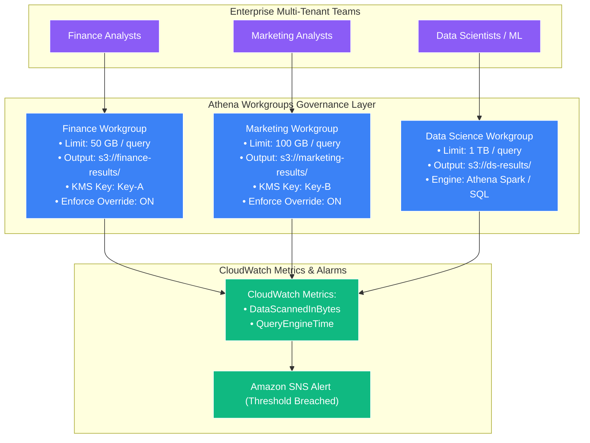
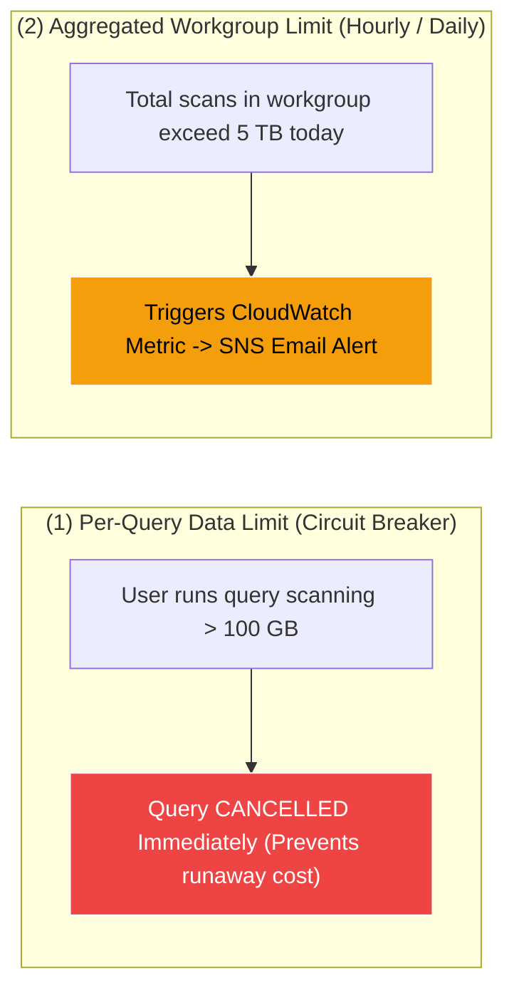

# 🛡️ Athena Workgroups & Cost Management

- **Category**: Analytics / Governance, Security & Cost Controls
- **Language / ဘာသာစကား**: **English (Original)** | [မြန်မာဘာသာ (Burmese)](/mm/02-services/analytics-streaming/athena/athena-workgroups)
- **Primary Use Case**: Multi-tenant isolation, per-query and workgroup-level data scan limits, mandatory encryption enforcement, and granular cost tracking.
- **Slide Reference**: Pages 365–382 in `[[AWSCertifiedDataEngineerSlides.pdf]]`
- **Hub Links**: `[[index]]` | `[[athena]]` | `[[domain-5-security-and-governance]]` | `[[cost-management]]`

---

## 1. High-Level Summary

Because Amazon Athena charges on a pay-per-scan model (**$5.00 per TB scanned**), a poorly structured query (e.g., executing `SELECT *` without partition filters on a multi-petabyte uncompressed dataset) can accidentally incur thousands of dollars in a matter of seconds.

**Athena Workgroups** provide multi-tenant isolation, cost governance, and security policy enforcement. By grouping users, applications, and business units into dedicated workgroups, administrators can enforce strict per-query data limits, mandate query result encryption, isolate query histories, and track spending per department via **Amazon CloudWatch**.



---

## 2. Core Governance Capabilities

### 1. Cost Controls & Data Scan Limits (Circuit Breakers)

Workgroups provide two distinct levels of data usage thresholds to prevent budget overruns:



1. **Per-Query Data Limit**:
   - Set a maximum data scan threshold per query (e.g., **100 GB**).
   - If an analyst submits a query that will scan more data than the threshold, Athena **automatically cancels the query before execution**, incurring zero or minimal scan charges.
2. **Workgroup-Wide Data Usage Alarms**:
   - Set cumulative hourly or daily data scan limits across the entire workgroup.
   - When the cumulative threshold is breached, Athena publishes an alert to **Amazon EventBridge** and **Amazon SNS**, notifying administrators while optionally preventing further query submissions.

---

### 2. Multi-Tenant Environment Isolation

- **Query History & Saved Queries Isolation**: Users in the `finance` workgroup cannot view, inspect, or download the query history, saved queries, or output data of the `marketing` workgroup.
- **IAM-Based Workgroup Access Control**: Access to workgroups is strictly governed using IAM policies:

```json
{
    "Version": "2012-10-17",
    "Statement": [
        {
            "Effect": "Allow",
            "Action": [
                "athena:StartQueryExecution",
                "athena:GetQueryExecution",
                "athena:GetQueryResults",
                "athena:StopQueryExecution"
            ],
            "Resource": "arn:aws:athena:us-east-1:123456789012:workgroup/finance_analytics"
        }
    ]
}
```

---

### 3. Enforcing Security Policies ("Override Client-Side Settings")

By default, JDBC/ODBC clients or Python scripts can specify their own S3 output paths and encryption settings. To enforce corporate compliance, workgroup administrators can enable **"Override client-side settings"**:

| Setting Enforced | Compliance & Security Impact |
| :--- | :--- |
| **Designated S3 Output Location** | Forces all query results for that workgroup into a specific, audited S3 bucket path (e.g., `s3://corp-analytics-results/finance/`). |
| **Mandatory AWS KMS Encryption** | Forces all CSV query results and metadata files to be encrypted with a specific **AWS KMS Customer Managed Key (CMK)**, ignoring client preferences. |
| **Requester Pays Compliance** | Controls whether queries run against S3 buckets configured with Requester Pays. |

---

### 4. Athena Engine Version Management

Athena periodically releases new engine versions with performance upgrades, new SQL functions, and bug fixes:
- **Engine Version 3**: The latest high-performance engine based on Trino.
- **Automatic vs. Manual Control**:
  - **Automatic (Recommended)**: Athena automatically upgrades the workgroup when a new engine version becomes generally available.
  - **Manual Version Pinning**: Allows data engineering teams to pin a workgroup to a specific engine version, test queries in a staging workgroup, and approve production upgrades during scheduled maintenance windows.

---

### 5. Amazon CloudWatch Metrics Integration

Athena automatically streams real-time execution metrics per workgroup to **Amazon CloudWatch**:
- `DataScannedInBytes`: Total bytes scanned from S3 (used for billing and cost allocation).
- `QueryEngineTime`: Time spent actively executing the query on Presto workers.
- `TotalExecutionTime`: End-to-end latency (queueing time + planning + execution).
- `ServicePreExecutionTime`: Time spent in query planning and metadata retrieval.

---

## 3. DEA-C01 Exam Tips & Scenarios

> [!IMPORTANT]
> **Key Exam Decision Triggers for Athena Workgroups**:
>
> - **"Prevent users from accidentally running expensive queries that scan terabytes of data"** $\rightarrow$ **Set a per-query data scan limit on the Athena Workgroup**.
> - **"Separate query execution histories, saved queries, and access permissions between different departments"** $\rightarrow$ **Create dedicated Athena Workgroups and assign IAM resource-level permissions**.
> - **"Force all query results to be written to a dedicated bucket and encrypted with an AWS KMS key, regardless of client JDBC settings"** $\rightarrow$ Configure the workgroup to **"Override client-side settings"** for output location and KMS encryption.
> - **"Track and allocate monthly Athena query spending to different business cost centers"** $\rightarrow$ Assign each department a dedicated Workgroup and monitor **CloudWatch `DataScannedInBytes` metrics with Cost Allocation Tags**.
> - **"Test a new Athena Engine Version before rolling it out to all production BI reports"** $\rightarrow$ Create a **staging Workgroup pinned to the new Athena Engine Version**.

---

## 📌 Related Notes
- `[[athena]]` — Amazon Athena Architecture Overview
- `[[athena-performance]]` — Query Cost Optimization
- `[[domain-5-security-and-governance]]` — Security, Encryption & IAM Policies
- `[[cost-management]]` — AWS Analytics Cost Allocation
