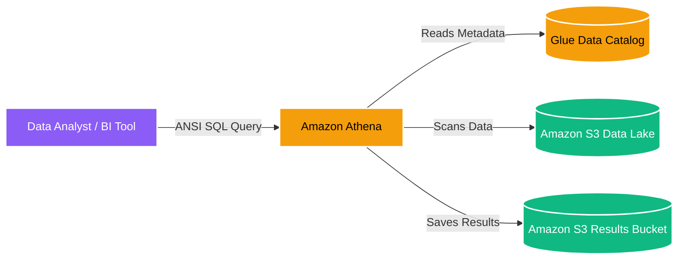

# 🏛️ Amazon Athena Overview

- **Category**: Analytics / Interactive Query
- **Language / ဘာသာစကား**: **English (Original)** | [မြန်မာဘာသာ (Burmese)](/mm/02-services/analytics-streaming/athena/athena)
- **Primary Use Case**: Interactive ad-hoc SQL queries directly on Amazon S3 data lakes using standard ANSI SQL without provisioning servers.
- **Slide Reference**: Pages 365–382 in `[[AWSCertifiedDataEngineerSlides.pdf]]`
- **Hub Links**: `[[index]]` | `[[service-catalog]]` | `[[domain-2-data-store-management]]` | `[[s3]]`

---

## 1. High-Level Summary

**Amazon Athena** is an interactive, serverless query service that allows data engineers and analysts to analyze data stored in Amazon S3 using standard SQL. Because it is serverless, there is no infrastructure to manage, and you only pay for the queries that you run (specifically, based on the amount of data scanned: $5 per TB scanned). 

Athena uses **Presto** (a distributed SQL query engine) under the hood for SQL execution and relies on the **AWS Glue Data Catalog** for table and database metadata.

---

## 2. Core Architecture

### Key Integrations
1. **Amazon S3**: Acts as the primary storage layer. Athena queries S3 directly without loading data into a database.
2. **AWS Glue Data Catalog**: Acts as the central metadata repository. Athena uses Glue to understand the schema (column names, types) and location of the S3 data.
3. **Amazon QuickSight**: Connects directly to Athena to build BI dashboards on top of S3 data.

---

## 3. Athena Feature Breakdown for DEA-C01

To master Athena for the Data Engineer exam, you must understand its sub-features in detail. Click on the notes below to dive deeper:

- **[[athena-performance]]**: How to optimize Athena queries to reduce cost and increase speed (Parquet, Snappy, Partitioning, Partition Projection).
- **[[athena-iceberg]]**: How to enable ACID transactions, row-level updates/deletes, and time-travel queries on S3 using Apache Iceberg.
- **[[athena-spark]]**: How to run instant, interactive PySpark and Jupyter notebooks completely serverless.
- **[[athena-federated-query]]**: How to query non-S3 data sources (DynamoDB, Redshift, CloudWatch) using Lambda connectors.
- **[[athena-workgroups]]**: How to control costs, enforce data scan limits, and separate workloads using Workgroups.
- **[[athena-ctas]]**: How to perform lightweight ETL by saving query results directly back into S3 as new tables (Create Table As Select).

---

## 4. Exam Tips & Scenarios

> [!IMPORTANT]
> **Key Exam Trigger Keywords**:
> - **"Serverless ad-hoc SQL querying on S3"** $\rightarrow$ **Amazon Athena**.
> - **"No infrastructure to manage, pay per TB scanned"** $\rightarrow$ **Amazon Athena**.
> - **"Athena table schema keeps disappearing or is not found"** $\rightarrow$ Ensure the **AWS Glue Crawler** has run, or the table is defined in the **Glue Data Catalog**.

---

## 📌 Related Notes
- `[[s3]]` — The underlying storage for Athena.
- `[[glue]]` — The metadata catalog powering Athena.
- `[[redshift]]` — Contrast with Redshift (which is used for heavy, complex enterprise data warehousing requiring provisioned compute).
