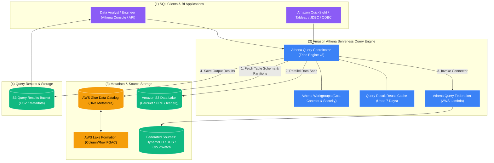

# 🏛️ Amazon Athena Overview (Serverless Interactive SQL)

- **Category**: Analytics / Interactive SQL & Data Lake Analytics
- **Language / ဘာသာစကား**: **English (Original)** | [မြန်မာဘာသာ (Burmese)](/mm/02-services/analytics-streaming/athena/athena)
- **Primary Use Case**: Interactive ad-hoc SQL querying on S3 Data Lakes, multi-source federated analytics, serverless Apache Spark notebooks, and lightweight ETL.
- **Slide Reference**: Pages 365–382 in `[[AWSCertifiedDataEngineerSlides.pdf]]`
- **Hub Links**: `[[index]]` | `[[service-catalog]]` | `[[domain-2-data-store-management]]` | `[[domain-3-data-processing]]` | `[[s3]]`

---

## 1. High-Level Summary

**Amazon Athena** is an interactive, serverless query service that allows data engineers and analysts to analyze petabytes of data stored in **Amazon S3** and other federated data sources using standard **ANSI SQL**. 

Athena is completely serverless—there is no compute infrastructure, EC2 cluster, or data warehouse to size, provision, or manage. You pay strictly for the queries you run, based on the **volume of data scanned** (standard pricing: **$5.00 per Terabyte (TB) scanned**, with a 10 MB minimum per query).

Under the hood, Amazon Athena is powered by **Presto / Trino** (Engine Version 3) for distributed SQL execution, and uses the **[[glue-data-catalog]]** as its centralized, Apache Hive-compatible metadata layer.

---

## 2. Core Architecture & Query Execution Flow

1. **Query Submission**: A user or BI tool submits a standard ANSI SQL query via the Athena Web Console, AWS CLI, SDK, or JDBC/ODBC drivers.
2. **Metadata Retrieval**: The Athena query engine contacts the **[[glue-data-catalog]]** to retrieve the table schema, serialization library (SerDe), S3 prefix locations, and partition metadata.
3. **Security & Access Evaluation**: Athena checks IAM permissions and evaluates fine-grained access control policies via **[[lake-formation]]** (enforcing column-level, row-level, and cell-level security filters).
4. **Distributed Execution**: Athena provisions distributed Presto compute workers across multiple Availability Zones to scan and aggregate the underlying S3 objects in parallel.
5. **Result Output & Storage**: Athena writes the resulting dataset in **CSV format** along with a `.metadata` file into a designated **Amazon S3 Query Results bucket** (`s3://aws-athena-query-results-.../`).

---

## 3. Athena Sub-Features Breakdown for DEA-C01

To master Athena for the Data Engineer exam, understand the dedicated specialized capabilities below:

| Feature / Sub-Topic | Primary Purpose | Key Exam Trigger | Detailed Note |
| :--- | :--- | :--- | :--- |
| **Performance Optimization** | Minimize data scanned and maximize query speed using Parquet, Snappy, and Partition Projection. | Converting CSV/JSON to Parquet; slow partition metadata lookups. | `[[athena-performance]]` |
| **ACID Transactions (Apache Iceberg)** | Perform row-level `UPDATE`, `DELETE`, and `MERGE INTO` operations with time-travel queries on S3. | GDPR / CCPA right-to-be-forgotten; concurrent writers on S3. | `[[athena-iceberg]]` |
| **Athena for Apache Spark** | Interactive PySpark analytics and Jupyter notebooks with sub-second startup (< 1 sec). | Interactive Python data exploration without waiting for EMR/Glue clusters. | `[[athena-spark]]` |
| **Federated Queries** | Query non-S3 sources (DynamoDB, RDS, CloudWatch) in place using AWS Lambda connectors. | Querying across S3 and DynamoDB in a single SQL query without ETL. | `[[athena-federated-query]]` |
| **Workgroups & Governance** | Multi-tenant isolation, per-query and workgroup-wide data scan limits, and mandatory encryption. | Preventing runaway query bills; separating team query histories. | `[[athena-workgroups]]` |
| **CTAS & UNLOAD Statements** | Lightweight serverless ETL using SQL to transform, partition, and compress S3 datasets. | Transforming raw CSV to Parquet using pure SQL; exporting query results. | `[[athena-ctas]]` |

---

## 4. Query Result Reuse & Caching

Athena includes a **Query Result Reuse (Result Caching)** feature:
- If an identical query is submitted within a configurable cache window (from **1 hour up to 7 days**), Athena returns the cached result from the S3 results bucket instead of re-scanning S3 data.
- **Cost & Latency Benefit**: Reused queries scan **0 bytes of data** ($0.00 compute cost) and return within milliseconds.
- **Cache Invalidation**: Result caching is automatically bypassed if the underlying S3 data or Glue Data Catalog table schema changes.

---

## 5. Security & Encryption Architecture

| Security Layer | Implementation Mechanism | DEA-C01 Exam Context |
| :--- | :--- | :--- |
| **Data Lake at Rest** | Amazon S3 encryption: SSE-S3, SSE-KMS, SSE-C, or Client-Side Encryption (CSE-KMS). | Athena decrypts data transparently if IAM role has KMS permissions. |
| **Query Results at Rest** | S3 Results Bucket encrypted with SSE-S3 or AWS KMS CMK. | Configured per Workgroup (enforce workgroup encryption override). |
| **Data in Transit** | TLS 1.2+ encryption for all API, JDBC, ODBC, and console traffic. | Enforced by default across all Athena endpoints. |
| **Fine-Grained Access Control (FGAC)** | **AWS Lake Formation** integration. | Apply row-level filters (e.g., `country = 'US'`) and column masking without rewriting tables. |
| **IAM Authorization** | Action policies: `athena:StartQueryExecution`, `athena:GetQueryResults`, `glue:GetTable`, `s3:GetObject`. | Missing `s3:GetObject` on the source bucket or `s3:PutObject` on the results bucket causes query failures. |

---

## 6. Analytical Compute Decision Matrix

| Feature | Amazon Athena | Amazon Redshift Serverless | Redshift Spectrum | Amazon EMR (Presto / Trino) |
| :--- | :--- | :--- | :--- | :--- |
| **Architecture** | **Serverless Interactive SQL** | **Serverless Cloud Data Warehouse** | **Hybrid S3 Query Layer for Redshift** | **Managed EC2 / EKS Cluster** |
| **Pricing Model** | **$5.00 per TB scanned** | Base capacity in Redshift Processing Units (RPUs) per hour. | $5.00 per TB scanned + Redshift cluster cost. | Underlying EC2 instance hours + EMR software fee. |
| **Primary Use Case** | Ad-hoc queries, log analytics, zero-ETL data lake discovery. | Enterprise BI, complex analytical joins, high-concurrency dashboards. | Joining live S3 data lake tables directly with Redshift local tables. | Highly customized, long-running big data SQL clusters. |
| **Startup Latency** | Instant (sub-second query dispatch). | Seconds (automatic serverless wake-up). | Instant (attached to running Redshift cluster). | Minutes (cluster provisioning). |
| **Data Modifications** | Read-only (or ACID row ops with Apache Iceberg). | Full ACID relational SQL (`INSERT`, `UPDATE`, `DELETE`). | Read-only on S3 external tables. | Full SQL + custom file manipulation. |

---

## 7. DEA-C01 Exam Tips & Decision Triggers

> [!IMPORTANT]
> **Key Exam Decision Triggers for Amazon Athena**:
>
> - **"Serverless ad-hoc SQL querying on S3 with zero infrastructure management"** $\rightarrow$ **Amazon Athena**.
> - **"Pay strictly per TB scanned ($5/TB) with no ongoing idle costs"** $\rightarrow$ **Amazon Athena**.
> - **"Query fails with 'Table not found' or 'Database does not exist'"** $\rightarrow$ Check that the table is registered in the **AWS Glue Data Catalog** and the IAM role has `glue:GetTable` permissions.
> - **"Query fails with 'Access Denied' when saving output"** $\rightarrow$ Ensure the user has `s3:PutObject` and `s3:GetBucketLocation` permissions on the **Athena Query Results S3 bucket**.
> - **"Prevent duplicate query scan costs on identical dashboard queries"** $\rightarrow$ Enable **Athena Query Result Reuse (Result Caching)**.
> - **"Enforce column-level masking (e.g., hide SSN) for Athena analysts"** $\rightarrow$ Grant permissions using **AWS Lake Formation**.

---

## 📌 Related Notes
- `[[athena-performance]]` — Athena Cost & Performance Tuning
- `[[athena-iceberg]]` — Apache Iceberg ACID Transactions on Athena
- `[[athena-spark]]` — Athena for Apache Spark
- `[[athena-federated-query]]` — Querying Non-S3 Sources with Lambda Connectors
- `[[athena-workgroups]]` — Workgroups, Cost Limits & Security Governance
- `[[athena-ctas]]` — Serverless Lightweight ETL with CTAS & UNLOAD
- `[[glue-data-catalog]]` — Glue Metadata Metastore
- `[[s3]]` — S3 Data Lake Foundation
