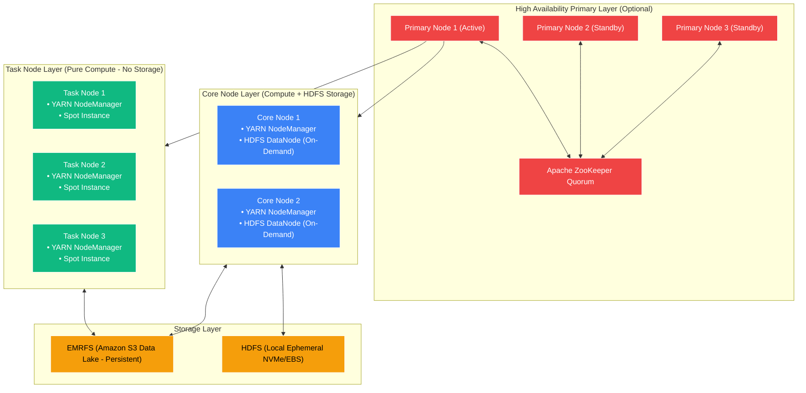
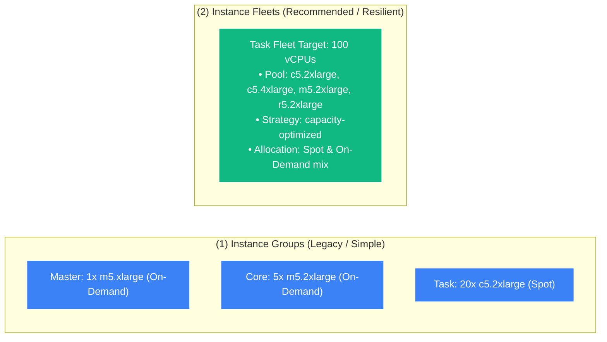
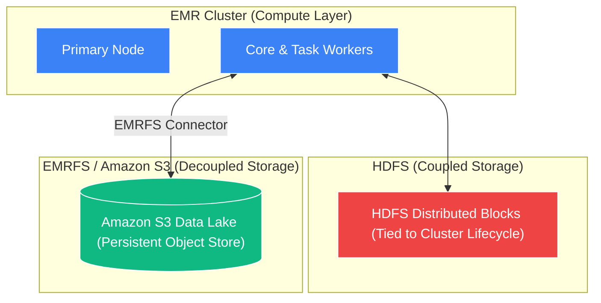

# 🏗️ EMR Cluster Architecture, Node Types & Storage

- **Category**: Analytics / Cluster Topology & Storage Decoupling
- **Language / ဘာသာစကား**: **English (Original)** | [မြန်မာဘာသာ (Burmese)](/mm/02-services/analytics-streaming/emr/emr-cluster-architecture)
- **Primary Use Case**: Designing fault-tolerant, cost-effective EMR clusters using Master, Core, and Task nodes, Spot Instance Fleets, HDFS, and EMRFS on Amazon S3.
- **Slide Reference**: Pages 383–413 in `[[AWSCertifiedDataEngineerSlides.pdf]]`
- **Hub Links**: `[[index]]` | `[[emr]]` | `[[s3]]` | `[[ec2-and-graviton]]` | `[[domain-1-ingestion-and-processing]]`

---

## 1. High-Level Summary

An Amazon EMR on EC2 cluster is a distributed collection of virtual machines organized into specific functional roles called **Node Types** (**Primary/Master**, **Core**, and **Task**). 

To achieve optimal performance and minimize cloud costs on the DEA-C01 exam, data engineers must understand how compute instances interact with storage layers (**HDFS vs. EMRFS on S3**), how to configure **Instance Fleets** to absorb Spot interruptions, and how to prevent catastrophic data loss during cluster downscaling.

---

## 2. EMR Node Types Deep Dive

| Node Type | Primary Daemon Processes | Runs Compute Tasks? | Hosts HDFS Data? | Purchasing Strategy | Downscaling Impact |
| :--- | :--- | :---: | :---: | :--- | :--- |
| **Primary (Master)** | `YARN ResourceManager`, `Hadoop NameNode`, `JobTracker` | No (Coordinates only) | No | **On-Demand or Reserved** | Single point of failure unless Multi-Master HA is enabled. |
| **Core** | `YARN NodeManager`, `HDFS DataNode` | **Yes** | **Yes** | **On-Demand / Savings Plans** | **High Risk**: Removing Core nodes can cause HDFS under-replication and data corruption. |
| **Task** | `YARN NodeManager` | **Yes** | **NO** | **Spot Instances (Up to 90% discount)** | **Zero Risk**: Can be added, removed, or interrupted with zero risk to HDFS data integrity. |

### 1. Primary / Master Node
- Manages health of the cluster, coordinates data distribution, and schedules Spark / MapReduce tasks.
- **Multi-Master (High Availability)**: Launches **3 Primary nodes** coordinated by Apache ZooKeeper. If the active Primary fails, failover to a standby Primary happens automatically without aborting active jobs.

### 2. Core Nodes
- Run processing tasks and store partition blocks of HDFS data.
- **Critical Exam Rule**: Because Core nodes maintain HDFS blocks, **NEVER use Spot Instances for Core nodes** on production clusters. If Spot capacity is reclaimed, HDFS data blocks are lost.

### 3. Task Nodes
- Provide pure, ephemeral compute power. They execute tasks and communicate intermediate shuffle data, but **never store persistent HDFS blocks**.
- **Graceful Decommissioning**: When a Task node is reclaimed by AWS Spot or scaled down, YARN gracefully finishes in-flight tasks and redirects pending tasks to other surviving nodes.

---

## 3. Instance Groups vs. Instance Fleets

When provisioning an Amazon EMR cluster, you must select one of two cluster composition topologies:

| Feature | EMR Instance Groups | EMR Instance Fleets (Recommended) |
| :--- | :--- | :--- |
| **Instance Type Diversity** | Exactly **1 instance type** per group (e.g., only `r5.xlarge`). | Mix up to **30 different EC2 instance types** per fleet. |
| **Capacity Specification** | Configured by **Instance Count** (e.g., 10 instances). | Configured by **Target Capacity Units / vCPUs** (e.g., 200 units). |
| **Spot Allocation Strategy** | Limited fallback options. | Supports **`capacity-optimized`** (picks deepest Spot pools to prevent interruptions) and **`lowest-price`**. |
| **Spot to On-Demand Fallback** | Manual intervention required. | Automatically launches On-Demand instances if Spot capacity is unavailable within a timeout. |
| **Auto Scaling Integration** | Supports EMR Managed Scaling and Custom Auto Scaling policies. | Supports **EMR Managed Scaling**. |

---

## 4. Storage Topologies: HDFS vs. EMRFS on S3

### 1. HDFS (Hadoop Distributed File System)
- Stored across the local EBS / NVMe volumes attached to **Core nodes**.
- **Pros**: Ultra-low latency and high IOPS for heavy, iterative MapReduce/Spark algorithms.
- **Cons**: **Tied to cluster lifecycle**. If the EMR cluster is terminated, all HDFS data is permanently destroyed. Requires running persistent clusters 24/7.

### 2. EMRFS (EMR File System on Amazon S3)
- An AWS-engineered filesystem connector that enables applications on EMR (Spark, Hive, Presto) to read and write directly to **Amazon S3 as an object store**.
- **Pros**:
  - **Decoupled Compute and Storage**: Scale compute independently of storage.
  - **Transient Clusters**: Launch an EMR cluster to process a batch job, write results directly to S3 via EMRFS, and immediately terminate the cluster to save 100% of idle costs.
  - **Durability**: Leverages Amazon S3 99.999999999% (11 9's) durability.
  - **Strong Consistency**: S3 provides strong read-after-write consistency out of the box.

---

## 5. DEA-C01 Exam Tips & Scenarios

> [!IMPORTANT]
> **Key Exam Decision Triggers for EMR Cluster Architecture**:
>
> - **"Design the most cost-effective EMR cluster for batch processing without risking data loss"** $\rightarrow$ Use **On-Demand for Primary and Core nodes**, and **Spot Instances for Task nodes** with **EMRFS on S3**.
> - **"Spot Instance interruptions are causing EMR jobs to fail due to lost HDFS data blocks"** $\rightarrow$ Spot instances were incorrectly placed on **Core nodes**; **move Spot instances to Task nodes and use On-Demand for Core nodes**.
> - **"Avoid Spot capacity shortages when launching massive EMR clusters"** $\rightarrow$ Configure **Instance Fleets** with up to **30 instance types** and set allocation strategy to **`capacity-optimized`**.
> - **"Cluster terminated unexpectedly and all transformed data was lost"** $\rightarrow$ Output was written to **ephemeral HDFS** instead of **persistent Amazon S3 via EMRFS**.
> - **"Ensure 100% uptime for EMR Primary node coordination"** $\rightarrow$ Enable **Multi-Master High Availability (3 Primary nodes)**.

---

## 📌 Related Notes
- `[[emr]]` — Amazon EMR Overview Hub
- `[[emr-performance-optimization]]` — Spark Optimization & S3DistCp
- `[[emr-lifecycle-and-cost]]` — Bootstrap Actions & EMR Managed Scaling
- `[[s3]]` — S3 Data Lake Foundation
- `[[ec2-and-graviton]]` — EC2 Instance Topologies & Graviton
