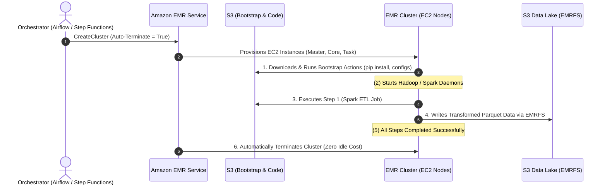
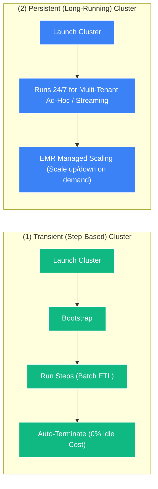

# ⚙️ EMR Lifecycle, Bootstrap Actions & Cost Optimization

- **Category**: Analytics / Cluster Lifecycle, Automation & Cost Governance
- **Language / ဘာသာစကား**: **English (Original)** | [မြန်မာဘာသာ (Burmese)](/mm/02-services/analytics-streaming/emr/emr-lifecycle-and-cost)
- **Primary Use Case**: Automating node initialization via Bootstrap Actions, orchestrating batch workflows via Steps, and maximizing cost savings via Transient Clusters and EMR Managed Scaling.
- **Slide Reference**: Pages 383–413 in `[[AWSCertifiedDataEngineerSlides.pdf]]`
- **Hub Links**: `[[index]]` | `[[emr]]` | `[[cost-management]]` | `[[step-functions]]` | `[[domain-3-data-processing]]`

---

## 1. High-Level Summary

Managing big data workloads on Amazon EMR requires understanding the complete **Cluster Lifecycle**—from pre-initialization custom scripts (**Bootstrap Actions**), to job orchestration (**Steps Execution**), to dynamic compute scaling (**EMR Managed Scaling**), and automated cluster termination.

Deploying workloads on **Transient (ephemeral) clusters** with **Spot Instance Fleets** and **Auto-Termination** policies enables organizations to run massive petabyte-scale data pipelines while reducing cloud infrastructure costs by up to **80–90%**.

---

## 2. Bootstrap Actions vs. Steps Execution

| Feature | EMR Bootstrap Actions | EMR Steps Execution |
| :--- | :--- | :--- |
| **Execution Timing** | Runs **once per node** during cluster provisioning, **before** Hadoop/Spark daemons start. | Runs **after** the cluster is fully initialized and applications are running. |
| **Target Nodes** | Executes on **ALL nodes** (Primary, Core, and Task nodes). | Executes on the cluster via the Primary coordinator. |
| **Primary Purpose** | Installing custom OS packages, Python libraries (`pip install`), tuning kernel settings, or setting proxy environment variables. | Running the actual big data processing logic (e.g., `spark-submit`, Hive script, Pig script, custom JAR). |
| **Failure Behavior** | If a bootstrap script exits with a non-zero code, **the entire cluster fails to launch and terminates immediately**. | Configurable on failure: `CONTINUE`, `CANCEL_AND_WAIT`, or `TERMINATE_CLUSTER`. |
| **Adding After Launch** | Cannot be added to an active running cluster (runs at boot only). | Can be added dynamically to running clusters via AWS CLI, SDK, or Step Functions. |

---

## 3. Transient vs. Persistent EMR Clusters

### 1. Transient Clusters (Batch Workloads)
- Designed to launch on-demand, execute a series of steps (e.g., daily 2-hour ETL), write output to S3 via EMRFS, and **automatically terminate immediately upon step completion**.
- **Key Exam Benefit**: Eliminates 100% of idle infrastructure costs during non-working hours.

### 2. Persistent Clusters (Interactive / Streaming Workloads)
- Kept running 24/7 to serve ad-hoc SQL queries from data analysts, long-running streaming jobs (Apache Flink / Spark Streaming), or shared enterprise notebooks.
- **Auto-Termination for Idle Clusters**: EMR can automatically shut down a persistent cluster if it remains idle with zero active YARN applications for a specified timeout (e.g., 30 minutes).

---

## 4. Cost Optimization & Auto-Scaling Strategies

### 1. EMR Managed Scaling
- EMR Managed Scaling continuously evaluates cluster metrics (such as YARN pending memory and container allocations) and automatically resizes the cluster:
- **Intelligent Downscaling**: Unlike standard EC2 Auto Scaling, EMR Managed Scaling **never terminates Core nodes during active job execution**, avoiding HDFS block under-replication and data corruption.
- Dynamically scales **Task nodes** to absorb computational spikes.

---

### 2. Spot Instance Fleets with `capacity-optimized` Strategy
- Configure Task nodes as an **Instance Fleet** specifying up to **30 different EC2 instance types** (e.g., `m5.xlarge`, `c5.2xlarge`, `r5.2xlarge`, `m6g.xlarge`).
- Set allocation strategy to **`capacity-optimized`** to pull Spot instances from the deepest pools, reducing Spot interruption rates to near zero.

---

### 3. Custom AMIs (Accelerating Cluster Boot Time)
- If bootstrap scripts install heavy packages (e.g., deep learning libraries, large RPM packages) taking 15+ minutes per node, bake those dependencies into a **Custom Amazon Linux AMI**.
- Launching clusters with a pre-baked Custom AMI reduces cluster launch time from 15 minutes to **under 3 minutes**.

---

### 4. Termination Protection
- Prevents users, automated scripts, or API calls from accidentally shutting down a critical production cluster. Must be disabled before terminating.

---

## 5. DEA-C01 Exam Tips & Scenarios

> [!IMPORTANT]
> **Key Exam Decision Triggers for EMR Lifecycle & Cost**:
>
> - **"Install third-party Python packages on all EMR cluster nodes before Hadoop daemons start"** $\rightarrow$ Use **EMR Bootstrap Actions**.
> - **"Run a scheduled daily Spark ETL job with minimal cost and zero idle compute charges"** $\rightarrow$ Use a **Transient EMR Cluster configured to auto-terminate upon step completion**.
> - **"Automatically resize an EMR cluster based on workload demands without causing task failures"** $\rightarrow$ Enable **EMR Managed Scaling**.
> - **"Prevent accidental termination of a 24/7 mission-critical production EMR cluster"** $\rightarrow$ Enable **Termination Protection**.
> - **"Bootstrap script taking too long to launch multi-node clusters"** $\rightarrow$ Pre-install software dependencies into a **Custom Amazon Linux AMI**.
> - **"Shut down a persistent development cluster if no one uses it over the weekend"** $\rightarrow$ Enable **Auto-Termination for Idle Clusters**.

---

## 📌 Related Notes
- `[[emr]]` — Amazon EMR Overview Hub
- `[[emr-cluster-architecture]]` — Master, Core & Task Nodes
- `[[cost-management]]` — AWS Cloud Financial Management
- `[[step-functions]]` — Orchestrating Transient EMR Pipelines
