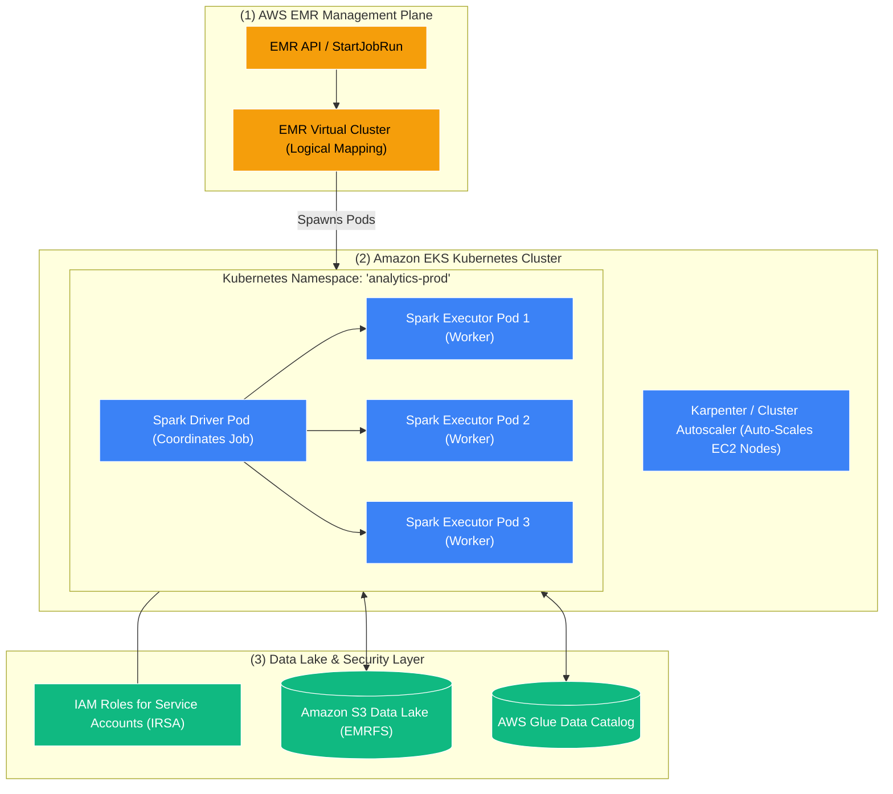

# ☸️ Amazon EMR on EKS (Containerized Big Data on Kubernetes)

- **Category**: Analytics / Containerized Distributed Processing
- **Language / ဘာသာစကား**: **English (Original)** | [မြန်မာဘာသာ (Burmese)](/mm/02-services/analytics-streaming/emr/emr-on-eks)
- **Primary Use Case**: Running Apache Spark applications inside Amazon EKS Kubernetes clusters to share compute infrastructure with microservices and achieve fast pod-level autoscaling.
- **Slide Reference**: Pages 383–413 in `[[AWSCertifiedDataEngineerSlides.pdf]]`
- **Hub Links**: `[[index]]` | `[[emr]]` | `[[ecr-ecs-eks]]` | `[[domain-1-ingestion-and-processing]]`

---

## 1. High-Level Summary

**Amazon EMR on EKS** provides a deployment model that decouples the EMR management layer from the underlying compute infrastructure, allowing organizations to run **Apache Spark** applications directly on **Amazon Elastic Kubernetes Service (Amazon EKS)**.

Instead of provisioning dedicated, long-running EC2 clusters for big data analytics, data engineering teams can leverage existing, shared enterprise Kubernetes clusters. EMR on EKS automatically installs, configures, and manages the lifecycle of the **EMR Runtime for Apache Spark** inside standard Kubernetes pods.

---

## 2. Core Architecture & Key Capabilities

### 1. EMR Virtual Clusters
- An **EMR Virtual Cluster** is a logical entity created in Amazon EMR that maps directly to a specific **Kubernetes Namespace** inside an Amazon EKS cluster.
- Multiple analytical teams (e.g., `data-engineering`, `data-science`, `marketing-analytics`) can have separate Virtual Clusters mapped to different namespaces on the same physical EKS cluster, enforcing strict multi-tenant compute isolation and Kubernetes ResourceQuotas.

---

### 2. Fine-Grained Security via IRSA (IAM Roles for Service Accounts)
- In traditional EMR on EC2, all applications running on an instance inherit the EC2 Instance Profile IAM role.
- With **EMR on EKS**, each Spark Job Run binds directly to a **Kubernetes Service Account** annotated with an IAM role (**IRSA**).
- **Security Benefit**: Job A can have read-only access to S3 bucket `s3://finance-data/`, while Job B has write access to `s3://marketing-data/`, executing side-by-side on the same underlying worker nodes.

---

### 3. Rapid Pod Startup & Karpenter Autoscaling
- Launching traditional EC2 instances takes **5 to 15 minutes**.
- Kubernetes pods spin up in **seconds**, allowing Spark jobs to start processing data almost immediately.
- Paired with modern Kubernetes autoscalers like **Karpenter**, the cluster dynamically provisions right-sized EC2 instances (mixing On-Demand, Spot, and AWS Graviton nodes) based on incoming Spark pod requests.

---

### 4. Custom Container Images via Amazon ECR
- Data engineers can package custom Spark applications, Python virtual environments, compiled C++ extensions, and custom JARs into standard Docker container images.
- Images are published to **[[ecr-ecs-eks|Amazon ECR]]** and referenced in the job submission payload.

---

## 3. Comparison Matrix: EMR on EKS vs. EMR on EC2 vs. EMR Serverless

| Feature | Amazon EMR on EKS | Amazon EMR on EC2 | Amazon EMR Serverless |
| :--- | :--- | :--- | :--- |
| **Compute Infrastructure** | **Shared Kubernetes (EKS)** | **Dedicated EC2 Instances** | **100% Serverless** |
| **Infrastructure Management** | Managed by Kubernetes Team / DevOps | Managed by Data Engineering Team | Managed entirely by AWS |
| **Multi-Tenancy** | **High** (Namespace & Pod level) | Medium (Separate EC2 clusters) | High (Logical Applications) |
| **Startup Latency** | **Fast (Seconds)** | Slow (5–15 minutes) | Fast (< 5s with warm pool) |
| **Supported Frameworks** | **Apache Spark** | Spark, Hive, Presto, Flink, HBase | Spark, Apache Hive |
| **Security Isolation** | **IAM Roles for Service Accounts (IRSA)** | EC2 Instance Profiles / Kerberos | IAM Job Execution Roles |
| **Best Used For** | Companies with existing Kubernetes platforms wanting to consolidate workloads. | Heavy, 24/7 dedicated clusters running non-Spark frameworks (HBase, Trino). | Running ad-hoc or scheduled Spark pipelines with zero cluster management. |

---

## 4. DEA-C01 Exam Tips & Scenarios

> [!IMPORTANT]
> **Key Exam Decision Triggers for EMR on EKS**:
>
> - **"Consolidate big data Apache Spark analytics onto an existing corporate Amazon EKS Kubernetes cluster"** $\rightarrow$ **Amazon EMR on EKS**.
> - **"Enforce granular, least-privilege IAM permissions per Spark job on a shared cluster"** $\rightarrow$ **EMR on EKS using IAM Roles for Service Accounts (IRSA)**.
> - **"Achieve sub-minute startup times for Spark batch jobs using containerized infrastructure"** $\rightarrow$ **Amazon EMR on EKS**.
> - **"Share compute infrastructure between web microservices and batch analytics to maximize server utilization"** $\rightarrow$ **Amazon EMR on EKS**.

---

## 📌 Related Notes
- `[[emr]]` — Amazon EMR Overview Hub
- `[[emr-serverless]]` — Serverless Big Data Compute
- `[[emr-cluster-architecture]]` — Provisioned EMR on EC2 Clusters
- `[[ecr-ecs-eks]]` — Amazon ECR, ECS & EKS Architecture
