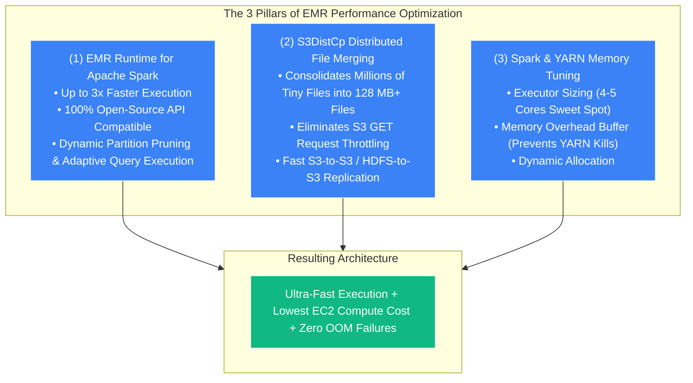
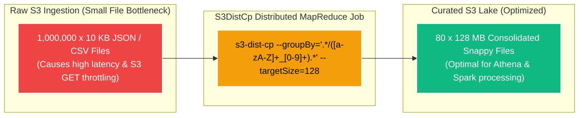
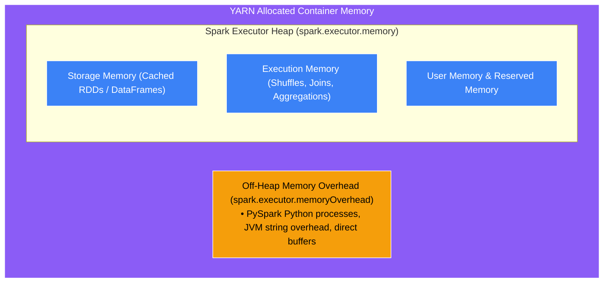

# ⚡ EMR Performance Optimization & S3DistCp

- **Category**: Analytics / Big Data Tuning & Distributed Data Transfer
- **Language / ဘာသာစကား**: **English (Original)** | [မြန်မာဘာသာ (Burmese)](/mm/02-services/analytics-streaming/emr/emr-performance-optimization)
- **Primary Use Case**: Maximizing Spark execution performance, solving the small file problem via S3DistCp, and fine-tuning YARN/Spark memory allocations.
- **Slide Reference**: Pages 383–413 in `[[AWSCertifiedDataEngineerSlides.pdf]]`
- **Hub Links**: `[[index]]` | `[[emr]]` | `[[s3]]` | `[[domain-3-data-processing]]`

---

## 1. High-Level Summary

Performance optimization on Amazon EMR involves tuning both the **compute execution engine (Apache Spark / YARN)** and the **underlying storage I/O layer (Amazon S3 / EMRFS)**. 

To excel on the DEA-C01 exam, data engineers must understand the performance benefits of the **EMR Runtime for Apache Spark**, how to consolidate millions of small files using **S3DistCp**, and how to size Spark Driver and Executor memory to eliminate out-of-memory (OOM) failures and YARN container evictions.



---

## 2. EMR Runtime for Apache Spark

Amazon EMR includes an AWS-engineered, proprietary **EMR Runtime for Apache Spark** enabled by default on modern EMR clusters (EMR 5.28+ and EMR 6.x / 7.x):
- **3x Performance Boost**: Delivers up to **3.2x faster query performance** and reduces compute costs by up to **71%** compared to standard open-source Apache Spark on EC2.
- **Zero Code Changes**: Provides **100% API compatibility** with standard Apache Spark. Applications written for open-source Spark run unchanged.
- **Key Enhancements**: Includes optimized dynamic partition pruning (DPP), Adaptive Query Execution (AQE) enhancements, and vectorized Parquet readers directly optimized for Amazon S3 object stores.

---

## 3. Deep Dive: S3DistCp (Distributed Copy & File Consolidation)

**S3DistCp (S3 Distributed Copy)** is an open-source extension of Hadoop `DistCp` optimized to work natively with AWS and Amazon S3 using MapReduce.



### Core S3DistCp Capabilities:
1. **Parallel Distributed Copying**: Copies massive multi-terabyte/petabyte datasets in parallel between S3 buckets, or between HDFS and Amazon S3.
2. **Solving the Small File Problem with `--groupBy`**:
   - Aggregates thousands of tiny files matching a regular expression into larger composite files.
   - Example Command:
     ```bash
     s3-dist-cp \
       --src s3://raw-landing-lake/hourly-logs/ \
       --dest s3://curated-lake/consolidated-logs/ \
       --groupBy='.*/([a-zA-Z]+_[0-9]+).*' \
       --targetSize=128
     ```
3. **Data Compression Conversion**: Compresses or decompresses files during data transfer (e.g., converting Gzip to Snappy).

---

## 4. Apache Spark Memory & Executor Tuning on EMR

One of the most common causes of Spark job failures on the DEA-C01 exam is the dreaded error:  
`"Container killed by YARN for exceeding memory limits"`.



### Sizing Rules & Best Practices:
1. **Executor Cores (`spark.executor.cores`)**:
   - **Sweet Spot**: Set to **4 or 5 vCPUs** per executor. Sizing with > 5 cores degrades HDFS/S3 I/O throughput; sizing with 1 core wastes multi-threading efficiency.
2. **Memory Overhead (`spark.executor.memoryOverhead`)**:
   - Allocated outside the JVM heap for non-JVM processes (e.g., PySpark Python worker processes).
   - Rule: Default is `max(384MB, 0.10 * spark.executor.memory)`. **Increase this value (e.g., to 20–30%) when running heavy PySpark transformations** to prevent YARN container termination.
3. **Dynamic Allocation (`spark.dynamicAllocation.enabled`)**:
   - Allows Spark to dynamically request executors when tasks queue up and release idle executors during lightweight stages.

---

## 5. DEA-C01 Exam Tips & Scenarios

> [!IMPORTANT]
> **Key Exam Decision Triggers for EMR Performance**:
>
> - **"Millions of small 10 KB files in S3 are causing slow EMR and Athena query performance"** $\rightarrow$ **Use `s3-dist-cp` with `--groupBy` and `--targetSize` to merge small files into 128 MB files**.
> - **"EMR Spark job fails with 'Container killed by YARN for exceeding memory limits'"** $\rightarrow$ **Increase `spark.executor.memoryOverhead`** in cluster configuration.
> - **"Accelerate Spark query performance on EMR without modifying application code"** $\rightarrow$ Use the **EMR Runtime for Apache Spark** (enabled by default on EMR 6.x/7.x).
> - **"Copy petabytes of data from HDFS to Amazon S3 in parallel with minimal latency"** $\rightarrow$ **Use `s3-dist-cp`**.
> - **"Optimal number of cores per Spark executor"** $\rightarrow$ **4 to 5 vCPUs per executor**.

---

## 📌 Related Notes
- `[[emr]]` — Amazon EMR Overview Hub
- `[[emr-cluster-architecture]]` — Node Types & Storage
- `[[athena-performance]]` — Athena Small File Optimization
- `[[data-formats-and-compression]]` — Parquet, ORC, Snappy & ZSTD
