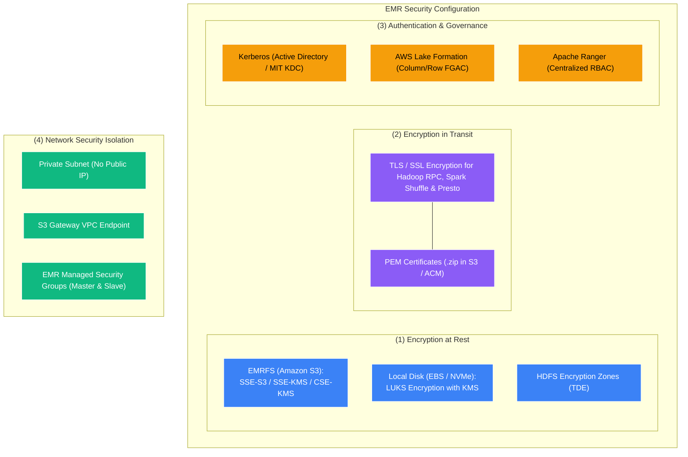
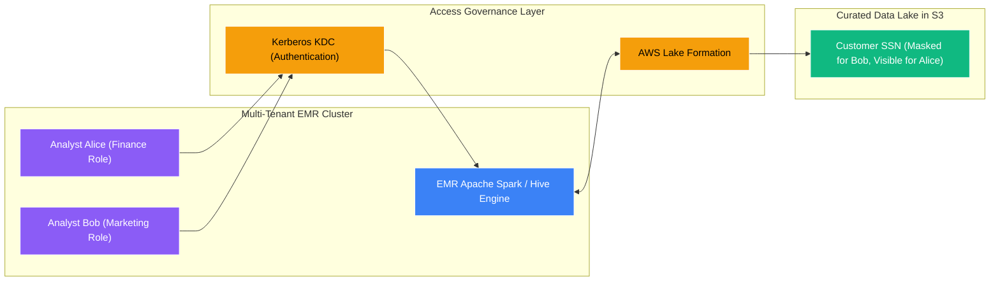

# 🔒 EMR Security, Encryption & Governance

- **Category**: Analytics / Enterprise Security, Encryption & Compliance
- **Language / ဘာသာစကား**: **English (Original)** | [မြန်မာဘာသာ (Burmese)](/mm/02-services/analytics-streaming/emr/emr-security-and-governance)
- **Primary Use Case**: Securing EMR clusters using EMR Security Configurations, at-rest/in-transit encryption, Kerberos authentication, and AWS Lake Formation fine-grained governance.
- **Slide Reference**: Pages 383–413 in `[AWSCertifiedDataEngineerSlides.pdf](/docs/AWSCertifiedDataEngineerSlides.pdf)`
- **Hub Links**: `[[index]]` | `[[emr]]` | `[[domain-5-security-and-governance]]` | `[[kms]]` | `[[lake-formation]]`

---

## 1. High-Level Summary

Enterprise big data workloads often process highly sensitive corporate and regulated customer data (such as PII, HIPAA, or financial records). Securing Amazon EMR requires a comprehensive defense-in-depth strategy encompassing **at-rest encryption**, **in-transit encryption**, **network isolation (VPCs & Private Endpoints)**, and **fine-grained user access governance (Kerberos, Lake Formation, and Apache Ranger)**.

Amazon EMR provides **Security Configurations**—reusable security templates that apply encryption, authentication, and authorization settings consistently across multiple clusters.

---

## 2. EMR Security Configurations Deep Dive

An **EMR Security Configuration** is a managed template stored in EMR that you associate with clusters upon launch:

### 1. Encryption at Rest
- **Amazon S3 (EMRFS)**:
  - **Server-Side Encryption**: `SSE-S3` (Amazon-managed) or `SSE-KMS` (Customer Managed Key).
  - **Client-Side Encryption**: `CSE-KMS` or `CSE-C` (Client-side custom master key).
- **Local Disks (EBS Volumes & NVMe Instance Store)**:
  - Uses **Linux Unified Key Setup (LUKS)** block-level encryption powered by AWS KMS keys.
  - Automatically encrypts local scratch space used for Spark intermediate shuffle data and HDFS storage.
- **HDFS Transparent Data Encryption (TDE)**:
  - Encrypts HDFS blocks in specific folders (encryption zones) using Hadoop key management.

---

### 2. Encryption in Transit (Node-to-Node Interconnect)
- Enforces TLS 1.2+ encryption for all internal daemon communications, including:
  - Spark internal shuffle block transfers.
  - Hadoop MapReduce shuffle transfers.
  - Hadoop RPC and HDFS DataNode traffic.
  - Presto / Trino inter-node queries.
- **Certificate Provider**: Encryption keys and PEM certificates are packaged into a `.zip` file stored in a restricted S3 bucket or provided via a custom certificate provider script.

---

## 3. User Authentication & Fine-Grained Access Control

### 1. Kerberos Authentication
- Provides strong, ticket-based user authentication on shared, multi-tenant clusters.
- **Cross-Realm Trust with Active Directory**: Users authenticate to EMR using their corporate Active Directory credentials.
- **Internal MIT KDC**: EMR can automatically configure a local MIT Kerberos Key Distribution Center (KDC) on the Primary node.

### 2. AWS Lake Formation Integration
- Enables **Fine-Grained Access Control (FGAC)** for Apache Spark and Apache Hive on EMR.
- Apply column-level security (e.g., mask `credit_card_number`), row-level filters (e.g., `country = 'US'`), and cell-level permissions based on Lake Formation policies.

### 3. Apache Ranger Integration
- EMR supports native integration with Apache Ranger to manage centralized authorization policies for Hive, Spark, and HBase.

---

## 4. Network Security & VPC Architecture

- **Private Subnet Deployment**: Best practice is to deploy all EMR cluster nodes inside a **Private Subnet** with no public IP addresses assigned.
- **VPC Endpoints**:
  - **S3 Gateway Endpoint**: Allows EMR nodes to access S3 data lakes for free without traversing a NAT Gateway.
  - **Glue Interface Endpoint**: Allows metadata retrieval from AWS Glue Data Catalog inside the private VPC.
- **EMR Managed Security Groups**:
  - **Master Security Group**: Governs inbound traffic to the Primary node.
  - **Slave Security Group**: Governs intra-cluster communication between Core and Task worker nodes.

---

## 5. DEA-C01 Exam Tips & Scenarios

> [!IMPORTANT]
> **Key Exam Decision Triggers for EMR Security**:
>
> - **"Ensure all data stored on local EBS volumes and S3 data lakes is encrypted with KMS CMKs"** $\rightarrow$ **Create an EMR Security Configuration enabling EBS LUKS encryption and EMRFS SSE-KMS**.
> - **"Enforce column-level data masking for EMR Spark users without maintaining separate datasets"** $\rightarrow$ Integrate Amazon EMR with **AWS Lake Formation**.
> - **"Allow corporate Active Directory users to authenticate securely to an EMR cluster"** $\rightarrow$ Configure **Kerberos with Active Directory cross-realm trust**.
> - **"Encrypt inter-node communication (Spark shuffle data) between worker nodes"** $\rightarrow$ Enable **In-Transit Encryption in the EMR Security Configuration using PEM certificates**.
> - **"Prevent EMR cluster from accessing the public internet while communicating with S3"** $\rightarrow$ Deploy EMR in a **Private Subnet with an Amazon S3 Gateway VPC Endpoint**.

---

## 📌 Related Notes
- `[[emr]]` — Amazon EMR Overview Hub
- `[[emr-cluster-architecture]]` — Node Types & Storage
- `[[lake-formation]]` — AWS Lake Formation Governance
- `[[kms]]` — AWS Key Management Service (KMS)
