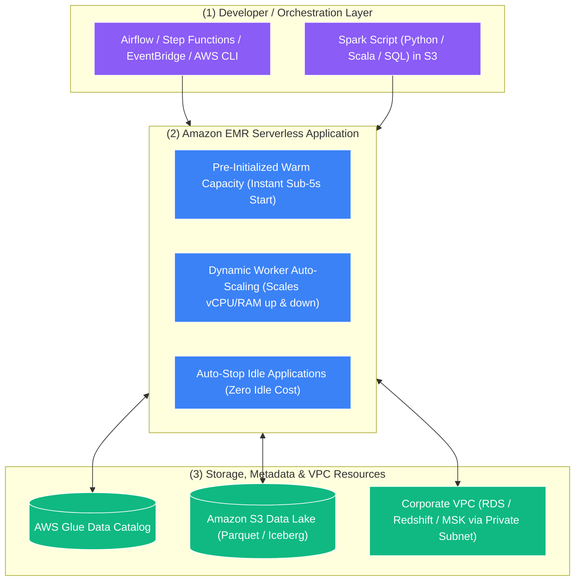

# ☁️ Amazon EMR Serverless

- **Category**: Analytics / Serverless Big Data Processing
- **Language / ဘာသာစကား**: **English (Original)** | [မြန်မာဘာသာ (Burmese)](/mm/02-services/analytics-streaming/emr/emr-serverless)
- **Primary Use Case**: Running large-scale Apache Spark and Apache Hive workloads without provisioning, sizing, managing, or tuning underlying EC2 clusters.
- **Slide Reference**: Pages 383–413 in `[[AWSCertifiedDataEngineerSlides.pdf]]`
- **Hub Links**: `[[index]]` | `[[emr]]` | `[[glue-etl-jobs]]` | `[[athena-spark]]` | `[[domain-3-data-processing]]`

---

## 1. High-Level Summary

**Amazon EMR Serverless** is a serverless deployment option for Amazon EMR that makes it simple and cost-effective to run big data applications built using open-source **Apache Spark** and **Apache Hive**.

With EMR Serverless, data engineers do not need to configure cluster topologies, choose EC2 instance types, tune Auto Scaling policies, or manage operating system patches. EMR Serverless automatically provisions the exact compute and memory resources required for the application, scales capacity dynamically as data volumes fluctuate, and deallocates resources as soon as the job finishes.

---

## 2. Core Architecture & Key Concepts

### 1. Applications vs. Job Runs
- **Application**: A logical container configured for an open-source framework (e.g., **Apache Spark 3.4** or **Apache Hive 3.1**) with specific release versions, network VPC configurations, and maximum capacity limits.
- **Job Run**: An isolated execution of a workload (e.g., executing `s3://bucket/scripts/daily_etl.py` or submitting a Spark JAR) within the Application.

---

### 2. Pre-Initialized Capacity (Warm Pools for Sub-5s Starts)
- Standard serverless jobs often suffer from cold-start provisioning delays (1–3 minutes).
- EMR Serverless allows administrators to maintain **Pre-Initialized Capacity** (a pool of pre-warmed workers).
- **Benefit**: Jobs submitted to pre-initialized applications start processing data in **under 1 to 5 seconds**, ideal for SLA-sensitive batch pipelines.

---

### 3. Granular Worker Sizing & Dynamic Scaling
When submitting a job, you can define custom worker configurations for the Spark Driver and Executors:
- **vCPU**: 1, 2, 4, 8, or 16 vCPUs per worker.
- **Memory**: 1 GB to 64 GB per worker (in 1 GB increments).
- **Disk Storage**: 20 GB to 200 GB local ephemeral storage per worker.
- **Auto-Scaling**: EMR Serverless automatically scales workers dynamically based on Spark stage concurrency and deallocates them immediately upon stage completion.

---

### 4. Auto-Stop Idle Applications
- To eliminate idle infrastructure waste, applications automatically transition to `STOPPED` state after an idle timeout (default: **15 minutes**).
- When a new job is submitted, the application automatically restarts without manual intervention.

---

### 5. Custom Container Images
- If your Spark application requires specific C++ libraries, proprietary Python packages, or specific Java dependencies that cannot be installed via PyPI at runtime, EMR Serverless supports **Custom Docker Container Images** stored in **[[ecr-ecs-eks|Amazon ECR]]**.

---

## 3. Serverless Spark Decision Matrix: EMR Serverless vs. Glue ETL vs. Athena Spark

| Feature | Amazon EMR Serverless | AWS Glue ETL Jobs | Athena for Apache Spark |
| :--- | :--- | :--- | :--- |
| **Primary Workload** | **Scheduled Big Data Batch & Streaming (Spark/Hive)** | **Scheduled Batch & CDC Pipelines** | **Interactive Ad-hoc Exploration (Jupyter)** |
| **Startup Latency** | **< 5 seconds** (with Pre-Initialized Capacity) | 1–2 minutes | **< 1 second (Instant)** |
| **Supported Frameworks** | **Apache Spark, Apache Hive** | Apache Spark, Python Shell, Ray | Apache Spark (PySpark) |
| **Custom Containers** | **Yes** (Full custom ECR Docker images) | Partial (Custom libraries / wheel files) | No |
| **State Tracking** | Custom application state | **Native Job Bookmarks** | Interactive session memory |
| **Pricing Model** | vCPU-hour, Memory GB-hour, Storage GB-hour | Per DPU-second consumed ($0.44/DPU-hr) | Per DPU-hour active |
| **Best Used For** | Migrating on-premise Spark/Hive to serverless without code rewrite. | Native AWS lakehouse ETL, visual DAGs, automatic schema drift handling. | Data scientists exploring S3 datasets interactively with Python charts. |

---

## 4. DEA-C01 Exam Tips & Scenarios

> [!IMPORTANT]
> **Key Exam Decision Triggers for EMR Serverless**:
>
> - **"Run Apache Spark or Apache Hive jobs without managing EC2 clusters, but need sub-5-second job start times"** $\rightarrow$ **Amazon EMR Serverless with Pre-Initialized Capacity**.
> - **"Migrate existing Apache Hive batch scripts from on-premises to a serverless AWS environment without rewriting into Spark"** $\rightarrow$ **Amazon EMR Serverless (Hive Application)**.
> - **"Ensure serverless Spark jobs do not exceed departmental cloud budgets"** $\rightarrow$ Set **Maximum Capacity Limits (Max vCPU and Max Memory)** on the EMR Serverless Application.
> - **"Require custom operating system packages and proprietary C/C++ libraries for a serverless Spark job"** $\rightarrow$ Use **EMR Serverless with Custom Docker Images hosted in Amazon ECR**.
> - **"Connect EMR Serverless jobs securely to private RDS databases without traversing the public internet"** $\rightarrow$ Configure the EMR Serverless application with **VPC Private Subnet and Security Group associations**.

---

## 📌 Related Notes
- `[[emr]]` — Amazon EMR Overview Hub
- `[[emr-cluster-architecture]]` — Provisioned EMR on EC2 Clusters
- `[[emr-on-eks]]` — Containerized Spark on Kubernetes
- `[[glue-etl-jobs]]` — AWS Glue Serverless Spark Alternative
- `[[athena-spark]]` — Interactive Serverless Spark Notebooks
