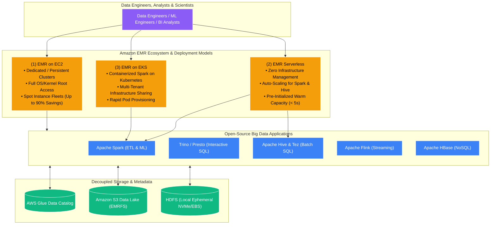
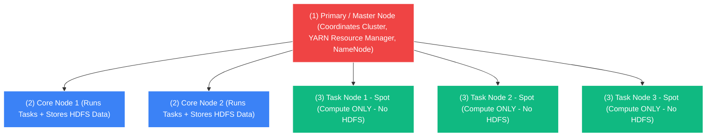

# 🐘 Amazon EMR Overview (Elastic MapReduce)

- **Category**: Analytics / Big Data & Distributed Processing
- **Language / ဘာသာစကား**: **English (Original)** | [မြန်မာဘာသာ (Burmese)](/mm/02-services/analytics-streaming/emr/emr)
- **Primary Use Case**: Petabyte-scale distributed data processing, SQL analytics, real-time streaming, and machine learning using open-source big data frameworks (Apache Spark, Hadoop, Presto/Trino, Hive, Flink, HBase, Hudi, Iceberg).
- **Slide Reference**: Pages 383–413 in `[[AWSCertifiedDataEngineerSlides.pdf]]`
- **Hub Links**: `[[index]]` | `[[service-catalog]]` | `[[domain-1-ingestion-and-processing]]` | `[[domain-3-data-processing]]` | `[[s3]]`

---

## 1. High-Level Summary

**Amazon EMR (Elastic MapReduce)** is the industry-leading, cloud-native big data platform on AWS. It allows data engineers and scientists to rapidly provision, scale, and run distributed open-source applications such as **Apache Spark**, **Apache Hadoop (YARN & HDFS)**, **Apache Hive**, **Presto / Trino**, **Apache Flink**, **Apache HBase**, and **Apache Iceberg / Hudi**.

Unlike managed serverless engines with fixed execution sandboxes (like AWS Glue or Athena), Amazon EMR provides **unprecedented flexibility, customization, and cost efficiency** at petabyte to exabyte scale. Engineers have full control over the underlying cluster operating systems, compute instance topologies (EC2, Graviton, Spot Fleets), containerization (Amazon EKS), and serverless execution models (**EMR Serverless**).

---

## 2. EMR Sub-Modules Breakdown for DEA-C01

To master Amazon EMR for the AWS Certified Data Engineer exam, explore the comprehensive deep-dive notes below:

| Sub-Module Note | Primary Technical Focus | Key Exam Concepts |
| :--- | :--- | :--- |
| **[[emr-cluster-architecture]]** | Master, Core, and Task node topologies; Instance Groups vs. Instance Fleets; HDFS vs. EMRFS. | Spot Instances on Task nodes; data loss prevention on Core nodes; EMRFS S3 decoupling. |
| **[[emr-serverless]]** | Serverless big data compute for Spark and Hive. | Pre-initialized capacity; auto-scaling worker pools; zero EC2 cluster maintenance. |
| **[[emr-on-eks]]** | Running Spark applications inside Amazon EKS Kubernetes pods. | Virtual clusters; multi-tenant infrastructure consolidation; IRSA role mapping. |
| **[[emr-performance-optimization]]** | EMR Runtime for Spark (up to 3x speedup), S3DistCp, and memory/executor tuning. | Small file aggregation with `s3-dist-cp --groupBy`; Spark dynamic allocation and shuffle tuning. |
| **[[emr-security-and-governance]]** | EMR Security Configurations, Kerberos, Lake Formation, and VPC private networking. | In-transit and at-rest encryption; fine-grained access control; Apache Ranger; private subnets. |
| **[[emr-lifecycle-and-cost]]** | Bootstrap actions, Steps execution, Transient vs. Persistent clusters, and Auto-Scaling. | Custom package installation; transient batch ETL termination; Managed Auto Scaling policies. |

---

## 3. High-Level Node Topology Summary

An Amazon EMR on EC2 cluster consists of three distinct node types:

1. **Primary Node (formerly Master Node)**: Coordinates distributed tasks, tracks job execution, and manages YARN Resource Manager and Hadoop NameNode.
2. **Core Nodes**: Execute distributed processing tasks (YARN NodeManager) **AND host the distributed file system (HDFS DataNodes)**. Terminating Core nodes can cause HDFS under-replication and permanent data loss!
3. **Task Nodes**: Execute compute processing tasks **ONLY**. They do **NOT** participate in HDFS storage, making them 100% resilient to sudden termination and the ideal candidate for **Amazon EC2 Spot Instances** (saving up to 90%).

---

## 4. Big Data Processing Decision Matrix: EMR vs. Glue vs. Athena

| Architecture Dimension | Amazon EMR (EC2 / EKS) | Amazon EMR Serverless | AWS Glue ETL Jobs | Amazon Athena |
| :--- | :--- | :--- | :--- | :--- |
| **Execution Model** | **Provisioned Cluster (EC2/EKS)** | **Serverless Big Data Apps** | **Serverless Spark / Python** | **Serverless Interactive SQL / Spark** |
| **Underlying Engine** | Spark, Flink, Trino, Hive, HBase, Presto | Spark, Apache Hive (Tez) | AWS Glue Spark / Ray | Trino (v3) / Spark Notebooks |
| **Startup Latency** | 5–15 minutes (EC2 launch) | < 5 seconds (with warm pool) | 1–2 minutes | Sub-second |
| **Customizability** | **Maximum (Full OS/Kernel/JARs)** | High (Custom images & JARs) | Medium (Python/JAR args) | Fixed SQL runtime |
| **Cost Structure** | EC2 instance hours + EMR fee | vCPU-hour + Memory GB-hour | Per DPU-second consumed | $5.00 per TB scanned |
| **Best Used For** | Petabyte clusters, 24/7 workloads, custom big data frameworks. | Scheduled Spark batch pipelines without EC2 cluster tuning. | Serverless batch ETL, Job Bookmarks, Data Catalog integration. | Ad-hoc SQL exploration, log analytics, BI dashboards. |

---

## 5. DEA-C01 Exam Tips & Decision Triggers

> [!IMPORTANT]
> **Key Exam Decision Triggers for Amazon EMR**:
>
> - **"Need petabyte-scale distributed processing with full control over cluster instances, custom open-source libraries, and operating system packages"** $\rightarrow$ **Amazon EMR on EC2**.
> - **"How to maximize cost savings on an EMR cluster without risking job failure or data corruption?"** $\rightarrow$ Use **On-Demand Instances for Primary and Core nodes**, and **Spot Instances for Task nodes**.
> - **"Prevent data loss when an EMR cluster terminates"** $\rightarrow$ Store all persistent input and output data in **Amazon S3 using EMRFS**, treating the cluster as purely transient.
> - **"Consolidate Spark data pipelines onto an existing Kubernetes platform with shared compute resources"** $\rightarrow$ **Amazon EMR on EKS**.
> - **"Run large Apache Spark and Hive batch workloads without sizing, managing, or tuning EC2 clusters"** $\rightarrow$ **Amazon EMR Serverless**.
> - **"Execute custom initialization scripts (e.g., install Python packages or download external config files) before Hadoop starts"** $\rightarrow$ Use **EMR Bootstrap Actions**.

---

## 📌 Related Notes
- `[[emr-cluster-architecture]]` — Node Types, Instance Fleets & Storage
- `[[emr-serverless]]` — Serverless Spark & Hive Applications
- `[[emr-on-eks]]` — Containerized Distributed Processing on Kubernetes
- `[[emr-performance-optimization]]` — Spark Optimization, S3DistCp & Performance
- `[[emr-security-and-governance]]` — Security Configurations, Kerberos & Lake Formation
- `[[emr-lifecycle-and-cost]]` — Bootstrap Actions, Steps & Cost Governance
- `[[glue]]` — AWS Glue Serverless Data Integration
- `[[athena]]` — Serverless Interactive SQL on S3
