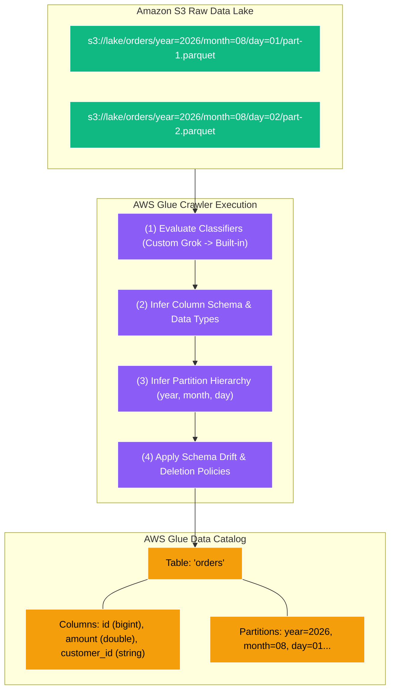
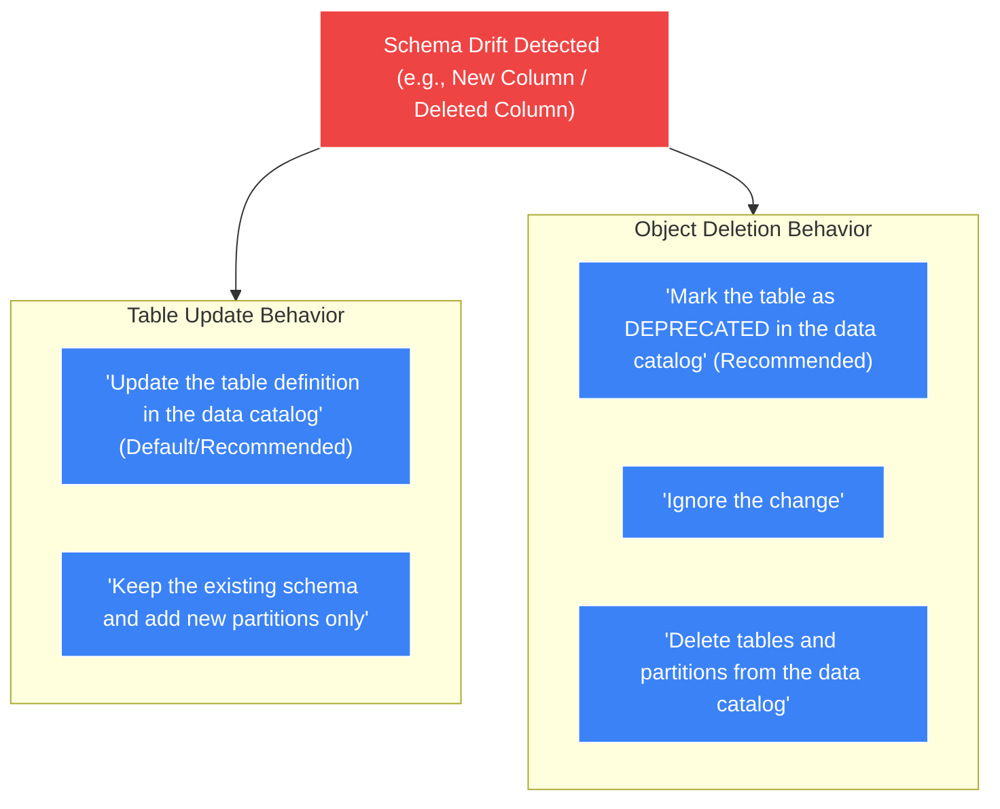

# 🕷️ AWS Glue Crawlers

- **Category**: Analytics / Automated Schema Discovery & Partition Management
- **Language / ဘာသာစကား**: **English (Original)** | [မြန်မာဘာသာ (Burmese)](/mm/02-services/analytics-streaming/glue/glue-crawlers)
- **Primary Use Case**: Automatic schema inference, partition detection, schema drift handling, and automated Glue Data Catalog population.
- **Slide Reference**: Pages 331–364 in `[AWSCertifiedDataEngineerSlides.pdf](/docs/AWSCertifiedDataEngineerSlides.pdf)`
- **Hub Links**: `[[en/index|index]]` | `[[en/02-services/analytics-streaming/glue/glue|glue]]` | `[[en/02-services/analytics-streaming/glue/glue-data-catalog|glue-data-catalog]]` | `[[en/02-services/analytics-streaming/athena/athena|athena]]`

---

## 1. High-Level Summary

**AWS Glue Crawlers** are automated discovery agents that inspect data stored in Amazon S3, Amazon RDS, Amazon Aurora, Amazon DynamoDB, Amazon DocumentDB, Amazon Redshift, and external JDBC databases. 

A crawler reads sample files from the data store, infers the data format and schema (column names and data types), determines Hive-compatible partition hierarchies, and creates or updates metadata tables in the **[[en/02-services/analytics-streaming/glue/glue-data-catalog|glue-data-catalog]]**.



---

## 2. Core Capabilities & Mechanics

### 1. Built-in vs. Custom Classifiers

A **Classifier** determines whether a data file matches a specific format and extracts the schema.

```mermaid
graph LR
    InputData["Input Data File"] --> Step1{"(1) Custom Classifiers (Checked in Priority Order)"}
    Step1 -->|Match Found| SchemaOut["Generate Schema Definition"]
    Step1 -->|No Match| Step2{"(2) Built-in Classifiers (Checked in Fixed Order)"}
    Step2 -->|Match (Parquet, JSON, CSV...)| SchemaOut
    Step2 -->|No Match| Unknown["UNKNOWN_CLASSIFIER_EXCEPTION"]

    classDef eval fill:#3b82f6,stroke:#fff,stroke-width:1px,color:#fff;
    classDef res fill:#10b981,stroke:#fff,stroke-width:1px,color:#fff;
    classDef fail fill:#ef4444,stroke:#fff,stroke-width:1px,color:#fff;

    class Step1,Step2 eval;
    class SchemaOut res;
    class Unknown fail;
```

1. **Custom Classifiers (Highest Priority)**:
   - Evaluated **first** in the order defined by the user.
   - Built using **Grok patterns**, XML paths, or custom CSV delimiters.
   - Ideal for proprietary log files (e.g., custom web server logs, syslog, mainframe formats).
2. **Built-in Classifiers (Fallback)**:
   - Evaluated if no custom classifier matches.
   - Native support for: **Apache Parquet, Apache ORC, Apache Avro, JSON, CSV, TSV, XML, and Common Log formats**.

---

### 2. S3 Partition Detection Heuristics

Glue Crawlers analyze S3 prefix paths to automatically determine partition keys:

| S3 URI Pattern | Partition Detection Result | Notes |
| :--- | :--- | :--- |
| `s3://bucket/orders/year=2026/month=08/data.parquet` | **Hive-style**: Partition columns named `year` and `month`. | **Best Practice**. Key names are explicit. |
| `s3://bucket/orders/2026/08/data.parquet` | **Non-Hive style**: Partition columns automatically named `partition_0` and `partition_1`. | Works if folder structures are identical across all directories. |
| `s3://bucket/orders/2026/08/data.parquet`<br>`s3://bucket/orders/2026/data.parquet` | **Inconsistent schemas**: May create **two separate tables** instead of one partitioned table. | Fix by ensuring consistent folder depth and trailing slashes. |

---

### 3. Handling Schema Evolution & Drift

Source schemas change over time (e.g., developers add a new column, alter data types, or delete fields). Glue Crawlers provide granular configuration policies for handling drift:



#### Policy Configurations for DEA-C01:
- **When Schema Changes**:
  - `Update the table definition in the data catalog`: Adds new columns to the table metadata automatically.
  - `Keep the existing schema`: Ignores new columns; only adds new partition paths to the existing table definition.
- **When Data is Deleted in S3**:
  - `Mark the table as DEPRECATED`: Retains metadata in the catalog but flags it as deprecated (safest option for auditability).
  - `Ignore the change`: Does not modify the catalog even if files are deleted.
  - `Delete tables and partitions from the data catalog`: Removes metadata definitions immediately (dangerous if files are accidentally moved).

---

### 4. Incremental & Event-Driven Crawling

Scanning an entire multi-terabyte data lake during every scheduled crawl is slow and expensive. AWS Glue provides two optimization mechanisms:

1. **Crawl New Sub-Folders Only**:
   - The crawler maintains an internal commit log of previously scanned folders.
   - On subsequent runs, it only inspects **newly created S3 sub-folders**, drastically cutting runtime.
2. **Event-Driven Crawlers (Amazon EventBridge + SQS)**:
   - S3 emits `s3:ObjectCreated:*` events to **Amazon EventBridge**.
   - EventBridge routes messages to an **Amazon SQS Queue**.
   - The Glue Crawler reads from the SQS queue and crawls **only the specific S3 objects** that triggered the event, enabling near-real-time schema updates.

---

### 5. Exclude Patterns & IAM Permissions

- **Exclude Patterns**: Prevent the crawler from scanning unwanted files using glob expressions:
  - `**/*.tmp` (exclude temporary files)
  - `**/*.crc` (exclude checksum files)
  - `**/archive/**` (exclude archived historical partitions)
- **IAM Role Requirements**:
  - The crawler requires an IAM role with the `AWSGlueServiceRole` managed policy.
  - Explicit S3 permissions: `s3:GetObject` and `s3:ListBucket` on the target S3 bucket ARN (`arn:aws:s3:::my-bucket/*` and `arn:aws:s3:::my-bucket`).
  - If target S3 data is encrypted with an AWS KMS CMK, the role must have `kms:Decrypt` permissions on that KMS key.

---

## 3. Troubleshooting & Common Failure Scenarios

| Issue / Symptom | Root Cause | Solution for DEA-C01 Exam |
| :--- | :--- | :--- |
| **Crawler finishes with status 'SUCCEEDED' but creates 0 tables** | 1. Missing `s3:GetObject` or `s3:ListBucket` IAM permissions.<br>2. S3 include path points to a file instead of a folder.<br>3. Exclude pattern accidentally matched all files. | Ensure the IAM role has `s3:GetObject`, and verify the S3 path format (`s3://my-bucket/dataset/`). |
| **Crawler creates multiple individual tables instead of one partitioned table** | 1. Inconsistent folder hierarchy depth.<br>2. Schema mismatch between partition folders (e.g., column type changed from `int` to `string`). | Set crawler configuration: **"Create a single schema for each S3 path"**, or enforce identical folder structures. |
| **Athena queries fail to see newly added S3 partitions** | The crawler has not run since new files landed, or the table was created manually without partition discovery. | Schedule the Glue Crawler, trigger it via EventBridge/SQS, or run `MSCK REPAIR TABLE` in Athena. |
| **Crawler takes hours to run on S3** | Scanning millions of tiny files or re-scanning the entire bucket from scratch. | Enable **"Crawl new sub-folders only"**, or configure **Event-driven crawling via SQS**. |

---

## 4. DEA-C01 Exam Tips & Scenarios

> [!IMPORTANT]
> **Key Exam Decision Triggers for Glue Crawlers**:
>
> - **"Automate the discovery of new partitions added to S3 daily without manual SQL intervention"** $\rightarrow$ **Schedule an AWS Glue Crawler**.
> - **"Source system added new columns; Athena queries must automatically reflect new fields"** $\rightarrow$ Configure Crawler with **"Update the table definition in the data catalog"**.
> - **"Parse proprietary, non-standard server logs into the Glue Data Catalog"** $\rightarrow$ Create a **Custom Classifier using Grok patterns** and attach it to the crawler.
> - **"Update the Data Catalog immediately when new files land in S3 with minimal compute cost"** $\rightarrow$ **Event-driven Glue Crawler using Amazon S3 Event Notifications, EventBridge, and SQS**.
> - **"Prevent temporary or metadata files from polluting the Data Catalog"** $\rightarrow$ Add **Exclude Patterns** (`**/*.tmp`, `**/*.crc`) to the crawler.

---

## 📌 Related Notes
- `[[en/02-services/analytics-streaming/glue/glue|glue]]` — AWS Glue Overview
- `[[en/02-services/analytics-streaming/glue/glue-data-catalog|glue-data-catalog]]` — Glue Data Catalog Metastore
- `[[en/02-services/analytics-streaming/athena/athena|athena]]` — Querying Crawler-Generated Tables
- `[[en/03-concepts/data-modeling-and-partitioning|data-modeling-and-partitioning]]` — S3 Partition Strategies
