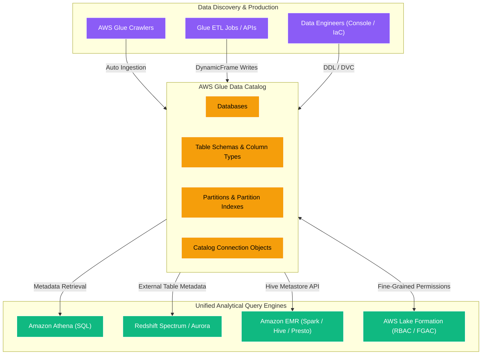
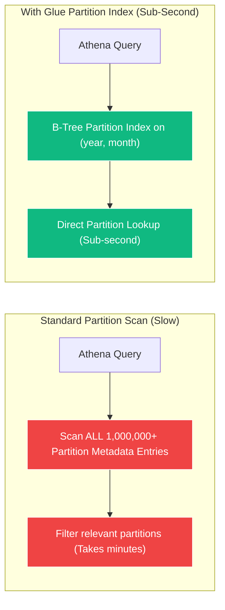
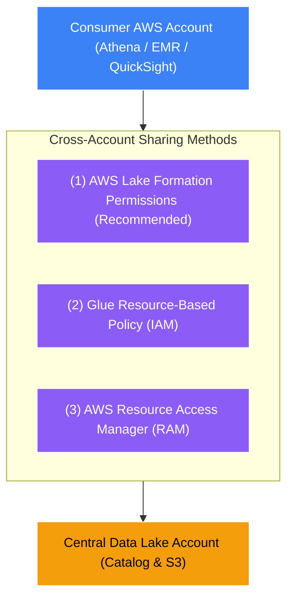

# 📖 AWS Glue Data Catalog

- **Category**: Analytics / Metadata Management & Governance
- **Language / ဘာသာစကား**: **English (Original)** | [မြန်မာဘာသာ (Burmese)](/mm/02-services/analytics-streaming/glue/glue-data-catalog)
- **Primary Use Case**: Centralized, persistent, Apache Hive-compatible metastore for S3 Data Lakes, Athena, EMR, and Redshift Spectrum.
- **Slide Reference**: Pages 331–364 in `[[AWSCertifiedDataEngineerSlides.pdf]]`
- **Hub Links**: `[[index]]` | `[[glue]]` | `[[athena]]` | `[[lake-formation]]` | `[[domain-2-data-store-management]]`

---

## 1. High-Level Summary

The **AWS Glue Data Catalog** is a fully managed, serverless, centralized Apache Hive-compatible metastore. It stores structural and operational metadata for data stored in Amazon S3, Amazon RDS, Amazon Redshift, Amazon DynamoDB, and external JDBC sources.

Instead of running and maintaining an Apache Hive Metastore on dedicated EC2 instances or Amazon EMR, the Glue Data Catalog serves as a single source of truth across the AWS analytics ecosystem. Any schema defined in the Glue Data Catalog is immediately queryable by **[[athena]]**, **[[emr]]**, **[[redshift]]** (via Redshift Spectrum and federated queries), and **AWS Glue ETL jobs**.

---

## 2. Core Architectural Components

### 1. Catalog Hierarchy: Databases, Tables, and Partitions
- **Databases**: Logical namespaces used to group related tables.
- **Tables**: Metadata descriptions of the underlying data files. A table does **not** store actual data; it specifies:
  - **Storage Location**: The S3 URI prefix (e.g., `s3://my-lake/curated/sales/`).
  - **Classification / Format**: Serialization/Deserialization library (SerDe), such as Apache Parquet, ORC, Avro, JSON, or CSV.
  - **Schema Definition**: Column names, data types (e.g., `string`, `bigint`, `struct`, `array`), and comments.
  - **Table Properties**: Key-value metadata pairs (e.g., compression format, skip header line counts).
- **Partitions**: Keys that map to sub-directory folders in S3 (e.g., `year=2026/month=08/day=17/`). Partitions drastically speed up queries by allowing query engines to skip scanning irrelevant directories.

---

### 2. Partition Indexes & Partition Filtering

As data lakes grow to millions of partitions, listing and evaluating partition metadata via API calls causes significant query latency in Amazon Athena and EMR.

#### How Partition Indexes Work:
1. **Creation**: You create a partition index on specific partition keys (e.g., `year`, `month`, `customer_id`).
2. **Indexing Mechanism**: AWS Glue builds a fast index over the partition keys.
3. **Partition Filtering**: When an Athena SQL query executes with a `WHERE` clause (e.g., `WHERE year = '2026' AND month = '08'`), Athena uses the index to retrieve only the matching partition metadata directly, cutting query planning time from minutes to milliseconds.
4. **Capacity**: You can create up to **3 partition indexes per table**.

> [!TIP]
> **Partition Index vs. Partition Projection**:
> - **Partition Index**: Created in the Glue Data Catalog. Speeds up metadata retrieval from the catalog API for Athena and EMR.
> - **Partition Projection**: Configured directly in Athena table properties. Bypasses the Glue Data Catalog metadata lookups entirely by calculating partition paths mathematically using predefined ranges/regex.

---

### 3. Cross-Account Data Catalog Sharing

In modern Data Mesh architectures, a central governance account often owns the Data Catalog, while consumer accounts run Athena or EMR queries.

AWS supports three methods for sharing the Glue Data Catalog across AWS accounts:

1. **AWS Lake Formation Cross-Account Grants (Preferred for DEA-C01)**:
   - Uses Lake Formation Tag-based access control (LF-TBAC) or direct resource links.
   - Provides granular column-level, row-level, and cell-level filtering for cross-account users without requiring complex IAM bucket policies.
2. **Glue Catalog Resource-Based Policy**:
   - A JSON policy attached directly to the Data Catalog in the owner account allowing `glue:*` actions from the consumer account ID.
3. **S3 Bucket Policy Requirement**:
   - Cross-account access to the catalog only grants access to the *metadata*. The consumer account must also be granted `s3:GetObject` permissions in the central account's **S3 Bucket Policy**.

---

### 4. Connection Objects in the Data Catalog

The Data Catalog also stores **Connection objects** that encapsulate authentication and network settings for external data stores:

| Connection Type | Target Systems | Key Configuration Requirements |
| :--- | :--- | :--- |
| **JDBC** | Amazon RDS, Aurora, Amazon Redshift, PostgreSQL, MySQL, Oracle, SQL Server | JDBC URL, username, password (in Secrets Manager), VPC subnet, Security Group (with self-referencing rule). |
| **Network** | Private VPC resources without credentials | VPC Subnet and Security Group. Used for Spark inter-node routing. |
| **Kafka / Amazon MSK** | Apache Kafka, Amazon MSK | Bootstrap servers, SSL/SASL credentials, VPC configuration. |
| **MongoDB / DocumentDB** | Amazon DocumentDB, MongoDB Atlas | Connection string, authentication database, SSL certificate. |

---

### 5. Data Catalog Encryption & Security

You can encrypt the entire Glue Data Catalog metadata using **AWS Key Management Service (AWS KMS)**:
- **Metadata Encryption**: Encrypts catalog databases, tables, partition definitions, and connection properties at rest using an AWS KMS Customer Managed Key (CMK).
- **Password Encryption for Connections**: Passwords stored inside JDBC connections are automatically encrypted using AWS KMS keys.

---

## 3. DEA-C01 Exam Tips & Scenarios

> [!IMPORTANT]
> **Key Exam Rules for Glue Data Catalog**:
>
> - **"Query planning in Athena takes too long on an S3 table with hundreds of thousands of partitions"** $\rightarrow$ **Create a Partition Index in the Glue Data Catalog**.
> - **"Centralized metastore replacement for Apache Hive on Amazon EMR"** $\rightarrow$ Configure EMR to use the **AWS Glue Data Catalog as its external Hive Metastore** (set `hive.metastore.client.factory.class` to the Glue factory).
> - **"Cross-account users can see table schemas in Athena but get 'Access Denied' when executing the query"** $\rightarrow$ The user has Data Catalog permissions, but the **S3 Bucket Policy** in the central account is missing read permissions (`s3:GetObject`, `s3:ListBucket`).
> - **"Enforce column-level or row-level masking across multiple consumer accounts"** $\rightarrow$ Manage the Glue Data Catalog permissions using **AWS Lake Formation**.
> - **"Store database connection credentials securely for Glue ETL jobs"** $\rightarrow$ Create a **Glue Catalog JDBC Connection** integrated with **AWS Secrets Manager**.

---

## 📌 Related Notes
- `[[glue]]` — AWS Glue Architecture & Taxonomy
- `[[glue-crawlers]]` — Automating Data Catalog Schema Population
- `[[lake-formation]]` — Fine-Grained Access Control over Data Catalog
- `[[athena]]` — Querying Tables in the Glue Data Catalog
- `[[athena-performance]]` — Partition Projection vs. Partition Indexes
- `[[redshift]]` — Querying Glue Data Catalog tables with Redshift Spectrum
