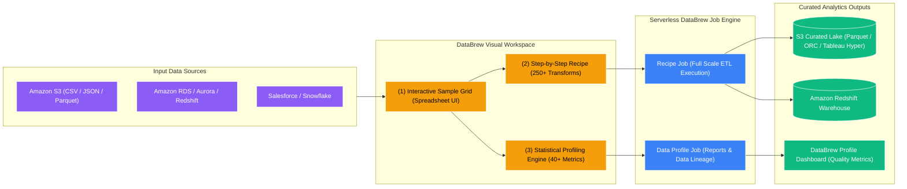

# ☕ AWS Glue DataBrew

- **Category**: Analytics / Visual No-Code Data Preparation & Profiling
- **Language / ဘာသာစကား**: **English (Original)** | [မြန်မာဘာသာ (Burmese)](/mm/02-services/analytics-streaming/glue/glue-databrew)
- **Primary Use Case**: Visual, zero-code data cleaning, statistical data profiling, PII masking, and data normalization for analysts and data scientists.
- **Slide Reference**: Pages 331–364 in `[AWSCertifiedDataEngineerSlides.pdf](/docs/AWSCertifiedDataEngineerSlides.pdf)`
- **Hub Links**: `[[en/index|index]]` | `[[en/02-services/analytics-streaming/glue/glue|glue]]` | `[[en/02-services/analytics-streaming/glue/glue-studio|glue-studio]]` | `[[en/03-concepts/data-validation-and-profiling|data-validation-and-profiling]]`

---

## 1. High-Level Summary

**AWS Glue DataBrew** is a visual data preparation tool that allows data analysts, business intelligence developers, and data scientists to clean, normalize, enrich, and profile data without writing a single line of code.

It provides a spreadsheet-like interface loaded with over **250 pre-built transformations**. DataBrew abstracts away the underlying compute, allowing users to build a transformation "Recipe" on a sample dataset, and then execute that Recipe as a serverless batch job across terabytes of data stored in Amazon S3, Amazon Redshift, Amazon RDS, or SaaS applications (e.g., Salesforce, Snowflake).

---

## 2. Core Architectural Components

### 1. The DataBrew Workflow Hierarchy

| Component | Definition & Purpose | DEA-C01 Exam Context |
| :--- | :--- | :--- |
| **Dataset** | A pointer to a data source (S3 files, Glue Data Catalog tables, RDS/Redshift connections). | Connects to source data formats (CSV, JSON, Parquet, Excel). |
| **Project** | An interactive visual workspace where you inspect a sample of the data (first N rows) and design transformation steps. | Used by analysts to visually build recipes. |
| **Recipe** | An ordered sequence of data transformation instructions (e.g., replace nulls, split columns, mask PII, format dates). | Reusable and exportable as JSON/YAML. |
| **Recipe Job** | A serverless batch job that applies a Recipe to the **entire multi-terabyte dataset** and outputs the clean data to S3 or Redshift. | Scale-out batch execution. |
| **Profile Job** | An automated job that analyzes the entire dataset to compute statistical distributions, anomaly reports, and data quality metrics. | Used for initial data discovery and audit reporting. |

---

### 2. Statistical Data Profiling (Profile Jobs)

When evaluating a new dataset, running a **DataBrew Profile Job** generates over **40 statistical metrics** displayed in a visual dashboard:
- **Column Statistics**: Min, max, mean, median, standard deviation, variance.
- **Data Quality & Hygiene**: Missing/null count and percentage, duplicate values, distinct value counts, data type validity.
- **Distribution & Shape**: Value histograms, frequency distributions, box plots for outlier detection.
- **Correlation**: Correlation matrix between numerical columns to identify collinear features for machine learning.

---

### 3. Pre-built Transformations & PII Masking

DataBrew provides 250+ built-in operations that solve common data wrangling tasks:
1. **PII Masking & Obfuscation**:
   - Mask credit card numbers, social security numbers (SSN), or email addresses using hashing, deterministic encryption, or regex masking (`****-****-****-1234`).
2. **Data Cleansing**:
   - Fill missing values using mean, median, mode, or custom defaults.
   - Remove duplicate rows and strip whitespace.
3. **Data Structuring**:
   - Pivot, unpivot, transpose, split composite columns (e.g., split `"First Last"` into `"First"` and `"Last"`), and merge columns.
4. **Encoding & Categorical Features**:
   - One-hot encoding, label encoding, and binned values for machine learning preparation.

---

### 4. Comparison: DataBrew vs. Glue Studio vs. Glue ETL Jobs

| Feature | AWS Glue DataBrew | AWS Glue Studio | AWS Glue ETL Jobs |
| :--- | :--- | :--- | :--- |
| **Target User** | **Data Analysts / BI Users / Citizen Data Scientists** | **Data Engineers / ETL Developers** | **Data Engineers / Software Engineers** |
| **User Interface** | Visual Spreadsheet / Sample Grid | Visual DAG (Directed Acyclic Graph) | Script Editor / IDE / CLI |
| **Coding Requirement** | **Zero code (100% No-Code)** | Low-code (Visual with code preview) | Full Code (PySpark / Scala / Python) |
| **Output Artifact** | Reusable **DataBrew Recipes** | Generated **PySpark / Scala scripts** | Custom **Spark Application** |
| **Supported Outputs** | Parquet, ORC, CSV, JSON, Avro, **Tableau Hyper** | Any Spark target (S3, JDBC, Redshift, Iceberg) | Any Spark target, custom APIs |
| **Best For** | Ad-hoc cleaning, data profiling, PII masking, BI prep. | Visual pipeline building and job monitoring. | Complex joins, high-scale ETL, streaming, custom logic. |

---

## 3. DEA-C01 Exam Tips & Scenarios

> [!IMPORTANT]
> **Key Exam Decision Triggers for Glue DataBrew**:
>
> - **"Empower business and data analysts to clean, transform, and normalize data without writing code"** $\rightarrow$ **AWS Glue DataBrew**.
> - **"Need visual statistical profiling to calculate missing values, distributions, and outliers across a multi-TB dataset"** $\rightarrow$ Run an **AWS Glue DataBrew Profile Job**.
> - **"Mask sensitive PII data (credit cards, SSNs) visually before sharing datasets with external teams"** $\rightarrow$ **AWS Glue DataBrew Recipes with built-in PII masking transforms**.
> - **"Export prepared data directly into Tableau Hyper format for immediate BI consumption"** $\rightarrow$ **AWS Glue DataBrew Recipe Job**.
> - **"Apply a standardized set of 20 cleaning transformations across 50 different incoming datasets"** $\rightarrow$ Create a **reusable DataBrew Recipe** and attach it to multiple Recipe Jobs.

---

## 📌 Related Notes
- `[[en/02-services/analytics-streaming/glue/glue|glue]]` — AWS Glue Architecture Overview
- `[[en/02-services/analytics-streaming/glue/glue-studio|glue-studio]]` — Glue Studio Visual DAG Authoring
- `[[en/02-services/analytics-streaming/glue/glue-etl-jobs|glue-etl-jobs]]` — Code-based Spark Transformations
- `[[en/03-concepts/data-validation-and-profiling|data-validation-and-profiling]]` — Concept: Data Profiling vs. Validation
